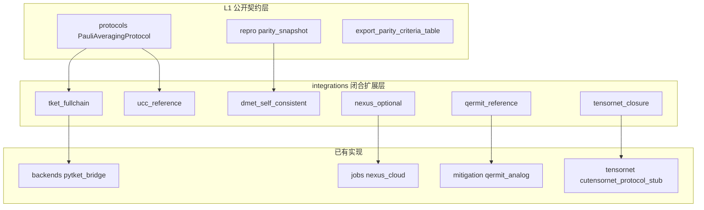

# InQuanto 闭源能力闭合：剖析、架构边界与可复现性定义

## 1. 必须先写清的「复现」含义

| 层级 | 含义 | 本项目是否追求 |
|------|------|----------------|
| **L0 二进制等价** | 与未公开的 InQuanto wheel / Nexus 私有 API 完全一致 | **否**（无源码与合同则无意义） |
| **L1 公开契约等价** | 与官方文档/API/教程描述的对象流、阶段、字段语义一致 | **是**（当前主目标） |
| **L2 数值比特级等价** | 同一输入下单次实验数值逐比特一致 | **通常**否（依赖随机性、闭源优化器、私有编译器） |
| **L3 统计与资源等价** | 在相同测量计划、门集、shots 模型下，能量/方差/资源表在允许误差内一致 | **可作为**论文级对照目标 |

**结论**：所谓「闭合」闭源产品，在工程上应落实为：**用开放栈覆盖公开文档中可检证的全部工作流关节**，并对照公开仓库（`qnexus`、`pytket-quantinuum`、教程）做行为回归；**不**声称替代未公开的算法默认与商业后端实现。

---

## 2. 六大难点的逐条剖析（证据与可闭合方式）

### 2.1 默认 TKET box 全链

**闭源侧究竟难在哪**：教程强调 `build` 保留 `pytket` boxes，再在 `compile` 阶段统一 `rebase` 与优化（见 InQuanto Protocols 文档）。

**可闭合部分**：逻辑电路 → `pytket.Circuit` → `depth`/`depth_2q`/native 门统计 →（可选）`get_compiled_circuit`。

**不可闭合部分**：与 InQuanto 私有 `preoptimize_passes` 实现细节完全一致；离子阱上最终 routing 与 Quantinuum 私有 pass 包。

**开放实现策略**：见 `qchem_stack.integrations.tket_fullchain`：在已有 `pytket_bridge` 上增加「全链位」——统一入口、缺失门类清单、与 `CircuitIR` 对齐的扩展表。

### 2.2 chemically aware UCC 默认

**闭源侧究竟难在哪**：官方文档描述激发**重组**以降低两比特门数（有 overhead  trade-off），属于**合成策略**，不是仅「是否有 UCCSD」。

**可闭合部分**：同一活性空间下的 **UCCSD 费米子生成元集合**、JW 后的 Pauli/线路复杂度对照、与 HEA/ADAPT 的**门数对比表**（Methods 可写）。

**不可闭合部分**：与 InQuanto 内部完全相同的 regrouping 与 Trotter 剖分；未公开常数与启发式。

**开放实现策略**：见 `qchem_stack.integrations.ucc_reference`：`IdentityRegrouping`（基线）+ 可插入的 `ChemicallyAwareUCCPolicy` 协议；未来可接论文 2210.14834 的可公开算法实现。

### 2.3 真 Nexus / qnexus 与 HQC

**闭源侧究竟难在哪**：账户、项目、编译产物上传、队列、HQC 计价与配额在**商业域**。

**可闭合部分**：`pip install qnexus` 后的**客户端可导入性**、与本地 `repro` 并行的**job 元数据侧车**、保留现有 `nexus_cloud` HTTP mock。

**不可闭合部分**：无 API Key/合同时的真实提交成功；HQC 数值与官方账单比特级一致。

**开放实现策略**：见 `qchem_stack.integrations.nexus_optional`：纯探测 API，不把密钥写入仓库；业务调用在用户的应用层组合。

### 2.4 完整 DMET 自洽循环

**闭源侧究竟难在哪**：多 fragment 与环境势更新、经典/量子 fragment solver 切换、收敛判据与数值稳定性。

**可闭合部分**：**状态机与数据契约**（bath → fragment 求解 → 全局更新）、自洽轮数进 `repro`、与 `EmbeddingSpec` 对齐的 falsifiability 字段。

**不可闭合部分**：与某篇文献或 InQuanto 私有 DMET 默认参数完全一致而不设验证集。

**开放实现策略**：见 `qchem_stack.integrations.dmet_self_consistent`：`DMETSelfConsistencyLoop` 协议 + `OneShotEmbeddingDriver`（单轮、用于 CI）；真实循环由用户注入 `FragmentSolverProtocol` 与 bath 更新规则。

### 2.5 Qermit 商业运行时（MitRes / MitEx）

**闭源侧究竟难在哪**：图调度、与硬件批处理对齐的**同步屏障**、闭源二进制。

**可闭合部分**：本校已有 `qermit_analog`（DAG 报告）+ `qermit_runtime`（线性执行）；对外统一说明「**行为类比**」与「**非** CQCL 二进制」。

**不可闭合部分**：与 Qermit 完全相同的数值缓解曲线与延迟模型。

**开放实现策略**：见 `qchem_stack.integrations.qermit_reference`：字段级映射表 + 何时用 `mitigation.execution_class = sync_graph` 的自述。

### 2.6 cuTensorNet 化学收缩「等价物」

**闭源侧究竟难在哪**：`inquanto-cutensornet` 与 GPU 栈深度绑定；化学哈密顿量到 TN 的图构造多为产品内逻辑。

**可闭合部分**：同一 Pauli/哈密顿量下的 **期望值在 SV/TN 双轨**上交叉检查（小体系）；`allow_partial` 语义在 stub 中已有对应思想。

**不可闭合部分**：与大体系 scalable TN chem 完全同构的收缩图与精度。

**开放实现策略**：见 `qchem_stack.integrations.tensornet_closure`：闭合策略枚举 + 与 `tensornet/cutensornet_protocol_stub` 的对接说明。

---

## 3. 推荐分层架构（与代码目录对应）

---

## 4. 验收：怎样算「闭合成功」

1. **工作流**：`tutorial_inquanto_chain_h2.yaml` 级链 + 可选 extras（pytket / qnexus）探测通过。  
2. **元数据**：`compiler_bundle_signature`、`hamiltonian_fingerprint`、`protocol_counts` 支撑集、PMSV 三元组齐全。  
3. **扩展点**：DMET/UCC/Qermit/Nexus/TN 均有 **Protocol/探测函数**，可在无商业合同时 CI 绿灯。  
4. **文档**：本文 + `inquanto_contract.inquanto_gap_categories()` 同步更新口径；**维护用记忆与缺口清单**见 [记忆_开放栈对标完成度与待闭合项.md](/parity/open-stack-memory)；**DMET/`parity_snapshot` 字段契约**见 [技术文档_DMET与parity_snapshot开放契约.md](/reference/dmet-parity-snapshot)。

---

## 5. 与 README「不对齐」声明的关系

本仓库**继续**不声称 L0；在 L1/L3 上通过上述层持续增厚。若 Quantinuum 公开新 API，优先更新 `integrations.*` 与 parity 导出，而非猜测闭源内部。
