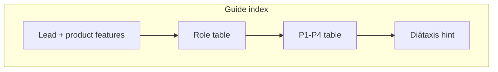

# Wireframe — home & guides

Implements the IA plan: **InQuanto-aligned three-column mental model** plus an explicit **fourth pillar** (jobs & reproducibility). Delivered in VitePress (`docs/en/index.md`, `/en/guide/`).

## 1. Home page

### 1.1 Block order

| # | Block | Purpose |
|---|-------|---------|
| A | **Hero** | Name + DOCUMENTATION label + tagline + **Quickstart** + **Product features** |
| B | **Utility links** | Runs API, Roadmap |
| C | **Section header** | Eyebrow + one-line intro to cards |
| D | **Four pillar cards** | P1–P4; each: title, lead, body, one deep link where useful |
| E | **Trust strip** (optional) | Parity matrix + honest partial/n/a — link `/en/parity/public-matrix` |
| F | **Short footer** | Security & data, Principles & reading |

### 1.2 ASCII wireframe

```
┌─────────────────────────────────────────────────────────────┐
│  Nav …  Search                                               │
├─────────────────────────────────────────────────────────────┤
│  qchem-stack                                                 │
│  DOCUMENTATION                                               │
│  Tagline …                                                   │
│  [ Quickstart ]   [ Product features ]                       │
├─────────────────────────────────────────────────────────────┤
│                    Runs API · Roadmap                        │
├─────────────────────────────────────────────────────────────┤
│              Four pillars / CAPABILITY PILLARS               │
│              One-line subcopy …                              │
├──────────────┬──────────────┬──────────────┬─────────────────┤
│ 01 Chem spec │ 02 Programs  │ 03 Execution │ 04 Jobs & repro │
│ lead         │ lead         │ lead         │ lead            │
│ body         │ body + link  │ body + link  │ body + API/repro│
└──────────────┴──────────────┴──────────────┴─────────────────┘
│ Trust: parity matrix · L1 sign-off · gap plan (link row)    │
└─────────────────────────────────────────────────────────────┘
```

## 2. Guide index (`/en/guide/`)

1. **Lead**: Product features → Quickstart → pillar table.
2. **Choose your path** (roles)

| Role | First hop |
|------|-----------|
| Research chemist | P1 + mirror manual geometry |
| Algorithm developer | P2 + CLI & scripts |
| Platform / ops | P4 + HTTP Runs API reference |
| Compliance / procurement | Parity matrix + Security & data |

3. **Pillar table** (P1–P4).
4. **Diátaxis**: point to top nav + [Documentation types](/en/meta/diataxis-index).



## 3. Implementation checklist

| Item | Status |
|------|--------|
| Hero dual CTA | Done |
| Four pillar cards on home | Done |
| Dedicated trust strip on home | Optional iteration |
| Role table on guide index | Done |
