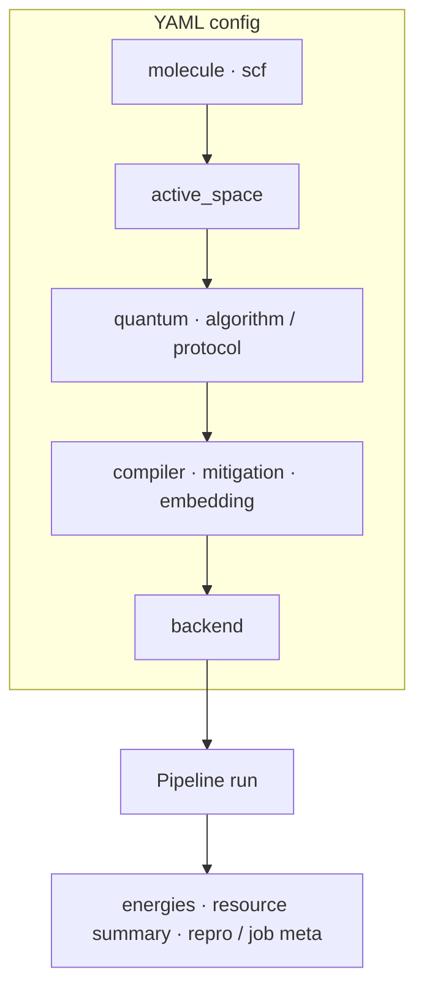

Default readers are **users** (R&D, computational chemistry, platform integration). Read in three layers: outcomes → interfaces → internals.

## Three layers

| Layer | You want | Where to start |
|-------|----------|----------------|
| **1. Main features** | What the stack does, end-to-end story | This page + [15-minute quickstart](/en/tutorial/quickstart) + [Workflow & YAML](/en/tutorial/workflow-overview) |
| **2. Usage & interfaces** | YAML, Python, HTTP, CLI | [Pillar guides](/en/guide/) · [CLI & scripts](/en/reference/cli-and-scripts) · [HTTP API](/en/reference/http-api-sqlite-jobs) |
| **3. Implementation & theory** | Contracts, compilation/sampling paths, mitigation semantics | [Reference pages](/en/reference/http-api-sqlite-jobs) · [Concept](/en/concept/engineering-architecture) · [Principles & reading](/en/guide/principles-and-reading) |

**InQuanto public-doc mapping** (295 nodes, parity matrix, etc.) is an **internal engineering target**, not required to use the product — see [Positioning & roadmap](/en/product/) and [Parity](/en/product/roadmap). The top nav keeps **Parity** for R&D alignment; **end users can skip** it unless you join acceptance or procurement mapping.

## Main features (user view)

- **Chemistry & embedding**: molecular / periodic drivers, active space, JW; optional DMET / projection / Schmidt-style workflows (see [P1](/en/guide/chemistry-and-embedding/)).
- **Algorithms & protocols**: variational flows (e.g. VQE, ADAPT), excited-state paths, five-stage protocol; computable-style previews ([P2](/en/guide/algorithms-and-protocols/)).
- **Execution & analysis**: backends (statevector, Qiskit, IonStack mock), sampling, resource summaries, mitigation-related fields ([P3](/en/guide/execution-and-analysis/)).
- **Jobs & reproducibility**: optional SQLite jobs, FastAPI submit/poll, `repro` / parity exports ([P4](/en/guide/jobs-and-reproducibility/)).

Scope and non-goals: [competitive positioning](/en/product/roadmap), [engineering architecture](/en/concept/engineering-architecture).

## One-page diagram: YAML → results

High-level **data flow** for one experiment (same story as [Workflow & YAML](/en/tutorial/workflow-overview); authoritative keys live in repo YAML + source).

## Packaged configs & field groups (`configs/`)

Paths are relative to the **`qchem_qml_md` repo root** (sibling of `docs-site` on disk).

**Machine list** (synced to `configs/*.yaml` on disk): **[Packaged configs index](/en/product/configs-packaged-list)** (`npm run sync:configs-table`). The table below is a **curated** “what to learn” subset.

| File | Good for learning |
|------|-------------------|
| `configs/example_h2.yaml` | Default **VQE + Pauli protocol**, statevector backend; best “full skeleton” to start |
| `configs/example_h2_sampled.yaml` | Sampling path vs `example_h2` |
| `configs/example_h2_qiskit_shots.yaml` | **Qiskit** shots / bitstrings (`quantum` extra) |
| `configs/example_h2_excited_smoke.yaml` | Excited-state smoke (`scripts/smoke_pipeline.py --excited-only`) |
| `configs/example_h2_iqeb.yaml` | **IQEB** outer loop |
| `configs/example_h2_qpe_track.yaml` | **QPE demo track** |
| `configs/example_h2_projection_trace.yaml` | **Projection** embedding L1 trace |
| `configs/example_h2_embedding_parity.yaml` | Embedding + parity field alignment |
| `configs/example_h2_uccsd_trotter.yaml` | **JW UCCSD** first-order Trotter layers (`uccsd_trotter_steps`) |
| `configs/example_h2_zne_circuit_fold.yaml` | **ZNE** + `zne_qiskit_unification_v1` narrative (see tutorial) |
| `configs/example_h2_pbc_gamma.yaml` | Minimal **PBC** Γ example |
| `configs/example_oniom_toy.yaml` | DMET-shaped + `oniom_layers_v1` toy metadata |
| `configs/example_h2_casscf_audit.yaml` | **CASSCF orbital optimization audit** flag |
| `configs/tutorial_inquanto_chain_h2.yaml` | Tutorial chain example |
| `configs/qpe_dual_track_demo.yaml` | QPE dual-track demo |
| `configs/example_h4_projection_mulliken.yaml` | Larger system + projection / Mulliken-style example |

### Top-level blocks in `example_h2.yaml` (overview vs detail)

| YAML block | Read first (overview) | Detail docs |
|------------|----------------------|---------------|
| `molecule` | Symbols, geometry, charge, basis | [P1 Chemistry & embedding](/en/guide/chemistry-and-embedding/) |
| `scf` | Classical driver (e.g. PySCF) and method | P1 · config models in source |
| `active_space` | Active orbitals / electrons | P1 |
| `quantum` | `algorithm`, Pauli protocol toggles, commented excited options | [P2 Algorithms & protocols](/en/guide/algorithms-and-protocols/) |
| `backend` | `provider`, shots, Qiskit-related keys | [P3 Execution & analysis](/en/guide/execution-and-analysis/) |
| `compiler` / `mitigation` / `embedding` | Compile level, mitigation toggles, embedding `mode` | P3 · [Mitigation mapping](/en/concept/mitigation-mapping) · P1 |
| `schema_version` / `experiment_id` / `random_seed` | Traceability & reproducibility | [P4](/en/guide/jobs-and-reproducibility/) · Reference |

For **allowed values and contract fields**, use [Reference](/en/reference/http-api-sqlite-jobs) and the Pydantic models in source; this table only maps “where to edit” to pillar docs.

## User-facing interfaces

| Surface | Typical use | Docs |
|---------|-------------|------|
| **YAML** | Declarative experiment + protocol | [Workflow & YAML](/en/tutorial/workflow-overview) → [guides](/en/guide/) |
| **Python API** | Notebooks / scripts, synchronous runs | [Quickstart](/en/tutorial/quickstart) · `qchem_stack.orchestration.pipeline` |
| **HTTP REST** | Schedulers, local demo gateway | [HTTP API](/en/reference/http-api-sqlite-jobs) |
| **CLI** | Workers, smoke scripts, exports | [CLI & scripts](/en/reference/cli-and-scripts) |

## Where implementation detail lives

- **Contracts, endpoints, CircuitIR / TKET**: [Reference pages](/en/reference/http-api-sqlite-jobs).
- **Layering and boundaries vs closed/cloud stacks**: [Concept](/en/concept/engineering-architecture) and related concept docs.
- **Deeper algorithms & QC/classical links**: [Principles & reading](/en/guide/principles-and-reading).

## Suggested learning path

1. [15-minute quickstart](/en/tutorial/quickstart)  
2. [Workflow & YAML overview](/en/tutorial/workflow-overview)  
3. Optional tutorials: [UCCSD Trotter + export](/en/tutorial/uccsd-trotter-export), [ZNE × Qiskit repro](/en/tutorial/zne-qiskit-repro), [Projection deep dive](/en/tutorial/projection-embedding-deep-dive)  
4. [Pillar guides](/en/guide/) as needed  
5. [CLI & scripts](/en/reference/cli-and-scripts) and [HTTP API](/en/reference/http-api-sqlite-jobs) for integration  

[Roadmap](/en/product/roadmap); **positioning and internal benchmark index**: [Positioning & roadmap](/en/product/).
