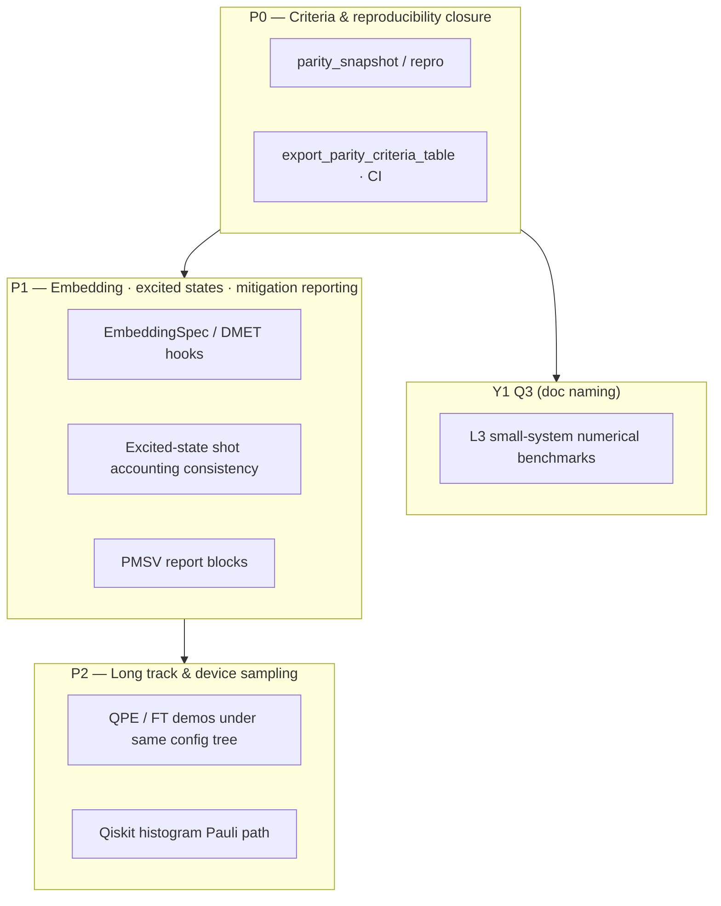

# Roadmap

This page compresses the engineering narrative into **one navigable hub**. Authoritative detail stays in **[full plan (Chinese)](/concept/p2-detailed-plan)** and [English summary](/en/concept/p2-detailed-plan).

## Beat overview (conceptual)

Phase labels **P0 / P1 / P2** match that doc; they do **not** imply calendar quarters unless your programme pins them separately.

## Doc index (deep dives)

| Topic | Page |
|------|------|
| Roadmap P2 | [Full plan (ZH)](/concept/p2-detailed-plan) · [Summary (EN)](/en/concept/p2-detailed-plan) |
| Engineering architecture | [Architecture](/en/concept/engineering-architecture) |
| API and jobs | [HTTP API · SQLite jobs](/en/reference/http-api-sqlite-jobs) |

## Back to product & quickstart

- [Product features](/en/product/features) · [Positioning & roadmap](/en/product/) · [15-minute quickstart](/en/tutorial/quickstart) · [Guides overview](/en/guide/)
