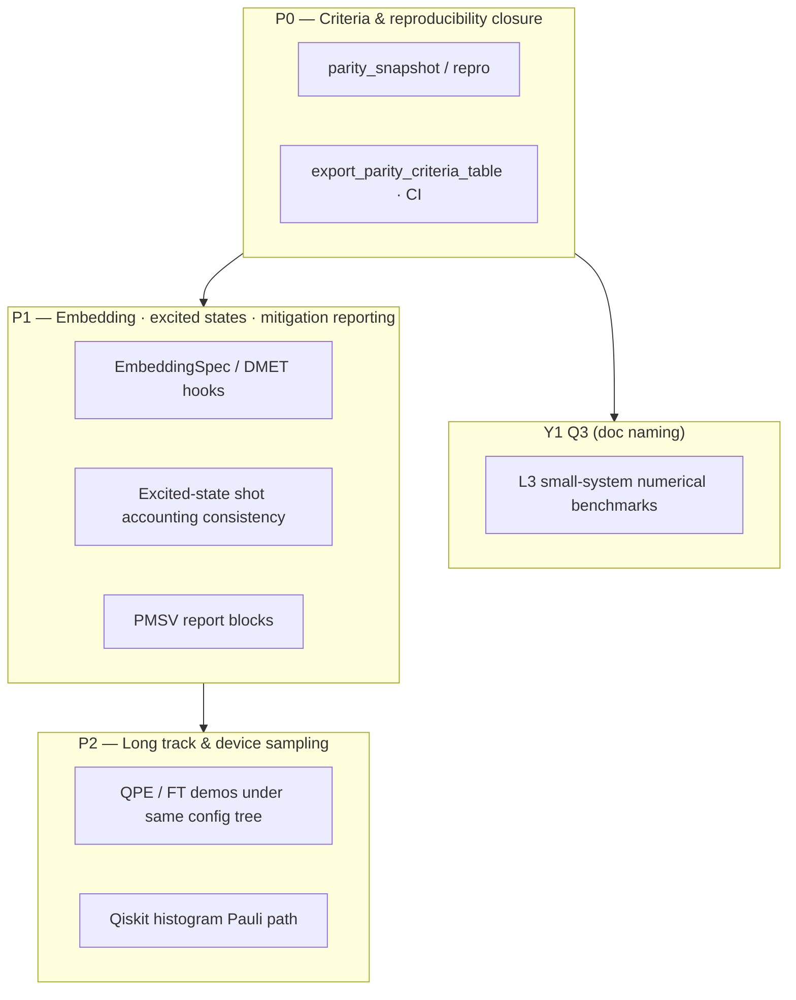

# Roadmap

This page compresses the engineering narrative into **one navigable hub**. Authoritative detail stays in [Competitive positioning](/concept/competitive-positioning) (§5 — Chinese-primary); contract matrices and sign-offs live under Parity.

## Beat overview (conceptual)

Phase labels **P0 / P1 / P2** match that doc; they do **not** imply calendar quarters unless your programme pins them separately.

## Y1 Q3: L3 benchmark suite

Goal: **repeatable numerical thresholds** for public alignment without claiming equivalence to closed-source defaults (excluding cloud/hardware). Order: benchmark 1 (H₂ sto-3g + VQE+Pauli) → benchmark 2 (sampled / shots) → optional benchmark 3 (Schmidt single round).

See **[L3 benchmark roadmap](/parity/l3-benchmark-roadmap)** (Chinese-primary).

## Doc index (deep dives)

| Topic | Page |
|------|------|
| Gap list & implementation order | [Gap implementation plan](/parity/gap-implementation-plan) (Chinese-primary) |
| Contract matrix | [Public parity matrix](/en/parity/public-matrix) · [full matrix (ZH)](/parity/public-matrix) |
| L1 / Y1 pinning | [L1 sign-off](/en/parity/l1-signoff) · [Y1 alignment ledger](/parity/y1-alignment-ledger) |
| Open-stack memory | [Open-stack memory](/parity/open-stack-memory) |
| Backlog vs schedule | [Backlog to schedule](/parity/backlog-to-schedule) |

## Back to product & quickstart

- [Product & positioning](/en/product/) · [15-minute quickstart](/en/tutorial/quickstart) · [Guides overview](/en/guide/)
