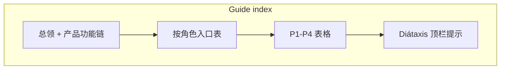

# 首页与指南线框（定稿可开发）

对应「InQuanto 文档站分析与对标页面整体架构」中的 **首页 + Guides** 信息结构；实现载体为当前 VitePress 主题（`docs/index.md`、`/guide/`）。

## 1. 首页（Docs Home）

### 1.1 区块顺序（自上而下）

| # | 区块 | 目的 |
|---|------|------|
| A | **Hero** | 产品名 + Documentation 眉题 + 一句价值主张 + **快速开始** / **产品功能** 双 CTA |
| B | **快捷链**（可选） | Runs API、路线图 — 高频工程入口 |
| C | **能力主轴标题** | 眉题 + 一句副文案，引入下方卡片 |
| D | **四柱能力卡片** | P1–P4；每卡：标题、lead、正文、**单一主深链**（手册镜像或指南） |
| E | **信任区块**（紧凑） | 公开契约矩阵 + 诚实边界（partial / n/a）— 链到 `/parity/public-matrix` |
| F | **页脚短链** | 安全与数据、原理与阅读 |

### 1.2 线框（ASCII）

```
┌─────────────────────────────────────────────────────────────┐
│  Nav …  Search                                               │
├─────────────────────────────────────────────────────────────┤
│  qchem-stack                                                 │
│  DOCUMENTATION (small caps)                                  │
│  一句 tagline …                                              │
│  [ 快速开始 ]   [ 产品功能 ]                                  │
├─────────────────────────────────────────────────────────────┤
│                    Runs API · 路线图                          │
├─────────────────────────────────────────────────────────────┤
│              四条能力主轴 / Capability pillars               │
│              副文案一行 …                                    │
├──────────────┬──────────────┬──────────────┬─────────────────┤
│ 01 P1 化学…  │ 02 P2 算法…  │ 03 P3 执行…  │ 04 P4 作业与…   │
│ lead         │ lead         │ lead         │ lead            │
│ body         │ body + 深链   │ body + 深链   │ body + API/repro│
└──────────────┴──────────────┴──────────────┴─────────────────┘
│ 信任：公开契约矩阵 · L1 签 off · 差距计划（链接行）            │
├─────────────────────────────────────────────────────────────┤
│  安全与数据 · 原理与阅读                                      │
└─────────────────────────────────────────────────────────────┘
```

### 1.3 与 InQuanto 差异（刻意）

- **第四柱**显式化：作业、SQLite、`repro`、HTTP Runs API 与 parity 台账同屏可达。
- **信任**不放在页脚小字：首页中段一条 **诚实边界** 链到 Parity 区，替代空洞营销话术。

## 2. 指南总览（`/guide/`）

### 2.1 结构

1. **一句总领**：先读产品功能 → Quickstart → 四柱表格。
2. **按角色入口（Choose your path）**  

| 角色 | 首跳 |
|------|------|
| 量子化学研究者 | P1 + `/mirror/manual/geometry/` |
| QC 算法 / 协议开发者 | P2 + `/reference/cli-and-scripts` |
| 平台集成 / 运维 | P4 + `/reference/http-api-sqlite-jobs` |
| 合规 / 采购 | `/parity/public-matrix` + `/meta/security-and-data` |

3. **四柱表格**（与 IA 定稿一致）。
4. **Diátaxis 提示**：Concept / Tutorial / Reference / Parity 见顶栏；链到 [文档类型索引](/meta/diataxis-index)。

### 2.2 线框（Mermaid）



## 3. 实现状态

| 项 | 状态 |
|----|------|
| Hero 双 CTA | 已落地 |
| 四柱首页卡片 | 已落地（与线框对齐） |
| 首页信任短行 | 见 `docs/index.md` 是否含独立 trust 行；可与页脚合并迭代 |
| 指南角色表 | 已写入 `/guide/` 总览 |

后续若加插图或 Figma，可在本页追加「视觉稿链接」一节。
