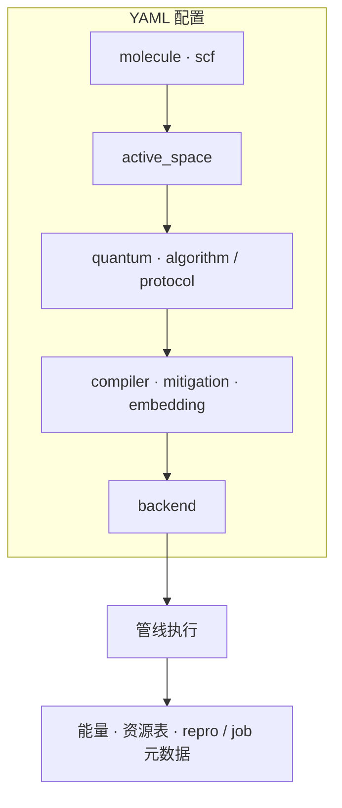

本站默认读者是**使用者**（研发、计算化学、平台集成）。下面按「先建立整体印象 → 再查接口与配置 → 最后深入实现与原理」分层。

## 三层阅读方式

| 层次 | 你关心什么 | 建议从哪里读 |
|------|------------|----------------|
| **1. 主要功能** | 软件解决什么问题、一条任务如何走完 | 本页下一节 + [15 分钟上手](/tutorial/quickstart) + [工作流与 YAML 概览](/tutorial/workflow-overview) |
| **2. 用法与接口** | 怎么配 YAML、怎么调 Python / HTTP / 命令行 | [四柱指南](/guide/) · [命令行与脚本](/reference/cli-and-scripts) · [HTTP API](/reference/http-api-sqlite-jobs) |
| **3. 实现细节与原理** | 字段契约、编译与采样路径、缓解与对标语义 | [Reference 各篇](/reference/http-api-sqlite-jobs) · [Concept](/concept/engineering-architecture) 等 · [原理与阅读建议](/guide/principles-and-reading) |

**与 InQuanto 公开文档的对标**（295 节点、契约矩阵等）属于**内部研发目标与验收**，放在 [定位与路线](/product/) 与 [Parity](/parity/public-matrix)，不是使用产品的必经路径。顶栏保留 **Parity** 便于研发对齐；**终端用户可跳过**该区，除非参与验收或采购对表。

## 主要功能（用户视角）

- **化学与嵌入**：分子/周期驱动、活性空间、Jordan–Wigner 等；可选 DMET / 投影 / Schmidt 等嵌入叙事（能力以配置与指南为准）。
- **算法与协议**：变分线路（如 VQE、ADAPT）、激发态相关路径、五阶段 Protocol；可预览 computable 等结构化输出（见 [P2 指南](/guide/algorithms-and-protocols/)）。
- **执行与分析**：多后端（如 statevector、Qiskit、IonStack mock）、采样与资源摘要、缓解相关配置与报告字段。
- **作业与可复现**：可选 SQLite 作业表、FastAPI 提交与轮询、`repro` / parity 导出，便于流水线与回归（见 [P4 指南](/guide/jobs-and-reproducibility/)）。

更细的**能力边界**（做什么、不做什么）见 [竞争定位](/concept/competitive-positioning) 与 [工程分层](/concept/engineering-architecture)。

## 一页图：从 YAML 到结果

概览一条实验在配置里的**数据流**（与 [工作流与 YAML](/tutorial/workflow-overview) 一致；细节以仓库 YAML 与源码为准）。

## 示例配置与字段分组（仓库 `configs/`）

以下路径均相对于 **`qchem_qml_md` 仓库根**（与文档站 `docs-site` 并列时请在本机打开对应目录）。

**机械清单**（与磁盘 `configs/*.yaml` 同步）：见 **[仓库 configs 索引](/product/configs-packaged-list)**（由 `npm run sync:configs-table` 生成）。下表为按主题的**推荐阅读**，与索引互补。

| 文件 | 适合用来学什么 |
|------|----------------|
| `configs/example_h2.yaml` | 默认 **VQE + Pauli 协议**、statevector 后端；字段最全的入门骨架 |
| `configs/example_h2_sampled.yaml` | 采样 / 协议路径与 `example_h2` 对比 |
| `configs/example_h2_qiskit_shots.yaml` | **Qiskit** shots 与比特串路径（需 quantum extra） |
| `configs/example_h2_excited_smoke.yaml` | 激发态烟测（与 `scripts/smoke_pipeline.py --excited-only` 配套） |
| `configs/example_h2_iqeb.yaml` | **IQEB** 外环示例 |
| `configs/example_h2_qpe_track.yaml` | **QPE 演示轨** |
| `configs/example_h2_projection_trace.yaml` | **projection** 嵌入 L1 轨迹 |
| `configs/example_h2_embedding_parity.yaml` | 嵌入与 parity 字段对表示例 |
| `configs/example_h2_uccsd_trotter.yaml` | **JW UCCSD** 一阶 Trotter 层（`uccsd_trotter_steps`） |
| `configs/example_h2_zne_circuit_fold.yaml` | **ZNE**（含与 Qiskit Pauli 路径合一的机读块说明，见教程） |
| `configs/example_h2_pbc_gamma.yaml` | **PBC** Γ 点最小示例 |
| `configs/example_oniom_toy.yaml` | **DMET 形状** + `oniom_layers_v1` 玩具层元数据 |
| `configs/example_h2_casscf_audit.yaml` | **CASSCF 一步轨道优化审计**（`casscf_orbital_optimization_audit`） |
| `configs/tutorial_inquanto_chain_h2.yaml` | 教程链式编排示例 |
| `configs/qpe_dual_track_demo.yaml` | QPE 双轨演示 |
| `configs/example_h4_projection_mulliken.yaml` | 多原子 + projection / Mulliken 相关示例 |

### 以 `example_h2.yaml` 为骨架的字段分组（概览 vs 细节）

| YAML 块（顶层键） | 你先看什么（概览） | 细节去哪读 |
|-------------------|-------------------|------------|
| `molecule` | 元素、坐标、电荷、基组 | [P1 化学与嵌入](/guide/chemistry-and-embedding/) |
| `scf` | 经典驱动（如 PySCF）与方法（RHF 等） | P1 · 配置模型源码 |
| `active_space` | 活性轨道 / 电子数 | P1 |
| `quantum` | `algorithm`、Pauli 协议开关、激发相关注释项 | [P2 算法与协议](/guide/algorithms-and-protocols/) |
| `backend` | `provider`、shots、与 Qiskit 相关子键 | [P3 执行与分析](/guide/execution-and-analysis/) |
| `compiler` / `mitigation` / `embedding` | 编译等级、缓解开关、嵌入 `mode` | P3 · [缓解映射](/concept/mitigation-mapping) · P1 |
| `schema_version` / `experiment_id` / `random_seed` | 可复现与追踪 | [P4](/guide/jobs-and-reproducibility/) · Reference |

**细节**（合法取值、白名单字段、`repro` 键集）以 **Reference** 与 **源码中的 Pydantic 模型**为准；上表只帮你把「改配置」时对号入座到四柱文档。

## 用户接口（对外契约面）

| 接口 | 典型用途 | 文档入口 |
|------|----------|----------|
| **YAML 配置** | 描述分子、量子算法、后端、协议与作业行为 | [工作流与 YAML 概览](/tutorial/workflow-overview) → 各柱 [指南](/guide/) |
| **Python API** | 脚本与笔记本内同步跑管线 | [15 分钟上手](/tutorial/quickstart) · 源码 `qchem_stack.orchestration.pipeline` |
| **HTTP REST** | 与外部调度器、本地演示网关集成 | [HTTP API · SQLite 作业](/reference/http-api-sqlite-jobs) |
| **命令行** | 起 worker、烟测脚本、导出 parity 表等 | [命令行与脚本](/reference/cli-and-scripts) |

## 实现细节去哪里看

- **契约级字段、端点表、CircuitIR / TKET 行为**：以 [Reference 各篇](/reference/http-api-sqlite-jobs) 为准（偏「实现与对表」）。
- **分层心智模型、与闭源/云侧边界**：以 [Concept](/concept/engineering-architecture) 等为准（偏「为什么这样设计」）。
- **算法与量子–经典衔接的深入阅读**：见 [原理与阅读建议](/guide/principles-and-reading)（书单式索引，仍指向站内已有文档）。

## 教程与学习顺序（建议）

1. [15 分钟上手](/tutorial/quickstart) — 安装与最小管线  
2. [工作流与 YAML 概览](/tutorial/workflow-overview) — 从配置文件理解任务  
3. 按需：[UCCSD Trotter](/tutorial/uccsd-trotter-export)、[ZNE repro](/tutorial/zne-qiskit-repro)、[Projection 深入](/tutorial/projection-embedding-deep-dive)  
4. 按任务选读 [P1–P4 指南](/guide/)  
5. 需要集成或自动化时再打开 [命令行与脚本](/reference/cli-and-scripts) 与 [HTTP API](/reference/http-api-sqlite-jobs)  

产品节奏与规划见 [路线图](/product/roadmap)；**边界、路线图与内部对标索引**见 [定位与路线](/product/)。
