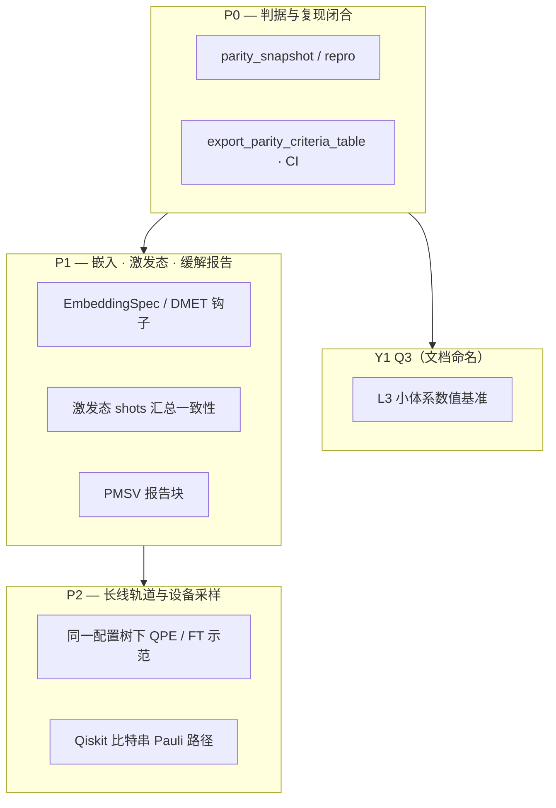

# 路线图

本页把工程叙事 **压缩成一页目录**；细则仍以仓库正文 [竞争定位与路线图](/concept/competitive-positioning)（第五节）为准，契约与签 off 仍以 Parity 区为准。

## 节拍总览（概念）

标签 **P0 / P1 / P2** 与竞品文档一致；**除非项目另有钉扎**，否则不强行绑日历季度。

## Y1 Q3：L3 基准套件

目标：在 **排除云/硬件** 前提下，为「公开面对齐」提供 **可重复数值门槛**（不等价 InQuanto 闭源默认）。顺序：基准 1（H₂ sto-3g + VQE+Pauli）→ 基准 2（采样 / shots）→ 可选基准 3（Schmidt 单轮）。

详见 **[L3 基准路线图](/parity/l3-benchmark-roadmap)**。

## 延伸阅读索引

| 主题 | 页面 |
|------|------|
| 差距与实施顺序 | [能力差距与实施计划](/parity/gap-implementation-plan) |
| 契约矩阵 | [公开契约矩阵](/parity/public-matrix) |
| L1 / Y1 钉扎 | [L1 签 off](/parity/l1-signoff)、[Y1 对标台账](/parity/y1-alignment-ledger) |
| 开放栈记忆 | [开放栈记忆](/parity/open-stack-memory) |
| 积压转排期 | [迭代说明](/parity/backlog-to-schedule) |

## 返回产品与上手

- [产品与方案](/product/) · [15 分钟上手](/tutorial/quickstart) · [指南总览](/guide/)
