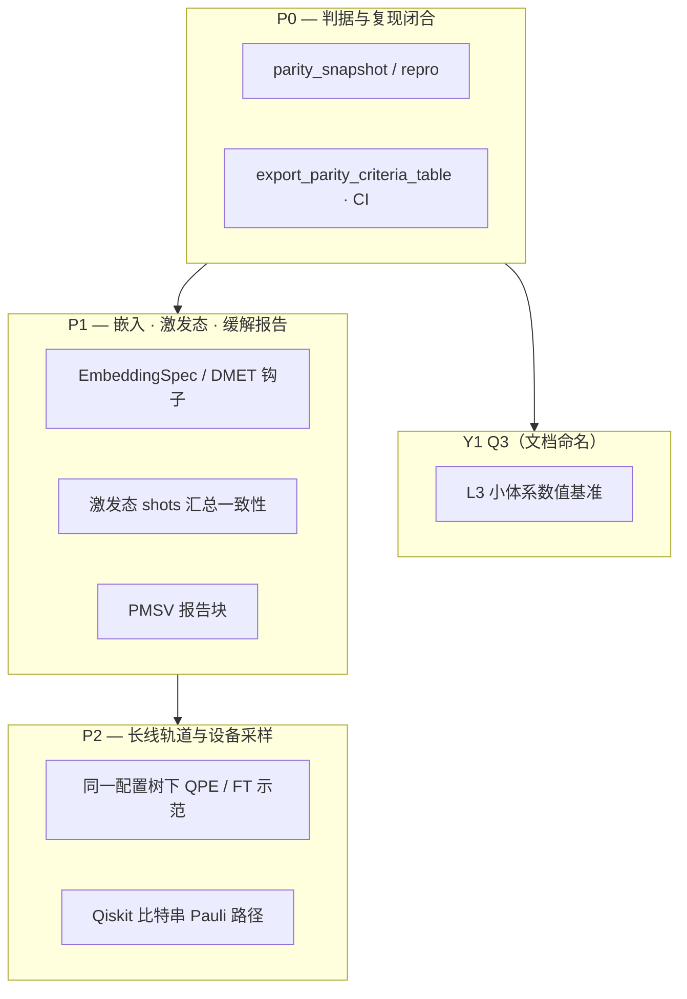

# 路线图

本页把工程叙事 **压缩成一页目录**；细则见 **[P2 详细实施计划](/concept/p2-detailed-plan)**。

## 节拍总览（概念）

标签 **P0 / P1 / P2** 用于内部工程节拍；**除非项目另有钉扎**，否则不强行绑日历季度。

## 延伸阅读索引

| 主题 | 页面 |
|------|------|
| 路线图 P2（全文） | [P2 详细实施计划](/concept/p2-detailed-plan) |
| 工程架构 | [工程分层架构](/concept/engineering-architecture) |
| API 与作业 | [HTTP API · SQLite 作业](/reference/http-api-sqlite-jobs) |

## 返回产品与上手

- [产品功能](/product/features) · [定位与路线](/product/) · [15 分钟上手](/tutorial/quickstart) · [指南总览](/guide/)
