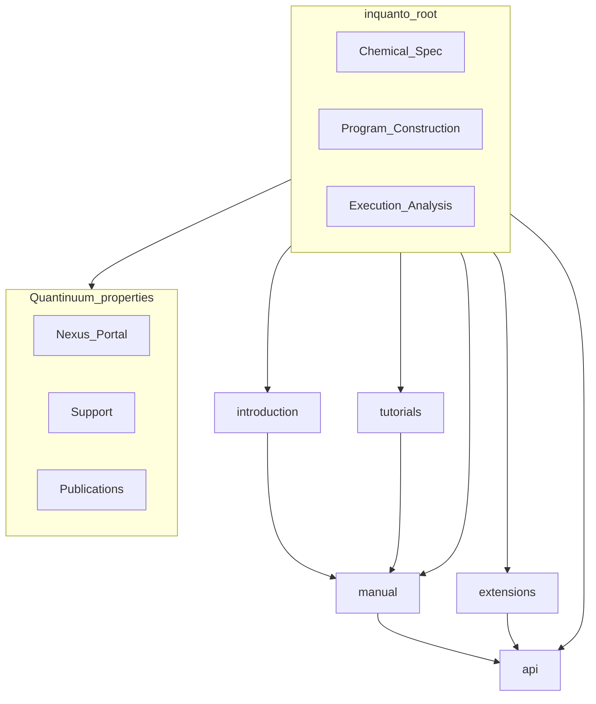

# Vol.00 执行摘要 — Quantinuum InQuanto 公开文档站

**读者**：架构师、产品线负责人、文档站负责人。  
**证据等级**：本卷区分 **已证实**（直接抓取公开 HTML 或 manifest 钉扎）与 **推断**（由 URL 形态、交叉链接与行业惯例推出）。  
**机器真源**：[`docs-site/scripts/mirror-doc-tree.yaml`](../../docs-site/scripts/mirror-doc-tree.yaml)（`site_meta.source_pin_date`、`upstream_doc_version_seen`）。

---

## 1. 文档站定位（已证实）

InQuanto 文档站根路径为 `https://docs.quantinuum.com/inquanto/`，与 **Python 包 InQuanto** 及 **Quantinuum Nexus** 生态相邻但分离：

- 根页以 **三大叙事柱** 组织：「Chemical Specification」「Program Construction」「Execution and Analysis」，每柱一段营销级说明 + 链向手册深度页（如 Protocols & Computables、误差缓解）。
- 页眉/页脚存在 **Nexus Portal**、**Product Updates**、**Support**、**Publications** 等外链，表明文档站承担 **获客 + 技术支持 + 学术背书** 三重职能，而非纯 API 字典。

**推断**：文档发布流水线极可能为 Sphinx 或同类静态生成器（`.html` 后缀、章节锚点、版本号出现在 `<title>`，如抓取样本 `Protocols - InQuanto 5.2.3`）。

---

## 2. 信息架构总览（已证实 + manifest 归纳）

顶层在 manifest 中划分为六大块（与公开 URL 前缀一致）：

| 顶层 | 公开角色 | 典型用户任务 |
|------|-----------|--------------|
| `introduction/` | 心智模型、安装、排障、最短路径 | 「InQuanto 是什么？怎么装？quickstart 能否跑通？」 |
| `manual/` | 概念 + 操作手册 | 「Protocol 五阶段是什么？如何接 PySCF？」 |
| `tutorials/` | 笔记本式教程 | 「按步骤复现 VQE / DMET / 异步实验」 |
| `extensions/` | 可选能力包 | 「是否安装 PySCF / Nexus / cuTensorNet？」 |
| `api/inquanto/` | 符号级参考 | 「`PauliAveraging.build` 签名与返回值」 |
| `misc/` | changelog、cite、许可、开源归属、联系 | 合规、引用与 Support 区 |

---

## 3. 与 Nexus / 商业产品边界（已证实）

公开 **Protocols** 页明确：后端通过 **pytket Backend** 与 **pytket extensions** 接入；若使用 **Quantinuum Nexus**，则通过 **qnexus** 与项目引用选择设备或模拟器（见抓取正文中的 Nexus / qnexus 链）。

**结论**：InQuanto 文档站是 **「库 + 编排抽象」** 的说明书；**计费、租户、OAuth、作业持久化 SLA** 等由 Nexus 产品承载。对标时不可把「文档里出现的 Nexus 教程」误等同为「InQuanto wheel 开源能力」。

---

## 4. 核心抽象轴（已证实）

从 `introduction/quickstart` 与 `manual/protocols_overview` 可抽出 **三条贯穿轴**：

1. **经典化学 → 量子对象**：`express.load_h5`、PySCF 扩展、Fermion / Qubit 算符与映射。
2. **算法 / Computable / Protocol**：VQE 等算法对象；Computable 组合；Protocol 五阶段（instantiate → build → compile → run → evaluate）。
3. **后端与资源**：编译 passes、shots 表、异步 `launch`/`retrieve`、缓解与资源估计。

本仓库 `qchem-stack` 的 **四柱 IA**（P1–P4）与此三轴 **可对齐但非一一对应**：我们显式把 **作业与可复现** 提升为 P4，以覆盖 Nexus 在厂商叙事中分散的职责。

---

## 5. 与本仓库文档站的关系（已证实 + 工程事实）

| 能力 | InQuanto 公开站 | 本仓库 `docs-site`（当前） |
|------|-----------------|---------------------------|
| 三柱营销枢纽 | 有 | 首页四柱 + `/product/` 产品叙事 |
| 全树 URL 索引 | Sphinx 侧栏 + 搜索 | `/mirror/` + `MirrorTree` + YAML manifest |
| 版本钉扎 | HTML title 中带版本 | `mirror-doc-tree.yaml` `site_meta` |
| 双语 | 以英文为主 | 根中文 + `/en/` 部分页 |
| Nexus 真链 | 有 | 明确 `n/a` + 本地 FastAPI/SQLite 类比 |

---

## 6. 风险与对标误区（推断）

- **误区一**：把 API 页数量当作「功能完成度」。应结合 **闭源 wheel** 与 **默认超参** 区分公开符号与可复现行为。
- **误区二**：忽略 **教程与手册的重复叙事** — InQuanto 允许同一概念在 quickstart、manual、tutorial 三处出现；自建站需决定是否 **DRY** 或 **刻意重复** 以降低新手摩擦。
- **误区三**：忽略 **TKET 中心主义** — 大量链接指向 `docs.quantinuum.com/tket/`，自建站若主打 Qiskit / 自研模拟器，需在 IA 上给 **编译与设备模型** 单独一章，避免读者迷路。

---

## 7. 本卷结论

InQuanto 文档站是 **「三柱品牌叙事 × Diátaxis 混合（教程 + 手册 + API）× 商业生态外链」** 的成熟形态。后续卷次将 **逐层拆解** Manual / Tutorials / Extensions / API 的 **层级、交叉引用与页面类型**；附录 A/B/C 提供 **295 个 manifest 节点**（与 `npm run check:mirror` 一致）的机器展开，用于审计与自建站路由映射；官方 Furo 侧栏与 manifest 边界见 [Vol.10](./vol-10-official-sidebar-vs-manifest.md)。

**下一卷**：[`vol-01-hub-and-navigation.md`](./vol-01-hub-and-navigation.md)。
