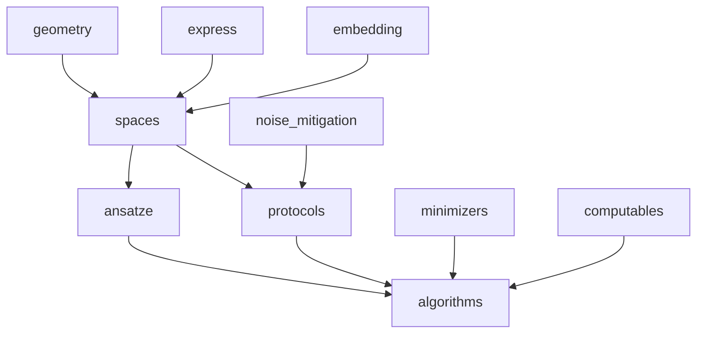

# Vol.02 Manual 全层级 — 目的、依赖与交叉引用模式

**读者**：技术写作者、量子化学 / QC 架构师。  
**真源**：[`inquanto-tree.yaml`](../../docs-site/scripts/inquanto-tree.yaml) 中 `manual:` 子树；抽样页面 **Protocols**、**Quick-start**（已抓取）。

---

## 1. Manual 在整站中的位置

Manual 是 **最大概念密度区**：从分子几何到噪声缓解，覆盖 **P1（化学）** 与 **P2/P3（量子程序与执行）** 的主体。Introduction 负责「第一次成功」；Manual 负责 **「为什么与怎么做」**；Tutorials 负责 **「跟着抄」**；API 负责 **「符号与边界条件」**。

---

## 2. 一级分支总表（manifest 顺序）

以下表格与 manifest 中 `manual.children` **键顺序** 一致，便于与附录 A 对照。

| 键 | 公开标题（中） | 典型先验知识 | 主要下游 |
|----|----------------|--------------|----------|
| `howto` | 如何使用 InQuanto | Python、QC 基础 | 全 manual |
| `geometry` | 几何 | 分子坐标、单位 | drivers、spaces |
| `express` | Express 数据集 | 无（开箱数据） | algorithms、quickstart |
| `symmetry` | 对称性 | 群论基础 | ansatze、operators |
| `spaces_operators` | 空间 / 算符 / 状态 / 映射 | 二次量子化、JW/BK | protocols、API spaces |
| `ansatze` | Ansatze | VQE 概念 | algorithms、protocols |
| `minimizers` | 极小化器 | 优化理论 | algorithms VQE |
| `computables` | Computables | 表达式树、lazy eval | protocols、algorithms |
| `protocols` | Protocols（五阶段） | pytket Circuit | backends、API protocols |
| `algorithms` | Algorithms | VQE/ADAPT/QPE | computables、protocols |
| `embedding` | 嵌入与 DMET | 电子结构 | PySCF 扩展、tutorials fragmentation |
| `noise_mitigation` | 噪声缓解 | 误差模型 | Qermit 文档、protocols |

---

## 3. 深度剖析：Protocols 五阶段（已证实）

公开 `protocols_overview` 定义 **统一心智模型**：

1. **Instantiate**：绑定 `backend`、`shots_per_circuit` 等实验级参数。
2. **Build**：生成 **逻辑电路**（与体系结构无关），常用 pytket **box** 表示。
3. **Compile**：`compile_circuits()` — rebasing、门集、`optimization_level` / `compiler_passes` / `preoptimize_passes` 三通道（与 TKET 文档强耦合）。
4. **Run / Launch**：同步 `run()` 或异步 `launch()` + `retrieve()`；远程设备推荐异步。
5. **Evaluate**：在 shots 表返回后求期望等，并可与 **Computable** 组合。

**交叉引用模式**：正文内高频链向 `api/inquanto/protocols.html#...`、`manual/computables_overview.html`、`tket` 手册 — **手册 — API — 外部 TKET** 三角。

---

## 4. 深度剖析：Quick-start（已证实）

`introduction/quickstart` 路径：**Express 内置 H2 数据 → `run_vqe` 封装 → 与 CCSD 参考能量对比**。并显式 **Note**：`run_vqe` 仅建议测试用、仅 statevector 后端，生产应使用完整 `AlgorithmVQE`。

**叙事技巧**：先给 **黑盒成功**，再警告 **适用范围** — 降低跳出率，同时避免过度承诺。

---

## 5. Manual 内部依赖 DAG（推断）

自建站可据此设计 **「推荐阅读顺序」** 侧栏或 `/guide/` 内 **prerequisite** 提示。

---

## 6. 与 API 的映射规律

- **概览页**（`*_overview.html`）对应 API **模块索引页**（`api/inquanto/algorithms.html` 等）。
- **子主题页**（`manual/ansatze/ucc_family.html`）对应 API **具体类 / 函数** 锚点。
- **单页多锚点**（`manual/spaces.html#qubit-mapping`）在 manifest 中拆为 **子节点**，利于本站 `/mirror/` 生成独立 URL — 优于单页内 TOC -only 的站点的 **可链接性**。

---

## 7. 本卷结论

Manual 是 InQuanto 文档 **「理论体系 + 操作步骤」** 的核心层；**Protocols 五阶段** 与 **Computable** 是整站的 **语义中枢**。自建 `qchem-stack` 文档时，应保证 **YAML 管线 / HTTP 作业 / Protocol 类** 在 Manual 层有 **与五阶段对齐** 的独立章节（你们已在工程记忆与 parity 矩阵中部分完成）。

**下一卷**：[`vol-03-tutorials-and-case-studies.md`](./vol-03-tutorials-and-case-studies.md)。
