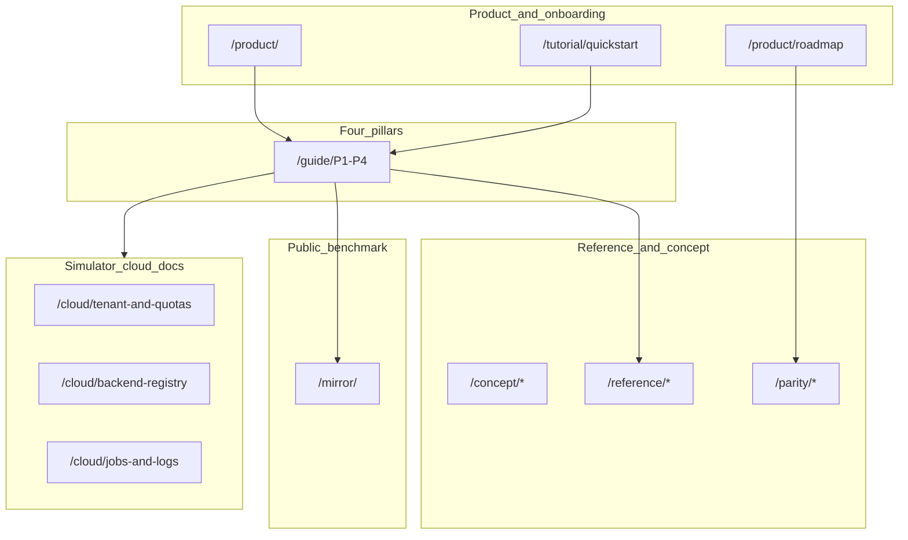

# Vol.08 目标架构 — 模拟器云平台 × 量子化学 × 量子计算编排

**读者**：云平台 PM、系统架构师、`qchem-stack` 核心贡献者。  
**目标**：在理解 InQuanto 文档 IA 的前提下，定义 **更适合你们** 的文档与产品站点 — **不复制 Nexus 闭源体验**，而在 **开源、可复现、多租户模拟器云** 上建立优势。

---

## 1. 设计原则（相对 InQuanto 公开站的差异化）

| 原则 | InQuanto 公开站侧重 | 本仓库目标侧重 |
|------|---------------------|----------------|
| 身份与作业 | 导流 Nexus | **自建租户 / API Key / 队列** 一等文档 |
| 后端叙事 | pytket 中心 | **多后端注册表**（statevector、Qiskit、IonStack、未来云模拟器） |
| 可复现 | 教程级 repro | **`repro` JSON、`parity_snapshot`、导出判据表** 契约级 |
| 对标透明度 | 隐含在厂商生态 | **`/mirror/` 公开文档对照** 显式审计 |
| 产品叙事 | 三柱 + 库 | **`/product/` + 四柱 + Roadmap** |

---

## 2. 建议站点地图（目标态）

**说明**：`/cloud/...` 为 **建议新增路由族**（当前仓库可仅占位），用于承载 **租户、配额、后端注册、作业日志保留** — 对应 InQuanto+Nexus 联合叙事在你们栈中的 **显式替代**。

---

## 3. 与 InQuanto 三柱的映射

| InQuanto 柱 | 本仓库主导航落点 |
|---------------|------------------|
| Chemical Specification | P1 `/guide/chemistry-and-embedding/` + Reference DMET +（未来）`/cloud/` 经典任务模板 |
| Program Construction | P2 `/guide/algorithms-and-protocols/` + `protocols` Reference + YAML `computable` 预览 |
| Execution and Analysis | P3 + Reference 采样路径 + 缓解 + **模拟器后端 SLA** |

**第四隐式柱（厂商靠 Nexus）**：你们已用 **P4 作业与可复现** + HTTP API 文档显式化 — **优于公开 InQuanto 文档「作业叙事分散」** 的阅读路径。

---

## 4. 模拟器云平台文档最小集（建议 backlog）

1. **租户模型**：workspace / project 与 `qchem_stack` `api_workspace_label` 对齐说明。
2. **配额与公平队列**：与 `SqliteJobStore`、worker 并发策略对照。
3. **后端能力矩阵**：每后端一行：shots、statevector、编译 passes、硬件真机（若未来有）。
4. **日志与合规**：保留天数、PII 边界、导出字段白名单（与 `repro` strict JSON 一致）。
5. **灾难恢复**：DB 路径、备份、版本升级迁移。

---

## 5. 与现有 `docs-site` 的衔接（不写代码，仅 IA）

当前已实现：**首页、四柱、`/product/`、`/product/roadmap`、`/mirror/`、i18n、MirrorTree 仪表盘**。  
下一迭代建议：

- 增加 `/cloud/` 占位索引 + 侧栏分组（与 Parity 分离）。
- 在 `vol-02` Manual 映射中挑选 **与云最相关** 的节点（async、backends、resource estimation），在 `/cloud/` 写 **「类比页」** 指向你们 HTTP 路由。

---

## 6. 本卷结论

**优于 InQuanto 公开站** 的关键不在「页面数量」，而在 **把作业、租户、可复现与多后端写成一等公民**，并保持 **`/mirror/` 诚实对标**。本卷为后续前端与信息架构迭代的 **验收参照**。

**返回**：[`INDEX.md`](./INDEX.md)。
