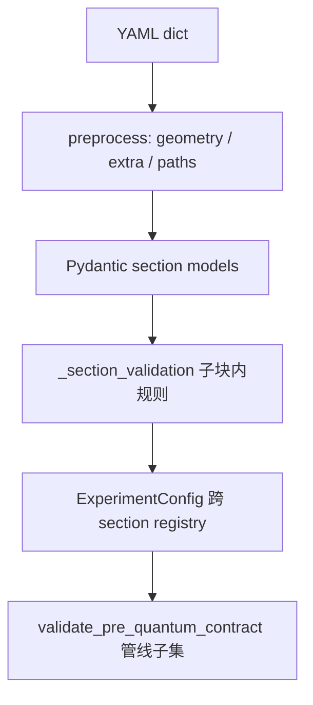

# Config 模块代码与架构风格约定

本文是 `qchem_stack.config` 的**唯一权威风格标准**：嵌套 YAML schema、Pydantic 模型布局、校验分层、异常类型、文档写法与迁移策略。新增或重构配置字段时**必须先对照本文**。

包内入口：[`src/qchem_stack/config/README.md`](../src/qchem_stack/config/README.md)。整体软件分层见 [ENGINEERING_ARCHITECTURE.md](ENGINEERING_ARCHITECTURE.md)。

---

## 0) 设计目标

| 目标 | 含义 |
|------|------|
| **可扩展** | 新算法 / 新 driver / 新 embedding 模式 = 加子模型 + 注册，不往「上帝类」堆字段 |
| **易用** | YAML 结构反映「用户在做哪类实验」；打开配置不应看到 50 个与当前路径无关的键 |
| **易维护** | Python 路径 = YAML 路径；校验位置可预测；文档不在代码里重复长文 |

**样板 section（已实现 nested v2）：** `embedding`、`quantum`。其它 section 向二者对齐。

---

## 1) 嵌套 section 标准模板

每个 YAML section 遵循同一骨架：

```text
section:
  <discriminator>          # mode / algorithm / strategy / driver — 用户意图
  <shared_fields>          # 跨子路径共享、且无法归入单一子块的少量键
  <sub_block_a>:           # 仅该路径相关字段
    ...
  <sub_block_b>:
    ...
```

### 1.1 四条硬规则

1. **判别键在顶层** — 如 `embedding.mode`、`quantum.algorithm`、`active_space.strategy`。
2. **子块只含该路径字段** — 全部 `ConfigDict(extra="forbid")`；写了但不会被用到的键应在校验阶段拒绝，而不是静默忽略。
3. **Python 路径 = YAML 路径** — `cfg.quantum.vqe.maxiter`；禁止 `vqe_maxiter` 等历史平铺前缀。
4. **canonical YAML 为 nested** — `schema_version: "2"`；加载时不接受 flat 遗留键。

### 1.2 参考 YAML（示意）

```yaml
schema_version: "2"
experiment_id: example

embedding:
  mode: dmet
  dmet:
    hamiltonian_source: schmidt_atomic_production
    schmidt:
      fragment_atom_indices: [0]

quantum:
  algorithm: vqe
  variational:
    ansatz: hea
  vqe:
    depth: 1
    maxiter: 24
  pauli:
    use_protocol: false
  excited:
    vqd:
      after_variational: false

active_space:
  strategy: cas
  cas:
    n_orbitals: 4
    n_electrons: 4
  mapping:
    fermion_qubit: jordan_wigner

chemistry_extended:
  pbc:
    cell_vectors_bohr: null
    kpoint_mesh: [1, 1, 1]
  avas:
    ao_labels: []
```

### 1.3 何时用 Discriminated Union

当子路径**互斥**且字段集差异大时，用 Pydantic `Field(discriminator=...)`（见 `embedding.py`）。当子块**可并存**（如 `quantum.excited.vqd` 与 `quantum.excited.qse`）时，用固定嵌套子模型组合，不必 union。

---

## 2) 标准文件布局（每个 section）

新增或重构一个配置域时，按下列文件拆分（名称可按域调整）：

| 文件 | 职责 |
|------|------|
| `{section}_enums.py` | 用户可见字符串 → `StrEnum`（优先于长 `Literal` 列表） |
| `{section}_specs.py` | 嵌套 `BaseModel` 子块，一律 `extra="forbid"` |
| `{section}.py` | 顶层 Spec / Union 入口；validator **仅转调** `_xxx_validation` |
| `{section}_helpers.py` | 只读窄化访问：`require_dmet(cfg)`、`resolve_vqe_maxiter(cfg)` |
| `_{section}_validation.py` | 跨字段规则、能力门控前的 schema 规则 |
**禁止：**

- 在 Spec 上再写与 `*_helpers` 语义重复的 `@property`（只保留一处）。
- 在 orchestration / chem / quantum 业务模块里解析 raw dict 或读 flat 遗留键。
- 在模型类上用字段级三引号 docstring 代替 `Field(description=...)`。

**参考实现：**

| Section | specs | union / 入口 | helpers |
|---------|-------|--------------|---------|
| embedding | `embedding_specs.py` | `embedding.py` | `embedding_helpers.py` |
| quantum | `quantum_specs.py` | `quantum.py` | `quantum_helpers.py` |

---

## 3) 各 section 目标结构（演进对照）

下表描述**目标架构**。未标注「已完成」的 section 仍可能含 flat 字段，新改动应朝目标形态收敛。

| Section | 判别键 | 目标子块 | 状态 |
|---------|--------|----------|------|
| `embedding` | `mode` | `dmet` / `projection` / `plugin` + 共享 `EmbeddingBase` | ✅ nested v2 |
| `quantum` | `algorithm` | `variational`, `vqe`, `adapt`, `iqeb`, `pauli`, `excited`, `demos`, `tensornet`, `graph` | ✅ nested v2 |
| `active_space` | `strategy` | `cas` / `manual` / `avas_stub` / `avas` + `mapping` + `jw` | ✅ `cas.n_orbitals` / `cas.n_electrons` |
| `chemistry_extended` | — | `solvent`, `pbc`, `avas`, `casscf`, `post_hf`, `mo_transform` | ✅ nested v2 |
| `scf` | `driver` | `pyscf` / `psi4` / `precomputed` driver 子块 | ✅ nested v2 |
| `molecule`, `backend`, `compiler`, … | — | 字段少时可保持扁平；超过 ~8 个相关字段则拆子块 | 按表评估 |

### 3.1 `quantum` 字段归属（已实现）

| 子块 | 内容 |
|------|------|
| `variational` | ansatz、uccsd_trotter_steps |
| `vqe` | depth, maxiter, optimizer, init |
| `adapt` | max_iter, pool_id |
| `iqeb` | pool_id, n_grads, energy_tolerance, max_rounds |
| `pauli` | use_protocol, grouping, sampled/qiskit shots, histograms, support_max_terms |
| `excited.vqd` / `qse` / `sceom` | 后置激发态轨道 |
| `demos.qpe` / `demos.vqs` | QPE / VQS 演示 sidecar |
| `tensornet` | expectation stub, contraction_engine |
| `graph` | workflow preview 的 extra/remove edges |

### 3.2 `chemistry_extended` 目标子块（✅ 已实现）

| 子块 | 内容 |
|------|------|
| `solvent` | model, epsilon |
| `pbc` | cell_vectors_bohr, kpoint_mesh, active_space_kpoint_index |
| `avas` | ao_labels, threshold, minao, with_iao, … |
| `casscf` | orbital_optimization_audit, orbital_optimization_for_integrals |
| `benchmarks` / `post_hf` | classical benchmarks, integral_crosscheck, rdm_correction |
| `mo_transform` | hook, kwargs |

PBC 相关校验（mesh、cell、solver capability）落在 `pbc` 子模型 + `_chemistry_extended_validation.py`。

### 3.3 `active_space` 目标形态（✅ 已实现）

- `strategy: cas` → `cas.n_orbitals` / `cas.n_electrons`（**单一 canonical 命名**）。
- `strategy: manual` → `manual.n_orbitals`, `manual.frozen_orbitals`, …
- `mapping.fermion_qubit` 等与 strategy 正交的映射选项放入 `mapping` 子块。
- 读路径优先 `active_space_helpers.resolve_n_orbitals` / `resolve_n_electrons`（旧 dump fallback alias）。

---

## 4) YAML 加载顺序

```text
raw dict
  → preprocess_top_level_yaml_dict（未知顶层键 → extra）
  → preprocess_experiment_dict_geometry_files / preprocess_precomputed_bundle_path
  → Pydantic section models（子块 extra=forbid）
  → ExperimentConfig 跨 section validator registry
  → 可选 validate_pre_quantum_contract()（管线二次门禁，规则子集）
```

**包 init**：公开 API 从 [`src/qchem_stack/config/__init__.py`](../src/qchem_stack/config/__init__.py) 导入后，`ExperimentConfig.model_rebuild()` 在模块末尾执行，以解析 `experiment.py` 中对 `MoleculeSpec` / `ActiveSpaceSpec` / `EmbeddingSpec` 的 forward ref（`TYPE_CHECKING` 引用）。

### 4.1 构造时校验 vs 管线二次门禁

| 函数 | 何时运行 | 示例 |
|------|----------|------|
| `ExperimentConfig` 构造 | `model_validate` / `from_yaml_dict` | embedding 契约、AVAS 标签、UCCSD 约束、PBC↔CASSCF、`validate_pbc_k_mesh_solver_capability`、backend capabilities |
| `validate_pre_quantum_contract(cfg)` | 管线显式调用 | precomputed 禁 live hooks、embedding、PBC↔CASSCF、backend capabilities（**不含** PBC k-mesh mesh 能力） |

新增跨 section 规则时，先判断属于哪一层，**避免两处重复且不一致**。

---

## 5) 校验分层原则



| 层级 | 放什么 | 放哪 |
|------|--------|------|
| 单字段类型/范围 | `Field(ge=..., le=...)` | 模型字段声明 |
| 单字段归一化 | `@field_validator` | 模型或 `_validation.py` |
| 子块内跨字段 | `@model_validator` → 函数 | `_{section}_validation.py` |
| 跨 section / 能力位 | 纯函数 | `_experiment_validation.py` |
| 运行时二次确认 | 管线入口 | `validate_pre_quantum_contract` |

目录内现状：

- 通用规整：`config/_validation.py`
- 分 section：`_active_space_validation.py`、`_chemistry_extended_validation.py`、`_quantum_validation.py`、`_embedding_validation.py`
- 顶层聚合：`_experiment_validation.py`

### 5.1 新增字段步骤（Checklist）

1. 在 `{section}_specs.py`（或对应模型）增加字段与 `Field` 约束。
2. 单字段规则 → `@field_validator`；子块内跨字段 → `_{section}_validation.py`。
3. 若依赖 `molecule` / `scf.driver` / `SolverCapabilities` → `_experiment_validation.py`，**禁止**写死 `driver == "pyscf"`（AVAS 等 milestone 例外见 [说明_active_space配置.md](说明_active_space配置.md)）。
4. 补测试：`tests/config/test_config_validation_helpers.py` 或 section 专项测试；packaged YAML 须能 `from_yaml_dict`。
6. 更新 `docs/说明_*.md` 字段表；错误信息前缀使用完整 nested 路径（如 `quantum.vqe.maxiter`）。

### 5.2 何时新建 `_{section}_validation.py`

- 单模型内跨字段规则超过 2–3 个分支；
- 规则需在多处复用；
- 模型文件因 validator 逻辑明显变长。

---

## 6) 异常类型

| 类型 | 用途 | 用户动作 |
|------|------|----------|
| `pydantic.ValidationError` | 类型、约束、forbid extra | 按字段路径改 YAML |
| `ValueError` | 互斥、形状、策略组合（schema 层可表达） | 改 YAML |
| `ConfigurationError` | 文件 IO、驱动/backend 能力、依赖缺失 | 换 driver / 装依赖 / 改环境 |

**约定：** 需要 `create_solver(cfg).capabilities` 的门禁优先用 `ConfigurationError`，与「改 YAML 也解决不了」的情况一致。

### 6.1 异常选用决策树

```text
配置加载 / model_validate
  ├─ 字段类型、ge/le、extra=forbid → pydantic.ValidationError（validator 内可 raise ValueError）
  ├─ 子块内互斥、形状、策略组合 → ValueError（Pydantic 包装为 ValidationError）
  ├─ 文件 IO、未知顶层键（strict）、geometry 文件缺失 → ConfigurationError
  └─ create_solver().capabilities 不满足 YAML 路径 → ConfigurationError

管线 / 化学装配（config 已通过）
  ├─ 前置条件不满足（Schmidt 需 RHF、backend 不支持路径）→ PipelineError
  └─ 嵌入构造失败 → EmbeddingError / SchmidtProductionError
```

**用户可见消息：** 面向用户的 `ConfigurationError` / `PipelineError` 文本使用**英文**；中文说明仅放在 `docs/说明_*.md`。

### 6.2 `dict[str, Any]` 白名单

| 允许 | 示例 | 说明 |
|------|------|------|
| 后端调试元数据 | `driver_meta`, `kernel_bindings` | 不保证跨版本键稳定 |
| 阶段 sidecar / 循环报告 | `dmet_loop_report`, `schmidt_ctx` | 仅 repro debug，非 parity 导出主键 |
| 算法运行审计 | `variational_audit`, `multifrag_audit` | 可增键，需文档化 |
| **禁止** | 用裸 dict 承载 `PARITY_EXPORT_V3_STABLE_KEYS` 字段 | 稳定键须 TypedDict / 显式构造 + 测试对拍 |

新增 repro/parity 字段时：先更新 `qchem_stack.protocols.product_contract` 与 golden fixture，再在 orchestration 写入。

### 6.3 模块 docstring 最低要求

| 包/文件 | 要求 |
|---------|------|
| `config/*.py`（section 入口） | 一行职责 + 链接 `docs/说明_*.md` |
| `orchestration/pipeline.py` | 管线入口、阶段顺序、禁止反向依赖 |
| `chem/hamiltonian*.py` | 哈密顿量构建；**禁止** import orchestration |
| 其它 `src/qchem_stack` 模块 | 建议一行；公开 API 函数保留 docstring |

---

## 7) 字段文档

| 位置 | 内容 |
|------|------|
| 代码 | 仅 `Field(description="一行摘要")` + 模块 docstring 链接 `docs/说明_*.md` |
| `docs/说明_*.md` | 字段表、长说明、示例 YAML、与 parity/repro 键对照 |
| `config` 包 README | 布局与加载链；不重复字段级说明 |

禁止在模型类上用字段级三引号 docstring 堆长文（历史文件逐步迁移到 `Field(description=...)`）。

---

## 8) 业务代码访问约定

- 配置消费方（orchestration / chem / quantum）通过 **`ExperimentConfig` 嵌套属性** 或 **`{section}_helpers`** 访问，不直接读 YAML dict。
- 新增访问模式时优先 helper（窄化 + 单测），避免在 20+ 调用点重复 `if cfg.embedding.mode == ...`。
- 算法模块**不解析 YAML**；只接收已从 config 提取的参数或 context 对象。

---

## 9) Schema 演进与迁移

| 策略 | 适用 |
|------|------|
| **`schema_version: "2"`** | 顶层必填；仅接受 nested canonical YAML（无 flat 键、无 load-time migration） |

Breaking change 时同步：全部 `configs/*.yaml`、测试 fixture、parity 导出脚本、`docs/说明_*.md`、docusaurus 教程示例。

---

## 10) 反模式（禁止）

| 反模式 | 原因 |
|--------|------|
| 单文件 50+ 平铺字段（「上帝 Spec」） | 难扩展、YAML 难读、校验耦合 |
| `vqe_*` / `pbc_*` 前缀堆在同一层级 | 路径与语义不对应 |
| 同一语义 property + helper 两套入口 | 读者不知用哪个 |
| 在 orchestration 里 `cfg["quantum"]["vqe_depth"]` | 绕过类型与校验 |
| 未知子键 silent ignore（无 `extra=forbid`） |  typo 到运行时才发现 |
| 跨 section 规则写进 `_active_space_validation.py` | 层次混乱 |

---

## 11) 后续开发备忘（按模块）

| 模块 | 备忘文档 |
|------|----------|
| `_active_space_validation.py` | [说明_active_space配置.md](说明_active_space配置.md) |
| `_experiment_validation.py` | 同上 + [说明_经典化学后端驱动_registry与能力位.md](说明_经典化学后端驱动_registry与能力位.md) |
| `_embedding_validation.py` | [说明_embedding配置.md](说明_embedding配置.md) |
| BK/SCBK / hamiltonian | [说明_BK与SCBK映射路径与性能优化备忘.md](说明_BK与SCBK映射路径与性能优化备忘.md) |
| 多后端 E0/E1/E2 | [execution/multi_backend_integration_philosophy.md](execution/multi_backend_integration_philosophy.md) |

---

## 12) 相关文档索引

| 文档 | 用途 |
|------|------|
| [说明_实验配置加载_io.md](说明_实验配置加载_io.md) | `load_experiment_config` / IO |
| [说明_embedding配置.md](说明_embedding配置.md) | embedding 字段 |
| [说明_active_space配置.md](说明_active_space配置.md) | active_space 字段 |
| [说明_scf配置.md](说明_scf配置.md) | scf 字段 |
| [ENGINEERING_ARCHITECTURE.md](ENGINEERING_ARCHITECTURE.md) | 全局分层与 PreQuantum 不变量 |
| [CONTRIBUTING.md](../CONTRIBUTING.md) | 合并前自检与 config 相关 pytest |

**维护者：** 任何改变 public YAML 形状或校验层次的 PR，必须在 PR 描述中注明对照本文哪一节，并更新对应 `docs/说明_*.md`。
