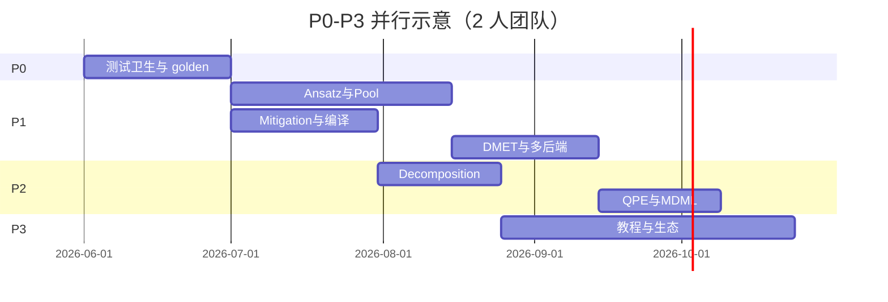

# InQuanto / Tangelo 对标 — P0–P3 全量执行主计划（2026Q3–2027Q2）

**版本**：v1.0 · **日期**：2026-05-28  
**角色**：承接上一轮 review 结论，把战略路线图（[`竞争定位与路线图_对标Quantinuum产品与技术路线.md`](../竞争定位与路线图_对标Quantinuum产品与技术路线.md)）与机读 gap（`product_gap_categories()`）落为 **可登记、可验收、可 CI 闸门** 的执行 WBS。  
**机读台账**：[`comparative_execution_backlog.yaml`](comparative_execution_backlog.yaml) Phase D–H（本计划新增）。  
**边界**：不承诺 L0 闭源等价、Nexus/HQC、商业 Qermit/cuTensorNet。

---

## 0. 执行摘要

| 层级 | 竞争目标 | 周期 | 人力假设 | 核心交付 |
|------|----------|------|----------|----------|
| **P0** | Methods 可信度地基（维护 + 补洞） | Day181–210（4 周） | 1 人全职 | CI/测试卫生、parity golden 扩容、gap 台账零漂移 |
| **P1** | 追 Tangelo 算法广度 + InQuanto 工作流纪律 | Day211–330（17 周） | 2–3 人 | 真实 ansatz、pool 深度、BK/SCBK、mitigation 真运行时、多后端 |
| **P2** | 大体系分解 + QPE/FT + MD/ML 科学闭环 | Day331–390（9 周） | 2 人 | DMET 自洽、ONIOM/QM-MM 可跑 demo、QPE 资源深度、AL 精度 |
| **P3** | 产品化与社区生态 | Day391–450（9 周） | 1–2 人 | 三路径教程、notebook、插件模板、benchmark dashboard |

**总工期**：约 **39 周（Day181–450）**，可按人力并行压缩至 **7–9 个月**。

**已完成基线（不再重复立项）**：

- 2026Q2 Day12–Day90 parity / Tangelo 日历收口  
- Day91–Day120 P2 深化骨架（resource preview、mitigation trace、L3 smoke）  
- Day121–Day180 comparative sprint Phase A–C（operator pool、VQD dual path、get_integrals、BK boundary、mapping roadmap）

---

## 1. 治理与闸门（全阶段强制）

### 1.1 单任务 Definition of Done

每个任务必须同时满足：

1. **代码**：`target_files` 中列出的模块有实现或明确 `n/a` 机读边界  
2. **测试**：新增或更新 pytest；可选依赖用 marker（`pyscf` / `psi4` / `l3`）  
3. **契约**：`product_contract.py` / export 稳定键 / `capability-surface` 同源  
4. **文档**：`public_parity_matrix.md` 对应行 + 用户向 docusaurus 或 `说明_*.md`  
5. **证据**：台账 `evidence` 字段可指向 commit、测试名、YAML 样例  

### 1.2 每周闸门（Monday / Wednesday / Friday）

| 日 | 动作 |
|----|------|
| 周一 | 更新 [`comparative_execution_backlog.yaml`](comparative_execution_backlog.yaml) 任务状态 |
| 周三 | 最小 CI 子集（见下） |
| 周五 | 周报：`docs/execution/week_*` 或 Day 模板页 |

**最小闸门命令**：

```bash
pytest tests/test_api_runs.py::test_capability_surface_matches_product_contract \
       tests/test_api_runs.py::test_parity_gaps_meta -q --tb=short
python scripts/check_comparative_execution_backlog.py
python scripts/check_parity_export_sample.py
```

### 1.3 阶段封板

每 Phase 结束必须：

- 跑全量 `pytest`（记录 skip 原因）  
- 更新 [`public_parity_matrix.md`](../public_parity_matrix.md) 与 [`quantum_InQuanto_Tangelo_对照矩阵.md`](../quantum_InQuanto_Tangelo_对照矩阵.md)  
- Phase 内所有 `done` 任务具备非空 `evidence`  

---

## 2. P0 — 基础可信度（Day181–210）

> **定位**：不是新功能大爆炸，而是把「已 claim 的能力」变成不可回归的 Methods 地基。

### P0-W1：测试与 CI 卫生（Day181–187）

| ID | 任务 | 触点 | 验收 |
|----|------|------|------|
| P0-01 | 引入 `tests/conftest.py`：H2 YAML factory、PySCF skip guard、solver registry autouse cleanup | `tests/conftest.py`, `tests/helpers/` | 至少 3 个 orchestration 测试改用 factory，删除重复 inline YAML |
| P0-02 | orchestration 重复测试 parametrize 化 | `tests/orchestration/test_orchestration_pipeline.py` | ADAPT/IQEB pool 类测试合并为 parametrize，行数降 ≥30% |
| P0-03 | `run_all_smoke.py` 扩容 | `examples/run_all_smoke.py` | 覆盖 tangelo_facade、open_stack_quantum_problem、parity export smoke |
| P0-04 | tensornet stub 最小测试 | `tests/test_tensornet_stub.py` | `tensornet_engine_resolved` 键有断言；parity matrix §1 行可引用 |

### P0-W2：Parity golden 与 gap 零漂移（Day188–194）

| ID | 任务 | 触点 | 验收 |
|----|------|------|------|
| P0-05 | parity export 样本扩容 | `scripts/check_parity_export_sample.py`, `configs/` | 新增：DMET fragment exact、projection Mulliken、SA-VQE、mitigation ZNE fold |
| P0-06 | workflow-preview ↔ run repro golden | `tests/test_workflow_preview_repro_alignment.py` | 至少 5 条 YAML：preview 与 DONE repro 的 computable_graph 键一致 |
| P0-07 | gap 台账与 HTTP 对拍 CI | `product_contract_gaps.py`, CI | `validate_product_gap_categories()` 在 CI 必跑；drift 即 fail |

### P0-W3：文档契约同步（Day195–210）

| ID | 任务 | 触点 | 验收 |
|----|------|------|------|
| P0-08 | 竞争定位 §6 与本计划互链 | `竞争定位与路线图_*.md`, 本文件 | 双向链接；P2 残余项指向 Phase F/G 任务 ID |
| P0-09 | execution README 索引 Phase D–H | `docs/execution/README.md` | 新 Phase 可发现 |
| P0-10 | P0 封板 | `docs/execution/day210_p0_closeout.md` | 全量 pytest + parity sample 绿 |

**P0 退出标准**：无「已实现但无测试」的 gap 行；audit 报告 §1.2 A–E 项至少关闭 4/5。

---

## 3. P1 — 开源工作流超越（Day211–330）

> **定位**：追 Tangelo **算法/映射/后端广度**，同时落实 InQuanto **Protocol + mitigation + embedding** 纪律。

### P1-A：Tangelo 算法与 ansatz 广度（Day211–255，Phase E）

#### P1-A1 真实 ansatz（Week 1–3）

| ID | 任务 | 对标 Tangelo | 实现要点 | 验收 YAML |
|----|------|--------------|----------|-----------|
| P1-01 | **UCCGD** 最小实现 | `UCCGD` ansatz | `quantum/algorithms/uccgd_vqe.py`；JW；registry 去掉 HEA redirect | `configs/example_h2_uccgd.yaml` |
| P1-02 | **QCC** 最小实现 | `QCC` / `qcc_tangelo_partial` | 专用 circuit builder；更新 `ansatz_registry` summary | `configs/example_h2_qcc.yaml` |
| P1-03 | **UpCCGSD** 或 **pUCCD** 二选一 | Tangelo solver 菜单 | 先 closed-shell 子集；文档标 `partial` 若缺 triples | `configs/example_h2_upccgsd.yaml` |
| P1-04 | 移除/降级 HEA 伪装 alias | `ucc1`/`vsqs` partial | alias 保留但默认 **fail-fast** 或 CLI 警告；capability-surface 标 `redirect_deprecated` | registry export 测试 |

**数值验收**：H₂ sto-3g CAS(2,2) 能量介于 RHF 与 FCI 窗口（与现有 UCCSD 测试同口径）。

#### P1-A2 算符池与 ADAPT/IQEB 深度（Week 4–5）

| ID | 任务 | 触点 | 验收 |
|----|------|------|------|
| P1-05 | 扩展 pool：`fermionic_generalized` 激发子集 | `operator_pool_registry.py` | 新 pool id + alias；ADAPT gradient 测试 |
| P1-06 | IQEB 外环收敛策略可配置 | `iqeb.py`, config | `iqeb_max_outer_rounds` + run_summary 导出 |
| P1-07 | QSCEOM 对称性 filter 桩 → 可切换 | `sceom.py` | `generator_strategy: symmetry_filtered_partial`；矩阵行升级说明 |
| P1-08 | L3 benchmark 纳入新 ansatz | `l3_algorithm_benchmark.py` | `QCHEM_RUN_L3=1` 时 +2 条配置 |

#### P1-A3 映射产品化（Week 6）

| ID | 任务 | 触点 | 验收 |
|----|------|------|------|
| P1-09 | **SCBK** 哈密顿量路径（不要求 UCCSD Trotter） | `fermion_mapping_registry.py`, `hamiltonian.py` | `active_space.fermion_qubit_mapping: symmetry_conserving_bk` 可跑 VQE+HEA |
| P1-10 | JKMN/HCB 从 `planned_not_wired` → 实现或永久 `n/a` | mapping status rows | capability-surface 与 parity 矩阵一致 |
| P1-11 | 多映射 conformance 测试矩阵 | `tests/test_backend_capability_conformance.py` | 同一 H₂：JW/BK/SCBK 输出 schema 相同、能量合理 |

---

### P1-B：InQuanto 工作流与缓解（Day256–285，Phase F 前半）

#### P1-B1 Mitigation 真运行时（Week 1–2）

| ID | 任务 | 对标 InQuanto | 触点 | 验收 |
|----|------|---------------|------|------|
| P1-12 | **ZNE** 多尺度真折叠 + Qiskit counts 闭环 | Qermit ZNE | `mitigation/zne.py`, `qermit_runtime.py` | `zne_mode: circuit_scale_fold` 在 Qiskit 后端产生单调曲线；`mitigation_dag_execution` 可追溯 |
| P1-13 | **Classical shadows** 从 stub → 最小可执行 | Qermit / Tangelo shadows | `mitigation/classical_shadows.py` | H₂ 2-qubit 期望值与 statevector 差 < 阈值（固定 seed） |
| P1-14 | SPAM 校正最小实现 | SPAM narrative | `mitigation/spam.py` | 2-qubit 玩具：校正前后 stderr 改善可测 |
| P1-15 | gap 行 `mitigation_batch_scheduler` 更新 | — | `product_contract_gaps.py` | 状态 `partial_runtime` → 文档说明 local-only 但节点可执行 |

#### P1-B2 编译与 Protocol 深度（Week 3）

| ID | 任务 | 触点 | 验收 |
|----|------|------|------|
| P1-16 | `compiler_pass_bundle` 扩展 2 个 pass | `backends/compiler/` | depth/2q 计数可导出；TKET optional 对拍 |
| P1-17 | ProtocolList 批跑资源汇总 | `protocols/protocol_list.py` | `run_all` 后 `dataframe_circuit_shot_rows` 行数 = computable 数 |
| P1-18 | evaluate support-set 扩展 | `protocols/evaluate.py` | 新增 1 个 negative test（unsupported Pauli 显式 fail） |

---

### P1-C：Embedding-first + 多后端（Day286–330，Phase F 后半）

#### P1-C1 DMET / Projection 加深（Week 1–2）

| ID | 任务 | 触点 | 验收 |
|----|------|------|------|
| P1-19 | **DMET bath SCF 自洽 loop** v1 | `chem/embedding/dmet.py`, `integrations/dmet_self_consistent.py` | H₄ 或 H₂ dimer：`n_scf_cycles_embedding≥2` 收敛 trace 写入 `parity_snapshot` |
| P1-20 | Fragment solver 插件 SPI | `chem/embedding/fragment_solvers/` | 文档 + `example_h4_dmet_fragment_exact_small.yaml` 走插件 id |
| P1-21 | Projection 与 global active space 对拍 | `projection_hamiltonian.py` | PySCF vs Psi4 同一几何 energy 差 < 阈值（已有测试扩展） |
| P1-22 | gap `dmet_self_consistency_depth` 降级条件文档化 | parity matrix §3 | 满足 P1-19 后可改 `partial`→`available`（局部体系） |

#### P1-C2 多后端 adapter（Week 3–4）

| ID | 任务 | 对标 Tangelo `linq` | 触点 | 验收 |
|----|------|---------------------|------|------|
| P1-23 | **Qulacs** executor adapter | Qulacs target | `backends/qulacs_executor.py` | H₂ HEA VQE smoke；conformance 测试 |
| P1-24 | **Braket** 或 **Cirq** 二选一 | 多后端 | `backends/` + `BackendSpec` | local simulator smoke |
| P1-25 | `test_backend_capability_conformance` 矩阵化 | — | tests | 参数化：backend × mapping × ansatz(hea) |
| P1-26 | UQC executor 与 mitigation 路径打通 | 已有 UQC | `uqc_executor.py` | 可选 ZNE fold；文档 [`在线学习云上调度.md`](../在线学习云上调度.md) 更新 |

**P1 退出标准**：

- `chemically_aware_ansatz_pack` 与 `operator_pool_taxonomy_depth` gap 仍可为 `partial`，但 **至少 2 个新 ansatz 为真实实现**  
- mitigation 至少 **2 种** 非 stub 可执行  
- **1 个** 新后端 conformance 绿  
- DMET self-consistency demo 可复跑  

---

## 4. P2 — 研究深度与大体系（Day331–390，Phase G）

### P2-W1：Problem decomposition 广度（Day331–355）

| ID | 任务 | 对标 Tangelo | 触点 | 验收 |
|----|------|--------------|------|------|
| P2-01 | **ONIOM** 从 toy → 可算单层 | ONIOM | `chem/embedding/oniom.py` | 2-layer：MM 用 classical 能量加和；QM 区走现有 pipeline |
| P2-02 | **QM/MM** 接口（固定 MM 电荷） | QM/MM | `chemistry_extended.mm_charges` | 能量分项 `energy_components_v1` 含 MM 项 |
| P2-03 | MI-FNO / incremental 预计算 input **插件** | decomposition | `integrations/precomputed_fragment.py` | JSON sidecar demo；不要求完整 MI-FNO 求解器 |
| P2-04 | 非 DMET decomposition demo 端到端 | 路线图 P2 | `configs/example_oniom_qm_mm_h2o.yaml` | pytest smoke + parity export 样本 |

### P2-W2：QPE / FT 与资源深度（Day356–370）

| ID | 任务 | 触点 | 验收 |
|----|------|------|------|
| P2-05 | QPE 主配置树接入（非仅 sidecar track） | `config/quantum_specs.py`, `orchestration/` | `quantum.algorithm: qpe_kitaev` 可跑 H₂ demo |
| P2-06 | `resource_estimation_preview_v1` 深度字段 | `integrations/resource_estimation.py` | T 门/深度/宽度估计公式文档化；Methods 导出 |
| P2-07 | QPE + ZNE 联合 demo | `configs/example_h2_qpe_zne.yaml` | mitigation_dag 与 qpe 报告同 repro |
| P2-08 | Bayesian QPE stub → 可选依赖 Phayes 路径 | `qpe_qec_demo/` | 无 Phayes 时 skip；有时能量区间合理 |

### P2-W3：MD/ML 科学闭环（Day371–390）

| ID | 任务 | 触点 | 验收 |
|----|------|------|------|
| P2-09 | 主动学习多轮集成测试 | `tests/test_md_bridge_multi_round.py` | ≥3 轮；mock qchem labeler |
| P2-10 | QMEF 数据集 golden | `tests/fixtures/qmef/` | round-trip export/import |
| P2-11 | H₂ 云仿真 AL **能量差** 目标 | `scripts/run_uqc_md_ml.py`, results | \|ΔE\| < 0.1 Ha（可调阈值）；写入 validation summary |
| P2-12 | `ml/surrogate.py` 标注 deprecated 或接 md_bridge | `ml/` | README 指向 md_bridge；无误导性 toy 默认路径 |
| P2-13 | MD/ML repro 字段冻结 | `md_bridge/contracts.py` | `md_ml_repro_freeze_fields_v1` CI 测试 |

**P2 退出标准**：ONIOM 或 QM/MM 至少一条 **非 toy** demo；QPE 进主配置；MD/ML 多轮测试 + 精度门槛文档化。

---

## 5. P3 — 产品化与社区生态（Day391–450，Phase H）

### P3-W1：教程三路径（Day391–415）

对标 InQuanto Tutorial 层级 + Tangelo-Examples 覆盖面。

| 路径 | 受众 | 内容 | 产物 |
|------|------|------|------|
| **Path A — 最小 VQE** | 新用户 | 安装 → `example_h2.yaml` → repro 导出 | Docusaurus `/tutorial/h2-vqe` + `examples/tutorial_01` 对齐 |
| **Path B — 工业工作流** | Methods 作者 | YAML → workflow-preview → HTTP job → parity | 新 `examples/tutorial_05_http_workflow.py` |
| **Path C — 大体系/嵌入** | 化学家 | Schmidt DMET → projection → fragment VQE | 新 notebook `notebooks/dmet_projection_walkthrough.ipynb` |

| ID | 任务 | 验收 |
|----|------|------|
| P3-01 | 三路径 docusaurus 导航 | 首页 3 cards；互相链接 |
| P3-02 | 6 个 `.ipynb`（H2 VQE、UCCSD、ADAPT、VQD、DMET、MD/ML） | Colab 元数据；CI 可选 nbconvert smoke |
| P3-03 | examples README 英中双语索引 | 与 audit §2 缺失项对齐 |
| P3-04 | `run_all_smoke.py` 覆盖全部 tutorial | 本地一条命令 |

### P3-W2：插件与 benchmark 生态（Day416–435）

| ID | 任务 | 触点 | 验收 |
|----|------|------|------|
| P3-05 | 插件模板 v2 | `examples/solver_plugin_entrypoint_demo/` | variational + backend 双插件 scaffold |
| P3-06 | CONTRIBUTING 插件章节 | `CONTRIBUTING.md` | 10 分钟接入 checklist |
| P3-07 | **Benchmark dashboard** 静态站 | `scripts/benchmark_dashboard/` | 读 L3 JSON → HTML；CI  artifact |
| P3-08 | 公开 parity 差距可视化 | docusaurus `/parity/gaps` | 读 `capability-surface` 静态快照 |

### P3-W3：发布与社区（Day436–450）

| ID | 任务 | 验收 |
|----|------|------|
| P3-09 | v0.2.0 release notes | CHANGELOG + parity 矩阵 diff |
| P3-10 | 「未承诺项」一页纸 | `docs/product/non_goals.md` | Nexus/cuTensorNet/L0 边界 |
| P3-11 | P3 封板 | `docs/execution/day450_p3_closeout.md` | 新用户 30 分钟内跑通 Path A（用户测试记录） |

**P3 退出标准**：三路径文档 + ≥4 notebook；benchmark dashboard 可生成；插件模板可 pip install -e。

---

## 6. 人力与并行策略



| 角色 | 主要负责 Phase | 技能 |
|------|----------------|------|
| **quantum-alg** | E（P1-A） | 变分算法、OpenFermion、Qiskit |
| **chem-stack** | F（P1-C）、G（P2-W1） | PySCF、embedding、DMET |
| **core-protocol** | F（P1-B）、P0 | protocols、mitigation、export |
| **platform** | H（P3）、P1-C2 后端 | API、Docusaurus、CI |
| **md-ml** | G（P2-W3） | JAX-MD、QML-FF、主动学习 |

**3 人团队**可将 P1-A 与 P1-B 并行，总工期压至 **~7 个月**。

---

## 7. 风险登记

| 风险 | 影响 | 缓解 |
|------|------|------|
| Tangelo 数值默认不一致 | L1 测试 flaky | 只断言能量窗口 + schema，不断言逐位相等 |
| Qulacs/Braket 可选依赖 CI 失败 | 后端任务 blocked | marker + 独立 optional job |
| DMET 自洽不收敛 | P1-19 延期 | 先 H₂ dimer 最小体系；文档 honest partial |
| MD/ML 精度不达标 | P2-11 失败 | 分离「架构验收」与「科学验收」阈值；调整 preset |
| 文档双语漂移 | P3 体验差 | 用户向英文为主；中文留在 `docs/说明_*` |

---

## 8. 刻意排除（全计划 non-goals）

以下 **不立项**；若 issue 提出，指向 [`docs/product/non_goals.md`](../product/non_goals.md)（P3-10 创建）：

- Quantinuum Nexus / qnexus / HQC / OAuth  
- H-Series 原生门集与校准  
- 商业 Qermit / cuTensorNet L0  
- BK/SCBK **UCCSD Trotter 电路**（保持 `n/a`）  
- ORCA / Gaussian 驱动（除非社区 PR）  

---

## 9. 与现有文档映射

| 文档 | 关系 |
|------|------|
| [`public_parity_matrix.md`](../public_parity_matrix.md) | 每个 Phase 封板更新对应 § |
| [`quantum_InQuanto_Tangelo_对照矩阵.md`](../quantum_InQuanto_Tangelo_对照矩阵.md) | P1-A 完成后更新 ansatz/算法表 |
| [`竞争定位与路线图_*.md`](../竞争定位与路线图_对标Quantinuum产品与技术路线.md) | 战略母稿；本计划为执行 WBS |
| [`comparative_execution_backlog.yaml`](comparative_execution_backlog.yaml) | Phase D–H 任务 ID 与本文 §2–5 同源 |
| [`day91_next_phase_plan_2026Q3.md`](day91_next_phase_plan_2026Q3.md) | 已被本计划 supersede（Day181+） |

---

## 10. 立即开始的 5 个动作（本周）

1. 运行 `python scripts/check_comparative_execution_backlog.py` 确认 Phase A–C 仍绿  
2. 创建 `tests/conftest.py`（**P0-01**）  
3. 在 backlog 将 **P0-01** 标为 `in_progress`  
4. 预约 Phase E kickoff（**P1-01 UCCGD** 设计 1 页：`docs/execution/p1_uccgd_design.md`）  
5. 指定 Phase 负责人并写入 [`day210_p0_closeout.md`](day210_p0_closeout.md) 模板  

---

**维护**：每完成一个 Phase，更新本文件 §0 基线列表，并把 `partial`→`yes` 的矩阵行链接到 `evidence`。
