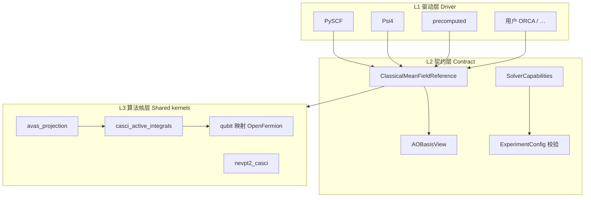

# 多经典化学后端接入理念（三层模型）

本文是 **qchem_stack 接入其它量子化学程序时的架构说明**，用于团队内讲解、用户自研 adapter、以及评审「要不要和 PySCF 数值完全一致」。

**设计目标（与你的目标对齐）**

- 用户熟悉 **PySCF / Psi4 / ORCA / …** 中的任意一种，即可通过 `scf.driver` 选用对应程序做经典参考步。
- **不要求** 每个 driver 在 AVAS、NEVPT2、PBC 等每一步都与 PySCF **数值相同**。
- **要求** 科学上可声明：谁算了 SCF、谁算了活性积分、谁做了后关联，不确定性写进 `driver_meta`。
- **接入工作量尽可能小**：新 driver 默认只需实现 **L1 驱动层**；复杂算法尽量 **委托 L3 共享核**。

相关实现入口：

| 层级 | 代码位置 |
|------|----------|
| L1 驱动 | `src/qchem_stack/chem/solvers/`、`registry.create_solver` |
| L2 契约 | `ClassicalMeanFieldReference`、`AOBasisView`、`SolverCapabilities` |
| L3 共享核 | `src/qchem_stack/chem/kernels/`、`active_space/`、`integrations/` |
| 接入辅助 | `src/qchem_stack/chem/integration/`（元数据约定、检查清单） |
| 模板 | `src/qchem_stack/chem/solvers/custom_solver_template.py` |

---

## 1. 为什么不要追求「与 PySCF 完全独立且完全等价」

### 1.1 管线真正需要的是「语义链」，不是「同一个可执行文件」

```text
平均场 SCF →（可选）轨道选择/旋转 AVAS/CASSCF → 活性空间积分 CASCI 型 → 费米子→qubit → 量子阶段
```

不同程序在链上的 **模块完整度不同**（例如 Psi4 1.10 常无 `casci`、无 AVAS、无与 PySCF `mrpt` 同级的开放 NEVPT2 API）。若强制「Psi4 全流程且与 PySCF 逐积分一致」，等于在仓库里 **再维护一套 PySCF 级库**，与「多 driver 可选」目标相反。

### 1.2 数值差异的来源（即使方法名相同）

- 不同 **积分库**（Libint vs PySCF AO 积分）。
- 不同 **SCF 实现**（例如 Psi4 默认 DF-RHF）。
- 不同 **对称性默认**（需用 `c1` 等小体系对齐）。
- **CASCI** 与 **CASSCF 优化轨道** 语义不同。

因此本仓库区分 **等价级别**（见 §3），而不是单一「等价/不等价」。

### 1.3 PySCF 在本架构中的角色

| 角色 | 说明 |
|------|------|
| **参考实现（reference）** | 测试与文档中的对照基准，尤其是活性积分。 |
| **开放算法核宿主（kernel host）** | AVAS、`CASCI` 有效积分、`mrpt.NEVPT` 等可在 L3 层被多个 driver **委托**。 |
| **不是**「唯一真理」 | ORCA/Gaussian 等不必、也无法与 PySCF 逐位一致。 |

---

## 2. 三层模型（L1 / L2 / L3）



### L1 — 驱动层（Driver）

**职责（尽量只做这些）**

- 读 `ExperimentConfig` 中的分子、基组、电荷、自旋、溶剂/PBC 等。
- 跑 **本程序能跑** 的平均场（或读入波函数/积分）。
- 产出可供 L2 消费的句柄（PySCF `mf`、Psi4 `RHF`、文件 bundle 等）。

**不必做**

- 在 driver 内重写 AVAS、NEVPT2、完整 PBC k 点活性积分（除非你们明确要原生实现）。

**注册方式**

- 内置：`chem/solvers/registry.py` bootstrap。
- 插件：`pyproject.toml` 的 entry point 组 `qchem_stack.chem_solvers`（与 `pyscf`/`psi4` 同级）。

### L2 — 契约层（Contract）

**统一对象**

- `ClassicalMeanFieldReference`：能量、MO、分子、`driver_meta`。
- `AOBasisView`：重叠矩阵、核哈密顿量、Fock、AO 分片、`mo_coeff_ao()`。
- `SolverCapabilities`：声明「这条 YAML 路径是否允许」，**不承诺** 与 PySCF 数值相同。

**配置校验**

- 与 driver 无关的：`active_space`、费米子映射等 → `_active_space_validation.py`。
- 与能力相关的：embedding、AVAS、RDM → `_experiment_validation.py` + `create_solver(cfg).capabilities`。
- **禁止** 在 orchestration 里写死 `if driver == "pyscf"` 选路（registry 模块注释已约定）。

### L3 — 算法核层（Shared kernels）

**职责**

- 实现 **后端中性** 或 **显式委托** 的算法步骤。
- 通过 `driver_meta.kernel_bindings` 记录「这一步实际由谁执行」。

**本仓库已有共享核示例**

| 核 id | 典型提供者 | 用途 |
|-------|------------|------|
| `casci_active_integrals` | `pyscf` 或 `psi4_mints` | 活性空间 h1/h2 |
| `avas_projection` | `pyscf`（Psi4 SCF + 导入 MO） | `strategy: avas` |
| `nevpt2_casci` | `pyscf_mrpt` | `rdm_correction_method` |
| `qubit_fermion_map` | `openfermion` | JW/BK/SCBK |

新 driver 若 **不实现** 某核，应设 `supports_*=False` 或走委托并在 meta 中写明（见 §4）。

---

## 3. 等价级别（E0 / E1 / E2）

接入与测试时 **分开声明**，避免混用「能跑」和「与 PySCF 一样」。

| 级别 | 名称 | 含义 | 新 driver 默认目标 |
|------|------|------|-------------------|
| **E0** | 配置等价 | 同一 YAML 在能力允许时能跑通或加载期明确拒绝 | **必须** |
| **E1** | 语义等价 | 同一活性电子/轨道数、同一 embedding 模式、同一 qubit 构建约定 | **必须** |
| **E2** | 数值参考等价 | 与选定 reference（常为 PySCF）在声明分子/基组/atol 内接近 | **可选**（测试/文档） |

**产品默认：E0 + E1。** E2 仅对声明的 benchmark 体系（如 H₂ sto-3g）在 CI 或文档中给出。

---

## 4. `driver_meta` 科学框架（必写字段）

所有 driver 在产出 `ClassicalMeanFieldReference` 时应合并（可用 `chem.integration.merge_integration_driver_meta` / `append_kernel_bindings`）：

| 字段 | 说明 |
|------|------|
| `driver_meta_schema_version` | 当前为 `1` |
| `upstream_classical_software_tag` | 与 `scf.driver` 一致，如 `psi4`、`pyscf`、`orca` |
| `driver_family` | 程序族，可与 tag 相同 |
| `integral_representation` | 如 `psi4_wavefunction`、`pyscf_mol` |
| `kernel_bindings` | 列表：每步算法 `{ "kernel_id", "provider", "implementation_id", "native": bool }` |
| `epistemic_bound` | 一两句话说明「不能和 PySCF 直接比什么」 |

**示例（Psi4 分子 RHF + PySCF AVAS 核）**

```json
{
  "upstream_classical_software_tag": "psi4",
  "kernel_bindings": [
    {"kernel_id": "mean_field_scf", "provider": "psi4", "implementation_id": "psi4_energy_scf_v1", "native": true},
    {"kernel_id": "avas_projection", "provider": "pyscf", "implementation_id": "pyscf_mcscf_avas_on_imported_mo_v1", "native": false}
  ],
  "epistemic_bound": "SCF from Psi4; AVAS uses PySCF mcscf.avas on imported MO — not Psi4-native AVAS."
}
```

---

## 5. 新 driver 最小接入路径（工作量最小化）

### 5.1 路径 A — 仅 SCF（推荐第一步，约 1–3 天）

1. 复制 `custom_solver_template.py` → 实现 `compute_mean_field`。
2. 实现 `AOBasisView` 子类或包装现有对象（见 `ao_basis_view.py`）。
3. 在 `capabilities` 中 **仅** 将已实现项标 `True`（其余 `False`）；可用 `chem.integration.presets.capabilities_driver_scf_only` 起步。
4. `register_solver("myprog", factory)` 或 entry point。
5. 跑 `validate_solver_adapter_contract(solver, run_mean_field=True)`。
6. 若需默认 `cas` 活性空间：委托 L3 `casci_active_integrals`（PySCF 或已有 Psi4 路径），在 meta 中写 `kernel_bindings`。

**用户可得到**：与现在 Psi4 类似 — **用自己熟悉的程序做 SCF**，下游 qubit 构建走共享核。

### 5.2 路径 B — SCF + 原生活性积分（约 1–2 周）

在路径 A 上实现 `get_integrals` 或 `ActiveSpaceIntegralExporter`，并设 `supports_restricted_active_space_qubit_hamiltonian=True`。

### 5.3 路径 C — 仅 precomputed（零 SCF，已有）

使用 `scf.driver: precomputed` + bundle；适合 ORCA/Gaussian 导出积分后接入。

### 5.4 不建议作为准入条件

- 与 PySCF 全方法、全体系 E2 一致。
- 在 driver 内重写 AVAS + NEVPT2 + PBC k 点（应委托或标 `unsupported`）。

---

## 6. `SolverCapabilities` 如何理解

能力位回答：**「这条 YAML 组合是否允许尝试？」** 而不是 **「是否原生实现且等于 PySCF」**。

| 标志为 True 时 | 可能含义 |
|----------------|----------|
| 原生实现 | 积分/SCF 均来自该 driver |
| 委托 L3 核 | 例如 Psi4 SCF + PySCF CASCI/AVAS（应在 meta 标明 `native: false`） |
| 不支持 | 保持 False，加载期由 `_experiment_validation` 拒绝 |

后续可细化 `supports_*` 文档字符串指向 `kernel_bindings` 约定；稳定核 id 见 `src/qchem_stack/chem/kernels/catalog.py`。L3 调度入口见 `chem/kernels/dispatch.py`（薄封装，委托 `active_space/` 与 `integrations/`）。

---

## 7. 内置 driver 对照（讲解用）

| driver | L1 擅长 | 常委托 L3 | 典型 epistemic_bound |
|--------|---------|-----------|----------------------|
| `pyscf` | 分子/PBC SCF、多数活性积分 | 少 | 开放栈参考实现 |
| `psi4` | 分子 SCF、Mints 积分 | AVAS、NEVPT2、部分 CASCI | SCF Psi4；PT/AVAS 可能 PySCF 核 |
| `precomputed` | 无 SCF | 取决于 bundle | 外部程序导出 |
| 用户 ORCA 等 | SCF 或读文件 | 建议 CASCI/AVAS 委托 PySCF | 混合参考需写明 |

**PBC 建议**：经典 SCF 用 **PySCF** `pbc`；Psi4 当前 Γ-only，见 [说明_经典化学后端驱动_registry与能力位.md](../说明_经典化学后端驱动_registry与能力位.md)。

---

## 8. 测试与 CI 建议

| 类型 | 命令/位置 | 目的 |
|------|-----------|------|
| 契约 | `validate_solver_adapter_contract` | L1 形状 |
| 清单 | `chem.integration.run_integration_checklist` | 接入评审 |
| Smoke | `pytest` 单分子 pipeline | E0 |
| Parity | `pytest -m psi4`、H₂/H₂O 软阈值 | E2（可选） |

新 driver **至少**：契约通过 + 1 个 smoke YAML。

---

## 9. 与现有文档的关系

| 文档 | 关系 |
|------|------|
| [说明_经典化学后端驱动_registry与能力位.md](../说明_经典化学后端驱动_registry与能力位.md) | 能力矩阵、registry 操作 |
| [config_校验分层约定.md](../config_校验分层约定.md) | 校验写在哪一层 |
| [说明_active_space配置.md](../说明_active_space配置.md) | 活性空间与 AVAS |
| [psi4_get_integrals_design.md](psi4_get_integrals_design.md) | Psi4 积分 API 草案 |

---

## 10. 一句话对外讲解

> **qchem_stack 不是「把每个量子化学程序都伪装成 PySCF」，而是：用户选自己熟悉的程序做经典驱动（L1），仓库用统一契约（L2）接上量子管线，复杂步骤用可声明的共享算法核（L3）；是否和 PySCF 数值接近是可选验证（E2），不是接入门槛。**

---

## 附录 A — entry point 注册示例

```toml
# pyproject.toml（用户自己的包）
[project.entry-points."qchem_stack.chem_solvers"]
myorca = "my_pkg.solvers:build_orca_solver"
```

```python
def build_orca_solver(cfg: ExperimentConfig) -> ChemIntegralSolver:
    return MyOrcaIntegralSolver.from_experiment_config(cfg)
```

## 附录 B — 接入评审清单（打印用）

- [ ] `backend_id` 与 `scf.driver` 一致
- [ ] `ClassicalMeanFieldReference` + `upstream_classical_software_tag`
- [ ] `AOBasisView`：至少 `overlap_ao`、`mo_coeff_ao`、`nao`、`aoslice_by_atom`
- [ ] `SolverCapabilities` 无虚假 True
- [ ] `kernel_bindings` + `epistemic_bound` 已填
- [ ] 一条 smoke 配置 + `validate_solver_adapter_contract`
- [ ] （可选）与 PySCF 的 E2 parity 仅针对声明体系

代码化清单：`python scripts/integration_checklist.py --driver <backend_id> --config <yaml> [--run-scf]`
