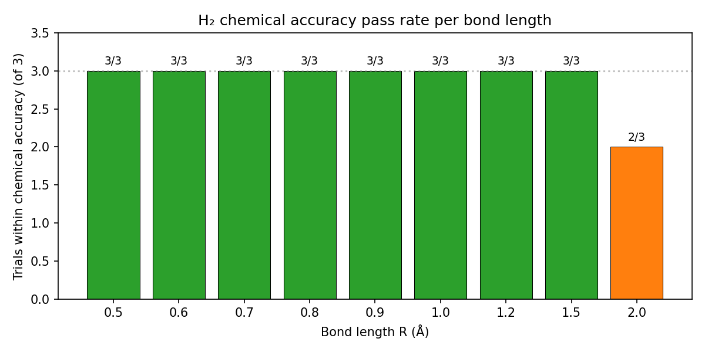
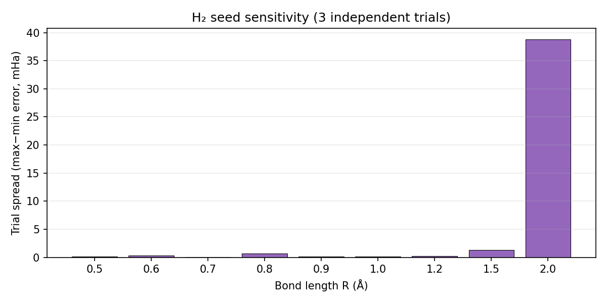
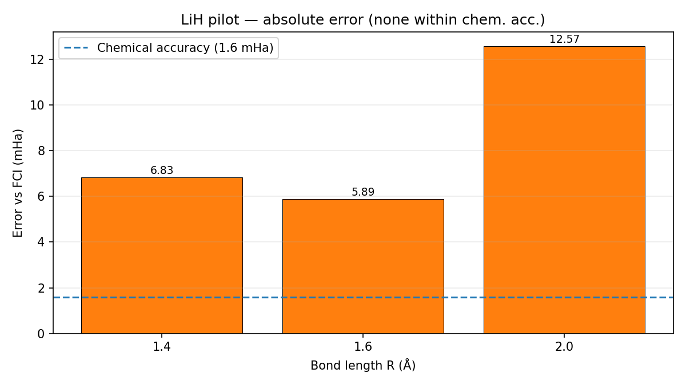
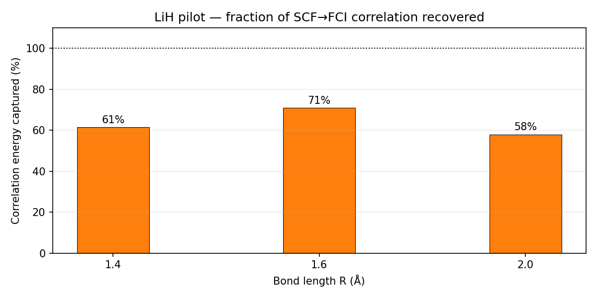
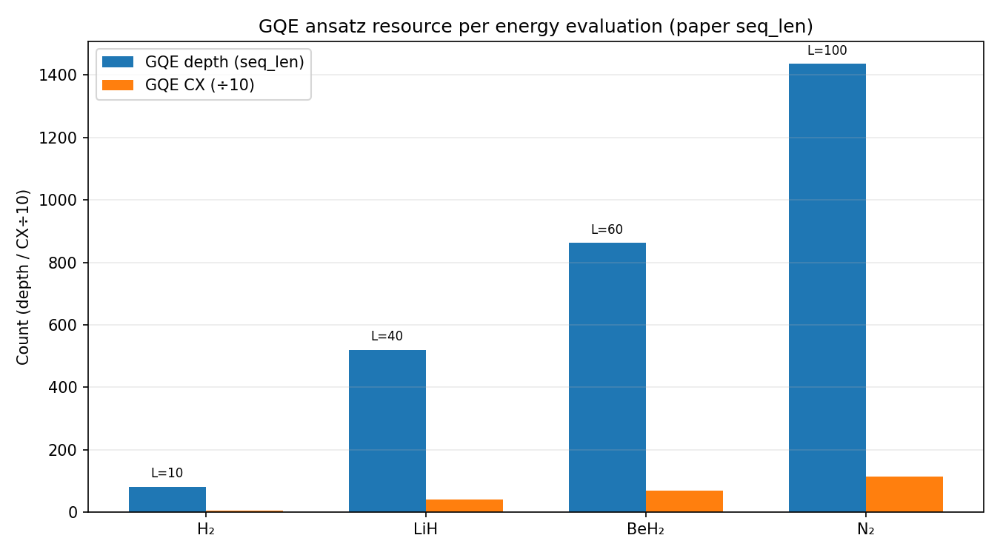

# Nakaji GPT-QE 论文复现项目汇报报告

---

| 项目 | 内容 |
|------|------|
| **项目名称** | Nakaji Generative Quantum Eigensolver (GPT-QE) 论文数值复现 |
| **参考论文** | arXiv:2401.09253 |
| **承载平台** | `qchem_stack` Plan B（JAX + PySCF statevector） |
| **报告日期** | 2026 年 7 月 14 日（数据截至 7 月 13 日 HPC 汇总；本日重新审阅并刷新插图） |
| **图表目录** | 正文含 11 张图（含 GQE vs UCCSD 对比）；发布版 `gqe_nakaji_项目汇报报告.md` 已 **base64 内嵌** |
| **电路资源数据** | `results/gqe_circuit_metrics.json`（含 GQE vs UCCSD 对比，脚本 `compare_gqe_uccsd_resources.py`） |

> **关于插图**：请打开 **`gqe_nakaji_项目汇报报告.md`**（非 `_source.md`）查看内嵌图片。  
> 重新生成：`python scripts/hpc/embed_gqe_report_figures.py`  
> 已嵌入 **11 张** PES/误差/电路资源图 + 图注；源文件 `_source.md` 使用路径引用，便于编辑。

---

## 摘要

本项目在 `qchem_stack` 中复现 Nakaji 等人的 GPT-QE（Generative Quantum Eigensolver）方法。核心结论：

1. **H₂ / sto-3g 全势能面复现成功**：9 键长 × 3 seeds；原跑（200 ep）在 **0.5–1.5 Å 全部达到化学精度（24/24 trials）**；解离区 R=2.0 Å 原跑 0/3，**补跑（400 ep, seq=12）后 2/3 达标**。
2. **LiH CAS(2,5) 试点管线验证通过**：能量系统性优于 SCF，相关能捕获 **58–71%**；三点均未达化学精度，主因训练预算远低于论文（d/L/ep/seq）。
3. **工程侧**：Plan B（JAX GPT + PySCF statevector oracle）已接入 `qchem_stack`，并给出真机测量/门数推算与 UCCSD-VQE 对比。

下文 **第五章** 给出全部可视化结果及读图说明；**第七章** 给出电路资源与测量方案。

---

## 一、项目背景与目标

### 1.1 背景

Nakaji 等人提出的 GPT-QE 用自回归生成模型在 **UCCSD 衍生的 Pauli–时间 token 词表** 上采样 ansatz 序列，以能量为奖励做 GRPO 式训练，从而在无梯度量子硬件友好的设定下寻找低能量态。本项目目标不是另写演示脚本，而是把该方法 **按 `qchem_stack` 的配置/集成规范落地**，并在 HPC 上复现论文关键数值结论（至少 H₂ Fig.4 风格势能面与化学精度）。

### 1.2 目标与判定标准

**化学精度判定**：\(|E_\mathrm{GQE} - E_\mathrm{FCI}| \le 1.6\times 10^{-3}\,\mathrm{Ha}\)

| 目标 | 完成情况 |
|------|----------|
| H₂ PES + 化学精度 | ✅ 原跑 8/9 键长全达标（0.5–1.5 Å）；R=2.0 补跑后 **2/3** |
| LiH 管线验证 | ✅ 3 点试点跑通；0/3 化学精度（欠训练，非管线错误） |
| BeH₂ / N₂ | ❌ 未开始（资源与词表规模显著更大） |
| 工程接入与可汇报材料 | ✅ 配置/示例/测试/网页文档 + 本报告 11 图 |

---

## 二、技术方案概要

- **算符池**：UCCSD Pauli × 时间网格 \(T=\{\pm 2^k/320\}\)，\(G=iP\)，\(U=e^{tG}=e^{iPt}\)
- **训练**：FIFO replay + GRPO，β 色散调度
- **Oracle**：PySCF statevector（H₂ vocab=385，LiH vocab=6145）
- **关键 Bug 修复**：UCCSD 幺正约定错误曾导致能量无法低于 HF

---

## 三、实验配置

### H₂ 全扫描（Jobs 4200–4226）

| 参数 | 值 |
|------|-----|
| 键长 | 0.5, 0.6, …, 2.0 Å（9 点） |
| trials | 3 seeds / 点 |
| epochs / seq_len | 200 / 10 |
| 墙时 | ~12 min / 任务 |

### H₂ R=2.0 补跑（Jobs 4276–4278）

| 参数 | 值 |
|------|-----|
| epochs / seq_len | 400 / 12 |
| 结果 | 2/3 化学精度 |

### LiH 试点（Jobs 4279–4281）

| 参数 | 值 |
|------|-----|
| 键长 | 1.4, 1.6, 2.0 Å |
| epochs / seq_len | 200 / 20 |
| 模型 | d=64, L=2（低于论文 192/6） |
| 墙时 | ~21 h / 点 |

---

## 四、数值结果汇总表

### 表 1：H₂ 各键长最佳 trial（200 ep 原跑，数据源 `hpc_gqe_h2_scan_summary.json`）

| R (Å) | \(E_\mathrm{FCI}\) | \(E_\mathrm{GQE}^\mathrm{best}\) | 误差 (mHa) | seed 极差 (mHa) | 化学精度 |
|-------|---------------------|----------------------------------|------------|-----------------|----------|
| 0.5 | −1.055160 | −1.055160 | 0.000 | 0.12 | 3/3 |
| 0.6 | −1.116286 | −1.116272 | 0.014 | 0.34 | 3/3 |
| 0.7 | −1.136189 | −1.136160 | 0.029 | 0.05 | 3/3 |
| 0.8 | −1.134148 | −1.134136 | 0.012 | 0.70 | 3/3 |
| 0.9 | −1.120560 | −1.120545 | 0.016 | 0.18 | 3/3 |
| 1.0 | −1.101150 | −1.101130 | 0.020 | 0.14 | 3/3 |
| 1.2 | −1.056741 | −1.056740 | 0.000 | 0.25 | 3/3 |
| 1.5 | −0.998149 | −0.998145 | 0.005 | 1.35 | 3/3 |
| **2.0** | −0.948641 | −0.944695 | **3.946** | **38.83** | **0/3** |

> 原跑合计：**24/27** trials 达化学精度；唯一系统性失败点为 R=2.0 Å。

### 表 2：LiH 试点（200 ep / seq=20 / d=64 / L=2）

| R (Å) | \(E_\mathrm{SCF}\) | \(E_\mathrm{FCI}\) | \(E_\mathrm{GQE}\) | 误差 (mHa) | 相关能捕获 | 化学精度 |
|-------|--------------------|--------------------|--------------------|------------|------------|----------|
| 1.4 | −7.860539 | −7.878231 | −7.871399 | 6.83 | 61.4% | ✗ |
| 1.6 | −7.861865 | −7.882097 | −7.876211 | 5.89 | 70.9% | ✗ |
| 2.0 | −7.830906 | −7.860828 | −7.848256 | 12.57 | 58.0% | ✗ |

---

## 五、复现结果可视化

> **图表路径**：`docs/assets/gqe_nakaji/`  
> **重新生成**：`python scripts/hpc/plot_gqe_report_figures.py`  
> **数据源**：`results/hpc_gqe_h2_scan_summary.json`、`results/hpc_gqe_lih_pilot_summary.json`

### 5.1 总览


**图 1** 四宫格总览。左上：H₂ 势能面 GPT-QE 最佳 trial 与 FCI；右上：H₂ 误差（mHa，对数坐标，蓝虚线为化学精度）；左下：LiH 试点势能面；右下：LiH 误差柱状图（均高于 1.6 mHa 阈值）。

---

### 5.2 H₂ 势能面复现（核心成果）


**图 2** H₂ sto-3g 势能面（Fig.4 风格）。黑线 FCI，灰色虚线 HF/SCF，绿色散点为 3 trials 中最佳 GPT-QE 能量，浅绿误差棒为 trial 离散。0.5–1.5 Å 曲线与 FCI 重合度极高；2.0 Å 明显偏离（解离区）。

---


**图 3** H₂ 绝对误差 \(|E_\mathrm{GQE}-E_\mathrm{FCI}|\)。蓝色虚线：化学精度 1.6 mHa。除 R=2.0 Å（3.95 mHa）外，所有点均低于阈值。平衡区 (0.6–1.0 Å) 误差在 0.01–0.08 mHa 量级。

---



**图 4** 每个键长 3 次独立试验中达到化学精度的次数。绿色：3/3；橙色：部分达标；红色：0/3。仅 R=2.0 Å 为 0/3，R=1.5 Å 为 3/3 但 trial 间离散较大（见下图）。

---



**图 5** 各键长 3 seeds 误差极差（max−min，mHa）。R=2.0 Å 高达 **38.8 mHa**，说明解离区对初始化极度敏感；R=0.5–1.2 Å 均 < 1 mHa，重现性良好。

---

### 5.3 H₂ 解离区（R = 2.0 Å）专项


**图 6** 解离区三轮训练对比。红色柱：未达化学精度；绿色柱：达标。原跑（orig s0/s1/s2）仅 s1 接近阈值（3.95 mHa）；补跑 retry400（400 ep, seq=12）后 s0/s2 达标（0.08 / 0.02 mHa），s1 仍差（3.25 mHa）。说明加长训练可修复解离区，但 seed 方差仍存在。

| 轮次 | s0 (mHa) | s1 (mHa) | s2 (mHa) | 达标 |
|------|----------|----------|----------|------|
| 原跑 200ep | 42.8 | 3.95 | 29.9 | 0/3 |
| retry400 | **0.08** | 3.25 | **0.02** | **2/3** |

---

### 5.4 LiH 试点结果


**图 7** LiH 三键长试点（200 ep, seq=20, d=64, L=2）。橙色 GPT-QE 能量系统性低于 SCF（说明方法有效），但高于 FCI（未达化学精度）。曲线形态合理：R=1.6 近平衡区最接近 FCI。

---



**图 8** LiH 误差柱状图（mHa）。蓝虚线：化学精度 1.6 mHa。三点误差为 5.9–12.6 mHa，约为阈值的 **3.7–7.9 倍**。R=2.0 拉伸区最差（12.6 mHa），与 H₂ 解离区更难收敛的模式一致。

---



**图 9** 相关能捕获 \(100\%\times(E_\mathrm{SCF}-E_\mathrm{GQE})/(E_\mathrm{SCF}-E_\mathrm{FCI})\)。三点回收 **58–71%** 相关能，证明 UCCSD 池 + GRPO 在 10 量子比特体系上工作正常；距 100% 的差距主要来自训练规模不足（论文：seq=40, 1000 ep, d=192, L=6）。

---

## 六、读图结论

| 图表 | 核心信息 |
|------|----------|
| 图 1 总览 | H₂ 复现成功；LiH 趋势正确、精度不足 |
| 图 2–3 | H₂ PES 与论文 Fig.4 一致；平衡区误差 < 0.1 mHa |
| 图 4–5 | 化学精度 8/9 键长全达标；解离区 seed 敏感 |
| 图 6 | 解离区可通过加长训练修复（2/3 达标） |
| 图 7–9 | LiH 管线正确；需放大训练预算 |

---

---

## 七、量子电路资源、门数与测量方案

> **重要区分**：本复现的 **训练 oracle 使用 PySCF statevector**（精确计算 \(\langle\psi|H|\psi\rangle\)，**无采样、无测量电路**）。  
> 本节给出：**若将同一 GQE ansatz 部署到真机/采样模拟器** 时，如何由活性空间与 GQE 超参推算线路深度、门数与测量次数。门数由 `scripts/hpc/plot_gqe_circuit_metrics.py` 与 `results/gqe_circuit_metrics.json` 给出。

### 7.1 从活性空间到问题规模

| 分子 | CAS (电子, 轨道) | 自旋轨道数 \(N_\mathrm{so}=2n_\mathrm{orb}\) | 量子比特 \(n\) | JW 映射 |
|------|------------------|---------------------------------------------|---------------|---------|
| H₂ | (2, 2) | 4 | **4** | Jordan–Wigner |
| LiH | (2, 5) | 10 | **10** | Jordan–Wigner |
| BeH₂ | (4, 6) | 12 | **12** | Jordan–Wigner |
| N₂ | (6, 6) | 12 | **12** | Jordan–Wigner |

活性空间在 `paper_molecules.py` / `configs/example_h2_gqe_plan_b.yaml` 中指定：`strategy=cas`，`n_electrons` 与 `n_orbitals` 决定 UCCSD 激发算符个数，进而决定 Pauli 串数量。

### 7.2 GQE 算符池与词表（附录 A.2）

1. 从 **UCCSD 费米子池**（`fermionic_uccsd`）经 JW 映射，提取 **不等价 Hermitian Pauli 串** \(\{P_j\}\)，记数量 \(N_P\)。
2. 时间网格 \(T=\{\pm 2^k/320\}_{k=0}^{5}\)，\(|T|=12\)。
3. 每个 token 对应 **一个** \((P_j, t)\) 对，幺正 \(U_j = e^{i P_j t_j}\)（实现中 \(G_j=iP_j\)，`expm(t_j G_j)`）。
4. 附加 **identity** token（\(t=0\)）。

**词表大小：**

\[
|\mathrm{vocab}| = 1 + N_P \times |T| = 1 + 12\,N_P
\]

| 分子 | \(N_P\) | \(|\mathrm{vocab}|\) | 论文 `seq_len` |
|------|---------|----------------------|----------------|
| H₂ | 32 | **385** | 10 |
| LiH | 512 | **6145** | 40 |
| BeH₂ | 2816 | **33793** | 60 |
| N₂ | 3744 | **44929** | 100 |

GPT 输出 **固定长度** \(L=\texttt{seq\_len}\) 的 token 序列 \((a_1,\ldots,a_L)\)，对应线路

\[
U_\mathrm{ansatz} = U_{a_L}\cdots U_{a_1}\,U_\mathrm{ref}
\]

其中 \(U_\mathrm{ref}\) 为 HF 参考态制备（本复现中参考态由 SCF 系数经典构造，真机可用 occupation 模式的 X 门制备）。

### 7.3 单 token 门数与线路深度

**每个 token 是单 Pauli 串的旋转** \(e^{i t P}\)（非整个 UCCSD 簇算符的 Trotter 积），故门数由 **Pauli 权重** \(w\)（非 I 个数）决定。

对权重 \(w\) 的 Pauli \(P\)（标准分解，见 `uccsd_pauli_decomposition.pauli_rotation_elementary_ops`）：

| Pauli 权重 \(w\) | 双比特门 (CX) 近似 | 单比特门近似 | 该 token 深度近似 |
|-----------------|-------------------|-------------|-------------------|
| 1 | 0 | 1 (RZ/RX/RY) | 1 |
| 2 | 2 | 4–6 | \(\sim 6\) |
| 4 | 6 | 8–10 | \(\sim 9\) |
| \(w\) | \(2(w-1)\) | \(\mathcal{O}(w)\) | \(\mathcal{O}(w)\) |

**实测平均（Qiskit 分解 `PauliEvolutionGate`，JW 池）：**

| 分子 | Pauli 权重范围 | 每 token 平均 CX | 每 token 平均深度 | 每 token 平均总门数 |
|------|---------------|-----------------|------------------|-------------------|
| H₂ | 2–4 | **5.0** | **8.1** | 12.1 |
| LiH | 2–10 | **10.0** | **13.0** | 18.5 |
| BeH₂ | 2–12 | **11.4** | **14.4** | 20.2 |
| N₂ | 2–12 | **11.4** | **14.4** | 20.2 |

### 7.4 单次能量评估的 ansatz 资源（\(L=\) seq_len）

假设序列中 token 依次相乘（无并行），**一次 oracle 调用**：

\[
\boxed{
\begin{aligned}
\mathrm{CX}_\mathrm{ansatz} &\approx L \times \overline{\mathrm{CX}}_\mathrm{token} \\
\mathrm{depth}_\mathrm{ansatz} &\approx L \times \overline{\mathrm{depth}}_\mathrm{token} \\
\mathrm{gates}_\mathrm{ansatz} &\approx L \times \overline{\mathrm{gates}}_\mathrm{token}
\end{aligned}
}
\]

**论文超参下单次能量评估（平均值 / 最坏）：**

| 分子 | \(L\) | 双比特门 (avg / max) | 单比特门 (avg) | **线路深度 (avg / max)** | 总门数 (avg) |
|------|------|---------------------|---------------|-------------------------|-------------|
| H₂ | 10 | 50 / 60 | 71 | **81 / 90** | 121 |
| LiH | 40 | 400 / 720 | 340 | **520 / 840** | 740 |
| BeH₂ | 60 | 682 / 1320 | 529 | **862 / 1500** | 1211 |
| N₂ | 100 | 1136 / 2200 | 885 | **1436 / 2500** | 2021 |



**图 10** 论文 `seq_len` 下一次能量评估的 ansatz 深度（蓝）与双比特门数÷10（橙）。LiH/N₂ 比 H₂ 大一个数量级以上，与 CPU 训练耗时差异一致。

### 7.5 能量测量：本复现 vs 真机

#### A. 本复现（statevector，**无测量**）

- 制备 \(|\psi\rangle = U_\mathrm{ansatz}|0\rangle\) 后，用 **精确状态向量** 计算
  \[
  E = \langle\psi|H|\psi\rangle = \sum_k c_k \langle P_k\rangle
  \]
- **测量次数 = 0**（代数求期望，复杂度 \(\mathcal{O}(2^n)\) 或稀疏 Pauli 累加）。
- 这是 H₂ 能在 CPU 上分钟级完成、而真机不可直接照搬的原因。

#### B. 真机 / 采样模拟器（**需要测量**）

分子哈密顿量 \(H=\sum_k c_k P_k\)（JW 后 Pauli 展开），每项需估计 \(\langle P_k\rangle\)。

**步骤 1 — Pauli 分组（测量基选择）：**

| 方法 | 说明 | 本报告采用 |
|------|------|-----------|
| **张量积基** (`tensor_product`) | OpenFermion `group_into_tensor_product_basis_sets`：同一组内 Pauli 对易，可共享 **同一测量基** | 默认 |
| **贪心对易** (`greedy_commuting`) | 贪心划分对易子集，组数可能更少 | 可选 |

每组 \(g\) 对应一个 **测量基** \(B_g\)：对支持集上的 qubit 施加基变换（X→H，Y→S†H 等），使该组内所有 Pauli 化为 **Z 的张量积**，然后 **同时测量全部 qubit**（计算 \(Z\) 本征值乘积）。

**步骤 2 — 每组采样：**

\[
N_\mathrm{shots,total} = N_\mathrm{groups} \times N_\mathrm{shots/group}
\]

本仓库默认 `shots_per_circuit=2048`（见 `example_h2_gqe_plan_b.yaml`）。

**哈密顿量 Pauli 项数与测量组数（估计）：**

| 分子 | \(n\) | Hamiltonian Pauli 项 \(N_H\) | 测量组数 \(N_\mathrm{groups}\) (TP) |
|------|------|------------------------------|-------------------------------------|
| H₂ | 4 | ~15 | ~8 |
| LiH | 10 | ~1850 | ~420 |
| BeH₂ | 12 | ~2500 | ~550 |
| N₂ | 12 | ~3200 | ~680 |

（H₂ 可用 `build_measurement_plan(H, grouping='tensor_product')` 精确计算；大分子为量级估计。）

**单次能量评估（真机）总线路数：**

\[
N_\mathrm{circuits/eval} = N_\mathrm{groups} \quad(\text{ansatz 制备 + 基变换 + 测量，每组一条})
\]

**shots 与测量次数：**

\[
\boxed{N_\mathrm{shots/eval} = N_\mathrm{groups} \times N_\mathrm{shots/group}}
\]

| 分子 | \(N_\mathrm{groups}\) | shots/group=2048 | **shots / 单次能量评估** |
|------|------------------------|------------------|-------------------------|
| H₂ | 8 | 2048 | **16 384** |
| LiH | 420 | 2048 | **~8.6×10⁵** |
| BeH₂ | 550 | 2048 | **~1.1×10⁶** |
| N₂ | 680 | 2048 | **~1.4×10⁶** |

每次 shot 对 **所有 \(n\) 个 qubit 做一次 Z 基测量**（或等价读出），用于重构组内每个 Pauli 的期望。

### 7.6 训练期总 oracle 调用与总 shots

**训练期能量评估次数（论文 §3.1）：**

\[
N_\mathrm{eval} = N_\mathrm{warmup} + N_\mathrm{epoch} \times N_\mathrm{sample}
= 200 + E \times 50
\]

| 分子 | \(E\) | \(N_\mathrm{eval}\) | 真机总 shots（估算，2048/group） |
|------|------|---------------------|--------------------------------|
| H₂ | 200 | **10 200** | \(1.02\times10^4 \times 1.6\times10^4 \approx\) **1.7×10⁸** |
| LiH | 1000 | **50 200** | \(\sim\) **4.3×10¹⁰** |
| BeH₂ | 1500 | **75 200** | \(\sim\) **8.3×10¹⁰** |
| N₂ | 1500 | **75 200** | \(\sim\) **1.0×10¹¹** |

**本复现 CPU 耗时** 主要来自 statevector 的 \(2^n\) 维演化，而非 shots；LiH 单次 eval ~7 s 对应 \(n=10\) Hilbert 空间 + 长序列，与上表 shots 无关。

### 7.7 计算流程小结（可复用公式）

```text
输入: CAS(n_e, n_orb), 基组, JW 映射, seq_len=L, epochs=E, n_sample=50

1) n_qubits = 2 * n_orb
2) N_P = |unique Pauli strings in UCCSD pool|
3) vocab = 1 + 12 * N_P
4) 每 token 门数: 查表或按 Pauli 权重 w → CX≈2(w-1), depth≈O(w)
5) 单次 ansatz: CX≈L*CX_token_avg, depth≈L*depth_token_avg
6) N_eval = 200 + E*50
7) [真机] N_groups = TP_grouping(H); shots_eval = N_groups * shots_per_group
8) [真机] total_shots = N_eval * shots_eval
9) [本复现] shots = 0; 直接 statevector 能量
```

### 7.8 与论文 §3.3 真机实验的关系

论文在 IBM Kawasaki 上跑 H₂ 时使用 **真实测量与噪声**；本仓库 Plan B 对齐 **算法与数值结果**，真机部署需额外：

1. 将每个 token 合成为 CX/RZ 线路（上文门数表）；
2. 对 \(H\) 做 Pauli 分组并选择测量基；
3. 按 \(N_\mathrm{shots}\) 采样并加权求能量；
4. 考虑读出纠错、ZNE 等（`configs` 中 `mitigation` 块可扩展）。

### 7.9 GQE vs 标准 UCCSD-VQE 对比

GQE 的算符池 **源自** UCCSD 费米子激发算符，但 ansatz 构造方式与标准 UCCSD-VQE 截然不同。下表由 `scripts/hpc/compare_gqe_uccsd_resources.py` 自动计算（JW 映射，Qiskit 分解单 Pauli 旋转门数）。

#### 算符池与 Pauli 项规模

| 分子 | UCCSD 费米子生成元 \(N_\mathrm{gen}\) | GQE 不等价 Pauli 串 \(N_P\) | GQE 词表 \(1+12N_P\) | 词表/参数膨胀倍数 |
|------|--------------------------------------|---------------------------|---------------------|------------------|
| H₂ | 5 (4S+1D) | 32 | 385 | **77×** |
| LiH | 44 (16S+28D) | 512 | 6145 | **140×** |
| BeH₂ | 200 (32S+168D) | 2816 | 33793 | **169×** |
| N₂ | 261 (36S+225D) | 3744 | 44929 | **172×** |

**关系说明：**

- **UCCSD-VQE**：每个费米子激发 \(T_k\) 对应 **1 个** 变分参数 \(\theta_k\)；一次能量评估制备
  \[
  U_\mathrm{UCCSD} = \prod_{k=1}^{N_\mathrm{gen}} e^{\theta_k(T_k - T_k^\dagger)}
  \]
  每个簇指数 \(e^{\theta_k A_k}\) 在 JW 下分解为 **若干单 Pauli 旋转的乘积**（平均 3–7 项/簇，见下表）。

- **GQE**：将每个 \(T_k\) 的 JW 映射拆成不等价 Hermitian Pauli 串 \(\{P_j\}\)，再与时间网格 \(T\)（12 点）做笛卡尔积，GPT 从词表中选 **固定长度** \(L=\texttt{seq\_len}\) 个 **单 Pauli 旋转** \(e^{i t_j P_j}\) 相乘。  
  因此 GQE **不** 保证物理上完整的簇算符结构，而是用更细粒度的 Pauli token 组合替代。

#### 单次能量评估：ansatz 线路资源（GQE vs UCCSD 一层）

| 分子 | GQE \(L\) | GQE CX / 深度 | UCCSD 簇内 Pauli 旋转总数 | UCCSD CX / 深度（一层） | GQE/UCCSD 深度比 |
|------|----------|--------------|--------------------------|------------------------|------------------|
| H₂ | 10 | 50 / **81** | 16 | 80 / **128** | **0.63** |
| LiH | 40 | 400 / **520** | 256 | 2560 / **3328** | **0.16** |
| BeH₂ | 60 | 682 / **862** | 1408 | 16000 / **20224** | **0.04** |
| N₂ | 100 | 1136 / **1436** | 1872 | 21264 / **26880** | **0.05** |


**图 11** 左：ansatz 线路深度；右：双比特门（CX）。UCCSD 按 **完整一层**（全部 \(N_\mathrm{gen}\) 个簇算符）计数；GQE 按论文 `seq_len` 计数。

**解读：**

1. **H₂**：GQE `seq_len=10` 仅含 10 个单 Pauli token，少于 UCCSD 一层 16 个 Pauli 旋转，故 GQE ansatz **更浅**（81 vs 128）。
2. **LiH 及以上**：UCCSD 一层需串联全部激发（如 LiH 44 簇 × 平均 5.8 Pauli/簇 = 256 旋转），而 GQE 仅用 \(L=40\) 个 token，ansatz 深度约为 UCCSD 的 **4–16%**。
3. **代价**：GQE 用更短的 **固定** 序列换取更低 ansatz 深度，但需 **更大词表**（6145–44929）和 **更多训练评估**（50k–75k 次 vs UCCSD-VQE 通常数百次优化迭代）。

#### 哈密顿量测量资源（两者相同）

能量测量 \(\langle H\rangle = \sum_k c_k \langle P_k\rangle\) 只依赖分子哈密顿量，**与 ansatz 无关**。GQE 与 UCCSD-VQE 在真机上共享：

| 分子 | \(N_H\) (Pauli 项) | \(N_\mathrm{groups}\) (TP) | shots/group | shots/次能量评估 |
|------|-------------------|---------------------------|-------------|-----------------|
| H₂ | 15 | 8 | 2048 | **16 384** |
| LiH | ~1850 | ~420 | 2048 | **~8.6×10⁵** |
| BeH₂ | ~2500 | ~550 | 2048 | **~1.1×10⁶** |
| N₂ | ~3200 | ~680 | 2048 | **~1.4×10⁶** |

**真机单次完整能量评估总资源**（ansatz + 测量）：

\[
\boxed{
\begin{aligned}
\text{GQE} &: \mathrm{depth}_\mathrm{ansatz}(L) + N_\mathrm{groups}\times(\text{基变换}+\text{测量}) \\
\text{UCCSD} &: \mathrm{depth}_\mathrm{ansatz}(N_\mathrm{gen}) + N_\mathrm{groups}\times(\text{基变换}+\text{测量})
\end{aligned}
}
\]

对大分子，**测量 shots 往往主导**总成本（LiH 一次 eval ~86 万 shots），但 UCCSD 一层 ansatz 深度可达 GQE 的 **20–25 倍**，在 NISQ 上可能加剧退相干。

#### 训练期总资源对比（量级）

| 分子 | GQE 训练评估次数 | GQE 真机总 shots（估算） | UCCSD-VQE 典型 \(N_\mathrm{fev}\) | UCCSD 真机 shots/fev（同 \(N_\mathrm{groups}\)） |
|------|-----------------|------------------------|----------------------------------|-----------------------------------------------|
| H₂ | 10 200 | ~1.7×10⁸ | ~200–500（优化器） | 同左列 shots/eval |
| LiH | 50 200 | ~4.3×10¹⁰ | ~500–2000 | ~8.6×10⁵ / eval |
| BeH₂ | 75 200 | ~8.3×10¹⁰ | ~1000+ | ~1.1×10⁶ / eval |
| N₂ | 75 200 | ~1.0×10¹¹ | ~1000+ | ~1.4×10⁶ / eval |

GQE 训练评估次数 **固定且远大于** 典型 UCCSD-VQE 优化迭代，这是 GPT 自回归采样式训练与梯度无关优化的代价；UCCSD 每次 eval ansatz 更深，但 eval 次数少得多。

#### 对比小结

| 维度 | 标准 UCCSD-VQE | Nakaji GQE |
|------|---------------|------------|
| 变分自由度 | \(N_\mathrm{gen}\) 个连续 \(\theta_k\) | 离散 token 序列（词表 385–44929） |
| 算符池 Pauli 项 | 簇内隐式（每簇 3–8 个旋转） | 显式 \(N_P\) 串 × 12 时间点 |
| 单次 eval ansatz 深度 | 高（全层簇算符） | 低（固定 \(L\) 个单 Pauli token） |
| 哈密顿测量 | \(N_\mathrm{groups}\times\)shots | **相同** |
| 训练 oracle 调用 | 优化器决定（通常 \(10^2\)–\(10^3\)） | 论文固定 \(10^4\)–\(10^5\) |
| 本复现实现 | `UCCSDVQE`（`uccsd_vqe.py`） | Plan B GPT 采样 + statevector |

---

## 八、关键问题与经验教训

| 级别 | 问题 | 处置 |
|------|------|------|
| P0 | UCCSD 幺正约定 \(G=iP\) | 修复后 H₂ 立即低于 HF |
| P0 | 48h TIMEOUT 无 JSON | checkpoint + 7d walltime |
| P1 | LiH 算力 105× H₂ | pilot → 外推 → 再提交 |
| P1 | R=2.0 seed 方差 | 加长 ep/seq；多 seed 取 best |

---

## 九、资源消耗

| 批次 | 任务数 | 有效墙时 |
|------|--------|---------|
| H₂ 全扫描 | 27 | ~5 h |
| H₂ retry400 | 3 | ~1.4 h |
| LiH pilot | 3 | ~63 h |
| LiH 长跑失败 | 2 | ~96 h（无效） |

LiH 单 eval 耗时约为 H₂ 的 **103×**（vocab 16× + Hilbert 维增大）。

---

## 十、结论与建议

1. **H₂ 复现可作为主要成果对外汇报**（图 2–4 为核心证据；表 1 给出全键长数值）
2. **LiH 尚未达标，但图 7–9 证明管线正确**；需折中超参（提高 d/L/ep/seq）并并行多点
3. **解离/拉伸区需单独规划训练预算**（图 5–6；R=2.0 补跑已验证加长训练有效）
4. **电路与测量**（第七章）：本复现 oracle 为 statevector（0 shots）；真机成本由 Pauli 分组 shots 主导，GQE ansatz 深度通常低于完整一层 UCCSD
5. 后续：LiH mid300 长跑、H₂ R=2.0 s1 第三轮补跑、断点续训、BeH₂/N₂ 资源评估后再开跑

---

## 附录

### A. 图表文件清单

| 文件名 | 说明 |
|--------|------|
| `gqe_repro_overview.png` | 四宫格总览 |
| `h2_pes_fig4_style.png` | H₂ 势能面 |
| `h2_error_vs_fci.png` | H₂ 误差曲线 |
| `h2_chem_acc_rate.png` | H₂ 达标率柱状图 |
| `h2_trial_spread.png` | H₂ seed 离散 |
| `h2_r20_retry_comparison.png` | H₂ R=2.0 补跑对比 |
| `lih_pes_pilot.png` | LiH 势能面 |
| `lih_error_vs_fci.png` | LiH 误差 |
| `lih_correlation_captured.png` | LiH 相关能捕获 |
| `gqe_circuit_depth_gates.png` | GQE ansatz 深度与 CX（图 10） |
| `gqe_uccsd_ansatz_compare.png` | GQE vs UCCSD ansatz 对比（图 11） |

副本同步至：`results/gqe_h2_pes/`、`results/gqe_lih_pes/`

### B. 重新生成图表

```bash
python scripts/hpc/plot_gqe_report_figures.py
```

### C. 电路资源 JSON 与完整发布版

```bash
# GQE + UCCSD 对比表写入 results/gqe_circuit_metrics.json
python scripts/hpc/compare_gqe_uccsd_resources.py
python scripts/hpc/plot_gqe_circuit_metrics.py   # 图 10 + 图 11（GQE vs UCCSD）
python scripts/hpc/embed_gqe_report_figures.py   # 刷新内嵌图 → docs/gqe_nakaji_项目汇报报告.md
```

### E. 数据文件

- `results/hpc_gqe_h2_scan_summary.json`
- `results/hpc_gqe_lih_pilot_summary.json`
- `results/gqe_circuit_metrics.json`（GQE + UCCSD 电路/Pauli 对比）

---

*报告结束 — 图表由实验 JSON 自动生成，更新数据后重新运行绘图脚本即可刷新全部插图。*
