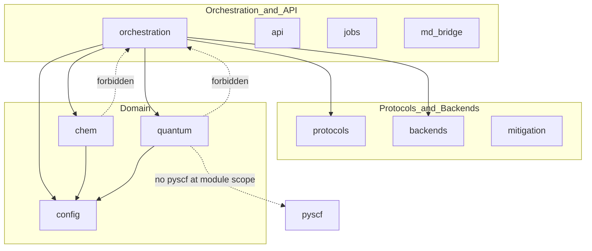

# Import layer boundaries (maintainer reference)

本文档描述 `qchem_stack` 的分层 import 约束，与 [`scripts/check_import_layers.py`](../../scripts/check_import_layers.py) 及 `tests/quantum/test_quantum_layer_import_boundaries.py` 一致。

## 分层模型



## 硬性规则

| 层 | 允许 import | 禁止 |
|----|-------------|------|
| `chem/` | `config`, 同层子模块 | `orchestration` |
| `quantum/` | `config`, 同层子模块 | `orchestration`, 模块级 `pyscf` |
| `orchestration/` | 下层全部 | 被 chem/quantum 反向 import |

## CI 检查

```bash
python scripts/check_import_layers.py
```

Lint job 在 Ruff 之后运行此脚本。

## 测试路径 helper

测试内引用仓库文件时，使用 [`tests/helpers/paths.py`](../../tests/helpers/paths.py) 而非 ``Path(__file__).parents[N]``：

| 函数 | 用途 |
|------|------|
| `repo_root()` | 仓库根（含 `pyproject.toml`） |
| `configs_path(name)` | `configs/` 下单个 YAML/JSON |
| `configs_dir()` | `configs/` 目录 |
| `docs_path(rel)` | `docs/` 下文档 |
| `fixtures_path(rel)` | `tests/fixtures/` |
| `scripts_path(rel)` | `scripts/` |

## 扩展

新增 backend 或 plugin 时，保持 **算法层不解析 YAML**、**驱动层不 import orchestration** 不变量。详见 [`docs/ENGINEERING_ARCHITECTURE.md`](../ENGINEERING_ARCHITECTURE.md)。
