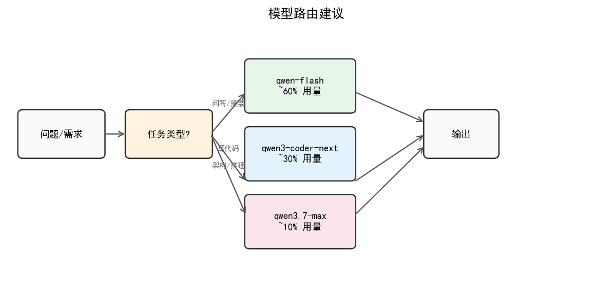
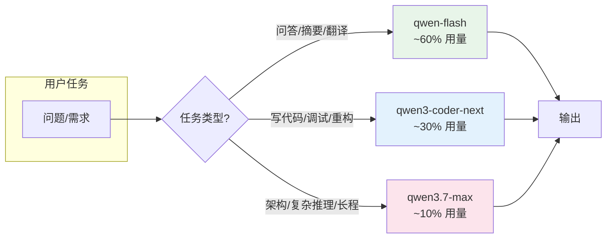
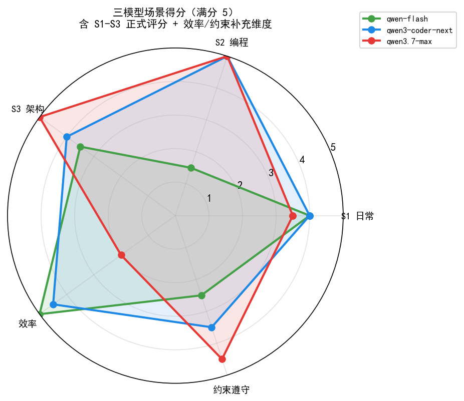
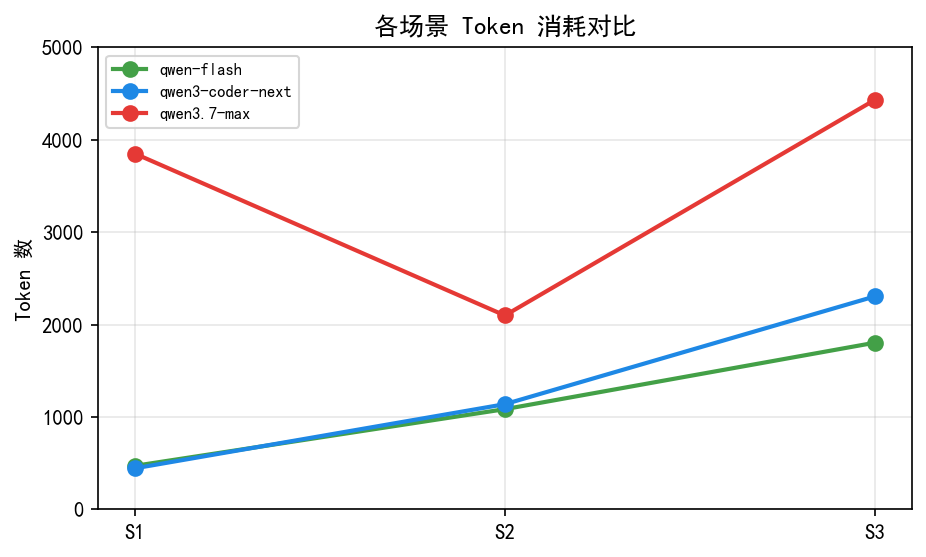
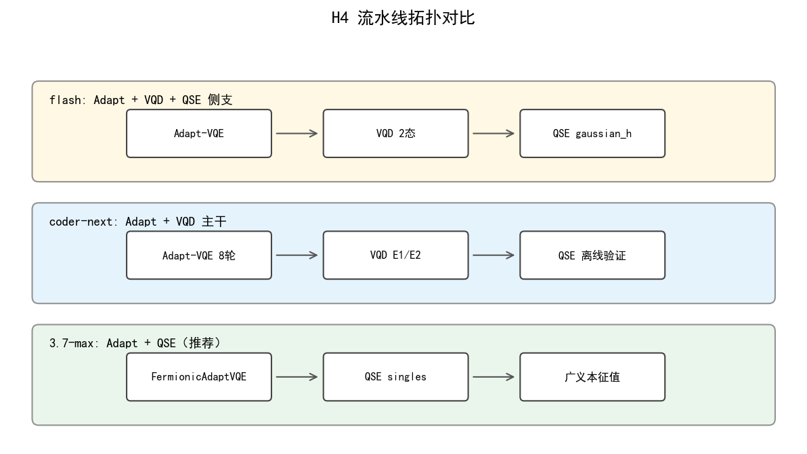

# 千问三模型评测报告（量子算法工程师场景）

---

## 1. 评测概览


| 维度         | 说明                                                             |
| -------------- | ------------------------------------------------------------------ |
| **评测对象** | `qwen-flash` / `qwen3-coder-next` / `qwen3.7-max`                |
| **场景数**   | 3（日常解释 / 编程 / 架构设计）                                  |
| **总调用**   | 9 次（3×3 全矩阵）                                              |
| **角色定位** | flash → 简单日常；coder-next → 编程 Agent；3.7-max → 复杂推理 |

### 1.1 模型路由建议



<details>
<summary>Mermaid 源码</summary>



</details>

### 2.1 雷达图（相对表现）



<details>
<summary>Mermaid 源码</summary>


---

## 3. 效率对比

### 3.2 Token 消耗




| 模型             |    S1 |    S2 |    S3 |       合计 | 相对 flash |
| ------------------ | ------: | ------: | ------: | -----------: | :----------: |
| qwen-flash       |   472 | 1,085 | 1,804 |  **3,361** |   1.0×   |
| qwen3-coder-next |   445 | 1,139 | 2,305 |  **3,889** |   1.2×   |
| qwen3.7-max      | 3,850 | 2,099 | 4,432 | **10,381** | **3.1×** |

> 3.7-max 在 S1 的 completion_tokens=3683，主要为深度思考开销；可见正文仅 ~192 字，物理内容正确。

---

## 4. 分场景详评

### 4.1 S1 — Jordan-Wigner 映射解释

**任务**：180–220 字，3 条 bullet，说明动机 / 结构变化 / 代价。


| 模型       |  延迟 | tokens | 物理正确性 |            格式遵守            |
| ------------ | ------: | -------: | :----------: | :------------------------------: |
| flash      |  3.4s |    472 |     ✅     |          ⚠️ 超字数          |
| coder-next |  2.1s |    445 |     ✅     |          ⚠️ 超字数          |
| 3.7-max    | 31.8s |   3850 |     ✅     | ⚠️ 超字数 + 高 thinking 开销 |

**结论**：三模型物理内容均正确（Pauli 字符串、Z 链非局域性、资源代价）。日常解释首选 **flash** 或 **coder-next**；不必为 S1 类任务调用 3.7-max。

---

### 4.2 S2 — `select_adapt_candidates` 编程

**任务**：实现 ADAPT 算符贪心选择（梯度过滤 → 降序 → qubit 宽度约束），含 3 组 assert。


| 模型       |  延迟 | tokens | 代码可运行 | 关键问题                               |
| ------------ | ------: | -------: | :----------: | ---------------------------------------- |
| flash      |  8.0s |  1,085 | ❌ FAILED | `filtered_sorted.index(name)` 逻辑错误 |
| coder-next |  4.0s |  1,139 | ✅ PASSED | 实现清晰，union 计数正确               |
| 3.7-max    | 14.9s |  2,099 | ✅ PASSED | 文档化最好，边界测试完备               |

**flash 失败根因**：

```python
# flash 错误写法：filtered_sorted 仅为 name 列表，index 与 pool 索引混用
qubits = [q for q in pool[filtered_sorted.index(name)][1]]
```

**推荐**：Cursor 日常编程默认 **qwen3-coder-next**；复杂算法模块可切换 **3.7-max**。

---

### 4.3 S3 — H4 激发态流水线架构 memo

**任务**：4e/4o H4，shots ≤ 5×10⁵，输出 A–E 结构化 memo（拓扑 / 三档对比 / 决策树 / 不推荐组合 / 验证实验）。

#### 推荐拓扑对比




| 模型        |          shots 预算意识          |   架构质量   | 关键差异                             |
| ------------- | :---------------------------------: | :------------: | -------------------------------------- |
| flash       | ⚠️ 乐观（三模块叠加仍称 ≤5e5） |   结构完整   | 推荐 Adapt+VQD+QSE 全链路            |
| coder-next  |    ⚠️ Adapt+VQD ≈4.8×10⁵    |  细节最丰富  | VQD 作主路径，QSE 仅对照             |
| **3.7-max** |        ✅**明确否决 VQD**        | **约束最严** | **Adapt+QSE 主路径，~3×10⁵ shots** |

**3.7-max 核心判断（采纳为实验草案依据）**：

1. **推荐**：`FermionicAdaptVQE` → `QSE(fermionic singles)` → 经典广义本征值求解
2. **条件推荐**：Adapt + VQD（shots > 10⁶，超出本预算）
3. **不推荐**：UCCSD-VQE only；Adapt + VQD @ ≤5×10⁵；Adapt + SCEOM sidecar

---

## 5. 决策矩阵


| 你的需求                  | 首选模型         | 备选                         |
| --------------------------- | ------------------ | ------------------------------ |
| Cmd+K 改一行、写注释      | qwen-flash       | —                           |
| Agent / Composer 写模块   | qwen3-coder-next | 3.7-max（难 bug）            |
| 流水线架构、shot 预算论证 | qwen3.7-max      | coder-next（细节多但约束弱） |
| 成本敏感、批量问答        | qwen-flash       | coder-next                   |

---

## 6. Cursor 本地配置


| 场景     | 模型 ID            | Cursor 用途            |
| ---------- | -------------------- | ------------------------ |
| 简单日常 | `qwen-flash`       | 问答、摘要、简单 Cmd+K |
| 日常编程 | `qwen3-coder-next` | Agent / Composer       |
| 千问最强 | `qwen3.7-max`      | 架构设计、复杂推理     |

**配置脚本**：`~/.cursor/configure_qwen_models.py`

```bash
# 关闭 Cursor 后执行（推荐）
DASHSCOPE_API_KEY="sk-..." python3 ~/.cursor/configure_qwen_models.py --region cn

# 若 Cursor 仍在运行（可能因 DB 锁失败）
DASHSCOPE_API_KEY="sk-..." python3 ~/.cursor/configure_qwen_models.py --region cn --force
```

**重启后**：Settings → Models → 关闭 Auto → 手动选择上述模型。

---

## 7. 实验配置草案

基于 3.7-max S3 memo，已生成 H4 实验配置：

- **文件**：`configs/example_h4_adapt_qse_benchmark.yaml`
- **路径**：`FermionicAdaptVQE` → `QSE(fermionic singles)`，VQD 关闭
- **shots 预算**：`extra.shot_budget_total: 500000`（文档化约束，供 benchmark 对照）

---

## 8. 总结与行动项


| # | 行动                                                   | 优先级 |
| --- | -------------------------------------------------------- | :------: |
| 1 | Cursor 默认编程模型设为**qwen3-coder-next**            |   高   |
| 2 | 架构/资源论证类任务切换**qwen3.7-max**                 |   高   |
| 3 | 简单问答用**qwen-flash**，避免 max 的 thinking 开销    |   中   |
| 4 | 运行`example_h4_adapt_qse_benchmark.yaml` 验证 S3 结论 |   中   |
| 5 | **轮换已暴露的 API Key**                               |   高   |

**一句话结论**：编程选 coder-next，架构选 3.7-max，日常选 flash；H4 激发态 pipeline 优先 **Adapt + QSE**，在 ≤5×10⁵ shots 下避免 VQD 主路径。

---

## 附录 A — 原始指标表


| scenario | model | latency_s | prompt | completion | total |
| ---------- | ------- | ----------: | -------: | -----------: | ------: |
| S1       | flash |      3.41 |    171 |        301 |   472 |
| S1       | coder |      2.11 |    171 |        274 |   445 |
| S1       | max   |     31.77 |    167 |       3683 |  3850 |
| S2       | flash |      8.01 |    267 |        818 |  1085 |
| S2       | coder |      4.02 |    267 |        872 |  1139 |
| S2       | max   |     14.93 |    266 |       1833 |  2099 |
| S3       | flash |     18.82 |    371 |       1433 |  1804 |
| S3       | coder |     12.61 |    371 |       1934 |  2305 |
| S3       | max   |     34.84 |    369 |       4063 |  4432 |

## 附录 B — 模型参数量（公开信息）


| 模型             | 参数量                   | 备注                    |
| ------------------ | -------------------------- | ------------------------- |
| qwen-flash       | 未公开                   | 商业 API，侧重速度/成本 |
| qwen3-coder-next | 80B total / 3B activated | MoE                     |
| qwen3.7-max      | >1T total                | MoE，激活参数量未公开   |

<style>#mermaid-1779692914274{font-family:sans-serif;font-size:16px;fill:#333;}#mermaid-1779692914274 .error-icon{fill:#552222;}#mermaid-1779692914274 .error-text{fill:#552222;stroke:#552222;}#mermaid-1779692914274 .edge-thickness-normal{stroke-width:2px;}#mermaid-1779692914274 .edge-thickness-thick{stroke-width:3.5px;}#mermaid-1779692914274 .edge-pattern-solid{stroke-dasharray:0;}#mermaid-1779692914274 .edge-pattern-dashed{stroke-dasharray:3;}#mermaid-1779692914274 .edge-pattern-dotted{stroke-dasharray:2;}#mermaid-1779692914274 .marker{fill:#333333;}#mermaid-1779692914274 .marker.cross{stroke:#333333;}#mermaid-1779692914274 svg{font-family:sans-serif;font-size:16px;}#mermaid-1779692914274 .label{font-family:sans-serif;color:#333;}#mermaid-1779692914274 .label text{fill:#333;}#mermaid-1779692914274 .node rect,#mermaid-1779692914274 .node circle,#mermaid-1779692914274 .node ellipse,#mermaid-1779692914274 .node polygon,#mermaid-1779692914274 .node path{fill:#ECECFF;stroke:#9370DB;stroke-width:1px;}#mermaid-1779692914274 .node .label{text-align:center;}#mermaid-1779692914274 .node.clickable{cursor:pointer;}#mermaid-1779692914274 .arrowheadPath{fill:#333333;}#mermaid-1779692914274 .edgePath .path{stroke:#333333;stroke-width:1.5px;}#mermaid-1779692914274 .flowchart-link{stroke:#333333;fill:none;}#mermaid-1779692914274 .edgeLabel{background-color:#e8e8e8;text-align:center;}#mermaid-1779692914274 .edgeLabel rect{opacity:0.5;background-color:#e8e8e8;fill:#e8e8e8;}#mermaid-1779692914274 .cluster rect{fill:#ffffde;stroke:#aaaa33;stroke-width:1px;}#mermaid-1779692914274 .cluster text{fill:#333;}#mermaid-1779692914274 div.mermaidTooltip{position:absolute;text-align:center;max-width:200px;padding:2px;font-family:sans-serif;font-size:12px;background:hsl(80,100%,96.2745098039%);border:1px solid #aaaa33;border-radius:2px;pointer-events:none;z-index:100;}#mermaid-1779692914274:root{--mermaid-font-family:sans-serif;}#mermaid-1779692914274:root{--mermaid-alt-font-family:sans-serif;}#mermaid-1779692914274 flowchart{fill:apa;}</style>

<style>#mermaid-1779692914275{font-family:sans-serif;font-size:16px;fill:#333;}#mermaid-1779692914275 .error-icon{fill:#552222;}#mermaid-1779692914275 .error-text{fill:#552222;stroke:#552222;}#mermaid-1779692914275 .edge-thickness-normal{stroke-width:2px;}#mermaid-1779692914275 .edge-thickness-thick{stroke-width:3.5px;}#mermaid-1779692914275 .edge-pattern-solid{stroke-dasharray:0;}#mermaid-1779692914275 .edge-pattern-dashed{stroke-dasharray:3;}#mermaid-1779692914275 .edge-pattern-dotted{stroke-dasharray:2;}#mermaid-1779692914275 .marker{fill:#333333;}#mermaid-1779692914275 .marker.cross{stroke:#333333;}#mermaid-1779692914275 svg{font-family:sans-serif;font-size:16px;}#mermaid-1779692914275 .label{font-family:sans-serif;color:#333;}#mermaid-1779692914275 .label text{fill:#333;}#mermaid-1779692914275 .node rect,#mermaid-1779692914275 .node circle,#mermaid-1779692914275 .node ellipse,#mermaid-1779692914275 .node polygon,#mermaid-1779692914275 .node path{fill:#ECECFF;stroke:#9370DB;stroke-width:1px;}#mermaid-1779692914275 .node .label{text-align:center;}#mermaid-1779692914275 .node.clickable{cursor:pointer;}#mermaid-1779692914275 .arrowheadPath{fill:#333333;}#mermaid-1779692914275 .edgePath .path{stroke:#333333;stroke-width:1.5px;}#mermaid-1779692914275 .flowchart-link{stroke:#333333;fill:none;}#mermaid-1779692914275 .edgeLabel{background-color:#e8e8e8;text-align:center;}#mermaid-1779692914275 .edgeLabel rect{opacity:0.5;background-color:#e8e8e8;fill:#e8e8e8;}#mermaid-1779692914275 .cluster rect{fill:#ffffde;stroke:#aaaa33;stroke-width:1px;}#mermaid-1779692914275 .cluster text{fill:#333;}#mermaid-1779692914275 div.mermaidTooltip{position:absolute;text-align:center;max-width:200px;padding:2px;font-family:sans-serif;font-size:12px;background:hsl(80,100%,96.2745098039%);border:1px solid #aaaa33;border-radius:2px;pointer-events:none;z-index:100;}#mermaid-1779692914275:root{--mermaid-font-family:sans-serif;}#mermaid-1779692914275:root{--mermaid-alt-font-family:sans-serif;}#mermaid-1779692914275 flowchart{fill:apa;}</style>
