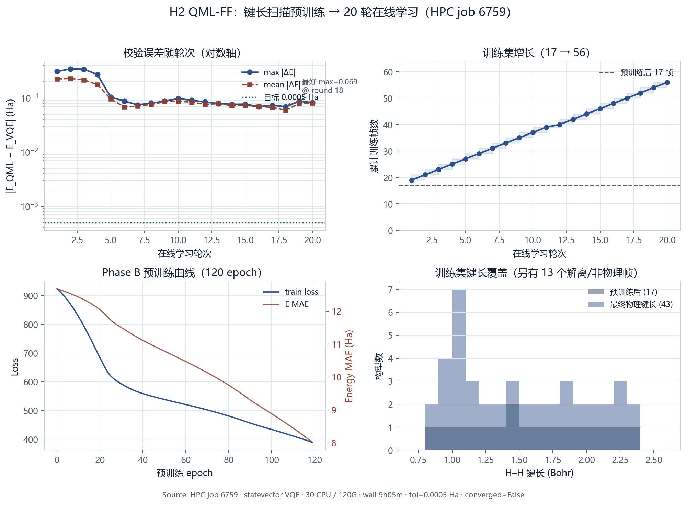
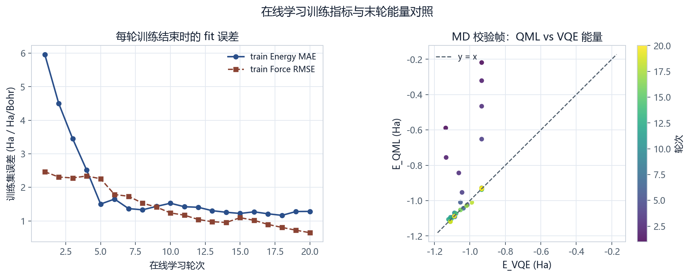

# H₂ QML-FF 训练报告：键长扫描预训练 + 在线学习

| 项 | 内容 |
|----|------|
| 作业 ID | **6759**（Slurm，COMPLETED） |
| 集群 | 幺正量子 HPC · `compute02` |
| 资源 | **30 CPU / 120G**（1 核 ↔ 4G） |
| 墙钟 | **9 h 05 min**（2026-07-17 14:50 → 23:55） |
| 后端 | `statevector` VQE（`configs/example_h2.yaml`） |
| 循环配置 | `configs/example_h2_qmlff_bondscan_ol_20rounds.yaml` |
| 结果目录 | `$HOME/results/h2_bondscan_ol_statevector_r20_6759/` |
| 收敛 | **未达标**（`converged=False`，目标 `5×10⁻⁴` Ha） |

> Typora 打开本文件即可；图在同目录 `figures/`。原始 JSON 在 `data/`。

---

## 1. 任务目标与流程

针对先前力场泛化不足（长 MD 易解离），本任务采用**非零样本**三阶段流程：

| 阶段 | 内容 | 本 run 设定 |
|------|------|------------|
| **A. 量子化学建集** | VQE 对 H₂ 做键长扫描，标注能量/力 | 16 点，0.8–2.4 Bohr → **17** 帧（含平衡构型） |
| **B. 预训练力场** | 仅在扫描集上训练，**无 MD** | `pretrain_epochs=120`，约 **46.6 min** |
| **C. 在线学习** | warm-start 后 20 轮：短 MD 校验 + 每轮追加不同键长 | `max_rounds=20`，`round_bonds_per_round=1` |

最终训练集：**56** 帧；每轮 checkpoint 见 `qmlff_checkpoints/round_XX/`。

---

## 2. 一句话结论

流水线完整跑通；校验误差从第 1 轮约 **0.31 Ha** 降到最好约 **0.069 Ha**（第 18 轮），约降到 1/4，但距化学精度目标 `5×10⁻⁴` Ha 仍差约两个数量级。最终集含 **13** 个解离/非物理键长帧，是主要污染源之一。

---

## 3. 结果总览图





---

## 4. 关键指标

### 4.1 作业与资源

| 指标 | 值 |
|------|-----|
| Exit code | 0 |
| Elapsed | 09:04:54 |
| MaxRSS（batch） | ~1.7 GB |
| 峰值分配 | 30 CPU · 120G |

### 4.2 Phase B 预训练（结束时）

| 指标 | 值 |
|------|-----|
| 训练帧数 | 17 |
| Epoch | 120 |
| 训练墙钟（history） | ~2799 s（≈46.6 min） |
| Loss | 924 → **389** |
| Energy MAE | 12.7 → **8.01 Ha** |
| Force RMSE | 6.00 → **2.85** |

预训练有下降，但绝对误差仍偏大（与 `energy_normalization: none`、模型容量/数据量有关）。

### 4.3 Phase C 在线学习（校验 |ΔE|）

| 指标 | 第 1 轮 | 最好 | 第 20 轮 |
|------|---------|------|----------|
| max \|ΔE\| (Ha) | 0.309 | **0.069**（第 18 轮） | 0.083 |
| mean \|ΔE\| (Ha) | 0.225 | **0.059**（第 18 轮） | 0.082 |
| 训练帧数 | 17→19 | — | →**56** |

目标容差：`energy_tolerance_hartree = 5×10⁻⁴` Ha → **未收敛**。

### 4.4 训练集键长

| 集合 | 物理键长帧（&lt;5 Bohr） | 非物理/解离（≥5 Bohr） |
|------|-------------------------|------------------------|
| 预训练后 | 17（0.8–2.4 Bohr 均匀扫描） | 0 |
| 最终 | 43 | **13** |

解离帧来自 MD 校验构型被 `add_top_k` / 合并进训练集，会拉高后续 fit 难度。

---

## 5. 超参数一览

| 类别 | 参数 | 值 |
|------|------|-----|
| 扫描 | `n_seed_geometries` / 范围 | 16 · 0.8–2.4 Bohr |
| 预训练 | `pretrain_epochs` | 120 |
| OL | `max_rounds` / `n_epochs_per_round` | 20 / 30 |
| OL | `round_bonds_per_round` | 1（互补半格点打乱） |
| 标签 | theory / energy ref | `full_pipeline` / `variational` |
| 模型 | backend / preset | `qmlff_preset` / `atomic_amplitude` |
| 模型 | n_qubits / n_layers | 6 / 2 |
| 优化 | lr / force_weight / lr_scheduler | 1e-3 / 10 / constant |
| 归一化 | `energy_normalization` | **none** |
| MD | steps / dt / T / init | 40 / 0.25 fs / 100 K / `base` |
| 收敛 | 容差 / 是否早停 | 5e-4 Ha / `stop_on_md_converged: false` |

### 每轮追加键长日程（Bohr）

`1.24, 1.32, 1.16, 1.08, 2.20, 1.96, 2.12, 1.56, 1.80, 1.48, 2.28, 1.40, 0.92, 0.84, 1.88, 2.04, 1.00, 1.64, 1.72, 2.36`

（详见 `data/round_bond_schedule.json`）

---

## 6. 逐轮明细

| 轮次 | n_train（前→后） | max\|ΔE\| | mean\|ΔE\| | train E-MAE | train F-RMSE | train loss |
|------|------------------|-----------|------------|-------------|--------------|------------|
| 1 | 17→19 | 0.3088 | 0.2250 | 5.960 | 2.466 | 286.7 |
| 2 | 19→21 | 0.3464 | 0.2292 | 4.496 | 2.306 | 198.3 |
| 3 | 21→23 | 0.3413 | 0.2170 | 3.445 | 2.280 | 161.2 |
| 4 | 23→25 | 0.2721 | 0.1766 | 2.513 | 2.337 | 150.1 |
| 5 | 25→27 | 0.1034 | 0.0960 | 1.502 | 2.255 | 166.2 |
| 6 | 27→29 | 0.0879 | 0.0683 | 1.650 | 1.785 | 153.1 |
| 7 | 29→31 | 0.0749 | 0.0714 | 1.366 | 1.734 | 132.5 |
| 8 | 31→33 | 0.0807 | 0.0760 | 1.329 | 1.529 | 113.0 |
| 9 | 33→35 | 0.0870 | 0.0856 | 1.431 | 1.411 | 99.6 |
| 10 | 35→37 | 0.0977 | 0.0868 | 1.526 | 1.238 | 93.7 |
| 11 | 37→39 | 0.0910 | 0.0841 | 1.422 | 1.170 | 78.2 |
| 12 | 39→40 | 0.0842 | 0.0767 | 1.405 | 1.042 | 69.7 |
| 13 | 40→42 | 0.0793 | 0.0785 | 1.303 | 0.975 | 63.6 |
| 14 | 42→44 | 0.0765 | 0.0727 | 1.257 | 0.952 | 58.7 |
| 15 | 44→46 | 0.0769 | 0.0728 | 1.221 | 1.095 | 59.9 |
| 16 | 46→48 | 0.0695 | 0.0694 | 1.270 | 1.016 | 51.2 |
| 17 | 48→50 | 0.0734 | 0.0674 | 1.210 | 0.894 | 44.2 |
| 18 | 50→52 | **0.0693** | **0.0593** | 1.165 | 0.805 | 41.1 |
| 19 | 52→54 | 0.0868 | 0.0794 | 1.279 | 0.722 | 37.2 |
| 20 | 54→56 | 0.0828 | 0.0817 | 1.283 | 0.647 | 35.3 |

观察：

- 第 1–5 轮校验误差下降最快；第 6 轮后进入 **~0.07–0.10 Ha** 平台。
- 训练集 loss / F-RMSE 持续下降，但校验 |ΔE| 未同步压到容差以下 → **泛化/标签一致性/数据污染**问题大于“训不下去”。

---

## 7. 问题诊断

1. **容差过紧相对当前模型**：平台误差 ~0.07 Ha ≫ 5e-4 Ha。  
2. **MD 解离帧入库**：13 个 ≥5 Bohr 构型进入训练，破坏势能面光滑性。  
3. **能量未中心化**：`energy_normalization: none`，预训练 E-MAE 绝对尺度偏大。  
4. **短 MD + 小模型**：`md_n_steps=40`、`n_qubits=6 / n_layers=2`，探索与表达能力有限。

---

## 8. 改进建议（下一版训练）

| 优先级 | 动作 |
|--------|------|
| P0 | 合并前过滤键长（建议 &lt; 3.0 Bohr），或 MD 失败则丢弃该帧 |
| P0 | `energy_normalization: subtract_mean` |
| P1 | 加密扫描（≥24 点）+ `pretrain_epochs` 200–300 |
| P1 | 分阶段容差：0.05 → 0.01 → 5e-4 |
| P2 | 提高 `n_epochs_per_round` 或轮次至 30–50；评估更大 preset |

---

## 9. 产物清单

本报告包目录结构：

```text
训练报告_H2_QMLFF_job6759/
├── 训练报告_H2键长扫描预训练与在线学习.md   ← 本文件
├── figures/
│   ├── h2_bondscan_ol_6759_overview.png
│   └── h2_bondscan_ol_6759_train_parity.png
└── data/
    ├── md_validation_summary.json
    ├── pretrain_metrics.json
    └── round_bond_schedule.json
```

完整运行产物（checkpoint、每轮 xyz）仍在：

`/data/home/sun_hl/results/h2_bondscan_ol_statevector_r20_6759/`

（本机镜像：`/home/sunhl/projects/qchem_qml_md/results/h2_bondscan_ol_statevector_r20_6759/`）

---

## 10. 署名与复现

- 复现入口：`scripts/hpc/h2_bondscan_online_learning.sbatch`  
- 提交示例：`MAX_ROUNDS=20 PROFILE=statevector sbatch --cpus-per-task=30 --mem=120G scripts/hpc/h2_bondscan_online_learning.sbatch`  
- 出图脚本：`docs/assets/plot_h2_bondscan_ol_6759.py`  
- 报告生成日期：2026-07-20  
