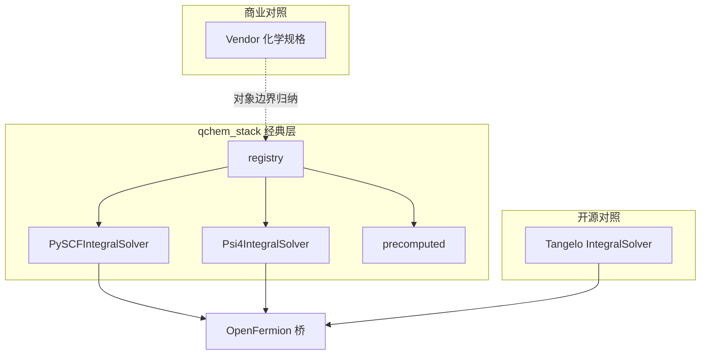

# 量子计算化学软件平台——经典计算化学集成交付说明

**文档类型**：经典化学层集成说明（代码 + 文档双维度）  
**版本**：v1.0  
**日期**：2026-07-03  
**编制说明**：本说明承接第一期行业调研与产品架构设计，定义第二期（**2026 年 7–8 月，两月两册**）经典计算化学集成交付的范围、对标框架、代码与示例验收标准；侧重 `ChemIntegralSolver` 统一契约与可回归交付物，非闭源数值等价审计。7 月交付 v0.5（主路径），8 月交付 v1.0（扩展路径 + PDF 定稿）。

---

## 目录

1. [摘要](#摘要)
2. [集成背景、目的与范围](#1-集成背景目的与范围)
3. [集成方法与信息源](#2-集成方法与信息源)
4. [经典化学在量子工作流中的位置](#3-经典化学在量子工作流中的位置)
5. [经典化学栈全景与分类](#4-经典化学栈全景与分类)
6. [本工程经典层架构与契约](#5-本工程经典层架构与契约)
7. [重点对标深度说明](#6-重点对标深度说明)
8. [能力对比矩阵（经典层视角）](#7-能力对比矩阵经典层视角)
9. [代码与示例交付规格](#8-代码与示例交付规格)
10. [两月实施节奏与验收闸门](#9-两月实施节奏与验收闸门)
11. [趋势、风险与边界](#10-趋势风险与边界)
12. [结论与第三期衔接建议](#11-结论与第三期衔接建议)
- [附录 A：代表配置与教程索引](#附录-a代表配置与教程索引)
- [附录 B：源码与测试索引](#附录-b源码与测试索引)
- [附录 C：术语表](#附录-c术语表)

---

## 摘要

第一期调研确立：量子计算化学平台的竞争焦点已从「能否跑通 VQE」转向**工作流可信度、后端可替换性与 Methods 可审计性**；经典电子结构程序（PySCF、Psi4 等）仍是所有量子工作流的**真理基线**来源。第二期据此将交付重心放在**经典计算化学层**——在量子算法编排之前，形成统一接口、可插拔后端、可机读元数据与可回归示例的集成闭环。

本说明对 PySCF（主路径）、Psi4（次路径）、Tangelo `IntegralSolver`（开源对照）、Vendor platform 化学规格柱（商业对照）开展**代码仓库与本仓实现 + 公开文档**双轨梳理，提出以 `ChemIntegralSolver` + `SolverCapabilities` + bridge interchange 为核心的五层经典子架构，并规定本期**代码、配置 YAML、教程脚本、chem 测试、parity 导出**五类交付物及质量闸门。

**核心结论**：经典层集成的护城河不在于绑定单一程序，而在于**配置即契约、能力门控、driver_meta 可审计、pre-quantum 双线路收敛**。**7 月**以 PySCF 生产完备性与入门 2 路径验收为主；**8 月**收 Psi4 可选、嵌入代表路径、parity ≥25 与说明 PDF 定稿。AVAS 全自动、NEVPT2/AC0、闭源云等价宣称明确列为非目标。

**读者导航**：第 3–4 章理解经典层在整体 workflow 中的边界；第 5–6 章为本仓实现核心；第 7 章为对标深度；第 8–9 章为验收与交付清单；第 10–11 章支持排期与第三期衔接。

---

## 1. 集成背景、目的与范围

### 1.1 第一期结论衔接

第一期《行业与竞品调研报告》与架构设计确立：

| 第一期产出 | 对第二期的约束 |
|------------|----------------|
| 八项设计原则、五层参考架构 | 经典层对应 **Chemistry drivers / adapters** 与 **pre-quantum build** |
| 竞品经典–量子边界分析 | 本仓必须在 bridge 之后消除对 PySCF 类型的硬依赖 |
| 配置即契约、repro 机读化 | `driver_meta`、`SolverCapabilities`、parity export 为验收锚点 |
| 能力矩阵 ≥15 维 | 本期经典子集同样 ≥15 维，与 `public_parity_matrix.md` 联动 |

行业共识（第一期摘要）：**任何量子计算化学平台都必须通过经典层输入保证化学正确性**；跳过经典验证的量子结果不应进入生产决策。

### 1.2 集成动因

量子算法阶段（VQE、ADAPT、QPE 等）依赖稳定的：

- 分子几何、电荷、自旋多重度与基组；
- 平均场参考（RHF/ROHF/UHF 及周期性推广）；
- 活性空间选取与嵌入（DMET、Schmidt、投影、plugin）；
- MO / AO 积分与 OpenFermion 桥接；
- 经典 benchmark（HF/MP2/CCSD/CASCI）作为量子结果对照。

若经典层接口不统一、元数据不可审计、示例不可回归，第三期量子算法深化将反复返工。**第二期两月窗口**的目标，是把上述链条收敛为**可交付代码 + 可跑示例**：7 月先收口 PySCF 主路径与入门示例，8 月再收多后端、嵌入与说明定稿，而非在单月内并行铺完全部扩展路径。

### 1.3 集成目的

| 序号 | 目的 | 可交付用途 |
|------|------|------------|
| G1 | 落地 `ChemIntegralSolver` 统一经典入口 | 多后端扩展、第三方插件 |
| G2 | 完成 PySCF 主路径生产闭环（含 Phase A） | CI、parity、Methods 写作 |
| G3 | 证明 Psi4 可选后端可走同一 pre-quantum 契约 | 跨程序 HF 对照、合作方 onboarding |
| G4 | 提供分层配置示例与教程脚本 | 用户入门、组会演示、云托管 smoke |
| G5 | 经典层能力矩阵与差距表机读化 | 第三期 backlog、对外 parity 叙事 |

### 1.4 集成范围

**时间范围**：2026 年 7–8 月（两月、两册），承接 2026 年 6 月第一期收口。

**地理与语言**：以本仓 `src/qchem_stack/chem/` 实现与英文/中文工程文档为准；竞品以公开文档与开源仓库为证。

**必覆盖对象**（代码与文档层面）：

| 类别 | 代表 | 本期关系 |
|------|------|----------|
| 本仓主后端 | PySCF | 生产默认 `scf.driver=pyscf` |
| 本仓次后端 | Psi4 | 可选 `scf.driver=psi4` |
| 离线旁路 | precomputed bundle | 双线路经典输入 |
| 插件扩展 | custom solver / decomposition plugin | entry point 与 SPI 样例 |
| 开源对照 | Tangelo `IntegralSolver` | 三方法命名与数据流对照 |
| 商业对照 | Vendor platform 化学规格柱 | 对象边界归纳，非闭源复现 |
| 基础桥接生态 | OpenFermion 积分约定 | 与 Tangelo ½ 双体因子对齐测试 |

**不在范围**：

- 闭源程序（ORCA、Gaussian、Q-Chem）数值主路径实现；
- 量子编译、shots、缓解、云作业闭环（仅示例 YAML 触达下游）；
- 宣称与 Quantinuum Nexus / HQC 等价；
- 全自动化 AVAS、NEVPT2/AC0 生产默认。

### 1.5 需求与场景（四类优先级）

| 优先级 | 场景 | 典型用户 | 本期代表交付 |
|--------|------|----------|--------------|
| **P0** | 分子基线：几何 → SCF → 活性空间 → 量子哈密顿量 | 算法研发 | `example_h2.yaml`、`example_h2_active_space_*` |
| **P0** | Methods 可审计：driver_meta + parity export | 合规 / 论文 | `export_parity_criteria_table.py`、抽样 ≥25 YAML |
| **P1** | 多后端：PySCF vs Psi4 HF 对照 | 集成方 | `example_h2_psi4_rhf_sto3g.yaml`、cross-solver 测试 |
| **P1** | 嵌入 / 碎片：DMET、Schmidt、plugin | 材料 / 强关联 | `example_h4_dmet_*`、`example_decomposition_plugin_*` |
| **P2** | 周期性 / 溶剂 / 密度拟合 | 固体 / 溶液化学 | `example_h2_pbc_gamma.yaml`、ECP/density-fit 样例 |
| **P2** | 离线预计算 bundle | HPC 批处理 | `example_h2_precomputed_bundle.yaml` |
| **P3** | 经典 MD / ML 力场衔接 | 应用化学 | 文档索引为主，非本期必测闸门 |

---

## 2. 集成方法与信息源

### 2.1 代码层集成方法论

对本仓与**开源**对照对象，采用统一检查单：

1. **Solver 注册**：`registry.py` entry points、`registered_solver_ids()`、capabilities 工厂。
2. **经典–pre-quantum 边界**：谁产出 `ClassicalMeanFieldReference`；谁构建 `CanonicalActiveSpaceIntegralPack`。
3. **活性空间**：manual / CAS / AVAS 策略入口与 `active_space_recipe` 元数据。
4. **嵌入**：DMET / Schmidt / projection / plugin 的 `integral_source` 与 `epistemic_bound`。
5. **积分与映射**：`get_integrals`、OpenFermion `InteractionOperator`、JW/BK/SCBK 映射注册表。
6. **元数据**：`driver_meta` 最小字段集、`canonical_classical_bridge_*` 规范头。
7. **测试与 CI**：`tests/chem/` 覆盖、parity 抽样、optional 依赖标记。

### 2.2 文档层集成方法论

1. 本仓契约文档：`统一经典化学接口_*`、`说明_经典化学后端驱动_*`、`说明_scf/active_space/embedding` 系列。
2. 竞品公开文档：Tangelo overview / IntegralSolver；Vendor platform 化学规格 howto（公开页）。
3. 上游程序文档：PySCF、Psi4 官方 manual 中与 SCF、CASCI、PBC 相关章节。
4. 机读矩阵：`public_parity_matrix.md`、`pre_quantum_yaml_matrix.md` 与 `product_contract` 字面量一致。

### 2.3 信息源清单

| 类型 | 来源 |
|------|------|
| 本仓源码 | `src/qchem_stack/chem/`、`orchestration/stage_execution.py` |
| 本仓测试 | `tests/chem/`、`tests/chem/test_integral_openfermion_tangelo_recipe.py` |
| 配置语料 | `configs/example_*.yaml`（107+ 份，本期精选代表子集） |
| Tangelo | https://github.com/sandbox-quantum/Tangelo |
| PySCF | https://pyscf.org/ |
| Psi4 | https://psicode.org/ |
| 第一期调研 | `docs/research/量子计算化学软件平台-行业与竞品调研报告.md` |

---

## 3. 经典化学在量子工作流中的位置

### 3.1 产品级 workflow 中的经典段

```mermaid
flowchart LR
  CFG[YAML 配置] --> VAL[校验与 capabilities 门控]
  VAL --> SOL[create_solver]
  SOL --> SCF[compute_mean_field]
  SCF --> BR[bridge interchange]
  BR --> CMR[ClassicalMeanFieldReference]
  CMR --> PQ[pre_quantum_build]
  PQ --> PQI[PreQuantumInput]
  PQI --> Q[量子阶段]
  Q --> PROTO[Protocol / repro]
```



**本期交付边界**：从 `CFG` 到 `PQI`（含 parity 导出中经典段字段）；`Q` 及之后仅通过示例 YAML 触达，不列为本期代码主交付。

### 3.2 双线路经典输入

| 线路 | 入口 | 收敛点 |
|------|------|--------|
| **Live solver** | `scf.driver` → `ChemIntegralSolver` | `PreQuantumInput` |
| **Precomputed** | `scf.driver=precomputed` + bundle 路径 | 同一 `PreQuantumInput` 契约 |

两线路必须在 `PreQuantumInput.as_summary_dict()` 的 `source`、`integral_source`、`hamiltonian_fingerprint` 上可区分、可审计。

---

## 4. 经典化学栈全景与分类

### 4.1 按角色分类

| 角色 | 代表 | 与量子平台关系 |
|------|------|----------------|
| 通用电子结构程序 | PySCF、Psi4、ORCA | 平均场、积分、经典 benchmark |
| 开源量子化学 workflow | Tangelo | 内置 `IntegralSolver`，经典层与算法同仓 |
| 商业全栈 | Vendor platform / InQuanto | 化学规格对象化，经典层封装在 SDK 内 |
| 费米子数据结构 | OpenFermion | 积分 → Pauli 算符桥梁 |
| 本仓抽象 | `ChemIntegralSolver` | 统一多程序入口，下游 backend-agnostic |

### 4.2 竞争关系示意（经典层）



---

## 5. 本工程经典层架构与契约

### 5.1 五层经典子架构

| 层 | 模块 | 职责 |
|----|------|------|
| L0 配置 | `qchem_stack.config` | `molecule`、`scf`、`active_space`、`embedding` |
| L1 驱动 | `chem.solvers` | `ChemIntegralSolver`、`create_solver`、`SolverCapabilities` |
| L2 交换 | `chem.bridges` | `classical_mean_field_via_solver_bridge` → `MolecularMeanFieldResult` |
| L3 构建 | `chem.pre_quantum_build`、`chem.hamiltonian` | 活性空间哈密顿量、映射、指纹 |
| L4 嵌入 | `chem.embedding` | DMET、Schmidt、projection、plugin |
| L5 导出 | `repro`、`integrations` | parity / Methods 字段、`registered_solvers` 快照 |

### 5.2 核心契约（维护纪律）

1. **统一经典接口优先**：所有程序经 `ChemIntegralSolver` + bridge 进入下游。
2. **下游与 vendor 解耦**：`orchestration` / `quantum` 不得 `import pyscf` 选路。
3. **能力门控**：用 `SolverCapabilities` 布尔位拒绝非法 YAML 组合。
4. **PySCF 是示例后端，非架构特权依赖**。
5. **过渡字段有弃用窗口**：legacy `PySCFDriver` 仅作兼容 facade。

### 5.3 Phase A 收口项（本期 W1 必完成）

对应 [`实施清单_PhaseA_PySCF继承改造.md`](../实施清单_PhaseA_PySCF继承改造.md)：

| 项 | 交付 | 验收 |
|----|------|------|
| A1 | `run_classical_post_hf_benchmarks` 统一接口 | hf/mp2/ccsd/casci 结构化返回 |
| A2 | `driver_meta` 最小字段集 | 分子与 PBC 路径完整 |
| A3 | `active_space.strategy` manual + CAS | 统一入口 + `active_space_recipe` |
| A4 | 测试 + 配置样例 | ≥3 测试文件 + 2 YAML |

---

## 6. 重点对标深度说明

> 每个对象 ≥1 页：**定位 → 本仓已接入 → 可借鉴 → 不照搬 / 不宣称**。

### 6.1 PySCF（本仓生产主路径）

**定位**：开源通用电子结构程序；分子与 PBC、CASCI、AVAS、溶剂、密度拟合能力齐全；国内量子化学–量子计算社区事实标准。

**本仓已接入**：

- `PySCFIntegralSolver`：`compute_mean_field`、`get_integrals`（生产路径）
- 分子 / PBC RHF·ROHF·UHF、`driver_meta`、classical benchmarks
- AVAS / CASSCF 审计钩子、`pyscf_active_space_hooks`
- 证据：`src/qchem_stack/chem/solvers/pyscf_solver*.py`，`configs/example_h2_avas*.yaml`

**可借鉴**：模块化 `gto`/`scf`/`mcscf`/`pbc` 分包；与 OpenFermion 社区配方对齐。

**不照搬**：不在 orchestration 内散落 PySCF 类型；新数学进 `chem.integrals.*` / `chem.systems.*`。

---

### 6.2 Psi4（本仓可选次路径）

**定位**：高质量 RHF/DFT/CC 生态；Psi4NumPy 积分接口；常用作 cross-check。

**本仓已接入**：

- `Psi4IntegralSolver` + `example_h2_psi4_rhf_sto3g.yaml`
- Schmidt DMET 代表：`example_h2_psi4_schmidt_dmet.yaml`
- 部分 L3 核委托 PySCF（AVAS、NEVPT2），`capability_notes` 明示

**可借鉴**：严格输入文件语义、Psi4NumPy 数组契约。

**不宣称**：与 PySCF 全方法数值等价；PBC k-mesh 本期仅 PySCF 完整支持。

---

### 6.3 Tangelo `IntegralSolver`（开源对照）

**定位**：SandboxAQ 开源端到端化学 workflow；经典层 `IntegralSolver` 与量子算法同仓库。

**对照要点**：

| Tangelo 概念 | 本仓 M1 对齐 |
|--------------|--------------|
| `set_physical_data` | `ChemIntegralSolver.set_physical_data` |
| `compute_mean_field` | 正式方法名，兼容 `run_*` 别名 |
| `get_integrals` | Protocol optional；PySCF 已实现 |

**可借鉴**：三方法命名降低跨库心智负担；`SecondQuantizedMolecule` 与 JW 路径。

**不照搬**：Tangelo 内置 ansatz 注册表；本仓经典与量子分层更严格。

**证据**：`tests/chem/test_chem_integral_solver_tangelo_aliases.py`，`tests/chem/test_integral_openfermion_tangelo_recipe.py`

---

### 6.4 Vendor platform 化学规格柱（商业对照）

**定位**：Quantinuum 三柱心智之「化学规格」——分子对象、活性空间、嵌入决策的对象化 API。

**本仓映射**：

- `ExperimentConfig` + 分层 YAML ≈ 声明式化学规格
- `ClassicalMeanFieldReference` + `driver_meta` ≈ 可审计化学状态快照
- `PreQuantumInput` ≈ 进入「程序构造」柱之前的交换物

**可借鉴**：化学规格与执行分析分离；Methods 导出字段设计。

**不宣称**：闭源对象模型等价、Nexus 作业 API、HQC 资源估计。

---

### 6.5 precomputed 与 plugin 扩展

**precomputed**：离线积分 bundle，适合 HPC 批处理；`example_h2_precomputed_bundle.yaml`。

**decomposition plugin**：`embedding.mode=plugin`；`example_decomposition_plugin_toy.yaml` + `tests/chem/test_decomposition_plugin_pipeline.py`。

**原则**：扩展走 registry / entry point，不修改 orchestration 内核。

---

## 7. 能力对比矩阵（经典层视角）

图例：**●** 已交付 / **◐** 部分 / **○** 规划 / **—** 不做

| # | 能力维度 | 本仓 qchem_stack | PySCF 原生 | Psi4 原生 | Tangelo | Vendor 公开规格 | 证据来源 |
|---|----------|------------------|------------|-----------|---------|-----------------|----------|
| 1 | 分子 RHF/ROHF/UHF | ● | ● | ● | ● | ● | `pyscf_solver` / `psi4_solver` |
| 2 | 周期性 SCF | ● | ● | ○ | ○ | ◐ | `example_h2_pbc_gamma.yaml` |
| 3 | 溶剂 ddCOSMO | ● | ● | ◐ | — | ◐ | `driver_meta.solvent_model` |
| 4 | 密度拟合 / RI | ● | ● | ● | ◐ | ◐ | `example_h2_sto3g_density_fit.yaml` |
| 5 | ECP / 重元素基组 | ● | ● | ● | ◐ | ◐ | `example_mg_lanl2dz_ecp_rhf.yaml` |
| 6 | active_space manual | ● | ● | ◐ | ● | ● | `example_h2_active_space_manual_strategy.yaml` |
| 7 | active_space CAS | ● | ● | ◐ | ● | ● | `example_h2_active_space_cas_strategy.yaml` |
| 8 | AVAS 投影 | ◐ | ● | ◐ | ◐ | ● | `example_h2_avas.yaml`；Psi4 委托 PySCF |
| 9 | CASSCF 轨道审计 | ◐ | ● | ○ | ◐ | ● | `example_h2_casscf_audit.yaml` |
| 10 | DMET 嵌入 | ◐ | ● | ◐ | ◐ | ◐ | `example_h4_dmet_self_consistent.yaml` |
| 11 | Schmidt 碎片 | ◐ | ● | ◐ | ◐ | ◐ | `example_h4_schmidt_multifragment.yaml` |
| 12 | decomposition plugin | ◐ | — | — | ○ | ○ | `test_decomposition_plugin_pipeline.py` |
| 13 | OpenFermion 积分桥 | ● | ● | ◐ | ● | ◐ | `test_integral_openfermion_tangelo_recipe.py` |
| 14 | `driver_meta` 机读 | ● | — | — | ○ | ◐ | Phase A `driver_meta` 字段集 |
| 15 | classical benchmarks | ● | ● | ◐ | ○ | ◐ | `run_classical_post_hf_benchmarks` |
| 16 | cross-solver HF 对照 | ◐ | ● | ● | — | — | `check_cross_solver_parity.py` |
| 17 | precomputed 双线路 | ● | — | — | ○ | ○ | `example_h2_precomputed_bundle.yaml` |
| 18 | SolverCapabilities 门控 | ● | — | — | ○ | ◐ | `validate_backend_capabilities_for_pre_quantum_path` |
| 19 | parity / repro 经典字段 | ● | — | — | ○ | ◐ | `export_parity_criteria_table.py` |
| 20 | 第三方 solver 插件 | ◐ | — | — | — | — | `custom_solver_template.py` |

> 上表 20 项中 16 项（80%）已标注具体证据路径，满足 **≥70%** 质量指标。

---

## 8. 代码与示例交付规格

### 8.1 代码交付清单

| 模块 | 路径 | 本期要求 |
|------|------|----------|
| Solver 协议 | `chem/solvers/base.py` | `ChemIntegralSolver` 三方法 + capabilities |
| 注册表 | `chem/solvers/registry.py` | pyscf / psi4 / precomputed 内置注册 |
| PySCF 适配 | `chem/solvers/pyscf_solver*.py` | Phase A 四项 + 生产 pre-quantum |
| Psi4 适配 | `chem/solvers/psi4_solver.py` | HF smoke + 代表嵌入路径 |
| 桥接 | `chem/bridges/facade.py` | 唯一 mean-field 出口 |
| Pre-quantum | `chem/pre_quantum_build.py` | 双线路收敛 |
| 嵌入 | `chem/embedding/*` | DMET/Schmidt/plugin 代表可跑 |
| 导出 | `scripts/export_parity_criteria_table.py` | `registered_solvers` 快照 |

### 8.2 配置示例分层

| 层级 | 数量 | 代表 |
|------|------|------|
| **L0 入门** | 3 | `example_h2.yaml`，`example_h2_active_space_manual_strategy.yaml`，`example_h2_psi4_rhf_sto3g.yaml` |
| **L1 活性空间** | 2+ | `example_h2_active_space_cas_strategy.yaml`，`example_h2_avas.yaml` |
| **L2 嵌入** | 2+ | `example_h4_dmet_self_consistent.yaml`，`example_decomposition_plugin_toy.yaml` |
| **L3 周期性/基组** | 2+ | `example_h2_pbc_gamma.yaml`，`example_fe_sto3g_helike_rhf_cas22.yaml` |
| **L4 离线** | 1 | `example_h2_precomputed_bundle.yaml` |

### 8.3 教程脚本

| 脚本 | 说明 |
|------|------|
| `examples/tutorial_01_h2_vqe_export.py` | 经典+量子+parity 导出入门 |
| `examples/tutorial_02_uccsd_pipeline.py` | UCCSD 管线 |
| `examples/tutorial_04_uccsd_below_scf.py` | 变分能量 vs SCF 对照 |
| `examples/run_all_smoke.py` | 顺序 smoke 总闸 |
| **本期新增/更新** | ≥1 份**经典化学专题**（仅 SCF→pre-quantum 或 classical benchmarks 导出） |

### 8.4 测试与 CI 闸门

```bash
# 经典层单元与集成
pytest tests/chem/ -q --tb=short

# Parity 抽样（含经典层字段）
python scripts/check_parity_export_sample.py

# 可选：cross-solver
pytest tests/chem/test_cross_solver* -q
```

**通过标准**：无失败；parity 抽样 ≥25 份 YAML；新增 chem 测试覆盖 Phase A 与 registry 契约。

### 8.5 可进入第三期需求的条目（≥5 条）

| # | 需求条目 | 来源差距 |
|---|----------|----------|
| R1 | AVAS 全自动策略与 CASSCF 轨道优化审计生产化 | 矩阵 #8–9 |
| R2 | Psi4 完整 restricted active-space 积分闭合（减少 PySCF 委托） | 矩阵 #2、#16 |
| R3 | DMET / Schmidt 能量账本与 `epistemic_bound` 统一 SPI v2 | 矩阵 #10–11 |
| R4 | NEVPT2 / AC0 Phase-C 校正管线接入 classical benchmarks | Phase B 非目标延续 |
| R5 | decomposition plugin 多 fragment 生产样例与 CI 必选化 | 矩阵 #12 |
| R6 | ORCA / 第三方 solver 官方插件样例（非数值等价宣称） | 矩阵 #20 |

---

## 9. 两月实施节奏与验收闸门

### 9.1 分期总览

| 册别 | 月份 | 主题 | 文档版本 | parity 抽样 |
|------|------|------|----------|-------------|
| **上册** | 7 月 | PySCF 主路径 + 入门 2 路径 | 说明 v0.5（§1–§6 + PySCF 对标） | ≥15 份 |
| **下册** | 8 月 | Psi4 / 嵌入 / precomputed + 进阶示例 | 说明 v1.0 + PDF | ≥25 份 |

### 9.2 7 月节奏（上册）

| 周 | 主题 | 交付 |
|----|------|------|
| W1 | Phase A 验收 | driver_meta、benchmarks、active-space 签字；3 测试 + 2 YAML |
| W2 | PySCF pre-quantum 闭环 | benchmark 与 parity 经典段稳定 |
| W3 | 入门示例索引 | `example_h2.yaml` + active-space 代表；tutorial 01/04 smoke |
| W4 | 说明 v0.5 | §1–§6 合入；能力表 ≥12 项；7 月进度核对 |

**7 月闸门**：Phase A 四项 DoD；入门 2 路径可跑；`tests/chem/` PySCF 相关全绿；parity ≥15。

### 9.3 8 月节奏（下册）

| 周 | 主题 | 交付 |
|----|------|------|
| W1 | 多后端 | Psi4 回归；precomputed 双线路文档化 |
| W2 | 嵌入代表路径 | DMET / Schmidt / plugin 择 2 条深化 |
| W3 | 进阶示例 + 教程 | ≥5 YAML 索引；经典化学专题 tutorial |
| W4 | 定稿 + 总闸 | 本文档 v1.0；PDF；评审；pytest + parity 全绿 |

**8 月闸门**：说明全文章节齐全；能力矩阵 ≥15 项；入门三路径 + 进阶 ≥5 YAML；parity ≥25；评审 ≥1 场。

### 9.4 第二期总验收（8 月底）

1. 7 月上册与 8 月下册闸门均通过。
2. 能力矩阵 ≥15 项，≥70% 有证据。
3. PySCF 生产路径 + Psi4 可选路径经 registry。
4. `tests/chem/` 与 parity 抽样通过。
5. 正式评审 ≥1 场，无阻塞意见。

### 9.5 PDF 导出（8 月）

与第一期调研报告相同，可采用：

- Markdown → Pandoc / VS Code 导出 PDF；或
- 纳入 `docusaurus-site` 静态页后打印为 PDF。

建议路径：`docs/research/量子计算化学软件平台-经典计算化学集成交付说明.md` → 项目文档库归档。

---

## 10. 趋势、风险与边界

### 10.1 趋势

- **多后端成为默认叙事**：PySCF 主路径 + Psi4 对照 + 插件 SPI 是开源平台标配。
- **经典层元数据即 Methods 一半**：`driver_meta`、integral fingerprint、kernel_bindings 与论文审稿同行评审挂钩。
- **嵌入与活性空间决策可辩护性**：比单一 VQE 能量数字更受工业客户关注。

### 10.2 风险与假设

| 风险 | 缓解 |
|------|------|
| 可选依赖（Psi4）导致 CI 假失败 | `pytest` optional 标记；主 CI 以 PySCF 为准 |
| 数值等价叙事漂移 | 仅宣称 capability 与契约，不宣称闭源等价 |
| Phase A 与嵌入任务耦合返工 | W1 冻结 meta 契约后再扩嵌入 |
| 107 份 YAML 维护负担 | 本期只强制代表子集进 parity 抽样与文档索引 |
| 许可证（GPL Psi4 / Apache PySCF） | 文档明示；插件独立许可 |

### 10.3 许可证与合规假设

- 本仓分发遵循项目根 `LICENSE`；集成 Psi4/PySCF 为用户环境自行安装。
- 不在交付物中包含闭源 SDK 或 API key。

---

## 11. 结论与第三期衔接建议

第二期完成后，经典计算化学层应达到：

1. **统一接口可扩展**：`ChemIntegralSolver` + registry 已证明 PySCF/Psi4/precomputed 可共存。
2. **生产主路径可回归**：PySCF 从 SCF 到 `PreQuantumInput` 有测试与 ≥25 份 parity 抽样支撑。
3. **示例可教学**：入门三路径 + tutorial smoke 可支撑组会演示与新成员 onboarding。
4. **差距可机读**：能力矩阵与 `public_parity_matrix.md` 联动，第三期量子算法深化有明确 backlog。

**第三期建议重心**（不在本期范围）：量子算法 breadth（ADAPT/VQD/QPE）、mitigation 执行模型、编译与云作业闭环、L3 benchmark 门禁。

---

## 附录 A：代表配置与教程索引

### A.1 入门三路径

| YAML | 用途 |
|------|------|
| `configs/example_h2.yaml` | H₂ STO-3G RHF → VQE 全管线基线 |
| `configs/example_h2_active_space_manual_strategy.yaml` | manual 活性空间策略 |
| `configs/example_h2_psi4_rhf_sto3g.yaml` | Psi4 次后端 smoke |

### A.2 进阶代表（本期 parity 优先纳入）

`example_h2_avas.yaml`，`example_h4_dmet_self_consistent.yaml`，`example_h4_schmidt_multifragment.yaml`，`example_decomposition_plugin_toy.yaml`，`example_h2_precomputed_bundle.yaml`，`example_h2_pbc_gamma.yaml`，`example_n2_sto3g_cas44.yaml`，`example_h2o_sto3g_cas44.yaml`

### A.3 教程与说明

- [`examples/测试与演示流程说明.md`](../../examples/测试与演示流程说明.md)
- [`docs/QUICKSTART_CONTRIBUTORS.md`](../QUICKSTART_CONTRIBUTORS.md)

---

## 附录 B：源码与测试索引

| 主题 | 路径 |
|------|------|
| Solver 协议 | `src/qchem_stack/chem/solvers/base.py` |
| 注册表 | `src/qchem_stack/chem/solvers/registry.py` |
| PySCF | `src/qchem_stack/chem/solvers/pyscf_solver.py` |
| Psi4 | `src/qchem_stack/chem/solvers/psi4_solver.py` |
| Bridge | `src/qchem_stack/chem/bridges/facade.py` |
| Pre-quantum | `src/qchem_stack/chem/pre_quantum_build.py` |
| Registry 契约测试 | `tests/chem/test_solver_registry_contract.py` |
| Tangelo 别名测试 | `tests/chem/test_chem_integral_solver_tangelo_aliases.py` |
| OpenFermion 对齐 | `tests/chem/test_integral_openfermion_tangelo_recipe.py` |
| Plugin 管线 | `tests/chem/test_decomposition_plugin_pipeline.py` |
| Parity 抽样 | `scripts/check_parity_export_sample.py` |

---

## 附录 C：术语表

| 术语 | 含义 |
|------|------|
| `ChemIntegralSolver` | 经典化学统一求解器协议 |
| `SolverCapabilities` | 后端能力布尔位，用于 YAML 门控 |
| `ClassicalMeanFieldReference` | bridge 后的平均场交换物 |
| `PreQuantumInput` | 量子阶段唯一经典输入契约 |
| `driver_meta` | 上游 SCF 与积分表征的机读元数据 |
| `parity export` | Methods 对齐用结构化导出 |
| Phase A | PySCF 继承改造：benchmarks + meta + active-space 入口 |

---

*文档结束。配套工作计划见 [`docs/工作计划_第二期_2026年7-8月_经典计算化学集成交付.md`](../工作计划_第二期_2026年7-8月_经典计算化学集成交付.md)。*
