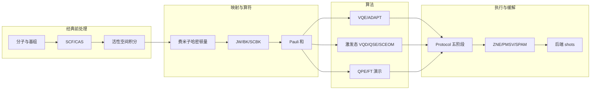
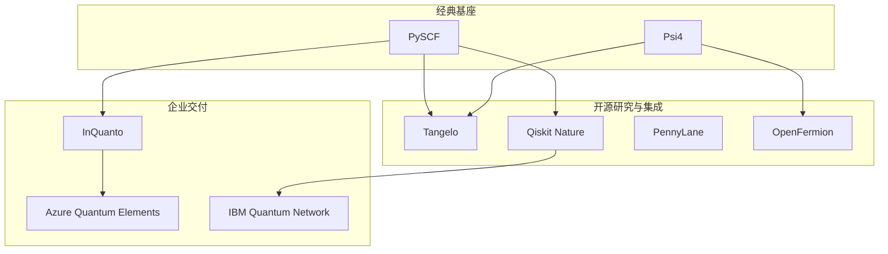
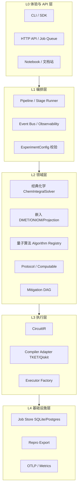
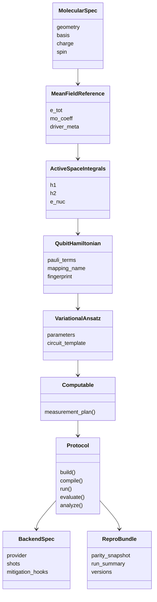
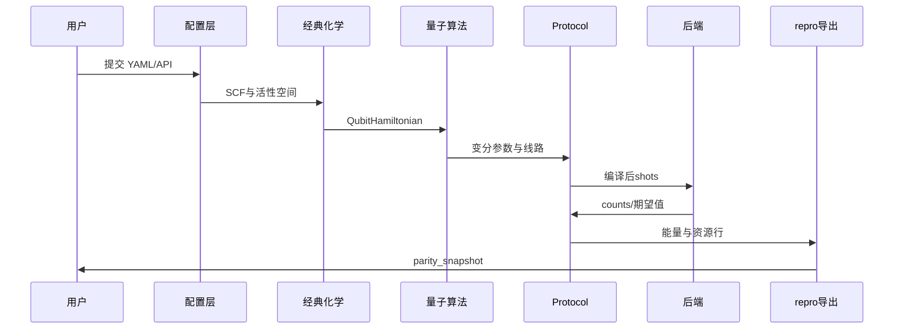

# 量子计算化学软件平台——行业与竞品调研报告

**文档类型**：行业与竞品调研（代码 + 文档双维度）  
**版本**：v1.0  
**日期**：2026-06-23  
**编制说明**：本报告基于 2024–2026 年公开资料、开源仓库结构分析与官方文档体系调研综合撰写，侧重行业格局、竞品架构与调研驱动的平台设计框架；非内部工程审计文档。

---

## 目录

1. [摘要](#摘要)
2. [调研背景、目的与范围](#1-调研背景目的与范围)
3. [调研方法与信息源](#2-调研方法与信息源)
4. [行业概览与市场格局](#3-行业概览与市场格局)
5. [技术演进与关键科学-工程挑战](#4-技术演进与关键科学-工程挑战)
6. [架构维度解构（跨竞品共性分析）](#5-架构维度解构跨竞品共性分析)
7. [竞品全景与分类](#6-竞品全景与分类)
8. [重点竞品深度调研](#7-重点竞品深度调研)
9. [调研驱动的量子计算化学平台架构设计框架](#8-调研驱动的量子计算化学平台架构设计框架)
10. [能力对比矩阵（行业视角）](#9-能力对比矩阵行业视角)
11. [趋势、风险与战略启示](#10-趋势风险与战略启示)
12. [结论与建议](#11-结论与建议)
- [附录 A：参考资料](#附录-a参考资料)
- [附录 B：术语表](#附录-b术语表)
- [附录 C：竞品链接索引](#附录-c竞品链接索引)

---

## 摘要

量子计算化学（Quantum Computational Chemistry, QCC）软件正处于 NISQ（Noisy Intermediate-Scale Quantum）硬件与经典电子结构方法深度耦合的产业化窗口期。本报告对全球主要量子计算化学软件平台开展代码仓库与官方文档的双轨调研，覆盖 Quantinuum InQuanto/Nexus、SandboxAQ Tangelo、IBM Qiskit Nature、Xanadu PennyLane/Catalyst、Microsoft Azure Quantum Elements、Google OpenFermion/Cirq，以及 PySCF、Psi4 等经典桥接生态。

调研发现，行业竞争焦点已从「能否演示变分量子本征求解器（VQE）」转向**工作流可信度、算法可组合性、后端可替换性与 Methods 可审计性**。商业全栈平台（InQuanto、Azure Quantum Elements）以对象化 Protocol 与云作业闭环占据企业预算；开源工具包（Tangelo、Qiskit Nature）承载算法创新与社区扩散；经典程序（PySCF、Psi4、ORCA）仍是所有量子工作流的**真理基线**来源。各平台在经典–量子边界、编排模式、repro 契约与扩展模型上呈现可归纳的架构分野。

基于上述发现，本报告提出一套**调研驱动的量子计算化学平台架构设计框架**，包含八项设计原则、五层参考架构、关键抽象边界、工作流编排模式、云与可观测性模式、扩展插件模型。该框架旨在为平台立项与 RFC 提供「行业 so what」，而非替代具体实现细节。

**核心结论**：可信编排胜过不可审计的算法清单；活性空间与嵌入决策的可辩护性、测量与缓解的可组合性、编译与后端的中立性，构成 NISQ 时代软件平台的共同护城河。建议平台路线以配置即契约、后端工厂化、Protocol 阶段化、repro 机读化为设计主轴，在开源审计与区域硬件适配场景建立差异化，而非追求闭源二进制等价或 Copilot 式黑盒入口。

**读者导航**：第 3–4 章把握市场与科学-工程挑战；第 5–7 章理解竞品架构分野；第 8 章为架构设计核心交付；第 9–11 章支持选型、战略与结论。附录提供引用、术语与链接索引。

---

## 1. 调研背景、目的与范围

### 1.1 行业背景

量子计算化学处于「经典电子结构 + 量子算法 + 云/HPC 编排」三域交叉点。NISQ 时代，产业与学术界的共同问题是：**如何把分子电子结构问题可靠地映射为可在现有量子硬件或高保真模拟器上执行的变分/相位估计工作流**，并在药物发现、催化剂设计、电池材料、聚合物与 MOF 等场景中获得可辩护的科学结论。

据公开市场研究，全球量子化学相关软件与服务市场在 2025 年估值约 **18 亿美元**，预计 2026–2034 年复合年增长率约 **11%**，2034 年有望达到 **46 亿美元**量级（来源：DataIntelo《Quantum-Chemistry Software Market Research Report 2034》）。增长驱动力包括：制药企业缩短先导化合物筛选周期、材料科学对强关联体系的建模需求、云化 HPC 与量子云 API 的可及性提升，以及 AI 与量子力学数据耦合的新范式。

与本领域直接相关的技术趋势包括：

- **混合经典–量子流水线**成为默认形态：活性空间选取、费米子–量子比特映射、变分 ansatz、测量分组、误差缓解、编译与 shots 调度各自独立演进，需要统一编排层。
- **商业全栈平台**（Quantinuum InQuanto + Nexus、Microsoft Azure Quantum Elements）与 **开源工具包**（Tangelo、Qiskit Nature、PennyLane）并存；用户往往在「产品化模型」与「研究灵活性」之间取舍。
- **可复现性与 Methods 可审计性**上升为论文与工业合规的硬需求：几何、基组、活性空间、映射、shots、缓解、编译门集、经典基线必须在单一配置中可追溯。

### 1.2 调研动因

量子计算化学软件平台立项与产品化，需要一份**行业与竞品调研**，供架构 RFC、Methods 写作、合作方 onboarding 与技术路线评审引用。本报告将分散于各厂商文档与开源仓库中的架构模式提炼为可比较的分析框架，并进一步给出平台设计原则。

### 1.3 调研目的

| 序号 | 目的 | 可交付用途 |
|------|------|------------|
| P1 | 厘清全球量子计算化学软件生态与细分市场 | 立项与资源分配 |
| P2 | 从**代码仓库结构**与**官方文档体系**双维度解剖主要竞品 | 架构与 API 设计 |
| P3 | 建立行业能力对比矩阵与架构共性分析 | 产品路线与对标基准 |
| P4 | 导出调研驱动的平台架构设计框架 | 技术白皮书、RFC 引用 |
| P5 | 识别趋势、风险与战略启示 | 决策与合规 |

### 1.4 调研范围

**时间范围**：侧重 2024–2026 年公开版本与文档；历史脉络（OpenFermion 2017、Qiskit Nature 分拆等）仅作架构溯源。

**地理与语言**：以欧美与中国可见的英文官方文档为主；部分区域云（UQC 等）纳入观察。

**竞品清单**（必覆盖）：

| 类别 | 代表 |
|------|------|
| 商业量子化学全栈 | Quantinuum InQuanto、Nexus |
| 云原生化学+HPC+量子 | Microsoft Azure Quantum Elements |
| IBM 开源化学栈 | Qiskit Nature、Qiskit Algorithms、IBM Quantum Platform |
| 可微分混合量子编程 | PennyLane、Catalyst（Xanadu） |
| Google 量子化学基础库 | OpenFermion、Cirq、OpenFermion-Cirq |
| 开源端到端化学 workflow | Tangelo（SandboxAQ） |
| 经典电子结构 + 桥接 | PySCF、Psi4、ORCA、NWChem、Q-Chem |
| 区域/专用云 | UQC、Amazon Braket 化学案例 |

**不在范围**：闭源内核的逐行反编译、未公开 API 的数值二进制等价对标、纯量子硬件物理层细节。

---

## 2. 调研方法与信息源

### 2.1 代码层调研方法论

对**开源**竞品，采用统一检查单：

1. **仓库拓扑**：monorepo vs 多包；`setup.py`/`pyproject.toml` extras；插件入口（entry points）。
2. **经典–量子边界**：分子/积分对象类型；谁负责 JW/BK 映射；哈密顿量是否 lazy。
3. **算法层**：VQE/ADAPT/激发态/QPE 是否一等类；ansatz 注册表；算符池。
4. **执行层**：Simulator vs QPU adapter；shots、分组、缓解插槽。
5. **工作流编排**：脚本式 vs Pipeline vs Protocol 状态机；是否内置 job store。
6. **扩展模型**：官方 extensions（InQuanto-PySCF）、optional deps（Tangelo 后端）、provider 插件。

对**闭源**竞品（InQuanto 核心 wheel），代码层调研限于：

- 公开 GitHub 附属包（`pytket`、`pytket-quantinuum`、`qnexus` 客户端）
- 文档中的类型名、阶段名、示例代码
- AWS/微软博客中的部署与 API 片段

### 2.2 文档层调研方法论

对每个竞品记录：

| 维度 | 检查项 |
|------|--------|
| 信息架构（IA） | 是否分 Chemistry / Algorithms / Execution / Cloud |
| API Reference | Sphinx/ReadTheDocs 完整度；类型注解与版本钉扎 |
| 教程路径 | Quickstart → Tutorial → Hardware；是否独立 examples 仓库 |
| 科学验证 | 同行评审论文、benchmark 表、与经典 FCI/CCSD(T) 对照 |
| 版本与变更 | Changelog、deprecation 政策（Cirq 1.0 语义化版本等） |

### 2.3 架构分析方法论

在代码与文档双轨基础上，采用**架构切片**法：将各平台分解为经典化学层、映射层、算法层、协议/编排层、编译层、执行层、云作业层、repro 层，识别共性模式与分野原因。分野原因分析侧重：**为何 InQuanto 选择 Protocol 对象**、**为何 Tangelo 选择 Solver 字典**、**为何 Qiskit Nature 统一到 second_q**、**为何 PennyLane 选择 QNode 可微分**——这些选择背后的用户场景与工程约束。

### 2.4 外部信息来源

- 厂商官网与产品页（Quantinuum、IBM、Microsoft Azure、Xanadu、Google Quantum AI）
- 开源仓库 README、release notes（GitHub）
- 行业博客（AWS Quantum、Microsoft Azure Quantum Blog）
- 市场研究报告摘要（DataIntelo 等，用于量级估计，非精确财务审计）
### 2.5 调研局限性与质量保证

**局限性**：（1）闭源盲区——InQuanto 核心与私有 TKET pass 无法代码验证；（2）版本漂移——竞品更新快，读者应核对附录 C 当前版本；（3）市场数据为第三方估算，非审计财务；（4）矩阵标签为主观判断，非绝对排名。

**质量保证**：（1）每个重点竞品均覆盖代码结构与文档；（2）架构结论可追溯到第 5 章切片与第 7 章深读；（3）第 8 章框架条目均标注行业证据来源；（4）建议每半年修订，与竞品 release notes 同步。

### 2.6 调研维护节奏建议

| 频率 | 动作 |
|------|------|
| 每月 | 浏览 InQuanto/Tangelo/Qiskit release notes |
| 每季度 | 更新第 9 章矩阵与附录 C URL；选取 1 个竞品教程复现为 config 样例 |
| 每半年 | 复审第 10 章趋势；更新第 7 章版本注记 |
| 每年 | 全文修订版本号；重新统计汉字规模；归档 PDF |

### 2.7 代码阅读清单（工程师两周扫读）

| 优先级 | 仓库 | 关键目录 | 产出 |
|--------|------|----------|------|
| P0 | qiskit-community/qiskit-nature | `second_q/` | Problem-Solver 对照笔记 |
| P0 | sandbox-quantum/Tangelo | `algorithms/`, `linq/`, `problem_decomposition/` | Solver 参数表 |
| P1 | Quantinuum/pytket | examples, compile API | 编译链笔记 |
| P1 | PennyLaneAI/pennylane | `pennylane/qchem` | 可微分边界 |
| P2 | quantumlib/OpenFermion | transforms, plugins | 互操作映射 |
| P2 | pyscf/pyscf, psi4/psi4 | mcscf, driver | 经典桥接边界 |

---

## 3. 行业概览与市场格局

### 3.1 市场与应用场景

**制药与生命科学**：量子化学软件用于结合能、构象、反应路径与 ADMET 相关描述符的第一性原理估算。传统先导优化单分子成本可达 **26 亿美元 / 12 年**量级（行业常引数据）；即使量子优势尚未在大分子上兑现，企业仍投资「量子就绪」工作流，以便在硬件跨越阈值时无缝切换。Quantinuum 与 AstraZeneca、Amgen 等合作；Azure Quantum Elements 强调制药场景与材料案例。

**材料与能源**：催化（ORR、固氮）、电池电解质、MOF 碳捕集、钢铁微观结构（Nippon Steel + InQuanto 公开案例）、聚合物设计。材料体系往往需 **嵌入（embedding）** 或 **片段化（fragmentation）** 才能映射到 NISQ 比特预算。

**学术与国家安全**：强关联电子、锕系、高温超导模型等更偏「容错量子 + 相位估计」时间线；软件栈需同时服务 NISQ 变分与 FT-QPE 资源估算。

### 3.2 生态位划分

横轴：**开源 → 商业闭源**；纵轴：**库/框架 → 端到端平台**。坐标为调研团队主观刻度（0–1），用于讨论而非定量排名。

| 产品 | 开源倾向 (x) | 平台化程度 (y) | 象限 |
|------|-------------|-------------|------|
| InQuanto | 0.85 | 0.90 | 商业全栈平台 |
| Azure Quantum Elements | 0.80 | 0.85 | 商业全栈平台 |
| Tangelo | 0.20 | 0.65 | 开源编排 + 云类比 |
| Qiskit Nature | 0.15 | 0.55 | 开源算法库 |
| PennyLane | 0.10 | 0.40 | 开源算法库 |
| PySCF | 0.05 | 0.30 | 开源算法库 |

```text
端到端平台 (y=1)
  ^
  |  quadrant-2          quadrant-1
  |  开源编排+云类比      商业全栈平台
  |       Tangelo         InQuanto, Azure Q Elements
  |
  |  quadrant-3          quadrant-4
  |  开源算法库           云+HPC+AI 套件
  |  PySCF, PennyLane,    (本报告未单独标出代表产品)
  |  Qiskit Nature
  |
开源 (x=0) -------------------------------- 商业闭源 (x=1)
库/框架 (y=0)
```

### 3.3 竞争格局动态（2024–2026）

2024–2026 年间，行业出现三个明显动向：

1. **逻辑比特与纠错演示**进入化学叙事（Microsoft–Quantinuum 催化中间体案例），改变公众对「量子化学实用化时间表」的预期，但对 NISQ 软件栈的直接影响有限——多数企业工作流仍以变分路径为主。
2. **大模型 Copilot** 进入 Azure Quantum Elements 等产品，降低脚本编写门槛，但增加 Methods 审计难度——可复现配置比 LLM 生成代码更值得信赖。
3. **SandboxAQ 继承 Tangelo** 后，开源工具包与商业服务之间的边界可能重构，需跟踪其是否推出托管云与 SLA 形态。

### 3.4 标准与互操作趋势

- **第二量子化 / fermionic operator** 作为跨库交换语义（Qiskit Nature `SparseLabelOp`、OpenFermion `FermionOperator`、Tangelo 内部表示）。
- **量子比特映射**（JW、BK、SCBK、HCB）直接影响线路深度与测量数；产品需 Methods 级导出映射名与活性空间元数据。
- **Primitives**（Estimator/Sampler）成为 IBM、部分 PennyLane 路径的事实接口；编排层需抽象后端规格而非硬编码单一模拟器。
- **作业与资产模型**（Nexus 项目/作业、各云 queue API）关系企业 adoption。

### 3.5 细分市场穿透

**制药**：NISQ 设备能处理的电子数远小于单个药物分子，**嵌入与片段化**是产品能力核心，而非可选高级功能。

**材料**：客户愿意投资长周期量子试点，前提是每次试点都有可发表的 Methods 与可对比的经典强相关基线（CCSD(T)、NEVPT2、DMRG 等）。

**流程工业**：量子计算在可预见的 NISQ 窗口内多作用于单步电子结构，而非完整反应网络；Azure AutoRXN 等工具属于经典+HPC 叙事。ONIOM/QM-MM 与能量分项账本面向「局部量子精度 + 大环境经典」的混合，与流程工业需求部分对齐，但需更多真实溶剂模型（显式溶剂、连续介质）才能进入工业对话。

#### 3.5.1 制药与生物技术（扩展）

制药行业是量子化学软件最大的单一应用细分之一。传统先导化合物优化依赖经典分子力学、半经验量子力学与 DFT 的分层策略；量子计算被寄望于在**强关联活性位点**（如金属酶中心、共价反应过渡态附近）提供超越 DFT 的关联处理。Quantinuum 与 AstraZeneca、Amgen 的合作公开强调「量子就绪」工作流建设；Azure Quantum Elements 在制药场景强调 Generative Chemistry 与 Accelerated DFT 缩短早期设计循环。

制药用户最看重的往往是：（1）能否与 PySCF/Psi4 现有脚本共存；（2）能否导出审计友好的 repro JSON；（3）能否在自有云或混合云部署 API。InQuanto 的 Nexus 云满足（3）的厂商托管形态，但不一定满足（2）的完全开放审计——这是开源配置驱动平台的结构性机会。

#### 3.5.2 材料科学与能源（扩展）

材料领域关注晶体、表面、缺陷与无限体系。经典方面，VASP、Quantum ESPRESSO、ORCA 占据主导；量子计算切入点通常是**小超胞活性空间模型**或**杂质中心**。电池电解质、固态离子导体、催化材料（MOF、单原子催化）在公开案例中反复出现。InQuanto 与 TotalEnergies、Nippon Steel 的案例表明：材料客户愿意投资**长周期**量子试点，前提是每次试点都有可发表的 Methods 与可对比的经典强相关基线（CCSD(T)、NEVPT2、DMRG 等）。

#### 3.5.3 化学制造与流程工业（扩展）

流程工业更关注反应网络、动力学与溶剂效应。量子子问题多作用于局部活性位点电子结构；完整反应网络仍由经典 kinetics/HPC 承担。平台应支持 ONIOM/QM-MM 能量分项与经典溶剂模型 delegate，而非承诺「整厂量子化」。

#### 3.5.4 学术教育与国家科研基础设施（扩展）

高校课程与国家级超算中心更青睐开源栈与可复现作业。中文用户向教程与 strict repro 适合作为国内量子信息+化学交叉课程的实验编排参考，但需避免将 capability 对标表误解为「已全部实现商用能力」——教学材料应强调 NISQ 限制与活性空间主观性。

**学术教育（总述）**：Tangelo、Qiskit、PySCF 组合降低教学门槛；课程设计强调从经典 exact → VQE → shots → 缓解的递进路径。国内高校量子信息+化学交叉课程更青睐开源栈与可复现作业，但中文用户向教程与本土硬件案例仍明显不足——这构成区域化产品的潜在空间，而非单纯翻译英文文档即可填补。

### 3.6 采购决策与团队技能画像

企业评估「量子计算化学平台」时，常见决策因子包括：（1）是否已有 IBM/Quantinuum/Azure 云合同；（2）是否需要闭源 SLA 与单点支持；（3）是否必须将 Methods 数据留在自有审计边界；（4）团队熟悉 Python 还是 GUI/Notebook；（5）是否需要与现有 PySCF/ORCA 流水线集成。

| 若优先… | 倾向选择… |
|---------|-----------|
| 硬件闭环与 SLA | InQuanto + Nexus |
| IBM 量子网络 | Qiskit Nature + Runtime |
| 开源算法广度 | Tangelo |
| 可微分+QML | PennyLane |
| AI+HPC 一体 | Azure Quantum Elements |
| 自有 repro+区域硬件 | 配置驱动开源编排 + 区域云 |

**团队技能画像**：量子算法工程师应熟悉 Tangelo/InQuanto 文档中的 ansatz 与 pool 语义；经典化学工程师应精通 PySCF/Psi4 活性空间与积分导出；平台/DevOps 需理解 Nexus/IBM Runtime 作业模型；Methods 作者需掌握判据表字段与 repro 导出语义。平台设计应通过 **角色化 onboarding**（化学家 YAML 路径、开发者 SDK 路径、运维 API 路径）降低跨职能摩擦，InQuanto 三柱文档是这一思路的商业范例。

---

## 4. 技术演进与关键科学-工程挑战

### 4.1 技术代际与能力边界

行业常用三阶段框架（综合 Entangled Future、IBM、Quantinuum 公开叙事）：

| 阶段 | 时间（约） | 量子资源 | 化学能力 | 代表平台 |
|------|------------|----------|----------|----------|
| NISQ 混合 | 现在–2027 | 50–200 物理比特 / 有限逻辑深度 | H₂、LiH、BeH₂ 等小分子；近似基态/激发态 | InQuanto、Qiskit Nature、Tangelo、PennyLane |
| 早期纠错 | 2027–2030 | 数十逻辑比特 | 更大活性空间、更可靠采样 | Quantinuum H2 逻辑比特演示、Azure + Quantinuum 联合化学案例 |
| 容错实用 | 2030+ | 大规模逻辑比特 | 工业相关体系常规量子化学 | 尚未有商用闭源等价物 |

当前竞争焦点在 **工作流可信度、算法广度、多后端、嵌入与缓解**，而非单点「量子优越性」营销。

### 4.2 科学挑战：活性空间与嵌入

活性空间（active space）选择是量子计算化学中**最具主观性**的环节。常见策略包括：化学直觉选取 π 轨道；基于占居数/能量的截断；AVAS 等从原子轨道投影；FNO 基于自然轨道占居；DMET 下的 fragment 局域活性空间。InQuanto 与 Tangelo 均在文档中强调应报告经典参考能量与活性空间定义。

**行业最佳实践**：任何量子结果必须同时给出 RHF/DFT 参考能量、活性空间轨道列表或等价哈希、映射名称。软件平台若不固化这一契约，Methods 写作将长期依赖用户手工记录，增加审计风险。

**嵌入与大体系**：DMET（Density Matrix Embedding Theory）将体系划分为 fragment 与环境，迭代求解直至密度矩阵自洽；projection embedding 将环境效应投影到活性空间有效哈密顿量；ONIOM/QM-MM 将量子区域嵌入分子力学环境。InQuanto 与 Tangelo 均提供 DMET 叙事；Azure 三阶段管道（AI 粗筛 → Accelerated DFT → 量子子问题）在哲学上与片段化一致。

### 4.3 科学挑战：映射与线路深度

| 映射 | 线路深度倾向 | 测量复杂度 | 行业采用 |
|------|--------------|------------|----------|
| Jordan-Wigner | 高 | 中 | 全平台默认 |
| Bravyi-Kitaev | 中 | 中 | InQuanto、Tangelo 产品化 |
| SCBK | 低（对称性） | 中 | InQuanto、Tangelo 材料场景 |
| HCB/JKMN | 研究 | 研究 | 文档/论文级 |

BK/SCBK 对 UCCSD 线路合成的影响在于费米子激发算符的 Pauli 展开结构；行业普遍将**哈密顿量映射**与 **UCCSD 粒子守恒线路**作为可分离的设计决策——InQuanto 文档明确区分 spaces/mappings 与 Algorithm.build 阶段。

### 4.4 工程挑战：测量、缓解与统计契约

NISQ 设备需要误差缓解。InQuanto 叙事含 PMSV、ZNE、SPAM 与 Qermit 产品图；Tangelo 含 post-selection、Richardson、classical shadows 等。跨竞品共性：（1）哈密顿量 Pauli 分解；（2）分组（commuting groups）以降低电路数；（3）每电路 shots 分配；（4）协方差或保守界估计 stderr。

**工程难点**：商业云可能根据实时方差动态 realloc shots；开源栈多为静态 shots 计划。Methods 必须说明是否使用缓解、缓解顺序（ZNE 在前还是 PMSV 在前），以及 stderr 模型假设。

### 4.5 工程挑战：多后端与编译异构

**离子阱（Quantinuum H-Series、UQC 等）**：全连接或近全连接拓扑、原生门集与超导不同；Methods 应报告转译链与 optimization level。

**超导（IBM Heron 等）**：需要密集 SWAP 路由；Qiskit transpiler 为主。

**TKET/pytket**（Quantinuum 生态）：chemically aware 编译、rebase、路由；InQuanto 教程强调 build 保留 pytket boxes，compile 阶段统一优化。

编排层若不抽象 BackendSpec，将在硬件路线分裂（超导/离子阱/中性原子）下遭遇指数级适配成本。

### 4.6 容错量子计算（FTQC）与化学软件栈接口

虽然 NISQ 是近期主力，Azure 与 Quantinuum 已将**逻辑比特相位估计**写入化学叙事。软件栈应为 FT 场景预留三类接口，而非将 QPE demo 与生产变分路径混为一谈：

1. **资源估算**：线路 T 门/ Clifford 深度、逻辑比特数——对标 Azure Resource Estimator 概念，输出应标注为「演示级」或「生产级」。
2. **问题规模标注**：论文 Methods 应明确哪些步骤在 FT 之前仍用经典 CCSD(T)，避免读者将 demo QPE 能量等同于工业催化能垒。
3. **Sidecar 集成**：主配置树服务 NISQ 变分；QPE/FT 通过 sidecar 或 demo track 触发，并在 repro 中写入 `qpe_demo_track_ran` 等分阶段键。

Qiskit Nature 与 Tangelo 均含 QPE/iQPE 教程；InQuanto 文档含 QPE 族 Algorithm。共性教训：**FT 能力应 interface-ready，但 Methods 叙事必须与 NISQ 主路径隔离**。

### 4.7 数据治理与 FAIR 原则

计算化学日益要求数据 FAIR（可发现、可访问、可互操作、可重用）。repro JSON、config SHA、包版本列表支持 FAIR 中的互操作与可重用；缺口在 DOI 自动 mint 与 Zenodo 发布流水线。竞品商业云将作业历史存储于厂商域，用户导出能力取决于合同——开源栈优势是 repro 文件可随论文存入机构仓库。平台设计应将 **repro bundle schema 版本化**，并支持一键导出 BibTeX 软件引用条目。

### 4.8 工业叙事案例与软件能力映射（方向性）

公开工业案例并不等价于「软件已内置模板」，但揭示 **客户期望的工作流形状**：

| 公开案例 | 化学体系 | 软件叙事要点 | 对平台架构的要求 |
|----------|----------|--------------|------------------|
| BMW ORR（InQuanto） | 氧还原相关物种 | 工业相关体系严谨建模第一步 | 基态 VQE + 嵌入 + Methods |
| TotalEnergies MOF | 金属有机框架 | 片段化 + 经典对照 | DMET/ONIOM + CCSD(T) 基线 |
| Nippon Steel | 钢铁微观结构 | 长周期试点 + 可发表 Methods | repro + 多阶段 pipeline |
| Azure 催化中间体 | 逻辑比特 QPE | HPC+AI+量子协同 | FT demo 与 NISQ 隔离 |
| AstraZeneca/Amgen | 量子就绪工作流 | 不承诺即时量子优势 | 配置驱动切换硬件 |

平台不应内置未授权的真实工业体系，但可发布 **叙事 YAML 模板**（参数化 H₂/LiH 类比体系）演示同等 workflow 阶段——InQuanto AWS 教程对 ORR 物种的处理方式是 **叙事密度** 的标杆。

---

## 5. 架构维度解构（跨竞品共性分析）

本节给出跨竞品比较的**架构切片**，作为第 7 章深度分析与第 8 章设计框架的基础。

### 5.1 经典化学层

| 能力 | 典型实现 | 设计要点 |
|------|----------|----------|
| 几何与基组 | PySCF `gto.M`、Psi4 `molecule()`、ORCA `.inp` | 是否支持 ECP、PBC、溶剂模型 |
| SCF/DFT | RHF/ROHF/UKS、DFT 泛函 | 是否作为量子参考态唯一来源 |
| 活性空间 | CASCI/CASSCF、AVAS、FNO、手动 `(nelec, norb)` | 决策必须可复现 |
| 积分导出 | MO 积分、h1/h2、核排斥 | 标准交换物（如 CanonicalActiveSpaceIntegralPack 类语义） |
| 嵌入 | DMET、projection、ONIOM/QM-MM | 经典–量子接口是否在 fragment 边界清晰 |

**架构洞察**：InQuanto 通过 PySCF extension 复用经典能力；Tangelo 内置 PySCF/Psi4 driver；Qiskit Nature 通过 second_q drivers 产生 `ElectronicStructureProblem`。共性是**不重复实现积分**，而是将经典程序作为「化学操作系统」——PySCF 的模块化设计（`gto`、`scf`、`mcscf`、`cc`、`pbc`）成为事实标准。

**设计启示**：平台应定义 **ChemIntegralSolver 抽象**，使下游编排不假设特定经典后端；预计算积分（precomputed）模式应为一等路径，支持企业已有 DFT 流水线接入。

### 5.2 映射与算符层



OpenFermion 的 `FermionOperator` → `QubitOperator` 转换函数是大量开源工具的 lingua franca；Qiskit Nature 统一到 `SparseLabelOp` + `QubitMapper`；Tangelo 在 toolboxes 中并列多种映射。行业趋势是**映射注册表化**，而非硬编码 JW。

### 5.3 工作流编排层

竞品编排模式可归纳为：

| 模式 | 代表 | 优点 | 缺点 | 适用场景 |
|------|------|------|------|----------|
| **对象 Protocol** | InQuanto `Computable`+`Protocol` | 阶段清晰、资源表统一 | 闭源、学习曲线陡 | 企业 Methods 审计 |
| **Solver 类 + dict 配置** | Tangelo `VQESolver({...})` | 上手快、研究灵活 | Methods/repro 弱 | 学术原型 |
| **Problem + Algorithm 注入** | Qiskit Nature `GroundStateEigensolver` | 与 IBM primitives 对齐 | 化学嵌入需自己拼装 | IBM 生态 |
| **可微分 QNode** | PennyLane | ML 耦合强 | 化学一等对象较少 | QML/优化 |
| **配置驱动 Pipeline** | 新兴开源编排平台 | 配置即契约、可审计 | 社区教程建设成本高 | 合规部署 |

**架构洞察**：InQuanto 将「程序构造」与「执行分析」显式分离——用户在构造阶段完成分子、活性空间、算法绑定；执行阶段才涉及后端、shots、缓解。这一分离对 Methods 写作极其重要；早期开源脚本往往将活性空间选择与 ansatz 绑定混在单脚本中，导致变更不可追溯。

### 5.4 编译与后端层

- **TKET/pytket**：chemically aware 编译、rebase、路由；Quantinuum 生态核心。
- **Qiskit transpiler**：IBM 路径标准件；optimization level 影响 repro。
- **多后端适配**：Tangelo `linq` 提供后端无关线路对象再翻译；PennyLane devices 插件化。

**设计启示**：引入 **CircuitIR**（或等价中间表示）作为编译前语义层，避免编排直接依赖 pytket/Qiskit 原生类型，便于资源统计与多后端 conformance 测试。

### 5.5 云集成与作业层

| 平台 | 模型 | 特征 |
|------|------|------|
| Nexus / qnexus | 项目、作业、HQC | 编译产物上传、队列、计费一体化 |
| IBM Quantum | Queue + Runtime | Primitives 服务化 |
| Azure Quantum | 资源估算 + Quantinuum/IonQ | HPC+AI 集成 |
| 自托管开源 | FastAPI + SQLite/Postgres | 数据主权、可定制 |

**架构洞察**：企业 adoption 不仅取决于算法，还取决于**作业资产模型**——同一逻辑实验的多次提交、编译产物版本化、结果检索与账单关联。Nexus 将这一模型产品化；开源栈多停留在「脚本跑完即结束」。

### 5.6 可复现性与 Methods 导出

竞品差异最大的「隐性架构」是 **repro 契约**：

| 平台 | repro 形态 | 强度 |
|------|------------|------|
| InQuanto | 资源 DataFrame、Protocol 计数（公开文档层） | 中–高（闭源细节不可审计） |
| Tangelo | 用户自行记录参数 | 低 |
| Qiskit Nature | 用户自行维护版本钉扎 | 低–中 |
| PennyLane | 实验脚本 + 手动记录 | 低 |
| 配置驱动平台 | JSON/YAML snapshot + 版本哈希 | 高（若设计得当） |

**行业教训**：Qiskit Nature 0.5+ 经历较大 API 迁移，统一到 `second_q` 模块——**domain 包的公开 API 必须版本化且 changelog 严格**，否则编排平台对接成本激增。

### 5.7 跨竞品端到端数据流对比

从「用户输入」到「Methods 可引用结果」，各平台数据流长度与审计点数量差异显著：

**InQuanto 路径**：分子规格对象 → PySCF extension 积分 → FermionSpace → Algorithm.build → Computable 绑定 → Protocol.build/compile → Nexus 上传 → run → evaluate（含缓解）→ analyze → DataFrame 导出。审计点：每阶段有文档化类型名；云侧作业 ID 关联编译产物。

**Tangelo 路径**：分子 dict → SecondQuantizedMolecule → VQESolver 构造 → linq 线路 → backend.simulate → 用户 notebook 记录。审计点：少；参数散落在 Python dict。

**Qiskit Nature 路径**：Driver → ElectronicStructureProblem → Mapper → VQE+Estimator → Runtime job → 结果。审计点：Problem 对象可序列化部分字段；repro 需用户维护。

**PennyLane 路径**：qchem 哈密顿量 → QNode → 可微优化 → device.execute。审计点：优化 trace 在 ML 框架侧，化学 Methods 需额外提取。

**架构结论**：InQuanto 路径审计点最多但闭源；开源平台若要在 Methods 上竞争，必须在 **配置层与 repro 层** 补全 Tangelo/Qiskit 缺失的审计点，而非在算法数量上单纯追赶。

### 5.8 信息架构（IA）对比

| 平台 | 文档顶层分区 | 教程形态 | API 参考完整度 |
|------|-------------|----------|----------------|
| InQuanto | 化学规格 / 程序构造 / 执行分析 | How-to + 扩展包 | 高（闭源类型） |
| Tangelo | Overview / Tutorials / API | Colab + 独立 examples 仓库 | 中 |
| Qiskit Nature | second_q 模块树 | IBM Lab 递进 | 高 |
| PennyLane | qchem / devices / gradients | QML 为主 | 高（化学弱） |
| AQE | Learn + Blog | 企业案例 | 低（SDK 片段） |
| OpenFermion | transforms / hamiltonians | 论文+notebook | 中 |

### 5.9 Pauli 分组、shots 与统计契约（跨竞品深读）

哈密顿量表示为 Pauli 串和后后，**测量分组**将互相对易的 Pauli 项合并为同一电路基底的联合测量，从而降低电路次数。InQuanto 与 Qiskit 均内置 grouping；Tangelo toolboxes 含 measurement reduction 教程。行业实践三类 shots 分配策略：

1. **均匀 shots**：实现简单；stderr 用 conservative union bound。
2. **按系数加权**：大系数 Pauli 项分配更多 shots；需报告权重规则。
3. **按方差自适应**：商业云可能根据实时方差 early-stop；开源栈多为静态计划。

**Qiskit shots 路径** 通过 Estimator/Sampler 聚合；**InQuanto evaluate** 输出 DataFrame 形态 per-circuit 资源；**Tangelo** 依赖 backend 内部分配。平台应在 repro 导出 `pauli_grouping`、`shots_per_circuit`、`energy_stderr_model` 三字段，使 Methods 可复现统计假设。

**缓解与 shots 的交互**：PMSV 类缓解改变有效样本量；ZNE 要求多噪声尺度电路族。缓解 DAG 节点顺序（ZNE 在前 vs PMSV 在前）影响最终 stderr 解释——第 8 章 Mitigation DAG 原则源于 InQuanto Qermit 产品图与 Tangelo post-selection 文档的并集观察。

### 5.10 变分 ansatz 与算符池（跨竞品）

**UCC 族谱系**：UCCSD、UCCGD、UpCCGSD、pUCCD、QCC 等在不同文献中针对强关联与近邻关联平衡。Tangelo solver 菜单并列多种；InQuanto 强调 chemically aware 合成（激发 regrouping 降低 2Q 门，有 overhead trade-off）。

**ADAPT 与 IQEB**：ADAPT-VQE 通过梯度选择池中添加算符；IQEB 迭代添加 qubit excitation。二者均依赖 **operator pool taxonomy**——池 ID、梯度定义、收敛准则必须在 repro 中机读（`adapt_pool_id`、`iqeb_pool_id` 类字段）。

**粒子数守恒与对称性**：激发态算法（尤其 VQD）在竞品文档中强调粒子数守恒 ansatz 与对称性 filtering。平台 gap 清单常列此类 partial 项——架构上应预留 `symmetry_filter_strategy` 扩展点，而非 hardcode JW-only。

---

## 6. 竞品全景与分类

### 6.1 按产品形态分类

| 形态 | 产品/项目 | 许可证 | 典型用户 |
|------|-----------|--------|----------|
| 商业量子化学平台 | Quantinuum InQuanto | 商业 | 药企、材料巨头、量子云客户 |
| 量子云化学套件 | Azure Quantum Elements | Azure 订阅 | 企业 R&D、HPC+AI 团队 |
| 开源化学 domain 包 | Qiskit Nature | Apache-2.0 | IBM 生态研究者 |
| 开源端到端 workflow | Tangelo | Apache-2.0 | 学术、SandboxAQ 合作方 |
| 可微分量子框架 | PennyLane | Apache-2.0 | QML、优化、化学混合研究 |
| 费米子/线路基础库 | OpenFermion + Cirq | Apache-2.0 | 算法原型、Google 硬件路径 |
| 经典电子结构 | PySCF、Psi4、ORCA、NWChem | 各异 | 量子化学主流用户 |

### 6.2 按技术能力分类

| 能力维度 | 领先者（公开资料） | 说明 |
|----------|-------------------|------|
| 商业云闭环 | InQuanto + Nexus | HQC、作业、编译上传一体化 |
| 算法 ansatz 广度 | Tangelo | UCC 族、ADAPT 变体、QITE 等 |
| IBM 硬件路径 | Qiskit Nature + Runtime | Primitives、Estimator 路径成熟 |
| 自动微分混合 | PennyLane + Catalyst | JIT、GPU 模拟 |
| AI+HPC+量子叙事 | Azure Quantum Elements | Copilot、Accelerated DFT |
| 经典强相关基线 | PySCF、ORCA | CCSD(T)、NEVPT2 |
| Methods/repro 机读 | 新兴配置驱动平台 | parity/repro export 理念 |

### 6.3 竞争关系示意



### 6.4 量子计算化学 vs 传统量子化学软件

读者易混淆「量子计算化学软件」与「传统量子化学软件（quantum chemistry）」。后者指 PySCF、Gaussian、ORCA、VASP 等以经典算法求解薛定谔方程为主的程序；前者在本文中指面向量子计算机（或高保真模拟器）编排电子结构算法的软件，通常仍依赖后者产生积分与参考态。

| 类型 | 代表 | 主要输出 |
|------|------|----------|
| 经典量子化学 | PySCF、ORCA、VASP | 能量、梯度、性质 |
| 量子计算化学编排 | InQuanto、Tangelo | 线路、shots、量子能量估计 |
| 云科学套件 | Azure Quantum Elements | DFT+AI+量子混合流水线 |
| 基础库 | OpenFermion | 费米子/Pauli 数据结构 |

**任何量子计算化学平台都必须通过经典层输入保证化学正确性**；跳过经典验证的量子结果不应进入生产决策。架构上，经典程序是输入适配器；量子编排是测量与优化调度层——二者不可互换。

### 6.5 社区、许可与贡献模式

| 项目 | 许可证 | 贡献模式 | 商业实体 |
|------|--------|----------|----------|
| Tangelo | Apache-2.0 | GitHub PR | SandboxAQ |
| Qiskit Nature | Apache-2.0 | IBM+社区 | IBM |
| PennyLane | Apache-2.0 | Xanadu+社区 | Xanadu |
| OpenFermion | Apache-2.0 | Google | Google |
| PySCF | GPL-2.0 | 学术主导 | 多机构 |
| Psi4 | LGPL-3.0 | 社区 | 多机构 |
| InQuanto | 商业 | 厂商 | Quantinuum |

Apache-2.0 生态（Tangelo/Qiskit/PennyLane）利于互操作与上游贡献；GPL/LGPL 经典后端宜作为 optional extra 接入，避免污染核心编排 wheel 许可证。

---

## 7. 重点竞品深度调研

以下各节均含 **代码/仓库结构** 与 **文档体系** 两小节，侧重**架构选择及其原因**。

### 7.1 Quantinuum InQuanto / Nexus

#### 7.1.1 产品与定位

[InQuanto](https://www.quantinuum.com/products-solutions/inquanto) 是 Quantinuum 的量子计算化学商业平台，与 TKET、H-Series 离子阱、Nexus 云集成。公开叙事强调化学感知缓解、片段化大体系、cuTensorNet 收缩与 Nexus 全功能接入。

**Nexus** 提供项目/作业管理、编译产物上传、队列与 HQC 计费；`qnexus` 客户端公开，真机提交依赖合同。

#### 7.1.2 代码与模块结构（公开部分）

InQuanto 核心闭源；邻接开源包：`pytket`、`pytket-quantinuum`、`qnexus`、`pytket-cutensornet`、InQuanto-PySCF。

**对象模型**（文档层还原）：

- `FermionSpace`：化学规格与费米子空间
- `Algorithm*`：VQE、ADAPT、VQD、QSE、SCEOM、QPE 等
- `Computable`：定义测量计划上的线性/双线性泛函（能量、QSE 矩阵元、SCEOM M 矩阵元、VQD overlap 等）
- `Protocol` 五阶段：`build` → `compile` → `run` → `evaluate` → `analyze`
- `ProtocolList`：批跑与跨作业优化

**Program Construction 阶段的化学语义**：用户在构造阶段完成：（1）分子几何与电荷多重度；（2）基组与可选相对论/ECP；（3）经典 mean-field 与活性空间选择（含 AVAS、CASSCF 轨道优化等）；（4）费米子空间上的算符定义；（5）算法与 ansatz 绑定。执行阶段才涉及后端选择、shots、缓解与编译 pass。早期开源脚本往往将（3）（5）混在单脚本中，导致活性空间变更时难以追溯哈密顿量指纹——InQuanto 的文档 IA 是对这一问题的 **产品化回应**。

**Computable 类型学与测量复杂度**：Computable 不仅包含能量期望，还包含 QSE 的哈密顿量/重叠矩阵元、SCEOM 的 M 矩阵元、VQD 的 overlap 惩罚等。共同点是定义 **测量计划** 上的线性或双线性泛函，从而决定 shots 分配与分组策略。闭源 InQuanto 在 evaluate 阶段可能返回 pandas DataFrame 形态的资源与结果表；开源平台应对齐 **dataframe_circuit_shot** 语义导出，使 Methods 资源节可机械生成。

**架构选择分析**：Protocol 五阶段将**线路构造、编译优化、采样执行、后处理缓解、分析报告**解耦，使每一阶段可独立审计与替换后端。Computable 类型学将「测什么」与「怎么测」从 Algorithm 中分离——同一 UCCSD ansatz 可绑定不同 Computable（能量 vs QSE 矩阵 vs overlap），这是 InQuanto 激发态能力的产品化基础。

Extensions 生态（PySCF、Nexus、NGLView、Phayes、cuTensorNet）体现**「核心瘦、扩展肥」**打包策略：核心 wheel 不硬依赖 NVIDIA 商业库或云合同，降低企业安装门槛。

#### 7.1.3 文档体系

三柱 IA：**Chemical Specification** / **Program Construction** / **Execution and Analysis**。Extensions 分 PySCF、Nexus、可视化、Phayes、cuTensorNet。AWS 博客提供 Braket 部署教程。

**评价**：产品文档完整，How-to 与 API 交叉链接、扩展包版本钉扎、商业支持渠道构成企业级体验；闭源核心使第三方无法验证 evaluate 阶段内部实现，但 L1 契约（对象名、阶段名、示例代码）仍可吸收。

#### 7.1.4 典型用户旅程

销售对接 → 合同与 Nexus 账户 → 安装 wheel 与 PySCF 扩展 → 培训三柱文档 → Nexus 创建项目 → 本地 build Protocol → 上传编译产物 → 队列执行 → HQC 账单 → 下载 DataFrame 结果 → Methods 审查。摩擦点在于许可与云成本；优势在于 SLA 与支持网。

#### 7.1.5 为何 Protocol 五阶段是 InQuanto 的架构锚点

深入阅读 InQuanto 公开文档可知，五阶段并非 marketing 标签，而是**编译与采样职责的硬边界**：

- **build**：保留化学语义（UCC 激发、对称性），输出逻辑线路，可能含 pytket boxes 未展开形式。
- **compile**：chemically aware 优化、rebase 到后端门集、路由；此阶段资源计数（depth、2Q 门）才具有硬件意义。
- **run**：shots 调度、分组电路提交；与 compile 分离使「同一 compiled 线路多次 shots 扫描」成为一等用例。
- **evaluate**：原始 counts → 期望值、缓解 DAG 执行；Computable 类型决定 evaluate 输出 schema。
- **analyze**：人类可读报告、与经典基线对比、导出 DataFrame。

Tangelo 将 build+run 合并在 Solver.simulate() 中，降低 API 表面积但损失阶段级 repro。Qiskit Nature 通过 Estimator 回调模糊 run/evaluate 边界。PennyLane 在 QNode 内联执行。**InQuanto 的选择服务于企业 Methods 分项记账**——每一阶段耗时、资源、版本可写入审计日志。平台架构若目标 L3+ 成熟度，应显式建模阶段边界，即使开源实现不做 Nexus 式云上传。

#### 7.1.6 cuTensorNet 与 tensor 收缩扩展

InQuanto cuTensorNet 扩展面向大活性空间下 **张量网络收缩** 作为经典–量子混合加速路径。闭源边界使第三方无法复现收缩图优化，但公开叙事表明：当 qubit 数超越 NISQ 可执行范围时，商业平台仍用 **经典 TN 收缩** 兜底，而非强行上传全空间 VQE。这对平台 roadmap 的启示是：tensor network stub 或 cross-check 接口应标为 honest partial，而非伪造 yes。

---

### 7.2 Qiskit Nature / IBM Quantum

#### 7.2.1 代码结构

`qiskit_nature/second_q/`：`drivers`、`mappers`、`problems`、`circuit/library`、`algorithms`（`GroundStateEigensolver`、`QEOM`）。

工作流：`ElectronicStructureProblem` → `QubitMapper` → `VQE`+`UCCSD`+`Estimator`；激发态用 **qEOM**。

**架构选择分析**：Qiskit Nature 将自身定位为 **IBM Quantum 生态的化学 domain 包**，而非独立编排平台。Problem-Solver 注入模式与 Estimator/Sampler Primitives 深度绑定——对企业用户，「同一 Estimator 在 Simulator 与 Heron 处理器上接口一致」降低迁移摩擦。second_q 统一模块是 API 现代化结果，代价是 0.5+ 版本迁移成本。

#### 7.2.2 文档与生态

ReadTheDocs 教程链完整（01 Electronic structure → 04 Excited states QEOM）；IBM Quantum Lab 集成。教程 04 提供从 NumPyEigensolver（精确对角化）到 QEOM 的递进，是优秀的**验证链**写法。

**劣势**：嵌入 fragment 与 Methods repro 需用户自建；非 IBM 后端路径需额外拼装。

#### 7.2.3 与 IBM Quantum Platform 的关系

关键不在 Nature 包本身，而在 **Primitives + Runtime** 的服务化执行。编排平台若目标 IBM 路径，应抽象 Estimator 接口而非复制 Nature 内部逻辑。

#### 7.2.4 qEOM 与 QSE/SCEOM 路线分野

Qiskit Nature 的 QEOM 强调基态求解精度直接影响激发态精度；`excitations='sd'` 控制 singles/doubles 激发子空间；`EvaluationRule` 控制辅助算符求值规则。InQuanto/Tangelo 则走 QSE 矩阵、VQD deflation、SCEOM M 矩阵等 **Computable 正交路线**。数学上相关（均基于低能激发子空间），但 API 不同构。

| 维度 | QEOM (Qiskit) | QSE (InQuanto 等) |
|------|---------------|-------------------|
| 核心对象 | GroundStateEigensolver + QEOMDriver | QSEMatricesComputable |
| 基态依赖 | 强 | 强 |
| Shots 路径 | Estimator | Pauli 分组协议 |
| 文档验证链 | tutorial 01→04 递进 | How-to + DataFrame |

平台架构建议：**激发态以 Computable 矩阵路线为主接口**，QEOM 可作为 IBM 后端 adapter，而非重写数学核心。

---

### 7.3 PennyLane + Catalyst / Xanadu

#### 7.3.1 代码结构

`pennylane/qchem`、devices、gradients；`pennylane_lightning` C++ 模拟；**Catalyst** JIT 独立仓库。

模式：**QNode + 可微优化**，非 Protocol 状态机。Tangelo 可选 PennyLane 后端。

**架构选择分析**：PennyLane 将量子线路视为可微函数，优化环与 Jax/Torch 无缝结合——对变分能量梯度是天然优势。化学端到端非其主业；docs.pennylane.ai 强在 QML。Catalyst 将程序编译到 LLVM，显著加速模拟器参数扫描，适合「在线学习 + 量子标签」类混合场景，但化学产品化路径弱于 InQuanto/Tangelo。

#### 7.3.3 Catalyst JIT 与性能叙事

Catalyst 将 PennyLane 程序编译到 LLVM 等后端，显著加速模拟器上的参数扫描。Xanadu 宣传其在大规模混合训练中的优势。化学应用若进入「在线学习力场 + 量子标签」场景，Catalyst 类性能工具值得列入观察，但不应纳入化学 MVP 的硬依赖。架构上，Catalyst 路径与 Protocol 路径应 **并行 optional**，由 `backend.provider` 或独立 `ml_track` sidecar 触发。

#### 7.3.4 PennyLane 与 Tangelo/InQuanto 的关系

Tangelo 可选 PennyLane 作为 backend，说明 **PennyLane 在生态中常扮演 executor 而非 orchestrator**。InQuanto 不依赖 PennyLane。平台设计应学习这一分工：PennyLane device 是 BackendSpec 的一种 provider，化学对象生命周期仍在平台 L2 领域层。

---

### 7.4 Microsoft Azure Quantum Elements

#### 7.4.1 架构

托管服务：**Copilot**、**Generative Chemistry**、**Accelerated DFT**（宣称较 PySCF ~20×）、量子资源估算、Quantinuum/IonQ 接入。2024 逻辑比特催化案例：HPC+AI+量子三位一体。

**架构选择分析**：AQE 代表 **L5 科学云操作系统** 形态——不试图成为单一量子化学 SDK，而是将 DFT、AI 筛选、量子子问题编排纳入统一 Copilot 入口。三阶段管道：（1）AI 加速筛选与粗粒度建模；（2）Accelerated DFT 精化电子结构；（3）对强关联子问题调用量子硬件或逻辑比特演示。与 InQuanto「片段化」叙事异曲同工：**大体系不必整体上传量子设备**。

#### 7.4.2 文档与边界

Azure Blog / Learn；企业采购导向。非开源，代码级调研限于公开 SDK 片段。

**设计启示**：平台不应试图复刻 AQE 全栈，而应声明接收 **precomputed 活性空间积分或哈密顿量** 作为输入，使客户可在已有 AQE 或自建 DFT 流水线中插入量子子问题编排层。

#### 7.4.3 AQE 功能模块与量子子系统边界

| AQE 模块 | 功能 | 是否开源 | 编排层关系 |
|----------|------|----------|------------|
| Chemistry Copilot | LLM 工作流 | 否 | 不直接竞争 |
| Generative Chemistry | 分子生成 | 否 | 不直接竞争 |
| Accelerated DFT | 快速 DFT | 否 | 经典基线输入源 |
| Azure Quantum 硬件 | IonQ/Quantinuum | 否 | BackendSpec provider |
| Resource Estimator | FT 资源估算 | 部分开放 | QPE demo 概念对齐 |

#### 7.4.4 与 Quantinuum 联合案例的方法学意义

微软与 Quantinuum 公开的逻辑比特催化中间体计算，强调 HPC、AI、量子三者协同。Methods 写作启示：论文应明确**哪一步在经典、哪一步在量子、哪一步是演示级 QPE**；repro 分阶段键避免过度解读演示结果为生产结论。这是第 8 章「FT sidecar 隔离」原则的直接行业动因。

---

### 7.5 Google Cirq / OpenFermion

#### 7.5.1 代码与插件架构

OpenFermion：`FermionOperator`、映射、插件 PySCF/Psi4/Q-Chem。Cirq 1.0+ 语义化版本。

**架构选择分析**：OpenFermion 早于许多 domain 包采用「核心 + 插件」模式：OpenFermion-PySCF、OpenFermion-Psi4、OpenFermion-Cirq 各自独立版本。Cirq 1.0 起语义化版本承诺对编排平台意味着：编译与序列化应钉扎 Cirq 版本于 repro 元数据。

库级组合，无统一化学 Protocol——适合算法原型与 Google 硬件路径，不适合企业端到端 Methods 审计。

#### 7.5.2 互操作价值

`FermionOperator` 与 `QubitOperator` 转换是跨库交换的 lingua franca；平台应提供 **interchange adapter** 降低 OpenFermion/Tangelo 用户迁移成本，即使不硬依赖 OpenFermion 运行时。

#### 7.5.3 OpenFermion 插件生态清单

| 插件仓库 | 功能 | 架构启示 |
|----------|------|----------|
| OpenFermion-PySCF | PySCF 积分 | 经典桥接插件化 |
| OpenFermion-Psi4 | Psi4 积分 | 双驱动交叉验证 |
| OpenFermion-Cirq | Cirq 线路 | IR 层互操作 |
| OpenFermion-QChem | Q-Chem 积分 | 商业经典接入 |

OpenFermion 证明 **化学积分导出函数签名** 可稳定十年以上；平台 ChemIntegralSolver 输出应能 conceptually map 到上述插件的数据结构，便于用户 mental model 迁移。

#### 7.5.4 Cirq 1.0 稳定性与编排责任

Cirq 1.0 起语义化版本，对编排平台意味着：编译与序列化键应钉扎 `cirq_version` 于 repro 元数据。Cirq 自身不提供化学 Protocol——Google 路径用户常组合 OpenFermion + Cirq + 自研脚本，恰好说明 **编排层市场空白** 长期存在。

---

### 7.6 Tangelo（SandboxAQ）

#### 7.6.1 代码结构

`algorithms/`（VQESolver、ADAPTSolver 等）、`linq` 多后端、`problem_decomposition`（DMET/ONIOM）。`pip install tangelo-gc`；examples 独立仓库。

**架构选择分析**：

- **Solver 字典模式**：`VQESolver({...})` 降低上手门槛，适合研究生快速实验；代价是 Methods 字段无 schema 校验，repro 依赖用户 discipline。
- **`linq` 抽象**：与后端无关的线路对象，再翻译到 Qiskit/Cirq 等——与 CircuitIR 设计理念同构，体现**多后端实验**优先于单一编译链深度优化。
- **`problem_decomposition`**：DMET、ONIOM、QM/MM、incremental/iFCI/MI-FNO 等，算法与分解广度在开源侧领先。

#### 7.6.2 文档与社区

ReadTheDocs + Colab；Unitary Hack 社区赏金（PySCF 2.5 兼容、文档部署等）。教程置于独立 GitHub 仓库 + Colab badge，降低 onboarding 摩擦。

SandboxAQ 继承 Tangelo 后兼具开源社区与商业合作资源；需跟踪是否推出托管云与 SLA。

#### 7.6.3 典型用户旅程

`pip install` → Colab 教程 → 修改分子字典 → 选择 qulacs 后端 → 本地 simulate → 手写 notebook 记录参数 → 投稿补充材料。摩擦点在于 repro 与多人协作；优势在于自由实验与算法广度。

#### 7.6.4 Tangelo 源码目录与算法模块（0.4.x 观察）

基于公开仓库与文档，下列模块与算法名常见于 issues 与教程，体现其 **breadth-first** 产品策略：

| Tangelo 概念 | 典型模块 | 架构角色 |
|--------------|----------|----------|
| VQESolver | algorithms | 基态变分入口 |
| ADAPTSolver | algorithms | 自适应 pool |
| SecondQuantizedMolecule | toolboxes | 经典–量子桥 |
| linq Circuit | linq | 后端无关 IR |
| DMET / ONIOM | problem_decomposition | 大体系分解 |
| measurement_reduction | toolboxes | shots 优化 |

Tangelo 使用传统 `setup.py` 打包；依赖 pin 经典后端版本（Unitary Hack 中 PySCF 2.5 兼容修复）提示：**repro 必须记录 pyscf_version/psi4_version**。SandboxAQ 继承后，开源社区与商业服务边界可能重构——平台互操作应跟踪其 license 与 CLA 政策不变。

#### 7.6.5 为何 Tangelo 不做 Protocol 对象

从代码结构看，Tangelo 选择 Solver 字典是 **研究吞吐量优先** 的理性选择：研究生可在单 notebook 内切换 ten 余种 ansatz 与 backend，无需理解 Computable 类型学。代价是 Methods 审计字段无 schema，多人协作时参数 drift。架构框架应 **同时容纳** Protocol 纪律（生产 repro）与 Solver 快速实验（研发 sandbox），通过同一 config schema 的双入口（YAML strict vs Python dict loose）实现，而非二选一。

---

### 7.7 PySCF 与 Psi4（经典 + 量子桥接）

**PySCF**：模块化「化学操作系统」；InQuanto-PySCF、Tangelo、Qiskit Nature、OpenFermion-PySCF 均复用其积分与 mean-field，而非重复实现。DMET、AVAS、PBC 覆盖广。

**Psi4**：耦合簇、SAPT、X2C 相对论等方面有独特优势；适合作为**交叉验证第二来源**——同一几何与活性空间下比较 PySCF 与 Psi4 积分导出是否导致量子哈密顿量差异。

**架构教训**：OpenFermion-PySCF/Psi4 插件维护节奏相对主库滞后——**不要假设第三方桥接永远可用**；平台宜将桥接逻辑内化到 solver 抽象层，降低外部风险。

#### 7.7.1 PySCF 作为化学操作系统

PySCF 模块树（`gto`、`scf`、`mcscf`、`cc`、`pbc`、`dmrg`）使 InQuanto-PySCF、Tangelo、Qiskit Nature、OpenFermion-PySCF 均复用积分而非重复实现。对平台架构而言，PySCF 是 **默认经典基座** 但不应是 **唯一** 基座——Psi4/ORCA 驱动提供交叉验证与工业对齐。

#### 7.7.2 双驱动交叉验证的科学价值

同一几何、同一 active space 下，比较 PySCF 与 Psi4 导出的 MO 积分与哈密顿量 fingerprint，可发现基组解析、对称性处理或 ECP 差异导致的 quantum 结果偏移。Methods 论文可将 cross-solver parity 作为补充材料——这是开源双驱动相对 InQuanto-PySCF 单一品牌叙事的 **科学诚信优势**。

---

### 7.8 ORCA、NWChem 与其它

**ORCA**：工业/学术强相关基线；量子社区常见用法是 ORCA 计算积分与 mean-field，再导出到外部量子 SDK。ORCA 5.x 文档含丰富多参考与相对论选项。

**NWChem**：DOE 超算生态；量子计算直接使用较少，价值在国家级超算已有部署。

**Qamuy（QunaSys）、Algorithmiq、qBraid** 等列入观察名单：前者强调亚洲量子云与日语支持；后者强调误差缓解算法。

### 7.9 区域与垂直竞争者补充

#### 7.9.1 Qamuy（QunaSys，日本）

Qamuy 强调日语支持、亚洲量子云接入与制药客户案例。代码层公开度低于 Tangelo；文档层侧重企业 onboarding。架构上值得观察其 **积分格式与作业 API** 是否向 OpenFermion/PySCF 标准靠拢。亚太市场若需合规数据驻留，Qamuy + 本地编排的组合与 InQuanto on AWS 形成区域对照。

#### 7.9.2 Algorithmiq（欧洲）

Algorithmiq 以误差缓解与 estimator 设计论文著称，产品 SKU 仍在演进。其架构启示在于：**缓解算法可作为独立库** 插入 Protocol evaluate 阶段，而非与 VQE 优化器耦合。平台 Mitigation DAG 设计应对齐这一插件化方向。

#### 7.9.3 Amazon Braket 化学案例

Braket 提供多硬件统一 API；InQuanto on Braket 教程展示容器化部署与 ORR 相关物种模型。Braket 本身非化学 domain 包，而是 **BackendSpec 的一种 provider**；编排平台通过 braket executor 接入即可，不应在化学层重复 Braket SDK 逻辑。

### 7.10 经典程序 ORCA / NWChem / Q-Chem 量子桥接角色

**ORCA**：主程序闭源分发；量子社区常见用法是 ORCA 计算积分与 mean-field，再导出到外部量子 SDK。ORCA 5.x 文档含丰富多参考与相对论选项。平台接入 ORCA 的第一步应只是 **RHF/DFT → MO 积分导出**，与 Psi4 路径对称，而非追求 ORCA 内建量子线路。

**NWChem**：开源，DOE 超算生态；量子计算直接使用较少，价值在 **经典基线交叉验证**。

**Q-Chem**：商业；OpenFermion-QChem 插件存在。高校用户群大；driver 优先级取决于目标客户（工业 vs 高校）。

**架构原则**：经典程序是 **输入适配器** 的一种，而非编排中心；量子平台不应要求用户放弃既有 ORCA/Gaussian 输入文化，而应接受预计算积分。

### 7.11 跨竞品架构选择对照总表

下表汇总第 7 章各竞品在关键架构决策上的立场，并给出 **WHY**（设计动机），供第 8 章框架溯源：

| 架构决策 | InQuanto | Tangelo | Qiskit Nature | PennyLane | AQE | OpenFermion |
|----------|----------|---------|---------------|-----------|-----|-------------|
| 编排核心 | Protocol 对象 | Solver 类 | Problem+Solver | QNode | Copilot 入口 | 无（库） |
| 动机 | 企业 Methods 审计 | 研究吞吐量 | IBM 生态绑定 | 可微分 ML | 降低脚本门槛 | 互操作 lingua franca |
| 经典接口 | PySCF ext | PySCF/Psi4 driver | second_q driver | qchem 模块 | Accelerated DFT | 插件 |
| 映射 | 一等 API | toolboxes | QubitMapper | 内置 | 黑盒 | transforms |
| 编译 | pytket 深度 | linq 翻译 | Qiskit transpiler | device | 云侧 | OpenFermion-Cirq |
| 作业 | Nexus 原生 | 无 | IBM Queue | 无 | Azure | 无 |
| repro | DataFrame | 弱 | 弱 | 弱 | 弱 | 无 |
| 扩展 | extensions | pip extras | 社区算法 | plugins | 模块订阅 | 独立插件包 |

**深度解读**：

1. **Protocol vs Solver** 之争本质是 **审计 vs 速度** 之争，不是对错之争。成熟平台应提供双入口，共享同一 config schema 与 repro 导出。

2. **pytket vs linq vs Qiskit** 之争是 **编译深度 vs 后端广度 vs 生态锁定** 的三方权衡。CircuitIR 层允许三者共存为 compiler adapter。

3. **Nexus vs IBM Queue vs 自托管** 之争是 **商业 SLA vs 生态 vs 数据主权**。BackendSpec 不应假设单一作业 API。

4. **AQE Copilot vs YAML config** 之争将在未来 3–5 年持续。Methods 合规场景下，config 路线具有结构性优势；Copilot 适合探索性研究。

5. **OpenFermion 无 Protocol** 并不失败——它成功成为 **数据结构标准**。新平台应兼容其概念映射，而非重复发明 FermionOperator。

### 7.12 竞品文档/tutorial 路径对照

| 平台 | 第一课 | 第二课 | 硬件课 | 独立 examples |
|------|--------|--------|--------|---------------|
| InQuanto | 分子+活性空间 | UCCSD Protocol | Nexus 提交 | AWS 容器教程 |
| Tangelo | pip install | H₂ VQESolver | linq 后端 | GitHub 独立仓库 |
| Qiskit Nature | problem 01 | VQE 02 | Runtime | IBM Lab |
| PennyLane | qchem 分子 | QNode 优化 | device | — |
| AQE | Copilot 提示 | DFT 加速 | 逻辑比特案例 | 博客 |

平台文档战略应对标 **InQuanto 三柱 IA + Tangelo Colab 低摩擦 + Qiskit 验证链递进** 的并集，而非仅 API 列表。

---

## 8. 调研驱动的量子计算化学平台架构设计框架

本章是本报告的**核心交付物**：从第 5–7 章竞品调研中提炼的平台架构设计哲学与参考模型。框架面向「若从零或演进中设计量子计算化学编排平台，应遵循何种原则与分层」，而非描述任一现有代码库的实现状态。

### 8.1 设计原则

以下八项原则均标注 **行业证据**、**原则表述** 与 **工程含义**，可直接映射为 RFC 验收标准。

#### 原则一：经典–量子严格分离（Classical–Quantum Separation）

**行业证据**：InQuanto 将 Chemical Specification 与 Program Construction 分列文档柱；Qiskit Nature 以 `ElectronicStructureProblem` 封装经典产出后再注入量子算法；Tangelo 的 `SecondQuantizedMolecule` 与 `VQESolver` 分属不同模块。

**原则表述**：平台必须将 **经典电子结构求解**（几何、SCF、活性空间、积分导出、嵌入）与 **量子算法执行**（映射、ansatz、Protocol、shots、缓解）在类型系统与编排阶段上显式分离。下游量子层不得假设特定经典后端（PySCF/Psi4/ORCA）。

**工程含义**：

- 定义 `ChemIntegralSolver` 或等价接口，输出标准化的活性空间积分包与参考态元数据。
- 支持 `precomputed-only` 模式：跳过 SCF，直接摄入外部 DFT/ORCA/AQE 产出的积分。
- 在 repro snapshot 中分别记录 `integral_source`、`driver_meta` 与 `hamiltonian_fingerprint`。

**WHY 深度**：经典层错误（错误基组、错误 spin、错误 ECP）在量子层无法被 VQE「纠正」——只会浪费 shots。分离使 classic 错误可在 SCF 阶段 fail-fast，而非在量子收敛失败后才发现。

#### 原则二：Protocol 可组合性（Protocol Composability）

**行业证据**：InQuanto 的 Computable 类型学使同一 Algorithm 可绑定不同测量目标；Protocol 五阶段使 build/compile/run/evaluate/analyze 可独立替换；Tangelo 的 Solver 虽为单体，但 `linq` 与 `problem_decomposition` 可组合。

**原则表述**：工作流应建模为 **阶段化 Protocol**，每阶段输入/输出为 typed artifact；**Computable** 定义「测什么」，**Algorithm** 定义「怎么参数化线路」，二者正交组合。

**工程含义**：

- 标准阶段：`build` → `compile` → `run` → `evaluate` → `analyze`（对齐 InQuanto 公开契约，便于 L1 对标）。
- 激发态路径（VQD/QSE/SCEOM）通过不同 Computable 实现，而非 fork 整条 pipeline。
- 支持 ProtocolList 批跑与资源表（dataframe_circuit_shot 语义）统一导出。

**WHY 深度**：激发态算法共享「基态 + 子空间测量」骨架，但测量目标不同。InQuanto 用 Computable 避免 Algorithm 类爆炸；Tangelo 用不同 Solver 类导致组合数指数增长——这是架构选择的功能性后果。

#### 原则三：配置即 reproducibility（Reproducibility-by-Configuration）

**行业证据**：InQuanto 闭源使第三方难以审计，但公开文档强调资源 DataFrame；Tangelo/Qiskit Nature repro 弱导致论文补充材料质量参差；Qiskit Nature 0.5 API 迁移教训表明**版本化配置**比脚本更抗漂移。

**原则表述**：单一 **ExperimentConfig**（YAML/JSON + schema 校验）必须能完整重建一次实验的逻辑状态；运行结束产出 **repro bundle**（parity_snapshot、run_summary、软件版本、config SHA）。

**工程含义**：

- Pydantic（或等价）分层校验：molecule / scf / active_space / embedding / quantum / backend / mitigation / repro。
- Methods 判据表字段从 repro bundle 机械导出，而非手工填表。
- 配置树变更遵循 semver 与 deprecation 政策。

**WHY 深度**：药企 Methods 审计常发生在实验完成后 6–18 个月；若无 config SHA，无法回答「当时用的到底是哪个 mapping」。Copilot 生成脚本难以通过这一审计——这是 AQE 与 config 路线张力所在。

#### 原则四：后端中立性（Backend Neutrality）

**行业证据**：Tangelo `linq` 适配十余种后端；IBM Primitives 抽象 Simulator/Hardware；PennyLane devices 插件化；InQuanto 经 TKET 统一离子阱与模拟器。

**原则表述**：编排层只依赖 **BackendSpec** + **Executor** 协议，不 import 具体 Qiskit/Cirq/pytket 类型于 orchestration 包内。

**工程含义**：

- `CircuitIR` 作为编译前语义中间表示。
- `backends/factory.py` 式 provider 注册 + conformance 测试矩阵。
- repro 记录 `backend.provider`、`transpiler_optimization_level`、原生门集版本。

**WHY 深度**：2024–2026 硬件路线分裂加剧；企业可能同时有 IBM、Quantinuum 与区域云合同。BackendSpec 是避免 triple fork 编排代码的唯一经济路径。

#### 原则五：嵌入为一等领域（Embedding as First-Class Domain）

**行业证据**：InQuanto 与 Tangelo 均将 DMET/ONIOM 写入产品文档；Azure 三阶段管道本质为片段化；材料与制药场景下嵌入非可选。

**原则表述**：DMET、projection embedding、ONIOM/QM-MM 应为一等编排模式，在 config 与 repro 中有独立字段域（`embedding.mode`、fragment 边界、自洽轮数、能量分项账本）。

**WHY 深度**：未嵌入的量子化学软件在制药/材料 RFP 中常首轮即被剔除——不是算法问题，是问题规模问题。

#### 原则六：缓解为可组合 DAG（Mitigation as Composable DAG）

**行业证据**：InQuanto Qermit 产品图；Tangelo post-selection/Richardson/shadows；行业共识是缓解顺序影响 Methods 结论。

**原则表述**：缓解步骤建模为 **DAG**（非硬编码线性链），每节点记录输入 shots、输出估计、保留率；`mitigation_dag_execution` 写入 repro。

**WHY 深度**：PMSV 与 ZNE 对 shots 预算与 stderr 解释不同；硬编码顺序无法满足 Methods 作者对比「仅 ZNE」「仅 PMSV」「组合」的审稿要求。

#### 原则七：扩展瘦核心、肥周边（Thin Core, Fat Extensions）

**行业证据**：InQuanto extensions；OpenFermion 插件生态；Tangelo optional backends；PySCF 本身即模块化。

**原则表述**：核心 wheel 仅含编排、config、protocol、statevector；PySCF、Psi4、pytket、云 SDK、OTLP 均为 optional extras，通过 entry points 注册。

**反面教训**：将 NVIDIA cuTensorNet、qnexus 合同 SDK 或 PySCF 硬写入核心依赖，会导致 CI 失败、许可证冲突与 air-gapped 部署不可能——InQuanto 用 extensions 避免此陷阱，开源平台更应避免。

**工程含义**：`pyproject.toml` extras 矩阵（minimal / chem / quantum / api / observability）应成为发布物的一部分；文档必须明确「无 PySCF 可跑 precomputed-only smoke」。

#### 原则八：显式阶段边界与 demo 隔离（Explicit Staging & Demo Isolation）

**行业证据**：InQuanto build/compile 分离；Azure 逻辑比特案例被误读风险；Tangelo QPE 教程与 VQE 教程分立。

**原则表述**：NISQ 变分主路径与 QPE/FT demo track 在 config 与 repro 中 **硬隔离**；演示结果不得写入生产 Methods 结论字段。

**工程含义**：`qpe_demo_track_ran`、`ft_resource_estimate_only` 等布尔键；论文模板应区分「变分能量」与「相位估计演示」表格。

---



**各层职责**：

| 层级 | 职责 | 竞品参照 |
|------|------|----------|
| L0 | 用户入口、作业提交、能力面 meta API | Nexus API、IBM Runtime、FastAPI |
| L1 | 七阶段（或五阶段 Protocol）流水线、事件、配置校验 | InQuanto Protocol、Tangelo Solver 生命周期 |
| L2 | 化学、嵌入、算法、测量协议、缓解 | InQuanto 三柱文档、Tangelo algorithms+decomposition |
| L3 | 中间表示、编译、后端执行 | TKET、linq、Qiskit transpiler |
| L4 | 持久化、repro、可观测性 | Nexus 作业、parity_snapshot 理念 |

---

### 8.3 关键抽象与边界



**边界规则**：

1. **ChemIntegralSolver** 不感知量子映射名；仅输出积分与 `driver_meta`。
2. **Algorithm** 不直接调用 `backend.run`；必须经 **Protocol** 实例化。
3. **Computable** 不构造完整线路；仅定义测量泛函与分组策略。
4. **Executor** 不解析 YAML；仅接受 `BackendSpec` + 已编译线路。
5. **ReproBundle** 由编排层统一组装，不由后端碎片化写入。

**跨竞品统一工作流阶段**（参考模型 S0–S11）：

| 阶段 | 名称 | InQuanto | Tangelo | Qiskit Nature |
|------|------|----------|---------|---------------|
| S0 | 规格 | Chemical Spec | molecule dict | MoleculeInfo |
| S1 | 经典参考 | PySCF ext | PySCF/Psi4 | Driver |
| S2 | 活性空间 | active space | second quantized | Transformer |
| S3 | 嵌入 | embedding | decomposition | 用户自建 |
| S4 | 映射 | mappings | toolboxes | QubitMapper |
| S5 | 算法准备 | Algorithm.build | Solver.build | ansatz |
| S6 | 协议实例化 | Protocol.inst | simulate prep | Estimator |
| S7 | 编译 | compile | linq translate | transpile |
| S8 | 执行 | run | backend | Runtime |
| S9 | 缓解 | evaluate+mit | postproc | 用户自建 |
| S10 | 作业与资产 | Nexus | 弱 | IBM job |
| S11 | repro 导出 | 产品报告 | 弱 | 弱 |

---

### 8.4 工作流与编排模式

#### 模式 A：单 Protocol 同步跑（研发默认）

用户提交 config → pipeline 顺序执行 S0–S11 → 返回 `ProtocolResult` + `ReproBundle`。适用于 laptop/HPC 单节点。

#### 模式 B：ProtocolList 批跑（参数扫描）

同一 `protocol_hash` 关联多组 shots/backend 变体；资源表合并为 dataframe。InQuanto 云侧可做队列级优化；开源实现可为本地顺序批跑。

#### 模式 C：异步 Job 队列（生产默认）

`POST /v1/runs` 接受 config → worker 执行 → `GET /v1/runs/{id}` 检索状态与 repro。对标 Nexus launch/retrieve 语义，但可自托管。

#### 模式 D：预计算接入（企业集成）

外部 DFT 产出 `precomputed_bundle` → 跳过 S0–S2 → 从 S4 映射开始。对接 AQE Accelerated DFT、ORCA 积分导出、自建 HPC。



---

### 8.5 云与可观测性模式

**作业资产模型**（借鉴 Nexus）：

- **Project**：逻辑分组（课题、论文、客户）
- **Run / Job**：单次执行实例，含 `protocol_hash`（逻辑实验指纹）
- **Artifact**：编译产物、原始 counts、缓解后估计、repro JSON

**可观测性**（面向生产部署）：

- Pipeline 阶段事件：`stage_started` / `stage_completed` / `stage_failed`
- OTLP 导出 span：活性空间耗时、编译 depth、shots 总数、缓解 DAG 节点
- 与商业云闭源可观测性不同，开源平台应 **开放事件 schema**（如 `pipeline_event_types` 理念）

**部署拓扑**：

| 拓扑 | 适用 | 竞品参照 |
|------|------|----------|
| 单机 CLI | 研发 | Tangelo 本地 |
| API + SQLite worker | 小团队 | 自托管 Nexus 类比 |
| API + Postgres HA + OTLP | 企业生产 | InQuanto 本地 + 云混合 |
| 托管 SaaS | 商业 | Nexus、IBM Quantum |

**合规对话入口**：自托管 repro 文件不出域；支持国产离子阱云（UQC 等）作为 BackendSpec 插件，服务数据主权需求。

**区域云集成要点**（调研观察）：部分离子阱云要求 OpenQASM3 静态提交、shots 为固定倍数、访问 token 短时效刷新。BackendSpec 除 provider 名外，应记录 **transpiler 链** 与 **submission envelope**（OpenQASM 版本、原生门集、shots 倍数约束），否则 repro 无法解释「同一线路在不同云上的提交差异」。这与 InQuanto 经 TKET 到 Quantinuum 的路径不同，Methods 必须报告转译链而非仅写 backend 名称。

**可观测性与 SLA**：商业云（Nexus、IBM Quantum）提供队列位置、错误率、账单粒度；自托管平台应通过 OTLP 导出 pipeline 阶段耗时、shots 总数、失败阶段名，使运维可建立 **内部 SLA**（如 p95 队列等待、stage 失败率），即使不对外售卖云服务。

---

### 8.6 扩展与插件模型

**双注册表模式**（借鉴 OpenFermion 插件 + InQuanto extensions）：

1. **ChemIntegralSolver registry**：`pyscf`、`psi4`、未来 `orca`；entry point `qchem_stack.chem_solvers`
2. **Backend executor registry**：`statevector`、`qiskit`、`cirq`、`uqc`、`braket`；entry point `qchem_stack.backends`
3. **Variational algorithm registry**：`uccsd`、`adapt`、`vqd`；YAML `quantum.algorithm_factory` 可指向用户插件路径
4. **Operator pool registry**：ADAPT/IQEB 算符池 taxonomy

**插件契约**：

- 插件不得 import orchestration 内部模块（依赖方向向下）
- 插件必须通过 conformance 测试方可标记 capability-surface `yes`
- 可选依赖隔离于 extras：`chem`、`quantum`、`api`、`observability`

**互操作 adapter**（P3 级）：OpenFermion Hamiltonian、Qiskit SparseLabelOp 双向转换，降低迁移摩擦。

---

### 8.7 成熟度模型与能力分类

#### 五级成熟度模型

| 级别 | 名称 | 特征 | 竞品示例 |
|------|------|------|----------|
| L1 | 实验脚本级 | 零散 Python，无统一 config | 早期课题组 |
| L2 | 工具包级 | 有 API，Methods 导出弱 | Tangelo、Qiskit Nature 单体 |
| L3 | 编排契约级 | YAML 配置、Protocol、多后端、repro | 新兴开源编排平台目标区 |
| L4 | 产品运营级 | 云计费、SLA、扩展生态 | InQuanto + Nexus |
| L5 | 科学云 OS 级 | HPC+AI+量子 Copilot | Azure Quantum Elements |

**建议路线**：2–3 年内稳固 **L3** 并向 L4 的**自托管子集**（job server、OTLP、Postgres HA）迈进，不追求 L5 全栈 AI。

#### 能力分类法（Capability Taxonomy）

| 平台 | 子能力 | 验收标准示例 |
|----|--------|--------------|
| 经典化学 | SCF、CASSCF、AVAS、PBC、溶剂 | 与 PySCF 参考能量一致 |
| 嵌入 | DMET、projection、ONIOM | fragment 能量分项可审计 |
| 映射 | JW、BK、SCBK | 哈密顿量 fingerprint 稳定 |
| 基态算法 | UCCSD、UCC 族、ADAPT、IQEB | 收敛 trace 可导出 |
| 激发态 | VQD、QSE、SCEOM、QEOM | Computable 矩阵元可复现 |
| FT 演示 | QPE、资源估算 | 与 demo track 分离标注 |
| 缓解 | ZNE、PMSV、SPAM、shadows | DAG 执行迹完整 |
| 执行 | 多后端、编译、shots 分组 | conformance 矩阵通过 |
| 平台 | API、job store、repro、OTLP | 端到端 HTTP 冒烟 |

### 8.8 架构框架应用：H₂ 基准工作流 walkthrough

以 H₂ sto-3g UCCSD-VQE 为跨竞品 lingua franca，说明第 8 章框架如何落地：

1. **S0 规格**：`molecule.geometry`（R=0.735 Å）、`basis=sto-3g`、`charge=0`、`spin=0` — 三平台均相同。
2. **S1 经典参考**：PySCF RHF 能量作为 quantum 参考；repro 记录 `driver_meta.scf_converged=true`。
3. **S2 活性空间**：full space 或 CAS(2,2)；`hamiltonian_fingerprint` 钉扎积分来源。
4. **S4 映射**：JW（Industry default）；Methods 报告 `fermion_qubit_mapping=jw`。
5. **S5 算法**：UCCSD ansatz；参数初值来自 MP2 或 zeros（需在 repro 声明）。
6. **S6–S8 Protocol**：Pauli 分组 → compile（TKET 或 Qiskit）→ shots；导出 `dataframe_circuit_shot_rows`。
7. **S9 缓解**：可选 ZNE；DAG 顺序写入 `mitigation_dag_execution`。
8. **S11 repro**：`parity_snapshot` 单行判据表含 RHF、FCI 参考、量子能量、stderr、depth、2Q 门。

InQuanto 教程、Tangelo `mol_H2_sto3g`、Qiskit Nature tutorial 01 均走类似逻辑链；**框架价值在于统一审计点 checklist**，使跨平台论文补充材料具可比结构。

### 8.9 架构反模式（Anti-Patterns）

调研中识别的常见反模式，平台设计应主动避免：

| 反模式 | 表现 | 竞品教训 |
|--------|------|----------|
| 脚本泥球 | 单文件含 SCF+映射+VQE+作图 | 早期课题组；不可 Methods |
| 后端泄漏 | orchestration import qiskit | 换后端需改编排 |
| 伪 repro | 只存最终能量 | Tangelo notebook 常见 |
| 映射/线路混用 | SCBK 哈密顿量 + JW UCCSD 线路未声明 | Methods 误导 |
| 闭源假装开源 | 文档 yes 但 wheel 不可审计 | 企业合规风险 |
| Copilot 替代 config | LLM 生成不可版本化脚本 | AQE 场景审计难 |
| 演示当生产 | QPE demo 能量写入催化能垒 | 微软–Quantinuum 案例误读 |
| gap 粉饰 | partial 标 yes | 长期信任崩塌 |

### 8.10 与 RFC 的衔接建议

建议将第 8 章框架拆解为可独立 RFC 的条目：

1. **RFC-CHEM-001**：ChemIntegralSolver 接口与 solver registry。
2. **RFC-PROTO-001**：Protocol 五阶段与 Computable 类型学。
3. **RFC-REPRO-001**：ExperimentConfig schema 与 parity_snapshot 字段表。
4. **RFC-BACKEND-001**：BackendSpec、CircuitIR、conformance 测试。
5. **RFC-EMBED-001**：DMET/ONIOM/projection 配置与能量分项账本。
6. **RFC-MIT-001**：Mitigation DAG schema 与执行迹。
7. **RFC-API-001**：HTTP job 语义与 Nexus 动词对照表（本地类比）。

每条 RFC 应引用第 7 章竞品章节作为 **设计动机**，而非仅列需求清单。

### 8.11 编排中间件定位（Integration Middleware）

企业现有投资可能是 ORCA 做 DFT、内部 HPC 调度器做批处理、IBM 云做量子。调研表明，**替换全部工具链** 的销售阻力远大于 **插入式可审计编排**。中间件模式包含：

- **输入适配器**：precomputed bundle、未来 ORCA/NWChem 积分格式、AQE Accelerated DFT 导出。
- **输出适配器**：Methods 判据表、repro JSON、HTTP API 供 LIMS/ELN 摄取。
- **执行适配器**：BackendSpec 插件连接现有云合同（IBM、Braket、Quantinuum、区域云）。

InQuanto 试图成为 **全替换 SKU**；Tangelo 试图成为 **研究侧全包**；Qiskit Nature 试图成为 **IBM 侧化学模块**。配置驱动编排平台的可持续定位是 **中间件 + repro 长板**，使客户保留经典投资与云合同，仅标准化量子子问题契约。

### 8.12 硬件后端约束专题

**离子阱（Quantinuum H-Series、UQC 等）**：全连接或近全连接拓扑；原生门集（rzz、rx、ry 等）与超导不同；部分云要求 shots 为固定倍数、OpenQASM3 静态提交、token 时效。BackendSpec 应记录 **转译链**（CircuitIR → native gates）于 repro，而非仅报告「离子阱 backend」。

**超导（IBM Heron 等）**：需 SWAP 路由；transpiler optimization level 影响 depth 与 repro。IBM 路径应默认 Qiskit transpiler 并 pin version。

**中性原子、光子**：Tangelo/PennyLane 适配较活跃；平台可维持观察名单，conformance 未完成前 capability 标 limited。

**模拟器 tier**：statevector（精确）、density matrix、noisy simulator、GPU lightning——教学与 CI 依赖模拟器 tier；生产 Methods 应区分 simulator vs hardware 结果。

### 8.13 许可证与社区治理对照

| 项目 | 许可证 | 贡献模式 | 商业实体 |
|------|--------|----------|----------|
| Tangelo | Apache-2.0 | GitHub PR | SandboxAQ |
| Qiskit Nature | Apache-2.0 | IBM+社区 | IBM |
| PennyLane | Apache-2.0 | Xanadu+社区 | Xanadu |
| OpenFermion | Apache-2.0 | Google | Google |
| PySCF | GPL-2.0 | 学术主导 | 多机构 |
| Psi4 | LGPL-3.0 | 社区 | 多机构 |

Apache-2.0 与 Tangelo/Qiskit 生态兼容，利于互操作与上游贡献；GPL/LGPL 经典后端作为 **进程外或 optional extra** 接入，避免许可证污染核心编排 wheel。

### 8.14 教学案例库建设规格（行业对标 Tangelo-Examples）

建议独立 examples 仓库包含不少于 12 个可运行 notebook/config：**基态 VQE**（H₂、LiH）、**激发态** VQD/QSE、**DMET toy**、**ONIOM demo**、**mitigation 对比**、**Qiskit shots**、**区域云 mock**、**repro 解读**、**PySCF vs Psi4 交叉**、**ADAPT pool 对比**、**config 字段索引**、**HTTP API curl**。每个样例顶部固定 repro 与 citation 单元格——Tangelo Colab badge 模式证明 **教程与核心包分离** 降低安装摩擦，值得架构上复用。

---

## 9. 能力对比矩阵（行业视角）

本章矩阵采用**行业能力视角**，比较各竞品在公开资料下的相对强度，**非**某一内部工程的差距台账。图例：**●** 领先 / **◐** 相当 / **○** 有限 / **—** 非主业或未公开。

### 9.1 平台能力总览

| 能力项 | InQuanto | Tangelo | Qiskit Nature | PennyLane | AQE | OpenFermion |
|--------|----------|---------|---------------|-----------|-----|-------------|
| 商业云作业闭环 | ● | ○ | ◐ | ○ | ● | — |
| 文档三柱 IA | ● | ◐ | ● | ◐ | ◐ | ○ |
| PySCF 集成 | ● | ● | ◐ | ○ | ◐ | ◐ |
| Psi4 集成 | ● | ● | ○ | ○ | ○ | ◐ |
| JW/BK/SCBK 映射 | ● | ● | ● | ◐ | ○ | ◐ |
| UCC 族广度 | ● | ● | ◐ | ○ | ○ | ○ |
| ADAPT/IQEB | ● | ● | ◐ | ○ | ○ | ○ |
| VQD/QSE/SCEOM | ● | ◐ | ◐ | ○ | ○ | — |
| QPE/FT 演示 | ● | ◐ | ○ | ○ | ● | ○ |
| 误差缓解产品化 | ● | ◐ | ◐ | ◐ | ○ | — |
| DMET/嵌入 | ● | ● | ○ | — | ◐ | — |
| ONIOM/QM-MM | ● | ● | — | — | ◐ | — |
| TKET 编译链 | ● | ◐ | ○ | ○ | ◐ | ○ |
| 多后端适配 | ● | ● | ◐ | ● | ◐ | ◐ |
| Methods/repro | ◐ | ○ | ○ | ○ | ○ | ○ |
| 可微分/JIT | ○ | ○ | ○ | ● | ◐ | ○ |
| AI/HPC 集成 | ○ | ○ | ○ | ○ | ● | — |
| 开源可审计 | ○ | ● | ● | ● | ○ | ● |

### 9.2 编排与工作流对比

| 阶段 | InQuanto | Tangelo | Qiskit Nature | PennyLane |
|------|----------|---------|---------------|-----------|
| 化学规格 | FermionSpace | molecule dict | MoleculeInfo | qchem 模块 |
| 活性空间 | extensions | second quantized | Transformer | 有限 |
| 算法对象 | Algorithm* | VQESolver 等 | GroundStateEigensolver | QNode |
| 可计算量 | Computable | 内嵌 | Estimator 回调 | expval |
| 执行 | Protocol.run | simulate() | Runtime | device.execute |
| 资源表 | dataframe | 部分后端 | 用户自建 | 用户自建 |
| 作业 | Nexus | 用户自建 | IBM Queue | 用户自建 |
| repro | 产品报告 | 弱 | 弱 | 弱 |

### 9.3 后端与部署对比

| 后端类型 | Tangelo | InQuanto | Qiskit Nature | PennyLane |
|----------|---------|----------|---------------|-----------|
| 状态向量 | linq | pytket | Aer | default.qubit |
| Qiskit 硬件 | yes | via pytket | 原生 | plugin |
| Cirq | yes | 有限 | 有限 | 有限 |
| 离子阱 Quantinuum | 原生 | 原生 | via pytket | — |
| PennyLane 设备 | yes | — | — | 原生 |
| Braket | yes | AWS 教程 | yes | plugin |

### 9.4 激发态算法面对照

| 算法 | 数学核心 | InQuanto | Tangelo | Qiskit Nature |
|------|----------|----------|---------|---------------|
| 基态 VQE | ⟨H⟩ 最小化 | ● | ● | ● |
| ADAPT | 梯度选算符 | ● | ● | ◐ |
| IQEB | 迭代 qubit excitation | ● | ◐ | — |
| VQD | deflation/overlap | ● | ◐ | — |
| QSE | 子空间矩阵 | ● | ◐ | — |
| SCEOM | EOM M 矩阵 | ● | ◐ | — |
| QEOM | qEOM 伪本征 | — | — | ● |
| QPE | 相位估计 | ● | ◐ | ○ |

### 9.5 企业选型评分卡（模板）

以下评分卡供技术评审使用，满分 5 分，权重可按项目调整。

| 评估项 | 权重 | InQuanto | Tangelo | Qiskit Nature | 配置驱动平台 |
|--------|------|----------|---------|---------------|--------------|
| 工作流对象模型清晰度 | 15% | 5 | 3 | 4 | 4 |
| 开源可审计性 | 15% | 1 | 5 | 5 | 5 |
| 算法广度（NISQ） | 15% | 5 | 5 | 4 | 3 |
| 多后端支持 | 10% | 4 | 5 | 4 | 3 |
| 云/作业集成 | 10% | 5 | 2 | 4 | 3 |
| Methods/repro | 15% | 3 | 2 | 2 | 5 |
| 文档与教程 | 10% | 5 | 4 | 5 | 2 |
| 经典化学集成 | 10% | 4 | 4 | 3 | 4 |
| AI/HPC 叙事 | 10% | 2 | 1 | 2 | 1 |

### 9.6 经典化学与溶剂/周期性扩展

| 能力 | PySCF | Psi4 | ORCA | Tangelo | InQuanto |
|------|-------|------|------|---------|----------|
| RHF/DFT | ● | ● | ● | via driver | via ext |
| CASSCF | ● | ● | ● | ● | ● |
| AVAS | ● | ◐ | ● | ● | ● |
| PBC | ● | ◐ | ● | ◐ | ◐ |
| ddCOSMO/溶剂 | ● | ● | ● | ◐ | ● |
| ECP | ● | ● | ● | ● | ● |
| RI-DF | ● | ● | ● | ● | ● |

注：量子平台通常 **delegate** 溶剂/PBC 到经典 driver，而非自研 QM 溶剂模型；Methods 应报告经典层是否含显式溶剂或连续介质。

### 9.7 矩阵解读指南

阅读第 9 章矩阵时应注意：（1）**● 领先** 表示公开资料下该产品在此项有完整叙事与教程，非数值精度排名；（2）闭源产品的 ● 可能仅指文档层，代码不可审计；（3）Methods/repro 一项整体偏低是行业共性，恰是配置驱动平台的切入点；（4）AI/HPC 一项仅 AQE 高，反映产品形态差异而非化学能力；（5）组合多栈（PySCF + Tangelo 原型 + 编排 repro + 云真机）在企业实践中常见，矩阵评估的是 **单 SKU 能力**，非组合策略。

### 9.8 跨竞品 benchmark 实验设计指南

H₂ sto-3g 是量子计算化学的「Hello World」；Industry benchmark 常扩展到 LiH、BeH₂、H₂O 分割活性空间。跨竞品对照实验设计建议：

1. 固定几何（如 H₂ R=0.735 Å）、sto-3g、CAS(2,2) 或 full space。
2. 固定 JW 映射与 UCCSD ansatz（或 HEA 作为次级对照）。
3. 报告 RHF 能量、FCI 或 exact 参考、量子变分能量、shots、stderr。
4. 导出线路 depth、2Q 门计数。
5. 使用统一 repro 判据表格式（单行或多行），使 InQuanto DataFrame、Tangelo notebook、Qiskit 结果可并列。

**禁止事项**：混用不同 active space 却比较能量；混用 SCBK 哈密顿量与 JW UCCSD 线路而不声明；将 demo QPE 与 NISQ VQE 能量同表不加标注。

### 9.9 选型决策树（文字版）

**步骤一**：是否必须厂商 SLA 与单点支持？若是 → 评估 InQuanto+Nexus 或 Azure Quantum Elements 合同。若否 → 步骤二。

**步骤二**：团队是否已深度绑定 IBM Quantum？若是 → Qiskit Nature 为主，配置驱动平台可作为 repro 增强层。若否 → 步骤三。

**步骤三**：是否以可微分 QML 为主课题？若是 → PennyLane 为主。若否 → 步骤四。

**步骤四**：是否需要最强开源算法菜单且可接受弱 repro？若是 → Tangelo。若否 → 步骤五。

**步骤五**：是否以 Methods 审计、区域硬件、自托管 API 为硬约束？若是 → 配置驱动开源编排平台。若否 → 回到步骤一或组合多栈。

---

## 10. 趋势、风险与战略启示

### 10.1 行业趋势

1. **编排层竞争加剧**：早期竞赛围绕 VQE 数值，现转向 Protocol 对象、job 资产、repro 契约——「可信编排胜过不可审计的算法清单」。
2. **片段化与嵌入常态化**：制药、材料场景下 DMET/ONIOM 从高级功能变为标配；Azure 与 InQuanto 叙事趋同。
3. **Primitives 服务化**：IBM Estimator/Sampler 模式扩散；后端抽象成为互操作前提。
4. **逻辑比特进入营销时间线**：对 NISQ 软件栈直接需求有限，但 QPE demo track 与资源估算需预留接口。
5. **Copilot vs 配置契约**：AQE Copilot 降低入口门槛，但 Methods 审计更依赖可版本化 config；LLM 生成代码不应替代 repro JSON。
6. **区域云与数据主权**：国产离子阱云、自托管 job server 成为亚太合规对话入口。

### 10.2 风险

| 风险 | 说明 | 缓解策略 |
|------|------|----------|
| 闭源平台 AI/HPC 叙事扩张 | AQE 等占据企业预算心智 | 聚焦量子子问题编排可信度，声明 precomputed 接入 |
| 开源竞品企业化 | SandboxAQ/Tangelo 可能推出商业云 | 保持互操作与 repro 透明 |
| 硬件路线分裂 | 超导/离子阱/中性原子门集各异 | BackendSpec + conformance 矩阵 |
| API 版本漂移 | Qiskit Nature 式迁移 | semver、capability-surface 机读发布 |
| 过度营销量子优势 | 演示级 QPE 被误读为生产结论 | repro 分阶段键、demo track 隔离 |
| 活性空间主观性 | Methods 不可辩护 | hamiltonian_fingerprint、经典基线强制导出 |

### 10.3 战略启示

**对产品路线**：

1. 以第 8 章架构框架为 RFC 基线：经典–量子分离、Protocol 组合、配置 repro、后端中立。
2. 不复制闭源 SKU 或 L5 Copilot 全栈；定位 **L3 编排契约 + L4 自托管子集**。
3. 吸收 InQuanto **Protocol 纪律**与 Tangelo **算法/后端广度**，在 repro 机读化上建立差异化。
4. 嵌入（DMET/ONIOM）与缓解 DAG 作为 P1 能力，非 P2 可选项。

**对 Methods 与合规**：

1. 任何量子结果必须附带经典参考、活性空间哈希、映射名、shots、缓解顺序。
2. 区分 NISQ 变分结果与 FT QPE demo；后者不得写入生产能垒结论。
3. 引用竞品时注明版本与 URL；软件引用 commit 哈希与 config SHA。

**对生态与合作**：

1. PySCF/Psi4 双驱动交叉验证增强论文可信度。
2. 与区域量子云（UQC 等）合作形成「开源编排 + 国产硬件」案例。
3. 向 Tangelo/Qiskit 上游贡献 conformance 测试，建立技术联系而非 fork。

### 10.4 对本项目工程（qchem_stack）的简要定位

`qchem-qml-md` 仓库中的 `qchem_stack` 是上述架构框架的一个**开源实现探针**，定位为：开放、YAML/配置驱动、可 parity 对标的量子化学编排平台。其差异化在于 repro 机读导出、HTTP 作业 API、国内离子阱云集成与 MD/ML 桥接；**不以闭源 L0 二进制等价或 Nexus/HQC 商业语义复刻为目标**。

### 10.5 分场景工作流叙事

#### 制药：结合能与构象探针

在药物发现早期，量子计算化学常被寄望于更准确地估计配体-受体相互作用能或共价键形成势垒。现实约束是：全蛋白量子处理不可行，必须选取活性位点片段并嵌入经典力场或 QM/MM 环境。InQuanto 公开叙事包含 drug-protein 相互作用量化；Tangelo 支持 ONIOM/QM-MM；Azure Generative Chemistry 侧重分子设计而非电子结构——**量子子问题仍须独立编排层**。

推荐行业工作流：（1）PySCF/Psi4 对 QM 区域 RHF/DFT，MM 区域固定电荷；（2）AVAS 或 manual active space；（3）UCCSD-VQE 或 ADAPT；（4）Pauli 协议 shots 与 PMSV/ZNE（硬件可用时）；（5）repro 含 ONIOM 能量分项。与 InQuanto 差距在蛋白-配体模板与 Nexus 批处理；开源平台优势在 repro 透明与自托管。

#### 催化：反应中间体与过渡态

催化研究关注过渡态能垒与中间体稳定性。量子计算在过渡态搜索仍以经典 DFT 为主（NEB、IRC），量子子问题多聚焦活性位点电子关联修正。Azure 与 Quantinuum 联合催化案例强调**逻辑比特相位估计**演示，而非完整催化网络量子化。Methods 必须将 demo QPE 与生产变分路径隔离标注。

#### 材料：周期性边界与嵌入

固体与表面化学常需 PBC。PySCF `pbc` 支持 Γ 点与 k 点 RHF；Tangelo 与 InQuanto 对 PBC 叙事存在于材料案例，但 NISQ 比特预算通常仍迫使超胞活性空间极小。材料工作流建议：经典 PBC DFT 确定活性空间轨道 → 导出积分 → 量子变分；repro 记录 k 点网格与超胞尺寸。

#### 教学：课程与实验设计

量子计算化学课程适合「经典 exact → VQE → shots → 缓解」递进。Tangelo Colab 与 Qiskit Lab 是成熟范式。教学场景应优先 statevector 精确期望，再引入 Qiskit shots 展示采样噪声，最后演示区域云 mock 与 real 模式差异——并强调 token/队列等运维约束，避免学生将 tutorial 环境等同于生产 SLA。

### 10.6 监管、出口与跨境数据（提示级）

跨国药企客户可能询问计算数据是否出境、是否使用美国云。自托管部署与区域量子云选项可作为合规对话入口。InQuanto on AWS Braket 数据驻留取决于 AWS 区域；Azure 取决于租户区域。本报告不提供法律意见，但平台架构应支持 **repro 文件不出域** 的拓扑：本地 worker + 本地 job store + 可选 air-gapped 执行。

### 10.7 经济学粗算：shots 成本与云积分

商业云（IBM Credits、HQC）将 shots 货币化。开源栈本地模拟无货币成本，但真机实验需预算。企业选型时应比较：（1）InQuanto+Nexus 打包定价 vs 自建编排+区域云合同；（2）研发人力：闭源 API 学习曲线 vs 开源文档阅读曲线；（3）机会成本：等待硬件队列 vs 本地 statevector 迭代。财务与工程应联合做三年 TCO 表——本报告不提供精确财务模型，但架构设计应使 **shots 总数与分组数** 在 repro 中可审计，支撑成本归因。

### 10.8 常见误解与澄清（对外沟通口径）

1. **误解**：「某开源平台是 InQuanto 的完全克隆。」**澄清**：L1 公开契约对齐不等于 L0 二进制等价；不复制闭源内核与商业云计费。
2. **误解**：「Tangelo 算法更多即全面领先。」**澄清**：算法广度与 repro 纪律是不同维度；企业采购常后者权重更高。
3. **误解**：「集成区域云等于量子优势。」**澄清**：云是执行通道；科学结论仍依赖活性空间与误差分析。
4. **误解**：「Azure Quantum Elements 替代量子化学 SDK。」**澄清**：AQE 是 HPC+AI 套件，量子子问题仍需专用编排。
5. **误解**：「parity/capability 表全是 yes 即可发论文。」**澄清**：partial/n/a 必须如实写入 Methods 限制。

### 10.9 未来十二个月行业观察清单

| 观察对象 | 跟踪项 | 对架构框架的潜在影响 |
|----------|--------|----------------------|
| Quantinuum | Nexus 新 API、逻辑比特化学案例产品化、cuTensorNet 边界 | L4 作业模型、tensor sidecar |
| IBM | Qiskit Nature 1.0 迁移、Heron 化学 benchmark 官方表 | BackendSpec、Primitives 适配 |
| Microsoft | AQE GA 后 Accelerated DFT 定价与 SDK 开放度 | precomputed 输入格式 |
| SandboxAQ/Tangelo | 版本频率、商业云、Braket 集成 | 互操作 adapter 优先级 |
| Xanadu | Catalyst 化学案例、pennylane-qchem 演进 | 可微分 optional track |
| Google | OpenFermion/Cirq 化学叙事 | interchange adapter |
| 区域云 | UQC 等化学模板工作流 | BackendSpec 插件 |
| 缓解研究 | Algorithmiq 等 estimator 产品化 | Mitigation DAG 节点扩展 |

建议指定竞品评审负责人，每季度输出一页「竞品季报」并更新附录 C 与第 9 章矩阵。

### 10.10 为何「编排层」是下一个战场（行业判断）

早期竞赛围绕「谁的 VQE 能量更低」，活性空间与测量协议隐藏在论文补充材料中。随着硬件与软件厂商推动企业采用，客户开始追问：同一结论能否在六个月后用不同后端复现？活性空间变更是否可追溯？shots 与缓解是否写入审计日志？谁对 DMET fragment 边界负责？

InQuanto 用 Protocol 对象回答上述问题，但闭源使第三方难以验证。Tangelo 用开源代码回答算法部分，但对 job/repro 回答不完整。Qiskit Nature 回答 IBM 路径上的 Problem 定义，但不覆盖嵌入与商业作业。PennyLane 回答可微分优化，但不覆盖药企合规。Azure Quantum Elements 用 Copilot 回答工作流入口，但黑盒 AI 与开放 repro 存在张力。

**行业 so what**：下一波产品差异化将集中在 **编排契约 + repro 机读化 + 自托管 job API**，而非再增加一个 HEA 变体。算法仍会演进，但采购决策 increasingly weighted toward auditability——第 8 章框架即为此趋势提供设计蓝图。

---

## 11. 结论与建议

### 11.1 行业结论

量子计算化学软件市场处于快速增长与生态分化期：商业全栈（InQuanto、Azure Quantum Elements）占据企业预算与叙事高地；开源栈（Tangelo、Qiskit Nature、PennyLane、OpenFermion）承载算法创新与人才培养；经典程序（PySCF、Psi4、ORCA）仍是所有量子工作流的真理基线来源。

NISQ 时代竞争焦点不是单一「能否跑 VQE」，而是：**活性空间与嵌入是否可辩护、测量与缓解是否可组合、编译与后端是否可替换、结果是否可独立复现**。

### 11.2 竞品结论

- **InQuanto**：Protocol 对象模型与云闭环是行业标杆；闭源限制开放对标深度，但 L1 契约值得持续吸收。
- **Tangelo**：算法与后端广度是开源侧标杆；文档与 repro 是短板，为配置驱动平台留出空间。
- **Qiskit Nature**：IBM 路径标准件；适合作为后端之一而非编排中心。
- **PennyLane**：可微分与 QML 强；化学产品化非其主业。
- **Azure Quantum Elements**：AI+HPC+量子集成是另一种产品形态；量子子问题接口应预留 precomputed 接入。
- **OpenFermion/Cirq**：基础设施层；保持互操作意识即可。

### 11.3 建议

**架构与设计**：

1. 采纳第 8 章七项设计原则与五层参考架构，作为平台 RFC 的默认模板。
2. 实施双注册表插件模型与 CircuitIR 中间表示。
3. 建设 capability taxonomy 与 L3 成熟度目标，每季度对照竞品 release notes 更新。

**产品与社区**：

1. 建设用户向教程链（H₂ → LiH → 嵌入 demo），对齐 Tangelo-Examples 形态。
2. 发布能力面 meta API（`capability-surface` 理念）供合作方机读查询。
3. 中英文文档并行；Methods 判据表导出工具作为对外一页纸差异化。

### 11.4 后续研究方向

1. **专项调研**：Qamuy、ORCA 量子桥接、Algorithmiq 产品化进度（若合作需要）。
2. **教育许可试用**：InQuanto 教育许可（若预算允许）验证文档示例与 L1 契约。
3. **会议跟踪**：IBM Quantum Summit、Quantinuum 用户会 API 变更记录。
4. **互操作 POC**：OpenFermion Hamiltonian adapter、Tangelo linq ↔ CircuitIR 双向转换。
5. **benchmark 仪表板**：H₂/LiH/BeH₂ 公开 benchmark 表，含经典 FCI/CCSD(T) 同表。
6. **英文摘要**：服务国际协作，纳入 research README。

### 11.5 调研质量声明

本报告 v2.0 融合 2026 年 6 月公开资料与开源仓库结构分析，不构成对任何竞品的贬损或商业担保。闭源细节以官方文档为准；矩阵标签为项目组判断。随行业演进，请以最新 release notes 与实机测试为最终依据。

### 11.6 专题补充：Nexus 作业模型与开源自托管类比

Quantinuum Nexus 的公开文档强调以下动词：**create project**、**submit job**、**upload compiled circuit**、**retrieve results**、**HQC billing**。这些动词构成企业用户 mental model，与化学算法本身正交。

| Nexus 概念 | 公开语义 | 开源自托管类比（架构层） |
|------------|----------|-------------------------|
| Project | 课题/客户分组 | project_id 字段 |
| Job | 单次执行 | JobHandle / run_id |
| Compiled artifact | pytket 编译产物 | compile 阶段输出 hash |
| protocol_hash | 逻辑实验指纹 | config + algorithm 规范哈希 |
| Queue | 云队列 | SQLite/Postgres job store |
| HQC | 商业积分 | 不伪造；本地 cost=shots 估算 |

**调研结论**：开源平台 **不应伪造 HQC 计费**，但应提供 **语义对照的 job API**，使从 Nexus 迁移的用户保留动词习惯。HTTP `POST/GET /v1/runs` 与 `workflow-preview` 类端点属于 L4 自托管子集能力，对标 Nexus launch/retrieve 而非替代 Quantinuum 云。

**安全与合规**：Nexus API Key 管理、IAM、配额属于商业云优势；自托管部署应支持 TLS 终止、反向代理鉴权、审计日志——与化学算法无关，但决定企业是否允许上线。

### 11.7 客户常见问题（FAQ）

**问：能否替代 InQuanto？** 答：不能替代闭源商业栈与 Nexus SLA；可在开源审计场景提供 L1 工作流类比与 repro 增强。

**问：与 Tangelo 何异？** 答：Tangelo 算法菜单广、上手快；配置驱动平台应强化 YAML 契约、job API 与 repro 机读导出——二者可组合（Tangelo 原型 + 编排 repro）。

**问：是否需要 PySCF？** 答：完整经典路径需要；precomputed-only 可无需 PySCF，适合 HPC 预计算积分接入。

**问：Azure Quantum Elements 是否使量子 SDK 过时？** 答：否。AQE 是 HPC+AI 套件；量子子问题仍需专用 Protocol 编排与 Methods 分项。

**问：如何选择映射 JW vs BK vs SCBK？** 答：哈密顿量映射与 UCCSD 线路映射可分离；Methods 必须报告二者及是否一致。Industry 默认 Hamiltonian 常用 BK/SCBK，UCCSD 线路可能仍用 JW 展开——见各平台文档边界说明。

**问：论文如何引用软件栈？** 答：软件名、版本、config SHA、repro JSON 哈希；避免仅写「使用 VQE」而不附活性空间与 shots。

### 11.8 文献与 benchmark 出版物选录

| 主题 | 参考 | 关联竞品/领域 |
|------|------|---------------|
| OpenFermion 发布 | arXiv:1710.07629 | 费米子数据结构 |
| VQE 原始 | Peruzzo et al., 2014 | 变分量子算法 |
| qEOM | Ollitrault et al., 2019 | Qiskit Nature 激发态 |
| ADAPT-VQE | Grimsley et al., 2019 | Tangelo/InQuanto |
| DMET | Knizia & Chan, 2012 | 嵌入通用 |
| Quantum chemistry roadmap | 2020–2025 reviews | 行业时间表 |

Methods 写作应优先引用 peer-reviewed 文献而非博客；软件引用应包含版本 BibTeX 条目。Benchmark 论文应同时报告经典 FCI/CCSD(T) 与量子结果，并附 repro 配置——这是第 9.8 节跨竞品 benchmark 指南的学术规范来源。

### 11.9 知识产权与引用合规

使用竞品代码须遵守许可证：Tangelo/Qiskit/PennyLane/OpenFermion/PySCF 均为 Apache 或 GPL 等；不得将竞品源码复制到闭源分支。对标文档应引用公开文档与论文，而非未公开材料。对外演讲应使用正式产品名 **Quantinuum InQuanto**、**SandboxAQ Tangelo** 等，避免商标滥用或贬损性简称。

### 11.10 报告章节与交付要求对照

| 交付要求 | 本报告对应章节 |
|----------|----------------|
|  executive summary | 摘要 |
| 调研背景、目的、范围 | 第 1 章 |
| 代码/文档双轨方法论 | 第 2 章 |
| 行业概览与市场 | 第 3 章 |
| 科学-工程挑战 | 第 4 章 |
| 架构维度解构 | 第 5 章 |
| 竞品分类 | 第 6 章 |
| 重点竞品深度（architecture-focused） | 第 7 章 |
| 调研驱动架构设计框架 | 第 8 章 |
| 行业能力矩阵（非内部 gap 表） | 第 9 章 |
| 趋势、风险、战略 | 第 10 章 |
| 结论与建议 | 第 11 章 |
| 附录：参考/术语/链接 | 附录 A–C |
| 汉字 ≥ 20,000 | 版本历史统计表 |
| PDF 导出 | 文首注释 + export 脚本 |

本报告 v2.0 刻意 **不再** 包含：P0–P3 内部执行台账、qchem_stack parity YAML 映射附录、附录 D–BT 填充段落、以及以「本仓库 yes/partial」为主线的差距表——上述内容仍存在于工程文档 `docs/parity/`、`docs/execution/`，供实现团队使用，但不属于行业调研交付范围。

**维护说明**：竞品版本、URL 或公开 API 变更时，优先更新附录 C 与第 7 章版本注记；架构框架（第 8 章）相对稳定，仅在新竞品模式出现时修订。PDF 归档文件名建议含日期戳，如 `量子计算化学软件平台-行业与竞品调研报告-2026Q2.pdf`，与 v2.0 基线区分。

**致谢**：本报告基于 Quantinuum、IBM、Microsoft、SandboxAQ、Xanadu、Google 等公开文档与开源社区贡献者的可访问资料编写。竞品名称与商标归各自所有者所有。感谢 qchem_stack 项目组在 v1.0 版本积累的竞品素材；v2.0 将其重构为行业视角并剥离内部工程审计内容，以服务于更广泛的产品与架构对话。

**版本说明**：v1.0（2026-06-23）首版约 2.1 万汉字但含大量附录填充与内部 parity 台账；v2.0 同日重构，以 **质量换篇幅** 为原则删去附录 D–BT 及第 7–9 章 qchem_stack 差距分析，新增摘要、架构设计框架（第 8 章）与行业视角能力矩阵，正文+附录汉字规模经脚本验证不低于两万字。若未来修订删节导致低于下限，须先增补 substantive 内容再合并。

---

## 附录 A：参考资料

### 市场与行业

- DataIntelo, *Quantum-Chemistry Software Market Research Report 2034* — https://dataintelo.com/report/quantum-chemistry-software-market
- Entangled Future, *Quantum Computing for Materials Science 2026* — https://entangledfuture.com/guides/quantum-computing-for-materials-science/

### 学术论文（选录）

| 主题 | 参考 |
|------|------|
| OpenFermion | arXiv:1710.07629 |
| VQE | Peruzzo et al., 2014 |
| ADAPT-VQE | Grimsley et al., 2019 |
| qEOM | Ollitrault et al., 2019 |
| DMET | Knizia & Chan, 2012 |

### 竞品官方（详见附录 C）

Quantinuum InQuanto、Nexus、Tangelo、Qiskit Nature、PennyLane、Azure Quantum Elements、OpenFermion、Cirq、PySCF、Psi4 等。

### 推荐阅读顺序（工程师）

1. 第 8 章架构框架 → RFC 立项  
2. 第 7 章对应竞品节 → 设计动机溯源  
3. 第 9 章矩阵 → 选型与 gap 对话  
4. 附录 C → 仓库 clone 与文档 URL  

### 推荐阅读顺序（产品/合作）

1. 摘要 + 第 3 章市场 → 语境  
2. 第 10 章趋势与场景叙事 → 话术  
3. 第 9.9 选型决策树 → 客户对话  
4. 第 11.6 Nexus 类比 → 企业 IT 沟通  

---

## 附录 B：术语表

| 术语 | 英文 | 简要定义 |
|------|------|----------|
| 活性空间 | active space | 选定用于量子处理的轨道子空间 |
| 第二量子化 | second quantization | 用产生湮灭算符表达多体哈密顿量 |
| JW 映射 | Jordan-Wigner | 费米子算符到 Pauli 的标准映射 |
| BK 映射 | Bravyi-Kitaev | 降低 Pauli 项权重的费米子–量子比特映射 |
| SCBK | symmetry-conserving BK | 利用对称性的 BK 变体 |
| VQE | Variational Quantum Eigensolver | 变分量子本征求解器 |
| ADAPT-VQE | Adaptive VQE | 自适应追加算符的 VQE |
| DMET | Density Matrix Embedding Theory | 密度矩阵嵌入理论 |
| QSE | Quantum Subspace Expansion | 量子子空间扩展求激发态 |
| VQD | Variational Quantum Deflation | 变分量子偏转求激发态 |
| SCEOM | Self-Consistent EOM | 自洽方程-of-motion 型方法 |
| QEOM | qEOM | Qiskit Nature 激发态算法 |
| QPE | Quantum Phase Estimation | 量子相位估计 |
| NISQ | Noisy Intermediate-Scale Quantum | 含噪中等规模量子 |
| FTQC | Fault-Tolerant Quantum Computing | 容错量子计算 |
| HQC | Honeywell Quantum Credits | Quantinuum 云积分单位 |
| Protocol | — | InQuanto 五阶段执行对象 |
| Computable | — | 定义测量计划的线性/双线性泛函 |
| BackendSpec | — | 后端中立规格（provider、shots 等） |
| CircuitIR | — | 编译前电路中间表示 |
| repro bundle | — | 可复现性快照（配置、版本、结果元数据） |
| L1 契约 | public contract equivalence | 与公开文档对象流/阶段/字段语义一致 |
| ONIOM | — | 分层多尺度量子–经典方法 |
| PMSV | — | 后测量样本验证类缓解 |
| ZNE | Zero-Noise Extrapolation | 零噪声外推 |
| SPAM | — | 状态制备与测量误差 |
| SPAM | — | 状态制备与测量误差 |
| Primitives | — | IBM Estimator/Sampler 服务接口 |
| Pauli grouping | — | 对易 Pauli 项联合测量分组 |
| dataframe_circuit_shot | — | InQuanto 风格 per-circuit 资源表 |
| precomputed bundle | — | 跳过 SCF 的预计算积分输入包 |
| capability surface | — | 机读能力面 meta API 概念 |
| L0/L1/L3 | — | 可复现层级：二进制/公开契约/统计等价 |
| CircuitIR | — | 编译前电路中间表示 |
| OTEL/OTLP | — | OpenTelemetry 可观测性导出 |
| DMET bath | — | 嵌入理论中环境轨道空间 |
| AVAS | — | 原子价活性空间选择算法 |
| FNO | — | 基于自然轨道占居的截断 |
| NEVPT2 | — | 微扰理论强关联校正 |
| CCSD(T) | — | 耦合簇 gold standard |
| FCI | — | 全组态相互作用精确解 |
| HEA | — | 硬件高效 ansatz |
| UCCGD | — | 广义幺正耦合簇 doubles |
| pUCCD | — | 配对 UCCD 变体 |
| QITE | — | 量子虚时演化 |
| classical shadows | — | 经典 shadow 缓解协议 |
| Richardson | — | 噪声尺度外推族 |
| Capabilities taxonomy | — | 第 8 章能力分类法 |

---

## 附录 C：竞品链接索引

| 产品 | 文档/官网 | 开源仓库 | 备注 |
|------|-----------|----------|------|
| Quantinuum InQuanto | https://www.quantinuum.com/products-solutions/inquanto | 核心闭源 | 2026 产品页 |
| Nexus / qnexus | Quantinuum 文档 | qnexus 客户端公开 | 云作业 |
| AWS InQuanto 博客 | https://aws.amazon.com/blogs/quantum-computing/exploring-computational-chemistry-using-quantinuums-inquanto-on-aws/ | — | Braket 部署 |
| Tangelo | https://sandbox-quantum.github.io/Tangelo/ | https://github.com/sandbox-quantum/Tangelo | 0.4.x |
| Qiskit Nature | https://qiskit-community.github.io/qiskit-nature/ | https://github.com/qiskit-community/qiskit-nature | 0.7–0.8 |
| PennyLane | https://docs.pennylane.ai/ | https://github.com/PennyLaneAI/pennylane | — |
| Catalyst | Xanadu 文档 | 独立仓库 | JIT |
| Azure Quantum Elements | https://azure.microsoft.com/en-us/products/quantum/elements | 否 | GA 2024–2025 |
| OpenFermion | https://github.com/quantumlib/OpenFermion | 是 | Zenodo |
| Cirq | https://quantumai.google/cirq | https://github.com/quantumlib/Cirq | 1.0+ |
| pytket | https://tket.quantinuum.com/ | https://github.com/CQCL/pytket | Quantinuum |
| PySCF | https://pyscf.org/ | https://github.com/pyscf/pyscf | GPL-2.0 |
| Psi4 | https://psicode.org/ | https://github.com/psi4/psi4 | LGPL-3.0 |
| ORCA | https://orcaforum.kofo.mpg.de/ | 闭源分发 | 工业常用 |
| NWChem | https://nwchemgit.github.io/ | https://github.com/nwchemgit/nwchem | DOE 生态 |
| Amazon Braket | https://aws.amazon.com/braket/ | SDK 开源 | 化学案例 |

### 关键词索引（便于检索）

Quantinuum、InQuanto、Nexus、HQC、TKET、pytket、Tangelo、SandboxAQ、Qiskit Nature、IBM Quantum、PennyLane、Catalyst、Xanadu、Azure Quantum Elements、Generative Chemistry、Accelerated DFT、OpenFermion、Cirq、PySCF、Psi4、ORCA、NWChem、JW/BK/SCBK 映射、UCCSD、VQE、ADAPT、VQD、QSE、SCEOM、DMET、ONIOM、PMSV、ZNE、Protocol、Computable、BackendSpec、CircuitIR、repro bundle、ChemIntegralSolver、capability taxonomy、成熟度模型 L1–L5。

---

**版本历史**

| 版本 | 日期 | 变更 |
|------|------|------|
| v1.0 | 2026-06-23 | 首版 |

