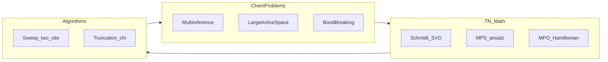

# 张量网络方法在计算化学中的自学路线（扩展版）

本文档把「思想 → 理论 → 公式 → 实现 → 化学问题」串成一条**可自检**的学习路径：除概念外，尽量写明**对象定义、典型复杂度、与单参考量子化学的边界、常见失败模式与文献锚点**。**§14–§16** 为加深阅读的「深度篇」（Schmidt/RDM、MPO–JW、RDM–CASPT2–单格点秩等）。数学排版约定：**行内**用单美元 `$...$`，**独立成行**的公式用双美元 `$$...$$`。

- **BibTeX**：[`docs/references/tensor_network_qchem.bib`](references/tensor_network_qchem.bib)（随正文补充了动态相关、TDVP、单格点 DMRG、纠缠熵选轨等条目）。
- **Toy 代码**：开放边界自旋链 finite DMRG + 小规模 ED 对照，[`examples/toy_dmrg_spin_chain.py`](../examples/toy_dmrg_spin_chain.py)（改编自 MIT 许可的 [`simple-dmrg`](https://github.com/simple-dmrg/simple-dmrg)）。

---

## 0. 化学侧：问题类型、方法边界与「何时上张量网络」

### 0.1 电子结构问题的层次

在固定原子核位置与有限基组下，标准路线可粗分为：

1. **平均场**：HF / DFT —— 单行列式（或 Kohn–Sham 非相互作用参考），便宜，但**强相关**时谱隙与占据图像可严重误导。
2. **单参考相关**：MPn、CCSD(T) 等 —— 在**主导行列式明确**时极成功；在键断裂、近简并、多金属 d 区、多自由基等处常需多参考。
3. **多参考变分**：CASSCF、Full/selected CI、DMRG/MPS、FCIQMC 等 —— 在**活性子空间**内（或全空间若可承受）显式处理组态混合。

**张量网络（此处主要指 MPS + MPO + DMRG 类 sweeps）**在化学中的主定位是：在选定轨道集上提供**可控精度的多参考变分解**，尤其当活性维数使传统 CI 向量不可存时。

### 0.2 「强相关」的可操作判据（非严格，但利于沟通）

出现下列任一情况时，应认真考虑多参考 +（大活性）DMRG 或同类方法：

- 多个 HF/CASSCF 解彼此接近（近简并），或 CASSCF 收敛极慢、占据分数大量偏离 $0/2$。
- 键长扫描上 CCSD(T) 与实验或其它多参考基准系统偏离；**非动力学极点**（CC 方程病态）。
- 过渡金属、稀土、多核簇：**大量 d/f 轨道**需同时参与活性耦合。
- 需要**大活性空间**（几十到上百轨道）仍希望保持变分控制与（相对）可扩展实现。

### 0.3 与其它大活性方法的对比（一句话地图）

| 方法族 | 优点 | 与张量网络的关系 / 注意点 |
|--------|------|---------------------------|
| 传统 CASSCF + CASPT2 | 生态成熟、动态相关接口清晰 | 活性维数受限于 CASSCF 对角化；大 CAS 时常换 **DMRG-SCF** 驱动作 CI 引擎 |
| selected / heat-bath CI | 对稀疏重要组态可极高效 | 与 DMRG 互补；可交叉检验同一活性空间 |
| FCIQMC / AFQMC | 随机相位空间、可并行 | 与 DMRG 同属「大 Hilbert」武器；成本与 sign problem 因体系而异 |
| DMRG/MPS | 变分 + 可控 $\chi$、适合链状纠缠结构 | **轨道排序与模优化**决定实际可达键维 |

---

## 1. 思想层：纠缠、Schmidt 分解、MPS 与「面积律直觉」

### 1.1 一次切割：Schmidt 分解与 von Neumann 熵

把总空间写为左右直积 $\mathcal{H}=\mathcal{H}_L\otimes\mathcal{H}_R$（化学里常对应「轨道链」在某键左侧与右侧）。任意归一化纯态可写为

$$
|\psi\rangle=\sum_{\alpha=1}^{\chi_{\max}} \lambda_\alpha\,|\alpha\rangle_L\otimes|\alpha\rangle_R,
\qquad
\lambda_\alpha\ge 0,\quad
\langle\alpha|\alpha'\rangle_{L/R}=\delta_{\alpha\alpha'}.
$$

**截断**：只保留最大的 $\chi$ 个 $\lambda_\alpha$，得近似态 $|\psi_\chi\rangle$；在 Frobenius 范数意义下对二分约化密度矩阵的最优近似由 **SVD / Eckart–Young** 给出（这是 DMRG 截断的数学内核）。

**von Neumann 纠缠熵**（以 Schmidt 权重 $w_\alpha=\lambda_\alpha^2$ 定义）：

$$
S_{L|R}=-\sum_\alpha w_\alpha\log w_\alpha.
$$

- $S$ 小：该切割上纠缠弱，MPS 可用较小 $\chi$。
- $S$ 大：要么需要更大 $\chi$，要么应通过**换轨道 / 重排序 / 分块**降低长程纠缠路径上的瓶颈。

**面积律（1D 物理与准 1D 化学的直觉）**：许多一维或准一维格点模型的基态纠缠熵随子区域边界尺度**有界或仅对数增长**；这解释了为何 DMRG 在自旋链上极成功。真实**三维分子**经轨道重排后常**近似**为「弱长程」一维链，但最坏情况仍可出现近似体积律的切割——此时任何 TN 都贵。

### 1.2 MPS  ansatz 与键维 $\chi$

$L$ 个格点（化学里常为 $L$ 个自旋轨道或 $L/2$ 个空间轨道×自旋），每点物理维 $d$（费米子单轨道为 $d=2$：空/占）。**开边界 MPS** 可写为

$$
|\psi\rangle=\sum_{s_1,\ldots,s_L} \mathrm{Tr}\!\left[A^{(1)}_{s_1} A^{(2)}_{s_2}\cdots A^{(L)}_{s_L}\right]\,|s_1,\ldots,s_L\rangle,
$$

其中 $A^{(\ell)}_{s_\ell}$ 是 $\chi_{\ell-1}\times \chi_\ell$ 矩阵（$\chi_0=\chi_L=1$ 时即矩阵乘积链）。**最大键维** $\chi=\max_\ell \chi_\ell$ 控制表达能力：$\chi$ 足够大时可精确表示任意态（平凡上界），实际计算中 $\chi$ 是**精度–成本**旋钮。

### 1.3 规范条件（实现与数值稳定性的核心）

记每点张量为 $A^{(\ell)}$（左虚拟、物理、右虚拟）。常见规范：

- **左规范**：$\sum_{s_\ell} A^{(\ell)}_{s_\ell} (A^{(\ell)}_{s_\ell})^\dagger = I$（左块等距）。
- **右规范**：对右块的对偶条件。
- **混合规范 / 正交中心**：存在一 bond，左侧左规范、右侧右规范；两格点更新时把中心放在待优化键上。

规范化的意义：**条件数控制**、截断误差的局部可加估计、以及 Lanczos/Davidson 在有效哈密顿量上的稳定迭代。

### 1.4 变分原理

在固定 $\chi$ 与 MPS 拓扑下，基态问题为

$$
E_0=\min_{|\psi\rangle\in\mathrm{MPS}_\chi}\frac{\langle\psi|H|\psi\rangle}{\langle\psi|\psi\rangle}.
$$

这是非凸优化；**sweep + 两格点或单格点子问题**给出实用算法，一般不保证全局最优，但大量经验表明在化学活性空间上**能量单调改进至平台**即可发表级使用（仍需 $\chi$ 扫描与外推）。

### 1.5 平移不变 MPS 与转移矩阵（物理图像，化学中作类比）

在**无穷、平移不变**一维链上，可取所有格点相同张量 $A^{(\ell)}=A$（物理维 $d$、键维 $\chi$）。定义（依规范略有写法差异）**转移算符**

$$
\mathbb{T}=\sum_{s=1}^{d}\,\overline{A}_s\otimes A_s\ \in\ \mathbb{C}^{\chi^2\times \chi^2},
$$

其中 $\overline{A}_s$ 为复共轭。$\mathbb{T}$ 的 Perron–Frobenius 主本征向量与次本征值间距 $|\lambda_1|/|\lambda_2|$ 决定关联函数 $\langle O_x O_{x+r}\rangle$ 的指数衰减长度 $\xi$。**化学有限分子**无严格平移对称，但**长共轭链、条带体系**中部常出现近似平移区；此时用 $\mathbb{T}$ 的谱解释「为何中部纠缠熵平台高度与 $\chi$ 的关系」有助于建立直觉（详见 McCulloch 2007；Schollwöck 2011 中 transfer-matrix 讨论）。

---

## 2. 理论层：DMRG、MPO 与复杂度

### 2.1 MPO：算符的链式压缩

**MPO** 将多体算符 $H$ 写成与 MPS 同拓扑的张量网络。若 $W^{(\ell)}$ 为第 $\ell$ 个 MPO 张量（虚拟维 $D_\ell$），则矩阵元由收缩给出。对**局域、有限程**格点模型，$D_\ell$ 常为有界小整数；对**一般分子二次量子化哈密顿量**，$D_\ell$ 随排序与反对易实现方式变化，但常仍远小于朴素 $4^L$ 表示。

**读什么**：化学 ab initio 语境下 **Wouters & Van Neck, JCP 145, 014102 (2016)** 是 MPO 构造与 DMRG 数据结构的系统入口；物理格点模型见 Schollwöck (2011)。

### 2.2 两格点 DMRG（two-site）更新（推荐先掌握）

设正交中心在键 $(i,i+1)$，合并张量 $\Theta$ 的向量维约为 $\chi_L d^2 \chi_R$。

1. 由左环境 + $W^{(i)},W^{(i+1)}$ + 右环境收缩得有效哈密顿量 $H_\mathrm{eff}$（通常不显式.dense，而用 matvec）。
2. 用 Lanczos / Davidson 求 $H_\mathrm{eff}$ 的最低本征对。
3. 将本征向量 reshape 为 $\chi_L d \times d\chi_R$ 矩阵，**SVD**；截断到 $\chi$，更新 MPS 张量并移动正交中心。

记 $\Theta$ 的系数为 $|\theta\rangle\in\mathbb{C}^{N_\Theta}$，$N_\Theta=\chi_L d_i d_{i+1}\chi_{i+1}$，则 $H_\mathrm{eff}$ 由 $\langle\theta'|H_\mathrm{eff}|\theta\rangle=\langle\psi(\theta')|H|\psi(\theta)\rangle$ 定义（实现中只做 matvec）。SVD $\Theta=U\Sigma V^\dagger$（截断秩 $\chi$）后，将 $U,V$ 吸收回 $A^{(i)},A^{(i+1)}$ 并滑动正交中心。

**优点**：在该键上**全局最优截断**（两格点联合），能量单调性较好。**缺点**：单步代价更高；极小 $\chi$ 时可能陷入「无纠缠」局部极小，实践中常用 **noise** 或从较大 $\chi$ 热启动缓解。

### 2.3 单格点 DMRG（single-site）与噪声

单格点更新一次只变一个 $A^{(\ell)}$，必须配合 **perturbation / noise**（向约化密度矩阵加小随机噪声再截断）或 **degenerate perturbation** 思想，否则虚拟维可能**无法增长**（秩卡住）。White 的 **single-site DMRG** 与后续实现细节见 *Phys. Rev. B* **72**, 180403 (2005) 及 Schollwöck 综述 §。

### 2.4 典型计算复杂度（数量级）

以下仅给出 sweep 中**一步**的常见标度直觉（常数因子与对称性块稀疏极大）：

- 两格点 eigenproblem 维度 $N_\Theta\sim \chi^2 d^2$；稀疏 Lanczos每步 matvec 代价约 $\mathcal{O}(\chi^3 d^2 D)$ 量级（$D$ 为 MPO 虚拟维）。
- 整条链一次完整 sweep：$\mathcal{O}(L\cdot \mathrm{(step\ cost)})$。

化学大活性空间上，**$\chi^3$** 与 **MPO bond** 往往比 $L$ 更决定总耗时。

### 2.5 时间依赖与激发（指路）

- **实时 / 虚时演化**：**TDVP**（time-dependent variational principle）在 MPS 切空间上积分 Schrödinger 方程，见 Haegeman 等 *PRL* **107**, 070601 (2011)。
- **激发态**：Lanczos 在 MPO 上、或 **MPS 正交化** 后求高根；化学上需注意根与对称性标签、以及与 CASPT2 激发流的一致性。

---

## 3. 公式层：二次量子化、费米子与化学 MPO

### 3.1 二次量子化哈密顿量（一般形式）

在单粒子基 $\{\phi_p\}$ 下（具体程序对 $h_{pq}$、$g_{pqrs}$ 的对称化与指标顺序可能不同）：

$$
H=\sum_{pq} h_{pq}\,a^\dagger_p a_q
+\frac{1}{2}\sum_{pqrs} g_{pqrs}\,a^\dagger_p a^\dagger_q a_s a_r.
$$

### 3.2 费米子反对易与 Jordan–Wigner 图像

$a^\dagger_p,a_q$ 满足 $\{a^\dagger_p,a_q\}=\delta_{pq}$。将一般相互作用写到链序 MPO 上时，常引入 **Jordan–Wigner 串** 或等价的 **swap network**，使算符在链上「传播」时携带正确的符号。结果：**轨道排序改变 MPO 复杂度与常数因子**，而不仅是「数值细节」。

### 3.3 对称性块（强烈建议在实现层理解）

- **粒子数 $U(1)$**：键上携带余粒子数，张量分块稀疏。
- **$S_z$ 或自旋适配**：进一步块对角化。
- **点群 / 非阿贝尔（如 SU(2)）**：可极大压缩键维，但实现难度显著上升（Wigner–Eckart 块、Clebsch–Gordan 耦合）。

对称性不是「优化技巧」，而是**对希尔伯特空间正确分解**；用错 sector 会得到错误根。

### 3.4 与自旋链 toy 的差异（读 toy 代码时对照）

[`examples/toy_dmrg_spin_chain.py`](../examples/toy_dmrg_spin_chain.py) 使用 **Pauli/自旋算符** 与 **玻色型张量积空间**，无反对易串；化学实现需在 MPO 构造与 sweep 中显式处理费米统计——这是从 toy 走向 **CheMPS2 / Block / QCMaquis** 时最大的语义跳跃。

---

## 4. 化学专论：活性空间、轨道排序、DMRG-SCF 与 RDM

### 4.1 活性空间与「模型误差 vs 截断误差」

- **模型误差**：活性轨道选太小或类型不对，物理上缺通道。
- **截断误差**：给定模型下 $\chi$ 不足。

发表级计算应分别报告：**活性定义理由**、$\chi$ 扫描 / 外推、（若有）PT2 基组与虚拟轨道截断。

### 4.2 轨道排序：为何与「图上的路由」类似

把轨道看成图上的顶点，把 $|h_{pq}|$、$|g_{pqrs}|$ 或近似纠缠贡献当边权，**Fiedler 向量 / 拉普拉斯谱**排序、或基于单参考纠缠熵的启发式，目的都是：**让强耦合轨道在链上靠近**，压缩 MPO 与 MPS 的有效键维。经验文献与数据驱动方案见 Legeza 等 *PRB* **77**, 125117 (2008) 及 Szalay 等综述 (2015)。

### 4.3 DMRG-SCF（与 CASSCF 类比）

外层：轨道酉旋转优化（类似 CASSCF）；内层：固定轨道下 DMRG 解活性 CI。**梯度 / 耦合系数** 需要 1–2 粒子 RDM；大活性下对 DMRG 噪声与 $\chi$ 收敛要求更高（2025 ORCA GPU 工作强调这一点）。

### 4.4 RDM 与可观测性质

从 MPS 可收缩得 1–2 粒子（及条件性 3–4 粒子）RDM；**自然轨道占据**、**旋布居**、偶极等依赖 1-RDM；**能量梯度**常需 1–2-RDM 与 core 贡献组合。若 RDM 在 $\chi$ 下未收敛，轨道梯度与 PT2 修正会**虚假稳定**。

---

## 5. 动态相关、多方法拼接与激发态（化学发表常涉及）

### 5.1 强相关 + 动态相关：为何不能停在 DMRG 能量

大活性 DMRG 捕获**强相关**（近简并组态混合）；**动态极化**（高频虚拟激发）常需 PT2、CC 或专门的多参考 PT。**DMRG-CASPT2** 类思路见 Kurashige & Yanai *JCP* **135**, 094104 (2011) 及后续改进；与 canonical transformation / 多参考线性化 CC 等路线并列，见 Yanai 等 *JCP* **130**, 124102 (2009) 的讨论语境。

### 5.2 intruder states 与 Level shift

多参考 PT2 在活性谱与连续/高激发接近时可能出现 **intruder**；需 level shift、收缩活性、或改换 NEVPT 等。**这不是 DMRG 独有**，但 DMRG 给出的大活性参考会使 PT2 空间更大，更需诊断。

### 5.3 激发态策略（简表）

| 目标 | 常见做法 | 注意 |
|------|----------|------|
| 低激发能 | MPS 上 Lanczos；或根正交化 | 根顺序与对称性标签 |
| 光谱强度 | 需过渡偶极 / 响应 | 见多参考线性响应文献 |
| 锥交 | 需非绝热耦合或简并摄动 | 单根 DMRG 不够 |

---

## 6. PEPS、高维 TN 与化学中的「可用边界」

### 6.1 PEPS 定义与收缩难度

**PEPS**：每个格点张量携带 **2D（或更高维）邻居** 虚拟键。精确收缩一般 **\#P-hard** 类困难；实用算法包括 **boundary MPS**、**TRG / HOTRG**、cluster 更新等，均有近似与体系依赖。

### 6.2 与 ab initio 电子结构的关系

- **分子 3D 电子气** 一般不是局域 2D Hubbard；直接上 PEPS 做全分子 ab initio 仍非主流。
- **有效格点模型**（Hubbard、Anderson、Lattice QCD 式离散化）与 **材料量子磁性**：PEPS/MERA 研究价值高。
- **化学启发**：当把体系刻意映射到低维图（条带、 ladder）时，可借鉴 PEPS 思想讨论纠缠标度，但生产管线仍以 **DMRG + 轨道工程** 为主。

### 6.3 MERA、TTN 等（一句）

**MERA** 等多尺度树网络对临界与对数深度纠缠有优势；化学文献中偶见概念借用，实现与数据生态远小于 MPS/DMRG。

### 6.4 PEPS 收缩：boundary MPS 与「为何二维难」

对 $L\times L$ 格点上的 PEPS，计算 $\langle\psi|O|\psi\rangle$ 需收缩 $O(L^2)$ 个张量。沿某方向切片时，可把相邻「条带」吸收进一维有效基，得到 **boundary MPS**：PEPS 行与一维 MPS 边界反复收缩；为控制代价需对 boundary 键维截断，误差沿条带累积。**一般精确收缩为 \#P-hard 类困难**；实用算法（TRG、HOTRG、cluster update、variational PEPS）都在近似与体系依赖之间取舍。化学上若将分子硬映射到宽二维格点，应首先评估：**近似收缩误差**是否已大于你关心的化学精度（kcal/mol 等）。

---

## 7. 实现层：从 toy 到生产 checklist

### 7.1 Toy：对齐「块算法」与截断

[`examples/toy_dmrg_spin_chain.py`](../examples/toy_dmrg_spin_chain.py) 实现 **finite-system warm-up + sweeps**（超块对角化 + 左块约化密度矩阵截断），与 MPS 语言等价但更易手推对照：

```bash
python examples/toy_dmrg_spin_chain.py --L 8 --m-warmup 20 --m-sweeps 20,30 --exact
```

### 7.2 生产代码应检查的清单

1. **规范与正交中心**：每步后验证等距关系（抽查 Frobenius 范数误差）。
2. **对称性 sector**：粒子数、自旋、点群不可混。
3. **能量单调与平台**：sweep 间能量应总体下降；若振荡检查 noise、$\chi$、排序。
4. **$\chi$ 外推**：至少 3 个 $\chi$；报告 discarded weight 或截断权重和。
5. **RDM 自洽性**：Hermiticity、迹、与能量重构（在实现支持时）。

### 7.3 软件生态（文档级，不绑定版本）

| 生态 | 典型用途 |
|------|----------|
| **PySCF + dmrgscf + Block/CheMPS2** | 研究级组合、Python 驱动 $\chi$ 扫描 |
| **OpenMolcas + QCMaquis** | DMRG-SCF / 大活性化学文献常见 |
| **ORCA** | 工业强度与 GPU DMRG-SCF（见 2025 arXiv） |
| **ITensor / TeNPy** | 物理模型与算法原型（化学接口需自建） |

---

## 8. 2025 预印本速读（扩展要点）

### 8.1 arXiv:2501.18263

除「全局费米子模优化、DMRG-RAS-X、GPU/对称性」外，建议在阅读时自问：**优化目标是否凸？与 HF 初轨的距离？对梯度法 / 高阶优化器的敏感性？** 大活性下答案常是「要配合好的初始轨道与多阶段 $\chi$ 增长」。

### 8.2 arXiv:2503.20700

除 CAS(82,82) 与铁硫簇示例外，建议提取的**工程信息**是：**同一几何下 $\chi$、noise、sweep 次数对收敛轨道的影响**——这决定后续 PT2 是否在同一势能面上可比。

---

## 9. 可复现实验协议：$\chi$、排序、局域化消融

在固定 **几何、基组、活性定义** 下：

1. **$\chi$ 扫描**：记录 $E$、$\mathrm{trunc}$、1-RDM 自然占据、（若有）偶极。
2. **排序消融**：默认序 vs Fiedler 型 vs 纠缠熵启发式；报告 MPO bond 或 wall time 若软件可输出。
3. **局域化消融**：Boys / Pipek–Mezey 与对称性兼容时的组合；注意可能破坏空间对称适配基。
4. **归档**：输入文件、版本号、随机种子（若用 noise）、commit hash。

---

## 10. 建议阅读顺序（12–16 周，偏「能算能写」）

1. Bridgeman–Chubb（图示）→ Schollwöck 2011（MPS/MPO/DMRG 主语言）→ White–Martin 1999（化学动机）。
2. Wouters JCP 2016（实现框架）→ JCP 152, 040903 (2020)（化学地图）→ Baiardi–Reiher WIREs。
3. Szalay 等 2015（纠缠优化与张量分解视角）+ McCulloch JSTAT 2007（DMRG 物理图像补充）。
4. Cirac 等 RMP 2021 + Orús Annu. Rev. CMP 2023（TN 全景与 PEPS 定理）。
5. Kurashige–Yanai 2011 + 动态相关综述树（从 JCP 2020 向外延伸）。
6. arXiv:2501.18263 + arXiv:2503.20700（2025 工程前沿）。
7. 穿插精读 **§14–§16 深度篇** 与 **附录 C**（与 Schollwöck / Wouters 原文公式对照手推）。

---

## 11. 文献矩阵（按主题，便于补全阅读）

| 主题 | 入门 / 综述 | 实现 / 算法 | 化学应用 |
|------|-------------|-------------|----------|
| MPS/MPO 语言 | Bridgeman–Chubb；Schollwöck 2011 | Wouters JCP 2016；White PRB 2005 | White–Martin 1999 |
| TN 定理与 PEPS | Cirac 等 RMP 2021 | Orús Annu. Rev. 2023 | 有效模型文献为主 |
| 纠缠与排序 | Legeza 等 PRB 2008 | Szalay 等 2015 | JCP 2020 Perspective |
| 动态相关 | Yanai 等 JCP 2009（邻域） | Kurashige–Yanai 2011 | Bauer 等 JCP 2020 |
| 时间演化 | Haegeman 等 PRL 2011 | Schollwöck 2011 § | 光谱与非绝热（专题深入） |

完整 BibTeX 键见 [`docs/references/tensor_network_qchem.bib`](references/tensor_network_qchem.bib)。

---

## 12. 图示：化学问题 ↔ TN 数学 ↔ 算法



---

## 13. 许可与致谢

- [`examples/toy_dmrg_spin_chain.py`](../examples/toy_dmrg_spin_chain.py) 的算法骨架来自 James R. Garrison 与 Ryan V. Mishmash 的 MIT 许可教程仓库 `simple-dmrg`（见脚本文件头注释）。

---

## 14 深度篇（一）：Schmidt、约化密度矩阵与截断的数学

### 14.1 二分约化密度矩阵的定义

对归一化纯态 $|\psi\rangle$，在直积分解 $\mathcal{H}=\mathcal{H}_L\otimes \mathcal{H}_R$ 下，**左约化密度矩阵**定义为

$$
\rho_L=\mathrm{Tr}_R\,|\psi\rangle\langle\psi|.
$$

若在 Schmidt 形下 $|\psi\rangle=\sum_\alpha \lambda_\alpha|\alpha\rangle_L|\alpha\rangle_R$（$\lambda_\alpha\ge 0$），则

$$
\rho_L=\sum_\alpha \lambda_\alpha^2\,|\alpha\rangle_L\langle\alpha|_L,
$$

即 Schmidt 权重 $w_\alpha=\lambda_\alpha^2$ 恰为 $\rho_L$ 的本征值。**Schmidt 秩** $\chi_{\max}=\mathrm{rank}(\rho_L)$ 等于将 $|\psi\rangle$ 的系数张量在切割 $L|R$ 下 **matricization**（左多指标合并、右多指标合并）所得矩阵的秩。

### 14.2 Eckart–Young 与 discarded weight

将系数写成矩阵 $M$（行索引 $\in$ 左块多体基、列索引 $\in$ 右块多体基），SVD 为 $M=U\Sigma V^\dagger$，$\Sigma=\mathrm{diag}(\sigma_1,\ldots)$。对秩 $\chi$ 截断得 $M_\chi$，Frobenius 误差为

$$
\|M-M_\chi\|_F^2=\sum_{\alpha>\chi}\sigma_\alpha^2.
$$

对纯态 Schmidt 分解，$\sigma_\alpha=\lambda_\alpha$，上式即 **discarded weight** $\epsilon_{\mathrm{disc}}=\sum_{\alpha>\chi}\lambda_\alpha^2$，直接度量**截断态与真态在波函数 2-范数意义下的差距**。DMRG 在 bond 上选保留子空间，本质上是在该切割下用 $\rho$ 的主子空间近似全局态。

### 14.3 能量误差与 $\epsilon_{\mathrm{disc}}$ 的关系（为何不能「一步换算」）

$E(\psi)=\langle\psi|H|\psi\rangle/\langle\psi|\psi\rangle$ 对 $|\psi\rangle$ **非线性**。设 $|\psi\rangle$ 为真基态、$|\tilde\psi\rangle=|\psi\rangle+|\delta\psi\rangle$ 归一化扰动且 $\langle\psi|\delta\psi\rangle=0$，则

$$
\tilde E-E \approx \langle\delta\psi|H-E|\delta\psi\rangle + \text{高阶},
$$

一阶项因 Rayleigh–Ritz 变分在真基态处消失。故 $|\Delta E|$ 与 $\|\delta\psi\|^2\sim \epsilon_{\mathrm{disc}}$ 的关系还依赖 $(H-E)$ 在误差子空间上的**局域范数与 gap**；实践中仍以 **$\chi$ 扫描、外推与 RDM 自检** 为主，而不把 $\epsilon_{\mathrm{disc}}$ 当作能量误差的万能标度。

### 14.4 纠缠谱（entanglement spectrum）

序列 $\{w_\alpha\}$（降序）或 $\{-\log w_\alpha\}$ 常称 **纠缠谱**。在格点物理中它与边缘态、CFT 中心荷等深刻联系；在量子化学工程里，更直接的用途是：**若少数键上 $w_\alpha$ 衰减极慢**，说明该切割两侧仍强纠缠，应优先通过**排序 / 活性扩展 / 分块**处理，而不是盲目加 $\chi$。

---

## 15 深度篇（二）：MPO、键上自动机与 Jordan–Wigner

### 15.1 MPO 的「键上自动机」图像

把 MPO 的虚拟指标 $b_\ell$ 看成在键 $\ell$ 上传播的**内部状态**（有限自动机）。每增加一个格点，状态按 $W^{(\ell)}$ 的块结构转移，并在物理指标上留下局域算符片段。**局域、有限程**格点模型（如 NN Heisenberg）只需有界个内部状态，故 $D=\dim(b)$ 为 $O(1)$。化学哈密顿量在链序下写为产生湮灭算符多项式时，每一项在自动机语言里对应一条**在键上行走的路径**；路径越长、越「绕远」，越推高有效 $D$ 或等价的收缩代价。

### 15.2 二次量子化 $H$ 与「全相互作用」的张力

$$
H=\sum_{pq} h_{pq}\,a^\dagger_p a_q
+\frac{1}{2}\sum_{pqrs} g_{pqrs}\,a^\dagger_p a^\dagger_q a_s a_r
$$

中任意 $(p,q,r,s)$ 一般**不**对应链上相邻格点的 NN 项。将 $a^\dagger,a$ 换为 JW 费米子 $f^\dagger,f$ 后，单粒子项与双粒子项都可在 MPO 上实现为**有限宽度的算符流**，但宽度（bond）上界依赖**排序与打包**（Wouters–Van Neck 2016 给出化学可实现的构造与复杂度讨论）。直觉：**让 $|h_{pq}|$、$|g_{pqrs}|$ 大的指标在链上靠近**，等价于缩短自动机里「携带非平凡算符」的段长。

### 15.3 两格点 $H_\mathrm{eff}$：环境张量与 matvec

记混合规范下键 $(i,i+1)$ 左侧环境张量 $L$（由 $\{A^{(\ell)},W^{(\ell)}\}_{\ell<i}$ 收缩得）与右侧环境 $R$。合并张量 $\Theta$ 张成维 $N_\Theta=\chi_{i-1} d_i d_{i+1}\chi_{i+1}$ 的子空间。$H_\mathrm{eff}$ 在该基下的作用可写为网络收缩（实现上用 **opt-einsum** 式或稀疏块结构），Lanczos 仅需 **matvec**，不必显式构造 $N_\Theta\times N_\Theta$ 稠密阵——这是 $L\sim 50$、$\chi\sim10^4$ 仍可算的关键。

### 15.4 Jordan–Wigner 变换（显式）

在固定链序 $1\prec 2\prec\cdots\prec L$ 下，

$$
f_p^\dagger=\Big(\prod_{q<p} e^{i\pi\, n_q}\Big)\,a_p^\dagger,\qquad n_q=a_q^\dagger a_q,
$$

则 $\{f_p,f_q^\dagger\}=\delta_{pq}$。任意 $a$ 串化为 $f$ 串时附带 **Pauli-$Z$ 串**；MPO 在键上记录「当前累积的 $Z$ 奇偶」即可在局域张量上实现正确符号。**重新排序轨道**等价于改变 JW 串拓扑，故可改变 $D$ 与常数因子——这是「排序即算法」的数学根源之一。

### 15.5 两格点 SVD 截断在该步的变分意义（与全局最优的区别）

两格点更新在**固定左环境基 + 右环境基**（由当前 MPS 诱导）下，对合并张量 $\Theta$ 求 $H_\mathrm{eff}$ 基态，再 SVD 截断，是在该步给出一个**对当前环境的最优秩-$\chi$ 分解**。全局能量泛函对全部 $\{A^{(\ell)}\}$ 仍非凸；sweep 是块坐标下降类过程。经验上两格点 + 足够 $\chi$ 能稳定逼近大活性化学基态。

---

## 16 深度篇（三）：RDM、DMRG-SCF、CASPT2 与单格点秩

### 16.1 1-RDM、2-RDM 与 MPS 收缩（概念式）

单粒子密度矩阵元 $\gamma^p_q=\langle\psi|a^\dagger_p a_q|\psi\rangle$ 对应在 MPS–MPO 网络上插入**单格点算符**后全收缩。双粒子 $\Gamma^{pq}_{rs}=\langle\psi|a^\dagger_p a^\dagger_q a_s a_r|\psi\rangle$ 需插入**两格点**或经 JW 等价后的串算符再收缩。DMRG-SCF 外层对轨道酉变换求导时，需要 **对称化 2-RDM** 与 AO 积分梯度收缩；大活性下若 $\chi$ 不足，$\Gamma$ 的误差会直接进入**虚假收敛的轨道梯度**。

### 16.2 DMRG-CASPT2 的零阶–微扰图像（骨架）

写 $H=H^{(0)}+V$，$|\Psi^{(0)}\rangle$ 为 DMRG 在 CAS 内得到的参考（多组态）。二阶修正典型涉及 $\langle\Psi^{(0)}|V|\Psi^{(n)}\rangle$ 与分母 $(E^{(0)}-E^{(0)}_n)$；**intruder** 即某 $n$ 使分母过小或符号病态。Level shift、收缩虚拟空间、或换用 NEVPT 定义分母，是文献与软件手册必须对照的细节（Kurashige–Yanai 2011 为 DMRG 参考下的 CASPT2 代表入口之一）。

### 16.3 单格点更新为何可能「秩不增」与 noise 的作用（线性代数图像）

单格点只变 $A^{(i)}$ 时，若当前 $\chi$ 子空间对局域有效哈密顿量已是**不变子空间**，则局域本征问题在该子空间内解出，SVD **不产生**新的奇异方向，虚拟维无法扩张。两格点更新联合优化 $(i,i+1)$，在一步内探索了更大的联合秩空间。单格点路径下，**向密度矩阵加小噪声**相当于在 $\rho$ 的主子空间外混入微量邻近方向，使下一轮截断基发生旋转，从而有机会**激活**新的奇异向量；这是工程上 noise 与「热启动 $\chi$」并用的常见理由（严格收敛定理见算法专文；White PRB 2005 为原始动机之一）。

### 16.4 TDVP 一句话（与 MPS 切空间）

对参数化族 $|\psi(\mathbf{c})\rangle$（MPS 系数 $\mathbf{c}$），Schrödinger 方程 $i\partial_t|\psi\rangle=H|\psi\rangle$ 投影到切空间 $T_{|\psi\rangle}\mathcal{M}_{\mathrm{MPS}}$ 得 **TDVP** 方程；离散时间步下与「一步 sweep + 小时间步」有亲缘。用于**实时动力学**与部分**虚时演化**场景；化学上光谱、非绝热可沿此线深入（Haegeman 等 PRL 2011）。

---

## 附录 A：记号约定

- $L$：格点数（轨道数或自旋轨道数，依上下文说明）。
- $\chi$：MPS 最大虚拟维（bond dimension）。
- $D$ 或 $D_\ell$：MPO 虚拟维（与 $\chi$ 不同，勿混）。
- $d$：单格点物理维（自旋轨道 $d=2$）。

---

## 附录 B：常见失败模式（排错表）

| 现象 | 可能原因 | 建议 |
|------|----------|------|
| 能量随 sweep 振荡 | 单格点无 noise、$\chi$ 过小 | 两格点或加 noise、增大 $\chi$ |
| $\chi$ 很大仍不收敛 | 排序差或活性错误 | 重排序、检查对称 sector |
| PT2 与 DMRG 参考不一致 | 不同轨道或不同根 | 固定同一组 MO 与态标签 |
| RDM 非 Hermite | 实现 bug 或未收敛 | 检查规范与 sweep 数 |

---

## 附录 C：非阿贝尔 SU(2) 块与 Wigner–Eckart（实现视角）

在 **自旋适配（spin-adapted）** MPS 中，虚拟键携带 SU(2) 不可约表示标签 $j$（总自旋片段），张量元仅在满足 **Clebsch–Gordan 耦合** $j_1\otimes j_2\to j_3$ 的块内非零。**Wigner–Eckart 定理**把「几何因子」（3–$j$ / 6–$j$ 符号）与**约化矩阵元**分离：同一对称块内多个物理矩阵元共用一个标量参数，从而显著压缩自由度并稳定大 $\chi$ 计算。代价是：代码路径需维护张量积分解、相位约定与块稀疏数据结构；调试与单测成本远高于纯 $U(1)$ 粒子数守恒。若你只做应用层计算，至少应理解：**自旋 sector 选错 = 得到错误本征态**，而非「收敛慢一点」。