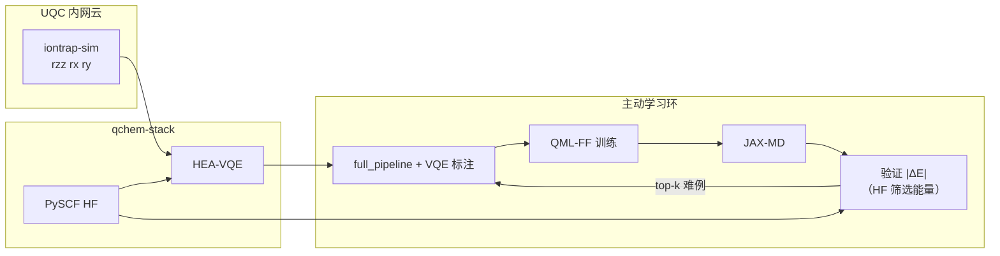

# 在线学习云上调度 — UQC 云平台 × 分子力场主动学习实验报告

> **文档类型**：实验记录 + 结果分析  
> **日期**：2026-05-28  
> **系统**：qchem-stack → UQC（幺正量子）`iontrap-sim` → QML-FF → JAX-MD 主动学习环  
> **关联配置**：`configs/example_h2_uqc_cloud_sim_md_ml.yaml`、`configs/example_h2_uqc_cloud_sim_qmlff_loop*.yaml`  
> **关联脚本**：`scripts/run_uqc_cloud_sim_online_learning.py`、`scripts/check_uqc_connectivity.py`、`scripts/analyze_uqc_md_ml_results.py`

---

## 1. 执行摘要

在本机通过**公司内网**（`SERVER_HOST=192.168.110.148:8003`，公网 `cloud.unitaryqubit.com` 不可达）稳定连接 UQC 云模拟器，完成了 **H₂ / sto-3g / HEA-VQE** 驱动下的分子力场在线学习端到端验证。

| 实验批次 | 输出目录 | 计划轮数 | 实际轮数 | 收敛 | 训练集帧数 |  wall time（约） |
|----------|----------|----------|----------|------|------------|------------------|
| A（宽松容差） | `results/uqc_cloud_sim_md_ml_2rounds` | 2 | **1**（提前收敛） | 是 | 2 | ~14 min |
| B（多轮收紧） | `results/uqc_cloud_sim_md_ml_5rounds` | 5 | **5**（跑满） | 否 | 6 | ~59 min |

**结论（工程层面）**：云上调度链路 **可用且稳定**（preflight、多次 `submit_task`、轮询、结果解析、回灌训练均无失败）。  
**结论（科学/力场层面）**：当前配置下 **力场优化与验证指标表现差**，主要来自 **能量参考不一致、VQE 标注精度不足、训练规模过小** 三类问题（见第 7 节），而非 UQC 连接或流水线崩溃。

---

## 2. 架构与数据流



**要点**：

1. 在线学习 **不直接** 调 UQC SDK；每次 `label_geometries_with_pipeline` / `run_pipeline_sync` 读取实验 YAML 的 `backend.provider: uqc`、`uqc_mode: real`。
2. 并入训练集的难例使用 `label_top_theory_level: full_pipeline` + `label_energy_reference: variational` → 能量来自 **云端 VQE**（`energy_after_variational`）。
3. 每轮 MD 验证时，`|ΔE|` 在 `md_validation_loop._build_frame_records` 中计算为  
   `E_QML − E_qchem`，其中 **`E_qchem` 来自 HF 筛选**（`label_screening_theory_level: hf_scf`），**不是** 训练用的 VQE 能量。

---

## 3. 环境与连通性

### 3.1 依赖

```bash
source .venv/bin/activate
pip install -e ".[chem,quantum]" uqc-client
pip install -e /path/to/QML-FF && pip install jax-md
```

### 3.2 内网接入（必须）

公网 DNS `220.178.61.185:8003` 在本机/WSL 上 **TCP 超时**。内网可达配置（`.env`，勿提交仓库）：

```bash
SERVER_HOST=192.168.110.148
SERVER_PORT=8003
UQC_API_TOKEN=<平台用户中心，约 30 min 有效>
```

可选 hosts：`192.168.110.148 cloud.unitaryqubit.com`

自检：

```bash
python scripts/check_uqc_connectivity.py
# 期望: TCP OK, Socket.IO OK, chips 含 iontrap-sim
```

### 3.3 量子后端约束（实验 YAML）

| 项 | 值 |
|----|-----|
| `uqc_target` | `iontrap-sim`（非 Matrix2 真机） |
| `uqc_allow_fallback` | `false` |
| `shots_per_circuit` | 100（云侧要求 100 的整数倍，≤1000） |
| `vqe.maxiter` | 5 |
| `vqe.depth` | 1 |
| 原生门集 | `rzz`, `rx`, `ry` |

### 3.4 多后端 Profile（推荐）

除在 YAML 里写 `backend.provider` 外，可用 **命名 profile** 切换执行后端（UQC 真云 / mock / 本地模拟器）：

```bash
# 列出全部 profile
python scripts/run_uqc_md_ml.py --list-backend-profiles

# 生产：公司 UQC 内网云（默认）
export UQC_API_TOKEN=...
python scripts/run_uqc_cloud_sim_online_learning.py \
  --backend-profile uqc_cloud \
  --experiment configs/example_h2_uqc_cloud_sim_md_ml.yaml

# 离线 / CI：UQC 协议栈 + 本地 mock
python scripts/run_uqc_md_ml.py --backend-profile uqc_mock \
  --experiment configs/example_h2_uqc_cloud_sim_md_ml.yaml

# 其他模拟后端（变分 HEA 一致性测试）
python scripts/run_uqc_md_ml.py --backend-profile cirq --experiment configs/example_h2.yaml
python scripts/run_uqc_md_ml.py --backend-profile braket --experiment configs/example_h2.yaml
```

Profile 会写入输出目录 `experiment_resolved_<profile>.yaml` 与 `md_validation_summary.json` 的 `backend_profile` 字段，便于审计。

| Profile | Provider | 用途 |
|---------|----------|------|
| `uqc_cloud` | uqc / real | **InQuanto 公司 UQC 内网云**（默认生产） |
| `uqc_mock` | uqc / mock | 无 token 的协议回归 |
| `statevector` | statevector | 最快本地调试 |
| `cirq` / `braket` / `qulacs` / `qiskit_*` | 各 SDK | 多后端对照 |

---

## 4. 实验 A：2 轮配置（宽松容差，提前停止）

**配置**：`configs/example_h2_uqc_cloud_sim_qmlff_loop.yaml`  
- `max_rounds: 2`  
- `energy_tolerance_hartree: 1.0`  
- `n_epochs_per_round: 1`  

**结果**（`results/uqc_cloud_sim_md_ml_2rounds/md_validation_summary.json`）：

摘要 JSON 含 **`accuracy_threshold_hartree`**（默认 **0.1 Ha**，H₂ 云仿真路径的文档化 \|ΔE\| 目标；由 `scripts/run_uqc_md_ml.py` 写入，可与环配置里的 `energy_tolerance_hartree` 收敛容差不同）。

| 指标 | 值 |
|------|-----|
| 完成轮数 | 1 / 2 |
| 训练集 | 1 → 2 帧 |
| MD 验证帧 | 1 |
| max \|ΔE\| | 0.793 Ha |
| converged | **true**（\|ΔE\| < 1.0） |
| QML 能量（验证帧） | -0.308 Ha |
| qchem 能量（验证帧） | -1.100 Ha |
| 训练 energy_mae（1 epoch） | ~7.8 mHa |
| 训练 force_rmse | ~0.85 |

**说明**：容差 1.0 Ha 极大，第一轮即判定「收敛」，**不能**代表力场已学好，仅说明闭环可跑通。

---

## 5. 实验 B：5 轮配置（收紧容差，跑满）

**配置**：`configs/example_h2_uqc_cloud_sim_qmlff_loop_5rounds.yaml`  
- `max_rounds: 5`  
- `energy_tolerance_hartree: 0.08`  
- `n_epochs_per_round: 2`，`warm_start: true`  
- `md_n_steps: 12`，`md_save_stride: 3`，每轮 2 个候选帧  

**命令**：

```bash
python scripts/run_uqc_cloud_sim_online_learning.py \
  --loop configs/example_h2_uqc_cloud_sim_qmlff_loop_5rounds.yaml \
  --output results/uqc_cloud_sim_md_ml_5rounds
```

### 5.1 分轮汇总

| 轮次 | n_train | max \|ΔE\| (Ha) | mean \|ΔE\| (Ha) | 训练 force_rmse | 训练 energy_mae/结构 (Ha) | converged |
|------|---------|-----------------|------------------|-----------------|---------------------------|-----------|
| 1 | 1→2 | 0.876 | 0.872 | 0.85 | 0.010 | 否 |
| 2 | 2→3 | 0.799 | 0.783 | 1.75 | 2.37 | 否 |
| 3 | 3→4 | 0.830 | 0.829 | 1.58 | 2.10 | 否 |
| 4 | 4→5 | 0.829 | 0.819 | 1.34 | 1.73 | 否 |
| 5 | 5→6 | **0.806** | **0.792** | 1.64 | 2.40 | 否 |

- **全局**：`converged=false`，`n_total_frames=6`，**failures=[]**（无标注/云任务失败）。
- **\|ΔE\| 趋势**：0.876 → 0.806 Ha（约 **8%** 相对下降），仍远高于容差 0.08 Ha。
- **云 VQE 能量量级**（日志 `E_var_au`）：约 **-0.23 ~ -0.46 Ha**；同构型 **HF** 约 **-1.08 ~ -1.12 Ha**。

### 5.2 可视化产物

生成命令：

```bash
python scripts/analyze_uqc_md_ml_results.py results/uqc_cloud_sim_md_ml_5rounds
```

| 图 | 路径 |
|----|------|
| 训练集规模 & \|ΔE\| vs 容差 | `results/uqc_cloud_sim_md_ml_5rounds/plots/rounds_dataset_and_delta_e.png` |
| 各验证帧 QML vs qchem 能量 | `results/uqc_cloud_sim_md_ml_5rounds/plots/frame_energies_qml_vs_qchem.png` |
| 各验证帧 \|ΔE\| | `results/uqc_cloud_sim_md_ml_5rounds/plots/frame_abs_delta_e.png` |
| 训练 force RMSE | `results/uqc_cloud_sim_md_ml_5rounds/plots/force_rmse_per_round.png` |
| 每轮训练 loss / MAE | `results/uqc_cloud_sim_md_ml_5rounds/plots/qmlff_training_per_round.png` |

### 5.3 云任务与耗时

- 每轮包含：冷启动/增量 **full_pipeline** 标注（UQC VQE）+ MD + HF 筛选 + top-1 升级标注。
- 单轮 wall time 约 **10–11 分钟**；5 轮合计约 **59 分钟**。
- 日志中大量 `Submitted UQC task ... (target=iontrap-sim, shots=100)`，**无** `uqc_allow_fallback` 静默回退。

---

## 6. 云上调度稳定性评估

| 维度 | 状态 | 说明 |
|------|------|------|
| TCP / Socket.IO | ✅ | 内网 `192.168.110.148:8003` |
| Token + preflight | ✅ | `get_chips` 正常 |
| 任务提交/轮询 | ✅ | 多轮、多构型无失败 |
| 与 MD 环集成 | ✅ | `md_validation_summary.json` 完整写出 |
| 公网直连 | ❌ | 需内网或 VPN 分流到 WSL |
| Token 持久性 | ⚠️ | ~30 min，长跑需刷新 |
| 科学收敛 | ❌ | 5 轮后 \|ΔE\| 仍 ~0.8 Ha |

**可复现检查清单**：

1. `python scripts/check_uqc_connectivity.py` → 退出码 0  
2. `.env` 中 `SERVER_HOST` / `UQC_API_TOKEN` 有效  
3. `source .venv/bin/activate` 后跑 `run_uqc_cloud_sim_online_learning.py`  
4. 结果目录含 `uqc_preflight.json`、`md_validation_summary.json`、`plots/`  

---

## 7. 为什么力场优化结果这么差？

本节解释 **训练 loss/MAE 看似还行，但验证 \|ΔE\| 巨大、且多轮后 force_rmse 恶化** 的原因。问题 **不是** UQC 断连，而是 **任务定义、能量标度、数据量与噪声** 叠加。

### 7.1 【主因】验证能量与训练能量不是同一参考

代码路径（`md_validation_loop.py`）：

1. **训练集并入**的难例：`label_top_theory_level: full_pipeline` + `label_energy_reference: variational`  
   → `QMFrame.energy_hartree` ≈ **云端 VQE 能量**（约 -0.23 ~ -0.46 Ha）。
2. **每轮 MD 验证**的 `energy_qchem_hartree`：来自 **HF 筛选** `label_screening_theory_level: hf_scf`  
   → 约 **-1.08 ~ -1.12 Ha**（`theory_level` 字段为 `hf_scf`）。

因此日志中的 **\|ΔE\| ≈ 0.8 Ha**  largely 是：

\[
|E_{\mathrm{QML}}^{\mathrm{(VQE\text{-}尺度})} - E_{\mathrm{HF}}| \approx |(-0.3) - (-1.1)| \approx 0.8\ \mathrm{Ha}
\]

而不是「QML 相对其训练标签（VQE）拟合失败」。  
从数值上看，QML 预测（~-0.23 ~ -0.32 Ha）其实 **更接近 VQE 标注**，却与 **HF 参考** 做差，导致验证指标「永远很差」，主动学习也会按错误目标选难例。

**改进方向**：验证与选帧应使用与训练一致的 `energy_reference`（例如 `variational`），或在报告中同时输出 `|E_QML - E_VQE|` 与 `|E_QML - E_HF|`。

### 7.2 【主因】云端 VQE 能量本身偏离真实基态

| 因素 | 当前设置 | 影响 |
|------|----------|------|
| shots | 100 | 统计噪声大 |
| maxiter | 5 | 优化未收敛 |
| Pauli 测量 | 单次 Z 基计数近似混合项 | `<H>` 有偏 |
| 活跃空间 / JW | 2 轨道 H₂ 模型 | 与 HF 全空间能量不可直接比 |
| 实验观测 VQE | E_var ~ -0.46 Ha | 远低于 STO-3G 精确 ~ -1.13 Ha |

训练标签带 **系统偏差 + 噪声**，QML-FF 再拟合这些标签，**无法** 同时逼近 HF 验证能量。

### 7.3 训练规模与优化预算过小

| 项 | 值 | 后果 |
|----|-----|------|
| `n_epochs_per_round` | 2 | 参数几乎未收敛 |
| `batch_size` | 1 | 梯度方差极大 |
| 最大训练帧 | 6 | 量子神经网络力场严重欠定 |
| `energy_normalization` | `subtract_mean` | 每轮均值随数据集变，目标面漂移 |
| `warm_start` | true | 扩数据集后旧参数可能 **负迁移**（见 force_rmse 第 2 轮跳升） |

第 1 轮仅 1 帧训练时 force_rmse≈0.85；第 2 轮扩到 2 帧且标签含噪声 VQE 后 force_rmse→1.75，符合 **小数据 + 分布移位** 下的过拟合/灾难性遗忘。

### 7.4 力与能量监督不一致

- 并入训练集的 `full_pipeline` 帧带 **HF 核梯度**（`include_hf_nuclear_gradient: true`）与 **VQE 能量** 混在同一 `QMFrame`。
- QML-FF 同时最小化 **力匹配 HF 梯度** 与 **能量匹配 VQE** → 多目标冲突，在 2 epoch 内无法兼顾。

### 7.5 验证指标与训练指标「表象矛盾」

- **训练** `energy_mae_per_structure_phys` 在 0.01–2.4 Ha 波动：在 **subtract_mean** 下，小训练集上 MAE 可对 **相对涨落** 敏感，且与物理绝对误差不对齐。
- **验证** 用 **物理 Hartree 绝对值** 对比 HF，故显示 0.8 Ha 量级差距。

因此「训练 loss 不算爆炸，但验证极差」是 **度量与参考不一致** 的预期结果，不是单纯「QML-FF 坏了」。

### 7.6 实验 A 的「假收敛」

`energy_tolerance_hartree: 1.0` 使 \|ΔE\|≈0.79 即判 converged，**掩盖** 上述问题。实验 B 用 0.08 Ha 才暴露真实差距。

---

## 8. 已实施的优化（2026-05-28 后续）

| 项 | 实现 |
|----|------|
| 多基 Pauli 测量 | `src/qchem_stack/backends/uqc_pauli_shots.py`，`backend.meta.uqc_multi_basis_pauli: true`（默认） |
| shots / maxiter | `example_h2_uqc_cloud_sim_md_ml.yaml`：`shots_per_circuit: 500`，`vqe.maxiter: 25` |
| 统一验证参考 | loop YAML：`validation_energy_reference: variational`，`validation_theory_level: full_pipeline`；`md_loop_rounds` 用其与 QML 比 \|ΔE\| |
| 能量契约校验 | `qchem_stack.md_bridge.energy_reference.validate_loop_energy_consistency`（loop 启动时默认 strict；`QCHEM_MD_LOOP_ENERGY_STRICT=0` 仅警告） |
| 双指标导出 | `validation_round_*.json` / `md_validation_summary.json` 含 `delta_hartree_raw` 与 `max_abs_delta_hartree_raw` |
| UQC ZNE 后处理 | `energy_stub`：`uqc_mitigation.apply_uqc_zne_mitigation`；`circuit_scale_fold`：`uqc_zne_fold.run_uqc_zne_circuit_fold` 多 scale 真提交 + HEA depth fold |
| mock vs 云对照 | `scripts/compare_uqc_vqe_mock_vs_cloud.py`（`--cloud` 需内网） |

云 loop 配置片段：

```yaml
validation_energy_reference: variational
validation_theory_level: full_pipeline
label_top_theory_level: full_pipeline
```

实验 YAML：

```yaml
shots_per_circuit: 500
backend.meta:
  uqc_multi_basis_pauli: true
  uqc_pauli_grouping: tensor_product
  uqc_mitigation:
    zne:
      enabled: false
      mode: circuit_scale_fold   # 或 energy_stub
      scales: [1.0, 1.5, 2.0]
quantum.vqe.maxiter: 25
```

## 9. 进一步改进建议

1. **力场训练侧**  
   - `n_epochs_per_round: 50+`，`batch_size` 增大；  
   - 固定 `subtract_mean` 的参考均值或改用 `per_atom`；  
   - 初期仅用 HF 能量+力做冷启动，再逐步引入 VQE 标签。

4. **指标与报告**  
   - 同时记录 `E_QML, E_HF, E_VQE` 三分量；  
   - 收敛判据基于 **与训练一致的参考**。

5. **运维**  
   - 长跑前刷新 token；  
   - 保持 `scripts/check_uqc_connectivity.py` 前置检查。

---

## 10. 附录：关键文件索引

| 类型 | 路径 |
|------|------|
| 实验 YAML | `configs/example_h2_uqc_cloud_sim_md_ml.yaml` |
| 2 轮 loop | `configs/example_h2_uqc_cloud_sim_qmlff_loop.yaml` |
| 5 轮 loop | `configs/example_h2_uqc_cloud_sim_qmlff_loop_5rounds.yaml` |
| 结果 A | `results/uqc_cloud_sim_md_ml_2rounds/` |
| 结果 B | `results/uqc_cloud_sim_md_ml_5rounds/` |
| 运行日志 B | `results/uqc_cloud_sim_md_ml_5rounds/run.log` |
| UQC 集成报告 | `docs/UQC云平台集成技术报告.md` |
| Mock 操作说明 | `docs/说明_UQC_mock与分子力场在线学习.md` |

---

## 11. 一句话结论

**云上调度已在本机内网环境下稳定跑通**；当前「力场优化很差」主要是因为 **用 HF 能量验证、用噪声 VQE 能量训练、两者相差约 0.8 Ha 的系统性标度差**，再叠加 **极少 epoch / 极少数据 / 云 VQE 精度不足**，而不是 UQC 链路故障。修复验证参考与标注质量后，应重新评估 \|ΔE\| 与 force_rmse 趋势。
