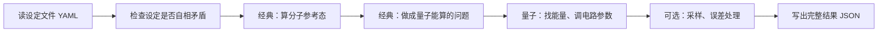
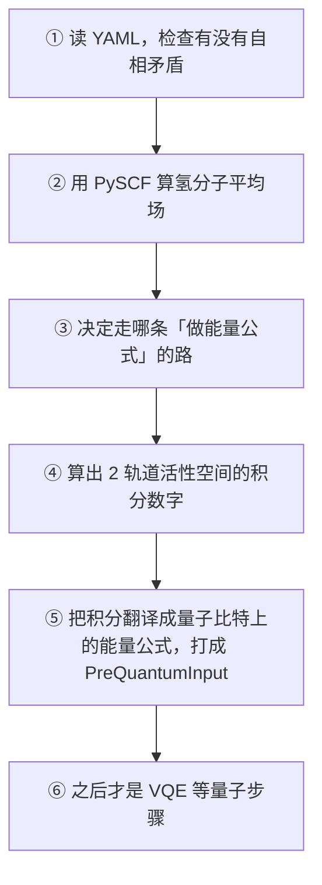

# qchem-stack 学习路线图（通俗版）

这份文档回答三件事：

1. **这个仓库在干什么**（用日常语言，不堆缩写）
2. **`scripts/` 里每个脚本是干什么的**
3. **`src/qchem_stack/` 里主要文件夹和文件是干什么的**

更偏工程契约、对外功能对照表的内容，仍请看 [README.md](../README.md) 和 [ENGINEERING_ARCHITECTURE.md](ENGINEERING_ARCHITECTURE.md)。本文是**入门地图**，不是论文附录。

**多经典化学后端接入**（PySCF / Psi4 / 自研 driver）：先读 [multi_backend_integration_philosophy.md](execution/multi_backend_integration_philosophy.md)，实现 `AOBasisView` 时对照 [external_driver_ao_basis_view.md](execution/external_driver_ao_basis_view.md)，用 `python scripts/integration_checklist.py --driver <id> --config <yaml> [--run-scf]` 做 smoke 评审。

---

## 一、这个仓库在干什么（一句话 + 一张图）

**一句话**：你写一份「实验设定」（YAML 文件），程序会按顺序做这些事——先在普通电脑上算分子的经典近似 → 把问题缩小并变成量子计算机能用的形式 → 用量子算法找能量 → 可选地再用「带噪声的采样」重算一遍 → 把结果整理成能存档、能写进论文附录的 JSON。

**类比**：像做一道菜——备料（经典计算）→ 切配（变成量子问题）→ 下锅（量子算法）→ 装盘（整理结果）。`orchestration/` 是**厨房总调度**，不负责每道菜的具体切法；切法在 `chem/` 和 `quantum/` 里。



**三个习惯（避免读代码时迷路）**：

| 习惯 | 说明 |
|------|------|
| 先读 `chem/`，再读 `quantum/`，最后读 `orchestration/` | 总调度文件里**没有**积分怎么算的公式；别在 `pipeline.py` 里找化学细节 |
| `pre_quantum_stage.py` 可以不看 | 只是把 `chem` 里的函数再导出一次，没有新逻辑 |
| 改「走哪条路」的选项时，要同步文档 | 运行 `python scripts/sync_pre_quantum_docs.py`（见下文脚本说明） |

---

## 二、`scripts/` 脚本说明（逐个）

下面按「日常会不会用到」分组。路径都在仓库根目录的 `scripts/` 下。

### 2.1 新人最常碰到的

| 脚本 | 用大白话说它在干什么 | 典型用法 |
|------|----------------------|----------|
| **`venv-run`** | 用**指定的 Python** 跑后面的命令（避免装错环境） | `./scripts/venv-run pytest tests -q` |
| **`smoke_pipeline.py`** | **冒烟测试**：用自带的示例设定跑通整条流水线，看能不能正常结束、有没有能量输出 | `python scripts/smoke_pipeline.py`；没装 PySCF 时用 `--precomputed-only` |
| **`minimal_pipeline_viz.py`** | 跑一遍最简单的氢分子示例，并画一张图（能量各阶段、各步耗时） | 需要 matplotlib；适合第一次「看见」全流程 |
| **`sync_pre_quantum_docs.py`** | 根据**代码里的选项列表**，自动更新两篇技术文档里的表格；防止文档和代码对不上 | 改了「进入量子前的分支」枚举后必须跑；CI 会检查 |

### 2.2 做离线经典数据、打包用的

| 脚本 | 用大白话说它在干什么 | 典型用法 |
|------|----------------------|----------|
| **`build_precomputed_bundle.py`** | 把别人算好的经典结果（能量、轨道、Pauli 项等）打成**一个 JSON 包**，之后设定里写「用离线包、不再现场算经典」 | 经典在别的机器算完，本仓库只做量子部分时 |
| **`sample_pipeline_configs.py`** | 对**多份**示例设定逐个跑流水线，做回归检查（怕改代码把别的例子弄坏） | 维护者、发版前 |
| **`check_parity_export_sample.py`** | **不真正跑化学**，只检查「导出给对外功能表用的 JSON」格式对不对 | CI / 本地快速检查 |

### 2.3 对外功能表、统计、报告（偏维护者）

| 脚本 | 用大白话说它在干什么 |
|------|----------------------|
| **`export_parity_criteria_table.py`** | 根据一份设定（和可选的一次运行结果），生成**结构化 JSON**，用来和「我们承诺支持哪些功能」对照 |
| **`count_parity_matrix_main_tables.py`** | 统计文档里功能对照表的大致规模（给项目管理用） |
| **`l3_algorithm_benchmark_report.py`** | 生成算法对比报告用的数据包（论文/Methods 表格式） |
| **`resource_estimation_demo.py`** | 演示：根据 Pauli 测量计划，粗算需要多少 shot、大概花多少钱（演示用） |

### 2.4 检查质量、契约、编码

| 脚本 | 用大白话说它在干什么 |
|------|----------------------|
| **`check_solver_adapter_contract.py`** | 检查你新写的「经典求解器插件」是否满足统一接口（该有哪些字段、该怎么报错） |
| **`check_cross_solver_parity.py`** | 可选：对比 PySCF 和 Psi4 算出来的氢氟能量是否接近（两个经典程序互相印证） |
| **`check_comparative_execution_backlog.py`** | 检查里程碑 YAML 是否写得规范（项目计划用） |
| **`verify_ninety_day_gates.sh`** | 跑一批和「九十天门禁」相关的检查（Shell 包装） |
| **`normalize_repo_text_utf8.py`** | 把仓库里文本文件统一成 UTF-8，减少乱码 |

### 2.5 演示、脚手架、其它

| 脚本 | 用大白话说它在干什么 |
|------|----------------------|
| **`create_solver_adapter_scaffold.py`** | **生成新经典后端**的空白代码骨架（省得从零建文件） |
| **`demo_mock_external_backend.py`** | 演示：注册一个假的量子后端，跑通插件模式流水线 |
| **`run_qpe_track_demo.py`** | 演示相位估计相关轨道（和主流水线分开的 demo 包） |

---

## 三、源码大文件夹是干什么的（`src/qchem_stack/`）

把每个顶层文件夹想成**一个部门**。

| 文件夹 | 部门在干什么 | 你什么时候需要读它 |
|--------|--------------|-------------------|
| **`config/`** | 读 YAML、变成程序里的「设定对象」、检查设定是否矛盾；嵌套结构与 [config 约定](config_校验分层约定.md) / [字段索引](config_字段索引.md) | 改设定、加新开关时；先读 `embedding` 样板再读 `quantum` 嵌套 |
| **`chem/`** | **经典化学**：算分子、缩小活性空间、导出积分、变成量子哈密顿量 | 改「进入量子之前」的逻辑时（重点） |
| **`quantum/`** | **量子算法**：VQE、ADAPT、激发态等；只关心已经给好的哈密顿量 | 改怎么找能量、怎么扩电路时 |
| **`backends/`** | **在哪台机器/哪个模拟器上跑电路**（精确模拟 vs 带 shot 的 Qiskit 等） | 换模拟器、算 shot 成本时 |
| **`protocols/`** | **第二遍量子实验**：用采样重复估能量、分组测量、和对外承诺的导出格式 | 设定里打开「Pauli 协议」时 |
| **`orchestration/`** | **总指挥**：按顺序调用上面各部门，记日志，写最终大 JSON | 看「一次实验从头到尾」时（建议最后读） |
| **`repro/`** | 把结果写成**严格、可 diff 的 JSON**（写论文、审计用） | 交付、复现时 |
| **`contracts/`** | 各种数据包的**版本名字**（例如「这是第 1 版 pre_quantum 输入」） | 改数据格式时 |
| **`jobs/`** | 异步任务、SQLite 存任务状态（类似「提交作业再取结果」） | 用 HTTP API 或后台跑任务时 |
| **`api/`** | 用网页接口提交设定、查运行状态 | 做 Web 集成时 |
| **`mitigation/`** | 减轻噪声影响的策略（例如零噪声外推） | 真机或带噪声模拟时 |
| **`integrations/`** | 和外部工具/demo 的衔接（预览图、benchmark 等） | 按需 |

---

## 四、进入量子计算之前：讲给人听（配氢分子例子）

**本节讲到哪为止**：从读 YAML，到程序准备好「交给量子算法的那一包数据」为止。**还不包括** VQE、在模拟器上跑电路、按 shot 采样等（那些见 §4.3 及以后）。

**适合谁**：要给同事、学生讲「这段代码在干什么」，对方不一定熟量子化学术语。建议一边打开 `configs/example_h2.yaml`，一边按 **§4.0** 往下讲；需要查函数时再到 IDE 里跳转。

**怎么自己跑一遍**：

```bash
./scripts/venv-run python scripts/smoke_pipeline.py
```

程序会读 `configs/example_h2.yaml`，走完经典部分和量子前打包；后面才会做 VQE 等（本文不展开）。

---

### 先弄懂这几个词（后面会反复出现）

| 词 | 用大白话解释 |
|----|----------------|
| **YAML / 设定文件** | 一份「实验说明书」，用人能改的文本写好：算什么分子、用哪个经典程序、活性空间多大、量子用啥算法等。 |
| **经典计算** | 在普通 CPU 上用的分子量子化学（不是真量子机）。本仓库里主要是 **PySCF** 这类程序。 |
| **SCF / 平均场** | 先算一个「单电子图像」：每个电子在其它电子平均场里运动，得到**总能量**和一套**分子轨道**（可以粗想成「电子最常待的轨道形状」）。氢分子例子里用的是 **RHF**（Restricted Hartree–Fock，闭壳层、两个电子自旋配对）。 |
| **活性空间** | 大分子不可能每个轨道都放到量子机上。你只挑 **少数几个轨道 + 里面的电子** 做精细关联，其余轨道冻结或近似掉。`example_h2.yaml` 里是 **2 个轨道、2 个电子**（常写成 2o2e）。 |
| **积分** | 描述「电子在这几个轨道里怎么相互作用」的一堆数字（不是微积分课里的 ∫）。有了积分，才能写出这个 маленький 子系统的能量公式。 |
| **哈密顿量 / 能量算符** | 量子算法要最小化或测量的那个「能量公式」。在代码里最终会变成很多 **Pauli 项**（每个量子比特上是 X、Y、Z 或 I 的组合，再乘一个系数）。 |
| **量子比特** | 量子计算机上的「位」。2 个**空间**轨道用 Jordan–Wigner 映射后，会变成 **4 个量子比特**（因为每个轨道有自旋 ↑↓）。 |
| **PreQuantumInput（量子前输入包）** | 程序内部的一个**标准包裹**：里面装着经典参考结果 + 已经写好的「用量子比特表示的能量公式」+ 一些说明字段。后面的 VQE **只认这一包**，不再直接碰 PySCF。 |
| **orchestration（编排）** | **厨房调度**：只负责「先洗菜再切菜再下锅」的顺序、记时、写日志；**不负责**积分公式怎么推。 |
| **chem（化学层）** | **洗菜、切菜**：真的去算分子、导出积分、变成量子比特上的能量公式。 |

---

### 4.0 故事版：氢分子例子从头到尾（`configs/example_h2.yaml`）

#### 4.0.1 这份说明书在经典阶段要求什么

`example_h2.yaml` 是仓库里最常用的入门例子：**两个氢原子、小基组、活性空间很小**，跑得快，适合讲流程。

| 说明书里的块 | 氢分子例子里写的 | 用人话解释「程序会干什么」 |
|--------------|------------------|---------------------------|
| **`molecule`** | 两个 H，距离约 1.4 bohr，基组 `sto-3g` | 告诉程序：算 **H–H**，用**很小的基组**（算得快，精度够做演示）。 |
| **`scf`** | `driver: pyscf`，`method: RHF` | 用 **PySCF** 做一步平均场计算，得到**一个总能量**和**分子轨道**。 |
| **`active_space`** | 2 轨道、2 电子；映射 `jordan_wigner` | 只对 **2 个轨道里的 2 个电子** 写精细能量公式；并约定：这 2 个轨道以后怎么「翻译」成量子比特上的算符（Jordan–Wigner 是一种常用翻译规则）。 |
| **`embedding`** | `mode: none` | **不做**大分子嵌入、Schmidt、片段投影等高级套路——就是「全分子上取这 2 个活性轨道」，最简单的一条路。 |
| **`quantum` / `backend` 等** | 例如 `algorithm: vqe` | 会一起读进内存，但 **算分子和做量子前打包时还不会用**；要等经典部分做完，才轮到 VQE。 |

对这份 YAML，程序内部会判定：走 **「现场算活性空间积分」** 那条默认路（代码里叫 `canonical_active_space_integral_pack`，只要知道是**最常见的新手路**即可）。

#### 4.0.2 五道菜：量子之前到底做了哪几件事

对照第一节的类比：



下面按 **①～⑤** 展开：每一关**解决什么问题**、**留下什么数据**、**主要代码在哪个文件**。

---

#### ① 读说明书，提前发现「配错了」

**要解决什么问题**  
避免「跑到半夜才发现：你开了 Schmidt 但求解器不支持」这类浪费。

**程序怎么做**

1. 脚本或命令行调用 `load_experiment_config("configs/example_h2.yaml")`（`config/io.py`）。
2. 把 YAML 转成内存里的 **`ExperimentConfig`** 对象（`config/experiment.py`）——可以想成「一份结构化的实验设定」，后面全程只传这一个对象。
3. 构造时跑一堆检查（`config/_experiment_validation.py`），例如：离线经典包不能和「现场再算后 HF」混用；某些嵌入模式必须配合 RHF 等。

**氢分子例子**  
`embedding: none` + `driver: pyscf` → 检查通过。此时 **还没调用 PySCF**，只是确认「这份说明书合法」。

**你可以跟别人这样说**  
「读 YAML 不是翻译一下就结束，而是先当质检员：组合不支持的选项直接报错，别等算了一小时再崩。」

---

#### ② 用经典程序算分子：得到「参考态」

**要解决什么问题**  
量子算法需要知道：电子大致待在哪些轨道上、经典参考能量是多少。这些信息来自 **平均场（SCF）** 计算。

**程序怎么做（调用链，从外到内）**

1. 总调度 `run_pipeline_sync`（`orchestration/pipeline.py`）调用 `run_scf_stage`（`orchestration/stage_execution.py`）。
2. `run_scf_stage` 里调用 `run_scf_reference`（`orchestration/scf_stage.py`）。
3. 再进入化学层的统一入口 `classical_mean_field_via_solver_bridge`（`chem/bridges/facade.py`）：根据 YAML 里的 `scf.driver` 选求解器（`chem/solvers/registry.py` → `chem/solvers/pyscf_solver.py` 或 `chem/solvers/psi4_solver.py` 等）。
4. 平均场结果被包成 **`ClassicalMeanFieldReference`**（`chem/bridges/reference_factory.py` 调用 `mean_field_reference.py`）——对上游来说，**不管底层是 PySCF 还是 Psi4，长得都一样**。

**这一步留下什么**

- **总能量** `e_tot`（氢分子在这个基组下的 RHF 能量，单位原子单位 au）。
- **经典参考态容器** `ClassicalMeanFieldReference`（内部 `MeanFieldLike` 包装各后端的 MF 对象；量子阶段不直接碰原始 PySCF/Psi4 句柄）。
- **`driver_meta`**：备注，例如「这次是 PySCF 算的」「活性空间策略是 manual」等（由 `reference_factory` + `active_space/mean_field_meta` 写入）。

**同一步还会做的小件事**

- `build_energy_components_v1`：把核能、溶剂等拆成条目，方便最后写进 JSON 报告。
- 氢分子默认设定下，`refine_mean_field_for_active_space` **一般不会改轨道**（除非你打开 AVAS、CASSCF 轨道优化之类的高级开关）。

**氢分子例子**  
算的是 **全分子** 的 RHF；YAML 里写的「2 轨道 2 电子」**不会**在这一步被改掉——只是为后面第 ④ 步划定「要在哪几个轨道里写能量公式」。

**你可以跟别人这样说**  
「SCF 不是量子计算，就是普通电脑上算一个『电子大概怎么分布』的底稿；后面所有积分都基于这套轨道。」

---

#### ③ 选一条路：能量公式从哪儿来

**要解决什么问题**  
大项目里不只有一种做法：可以现场算积分、可以用别人算好的 JSON、可以对超大分子做嵌入……程序要先 **判路**，再调用对应的建造逻辑。

**程序怎么做**

1. `build_pre_quantum_stage`（`orchestration/stage_execution.py`）调用化学层的 `build_pre_quantum_input_with_context`（`chem/pre_quantum_build.py`）。
2. 先用 `resolve_pre_quantum_path(cfg)`（`chem/pre_quantum_path.py`）看 YAML：  
   - 是不是 `driver: precomputed`？→ 离线包路  
   - `embedding.mode` 是不是 `plugin` / `projection`？  
   - `embedding.dmet.hamiltonian_source` 是不是 `schmidt_atomic_production`？（nested schema v2）  
   - 都不是 → **默认：现场活性空间积分路**
3. 再从登记表 `get_pre_quantum_branch_builder`（`chem/pre_quantum_builder_registry.py`）取出这一条路对应的函数去执行。

**氢分子例子**  
走 **默认路** → 执行 `_build_pre_quantum_from_canonical_pack`。

**你可以跟别人这样说**  
「`pre_quantum_path` 像路口指示牌；`builder_registry` 像『每条路派哪个施工队』。`embedding` 自 nested schema v2 起按 `mode` 分子块（`dmet` / `projection` / `plugin`），详见 [`docs/说明_embedding配置.md`](说明_embedding配置.md)。」

**其它四条路（知道有就行，氢分子用不到）**

| 路 | 什么时候走 | 和默认路的区别（大白话） |
|----|------------|--------------------------|
| 默认：现场活性空间 | PySCF/Psi4 在线算，嵌入关着 | 自己算 SCF → 自己抽 2o2e 积分 → 自己翻译成 Pauli |
| 离线包 | YAML 写 `scf.driver: precomputed` | 经典部分不算，读别人给的 JSON，要对得上 YAML |
| 插件分解 | `embedding.mode: plugin` + `embedding.plugin.*` | 能量公式主要来自外部 JSON，不现场从 SCF 推 |
| Schmidt 生产 | `embedding.dmet.hamiltonian_source: schmidt_atomic_production` | 先做大分子嵌入，在「杂质区」建哈密顿量 |
| 投影片段 | `embedding.mode: projection` + `embedding.projection.quantum_hamiltonian: fragment_mulliken_mo` | 在分子**片段**上取活性空间 |

---

#### ④ 在 2 个活性轨道里，算出「能量公式需要的数字」（积分）

**要解决什么问题**  
量子机不会帮你算「电子在轨道 a、b 上怎么相互作用」。这些相互作用要先在经典程序里变成 **积分（一堆数）**，再在第 ⑤ 步翻译成 Pauli 项。

**程序怎么做**

1. 进入 `_build_pre_quantum_from_canonical_pack`（`chem/pre_quantum_build.py`）。
2. 先问：当前求解器能不能导出「限制性活性空间」的积分？不能就直接报错（避免算到一半才发现 Psi4 这条路还没接好）。
3. 调用 `CanonicalActiveSpaceIntegralPack.from_classical_reference(...)`（`chem/bridges/canonical_integral_pack.py`）：  
   - 根据参考态上的标签（例如 `pyscf`）去 **`integrals/exporter_registry.py`** 找「导出员」；  
   - 氢分子用的是 **`pyscf_active_space_exporter.py`**：从 PySCF 对象里抽出 2 轨道的一体、二体积分等。  
4. 若同一次运行里重复要同一套积分，**`run_build_cache.py`** 会缓存，避免算两遍。

**这一步留下什么**

一个叫 **`CanonicalActiveSpaceIntegralPack`（标准积分包）** 的东西：

- **`compact`**：紧凑存放的积分数字；
- **`provenance`**：说明书式的备注——谁算的、用的哪套桥接版本等（方便复现和对表）。

**氢分子例子**  
2 个空间轨道 → 积分规模很小；这一步通常很快。

**你可以跟别人这样说**  
「积分包是经典和量子之间的『中间语种』：换 PySCF 还是 Psi4，只要都能产出同一种格式的积分包，后面翻译成 Pauli 的代码不用改。」

---

#### ⑤ 把积分翻译成「量子比特上的能量公式」，打成 PreQuantumInput

**要解决什么问题**  
量子算法（VQE 等）只懂：**在若干量子比特上，测量由 X/Y/Z 组成的算符的期望值**。所以要把第 ④ 步的积分，变成 **Pauli 项列表**（每项 = 一串 X/Y/Z/I + 一个系数）。

**程序怎么做**

1. `molecular_hamiltonian_from_canonical_active_space_pack`（`chem/hamiltonian.py`）读积分包，按 YAML 里的 `jordan_wigner` 做映射（借助 OpenFermion 库）。
2. 得到 **`QubitHamiltonian`**：  
   - 需要几个量子比特 `n_qubits`；  
   - `terms`：每个 Pauli 字符串对应系数；  
   - `meta`：指纹、参考 SCF 能量、积分从哪来等。
3. 再和经典参考态一起，装进 **`PreQuantumInput`**（`chem/pre_quantum_input.py`），并写上 `meta`（例如 `source` 表示走了哪条路、`hamiltonian_fixed_before_variational` 表示变分前能量公式已固定）。

**氢分子例子**  
2 个空间轨道 → **4 个量子比特**；Pauli 项很少，适合教学。

**编排层收尾**

- `build_pre_quantum_stage` 打日志：`hamiltonian_built`，并记下用了几个量子比特。
- 最后写入结果 JSON 时，会有 `pre_quantum_input` 的**摘要**（完整 Pauli 列表在对象里，摘要里常见指纹、轨道数等）。

**你可以跟别人这样说**  
「到 PreQuantumInput 为止，**量子算法需要的『题目』已经出好了**：几道量子比特、能量公式长什么样、经典参考能量是多少。后面的 VQE 只是在找电路参数，让测量能量尽量低。」

**分界线（讲的时候一定要点出来）**  
`pipeline.py` 里，**紧接着的下一步**是 `run_variational_stage`——那已经是 **§4.3 量子阶段**，不再调用 PySCF。

---

#### 4.0.3 带人读代码：建议停下来的 6 个位置

在 `orchestration/pipeline.py` 的 `run_pipeline_sync` 里，按顺序看：

| 顺序 | 停在哪 | 此时内存里应该有什么 |
|------|--------|----------------------|
| 1 | `load_experiment_config` 返回后 | `ExperimentConfig`，还没算分子 |
| 2 | `run_scf_stage` 返回后 | `ClassicalMeanFieldReference`，有 RHF 能量 |
| 3 | `resolve_pre_quantum_path` | 知道氢分子走「默认现场积分」路 |
| 4 | `from_classical_reference` 返回后 | 积分包 `CanonicalActiveSpaceIntegralPack` |
| 5 | `molecular_hamiltonian_from_canonical_active_space_pack` 返回后 | `QubitHamiltonian`，例如 4 个量子比特 |
| 6 | `build_pre_quantum_stage` 返回后 | 完整的 `PreQuantumInput` |

边读边跑测试：

```bash
./scripts/venv-run pytest tests/test_pre_quantum_path.py tests/test_build_pre_quantum_input_api.py -q
```

---

#### 4.0.4 一张表：氢分子例子里，文件分工（量子之前）

| 文件夹 / 文件 | 用一句话说职责 |
|---------------|----------------|
| `config/io.py` | 读 YAML，变成 `ExperimentConfig` |
| `config/experiment.py` | 定义说明书里有哪些栏目 |
| `config/_experiment_validation.py` | 开工前质检 |
| `orchestration/pipeline.py` | 总调度：先经典、再打包、再量子 |
| `orchestration/stage_execution.py` | 给「算分子」「做量子前包」包一层计时和日志 |
| `orchestration/scf_stage.py` | 启动经典求解器的那一步 |
| `chem/bridges/facade.py` | **全仓库只有一个**「去算 SCF」的主入口 |
| `chem/bridges/reference_factory.py` | SCF 结果 → `ClassicalMeanFieldReference` + active-space meta |
| `chem/solvers/registry.py` | 按 YAML 选 PySCF / Psi4 / 离线包 |
| `chem/solvers/pyscf_solver.py` | PySCF 适配器（`compute_mean_field` / `get_integrals`） |
| `chem/solvers/psi4_solver.py` | Psi4 适配器 |
| `chem/pre_quantum_path.py` | 判走哪条路 |
| `chem/pre_quantum_build.py` | 按路施工：积分 → Pauli → 打包 |
| `chem/pre_quantum_input.py` | 定义「交给量子的那一包」长什么样 |
| `chem/hamiltonian.py` | 积分翻译成 Pauli |
| `chem/integrals/*` | 各经典程序怎么导出积分包 |
| `orchestration/pre_quantum_stage.py` | **可跳过**：只是把 chem 里的函数再导出一次 |

---

### 4.1 设定与检查 — `config/`（说明书部门）

**嵌套 YAML 与代码风格标准（改 config 必读）：** [config_校验分层约定.md](config_校验分层约定.md)；包内索引 [src/qchem_stack/config/README.md](../src/qchem_stack/config/README.md)。

| 文件 | 用大白话：干什么 | 和谁配合 |
|------|------------------|----------|
| **`experiment.py`** | 规定一份实验说明书有哪些栏目（分子、经典、活性空间、量子、后端…），并变成 Python 对象 | 全流程只读这一个 `ExperimentConfig` |
| **`io.py`** | 从磁盘读 YAML；也是脚本、`run_pipeline_from_config` 的入口 | 读完就触发检查 |
| **`_experiment_validation.py`** | **开工前质检**：组合不支持的选项直接报错 | 会查「你选的路」求解器能不能走 |
| **`scf.py`** | 经典用谁算（pyscf / psi4 / 离线包）、RHF 还是别的 | `solvers/registry` |
| **`active_space.py`** | 几个活性轨道、几个电子、怎么映射到量子比特 | `pre_quantum_build`、`hamiltonian` |
| **`embedding.py`** | 要不要嵌入、Schmidt、投影等 | `pre_quantum_path` 判路时用 |
| **`geometry_files.py`** | yaml 写了 `geometry_file` 时，在进 `MoleculeSpec` 前把 `.xyz` 展开成 `symbols` + `coordinates` | [说明_geometry_files源码学习.md](说明_geometry_files源码学习.md) |
| **`molecule.py` 等** | 原子坐标、基组、电荷；`coordinates_in_bohr()` 做单位换算 | 建分子时用 |

**没有这一层会怎样**：每个人自己读 YAML，字段名不一致，有的错误跑到一半才出现。

---

### 4.2 经典化学 — `chem/`（洗菜切菜部门）

#### 4.2.1 编排层怎么调用 chem（仍算「量子之前」）

| 文件 | 用大白话 | 输入 → 输出 |
|------|----------|-------------|
| **`orchestration/pipeline.py`** | 总指挥：`run_pipeline_sync` 按顺序调用下面各步 | 设定 → 最终结果字典 |
| **`orchestration/stage_execution.py`** | 给「算分子」「做量子前包」记时、打阶段日志 | 中间结果对象 |
| **`orchestration/scf_stage.py`** | 发起经典计算 | 设定 → 经典参考态 |
| **`orchestration/pre_quantum_stage.py`** | **没有新逻辑**，可跳过 | 转发 chem |
| **`orchestration/precomputed_stage.py`** | 处理「用离线 JSON」时的路径和对账 | 离线包相关 |

**记一句**：`orchestration` = 顺序 + 日志 + 写 JSON；**公式和积分都在 `chem/`**。

#### 4.2.2 「交给量子的那一包」——核心文件

| 文件 | 用大白话 | 备注 |
|------|----------|------|
| **`pre_quantum_path.py`** | 看 YAML，决定走五条路里的哪一条 | 和文档、测试共用同一份「路名」 |
| **`pre_quantum_build.py`** | 按选的路，做完「积分 → Pauli → 打包」 | 氢分子默认路的主要逻辑在这里 |
| **`pre_quantum_input.py`** | 定义 `PreQuantumInput` 里有什么字段；导出摘要给 JSON | VQE 通过 `VariationalRunContext` 读这一包 |
| **`pre_quantum_builder_registry.py`** | 每条路登记一个施工函数；新路只登记、不改总流程 | |
| **`hamiltonian.py`** | 把积分变成 `QubitHamiltonian`（Pauli 列表） | 量子目录里不应再 `import pyscf` |

**`PreQuantumInput` 里，讲的时候可以这样分**

| 里面有什么 | 讲的时候怎么说 |
|------------|----------------|
| `qubit_hamiltonian` | **题目本身**：量子算法要优化的能量公式 |
| `classical_reference` | **参考答案的底稿**：经典总能量、谁算的 |
| `canonical_active_space_integral_pack` | 默认路会有：**经典侧的中间产物**，方便审计「积分从哪来」 |
| `meta` | **标签**：走了哪条路、变分前公式是否已固定等 |

#### 4.2.3 经典谁算、积分谁导

| 文件 | 用大白话 |
|------|----------|
| **`solvers/registry.py`** | 根据 YAML 的 `scf.driver` 选「哪家经典厂」 |
| **`solvers/base.py`** | 每个厂声明自己能干啥（能不能 Schmidt、能不能导出活性空间积分…） |
| **`bridges/facade.py`** | 全仓库**唯一**「去算 SCF」的门口 |
| **`bridges/reference_factory.py`** | SCF pack → `ClassicalMeanFieldReference` + active-space meta |
| **`solvers/pyscf_solver.py`** | PySCF 后端适配器 |
| **`solvers/psi4_solver.py`** | Psi4 后端适配器 |
| **`drivers/`** | **Deprecated** — 仅 legacy `PySCFDriver` 兼容；新代码勿用 |
| **`integrals/exporter_registry.py`** | 换经典程序时，只要新登记一个「积分导出员」 |
| **`integrals/pyscf_active_space_exporter.py`** | PySCF 版导出员 |
| **`bridges/canonical_integral_pack.py`** | 统一格式的积分包 |
| **`bridges/mean_field_reference.py`** | 统一的经典参考态外观 |
| **`bridges/run_build_cache.py`** | 同一次运行别重复算同一套积分 |
| **`precomputed_*.py`** | 读离线 JSON，并和 YAML 对账 |
| **`bridges/ao_basis_view.py`** | 后端中性的 AO/MO 视图；Schmidt/AVAS 等路径经此而非 PySCF MF gate |

#### 4.2.4 嵌入相关（氢分子默认不用，但要会说）

| 文件 | 用大白话 | 氢分子 |
|------|----------|--------|
| **`embedding/hamiltonian_semantics.py`** | 给结果打语义标签（方便对外对表） | 会写入 meta |
| **`embedding/decomposition_plugin.py`** | 插件路：读外部 Pauli | 不用 |
| **`embedding/projection_hamiltonian.py`** | 投影片段路 | 不用 |
| **`embedding/schmidt_production.py`** | Schmidt / DMET 相关 | 不用 |
| **`active_space/*.py`** | 可选：AVAS、CASSCF 轨道优化 | 默认不开 |
| **`embedding/dmet.py` 等** | 大体系 DMET；**很多在变分之后才做审计** | 别和「变分前题目已出好」混在一块讲 |

---

### 4.3 量子算法 — `quantum/`

| 文件 | 干什么 | 和谁配合 |
|------|--------|----------|
| **`variational_plugins/spec.py`** | 定义变分算法需要的输入（设定、哈密顿量、执行器、上一阶段的包）和输出（能量、电路角度） | 流水线塞数据；各算法只读这一份 |
| **`variational_plugins/registry.py`** | 根据设定里的「算法名字」找到对应函数并执行 | 内置 VQE、ADAPT、IQEB 等 |
| **`variational_plugins/builtins.py`** | 把名字接到具体算法文件 | 调用 `algorithms/`、`variational_branch` |
| **`excited_plugins/registry.py`** | 激发态 sidecar（VQD / QSE / SCEOM）插件调度 | `orchestration/excited_stages.py` 调用 |
| **`variational_branch.py`** | UCCSD vs HEA 共享分支（VQE 基态 + VQD `prepare_state`） | `builtins` 与 `excited_plugins/builtins` |
| **`algorithms/vqe.py`** | 最常见的：**调电路参数让能量尽量低** | 用 `backends` 里的执行器算期望值 |
| **`algorithms/adapt.py`、`iqeb.py`** | 逐步加算符、加深电路的算法 | 用 `operator_pool_registry.py` 里的「候选算符池」 |
| **`algorithms/uccsd_vqe.py`** + **`algorithms/uccsd_mapping.py`** | UCCSD 变分 ansatz 与 JW/BK 映射层 | `variational_branch`；需 `pauli.use_protocol: false` |
| **`algorithms/excited*.py`** | 激发态算法类（VQD、QSE、SCEOM） | 经 `excited_plugins/builtins` 接线 |
| **`statevector.py`** | HEA statevector 与 dense Pauli 期望 | 采样协议、激发态 HEA 路径 |

**配置读取约定**：插件 runner 通过 `config.quantum_helpers` 窄化读取 YAML，不在算法模块里解析 YAML。

**这里不该出现**：`import pyscf`、再去判断「用的是不是 PySCF」——经典的事在 `chem/` 已经做完了。

风格与 import 细节见 [`docs/quantum_模块风格约定.md`](quantum_模块风格约定.md)。

---

### 4.4 在哪跑电路、怎么采样 — `backends/` + `protocols/`

| 文件 | 干什么 |
|------|--------|
| **`backends/spec.py`** | 描述「用哪个模拟器、多少 shot」等 |
| **`backends/factory.py`** | 根据设定造出真正的执行器对象 |
| **`backends/executor_base.py`** | 执行器的统一接口：给定角度，算能量 |
| **`backends/qiskit_executor.py` 等** | 各平台具体实现 |
| **`backends/pauli_grouping.py` 等** | 把很多 Pauli 测量项合并成几组，少测几次 |
| **`protocols/protocol.py`** | **变分已经找到角度之后**：用采样再估一遍能量、记账本（可选噪声处理） |
| **`protocols/product_contract.py`** | 对外导出 JSON 时，键名和含义的约定 |

**分工记一句**：

- **变分阶段**：往往在精确模拟器上把参数调好（快、准）。
- **Pauli 协议阶段**（设定里打开时）：模拟真机那样用有限次测量估能量。

---

### 4.5 总指挥 — `orchestration/`

| 文件 | 干什么 | 要不要精读 |
|------|--------|------------|
| **`pipeline.py`** | **`run_pipeline_sync`**：一次实验的主函数，从头到尾串起来 | **要**，但建议**最后**读 |
| **`stage_execution.py`** | 把「算经典」「做量子前打包」包一层：记时、打日志 | 要 |
| **`scf_stage.py`** | 调用经典求解器，得到参考态 | 中 |
| **`precomputed_stage.py`** | 处理离线包路径 | 用离线包时再看 |
| **`pre_quantum_stage.py`** | 仅转发 `chem` 的函数 | **可跳过** |
| **`embedding_workflow_stage.py`** | 变分之后的嵌入侧车、审计 | 做 DMET 时 |
| **`excited_stages.py`** | 激发态 sidecar 调度（委托 `quantum.excited_plugins`） | 算激发态时 |
| **`protocol_finalize_stage.py`** | Pauli 协议、误差处理、写资源统计 | 开协议时 |
| **`repro_*.py`** | 版本号、快照、人类可读的运行摘要 | 写论文、对表时 |

**`pipeline.py` 整条线的 5 步**（氢分子例子；前两步用人话见 **§4.0.2**）：

1. **经典阶段** — 算分子平均场，得到参考态  
2. **量子前打包** — 积分 → 量子比特上的能量公式 → `PreQuantumInput`  
3. **变分（VQE 等）** — 调电路参数  
4. （可选）嵌入侧车、激发态  
5. （可选）Pauli 采样协议 + 整理 repro  

---

### 4.6 其它小但重要的

| 文件 | 干什么 |
|------|--------|
| **`repro/export.py`** | 导出 JSON 时不悄悄把奇怪对象变成字符串（方便 diff） |
| **`exceptions.py`** | 区分「设定/能力不对」和一般报错 |
| **`chem/pre_quantum_docs_sync.py`** | 给 `sync_pre_quantum_docs.py` 提供要写入文档的表格内容 |

---

## 五、推荐阅读顺序（按天，可放慢）

**依赖关系**：设定 → 经典化学（含量子前打包）→ 量子算法 → 后端与采样协议 → 总指挥。

### 第 0 步：先能跑通（半天）

1. 读 `configs/example_h2.yaml`，对照 `config/experiment.py` 看字段含义。  
2. 运行：`./scripts/venv-run python scripts/smoke_pipeline.py`  
3. 可选：`./scripts/venv-run python scripts/minimal_pipeline_viz.py` 看图。

### 第 1 步：量子之前（2～4 天，重点）

1. **先讲懂故事**：用 **§4.0** 把氢分子五道菜（读 YAML → SCF → 判路 → 积分 → Pauli → PreQuantumInput）能给别人复述一遍。  
2. **再对照代码**：按 §4.0.3 的 6 个断点跟 `pipeline.py`；不懂的词回看 §4 开头的「先弄懂这几个词」。  
3. **最后扫文件表**：§4.1 `config`、§4.2 `chem` 当索引，不必背函数名。

每读一个模块，跑 `tests/test_pre_quantum_*`。

**讲完别人应能答**：经典算完留下什么？积分包是干啥的？`PreQuantumInput` 和 PySCF 对象的分工？离线包和现场算有啥区别？

### 第 2 步：量子算法（2～3 天）

`variational_plugins/spec.py` → `registry.py` → `builtins.py` → `algorithms/vqe.py`。

**读完应能回答**：变分算法拿到的「整包数据」里，能量算符以哪个字段为准？

### 第 3 步：采样与协议（按需 1～2 天）

`backends/factory.py` → `protocols/protocol.py`（浏览主流程即可）。

### 第 4 步：总指挥（1～2 天，放最后）

`stage_execution.py` → `pipeline.py` 里的 `run_pipeline_sync`。

---

## 六、常用命令（带注释）

```bash
# 用项目约定的 Python 跑测试
./scripts/venv-run pytest tests/test_pre_quantum_path.py -q

# 冒烟：整条流水线能否跑通
./scripts/venv-run python scripts/smoke_pipeline.py

# 没有 PySCF 时，用离线包例子
./scripts/venv-run python scripts/smoke_pipeline.py --precomputed-only

# 改过分支枚举后，同步文档（提交前必做）
python scripts/sync_pre_quantum_docs.py
```

---

## 七、各条学习主线（自选）

| 你想做的事 | 先看什么 |
|------------|----------|
| 最快跑通氢分子 VQE | `example_h2.yaml`、`hamiltonian.py`、`algorithms/vqe.py` |
| 算激发态 | `algorithms/excited.py`、`example_h2_excited_smoke.yaml` |
| 真机/shot 成本 | `backends/`、`protocols/protocol.py` |
| 接 Web 或后台任务 | `api/app.py`、`jobs/`、`pipeline.py` |
| 加新的「进入量子前」路线 | §4.2 整段 + `exporter_registry` + `builder_registry` |

---

## 八、和「编排层还在不在」有关的说明

| 说法 | 对不对 |
|------|--------|
| 进入量子前的化学细节已经搬到 `chem/` | **对** |
| `pre_quantum_stage.py` 可以不看 | **对**（只是转发） |
| 整个 `orchestration/` 可以不看 | **错** — 完整实验仍从 `pipeline.py` 进入 |
| 学习时要先啃 `pipeline.py` | **不必** — 先懂 `chem` 和 `quantum`，最后把它当「总菜单」 |

---

## 九、想深入时再打开的文档

| 文档 | 什么时候看 |
|------|------------|
| [技术文档_双线路经典输入与统一PreQuantumInput契约.md](技术文档_双线路经典输入与统一PreQuantumInput契约.md) | 要精确理解「交给量子的那一包」里每个字段 |
| [pre_quantum_yaml_matrix.md](pre_quantum_yaml_matrix.md) | 查哪些 YAML 组合合法 |
| [ENGINEERING_ARCHITECTURE.md](ENGINEERING_ARCHITECTURE.md) | 分层规则、HTTP、严格 JSON 导出 |
| [public_parity_matrix.md](public_parity_matrix.md) | 和对外功能承诺对照时 |

---

## 十、维护说明

- 本文档路径：`docs/学习路线图_框架理论到源码阅读顺序.md`
- 改 `PreQuantumPath` 等枚举后：运行 `python scripts/sync_pre_quantum_docs.py` 并提交文档变更
- 架构大改以 [ENGINEERING_ARCHITECTURE.md](ENGINEERING_ARCHITECTURE.md) 为准
