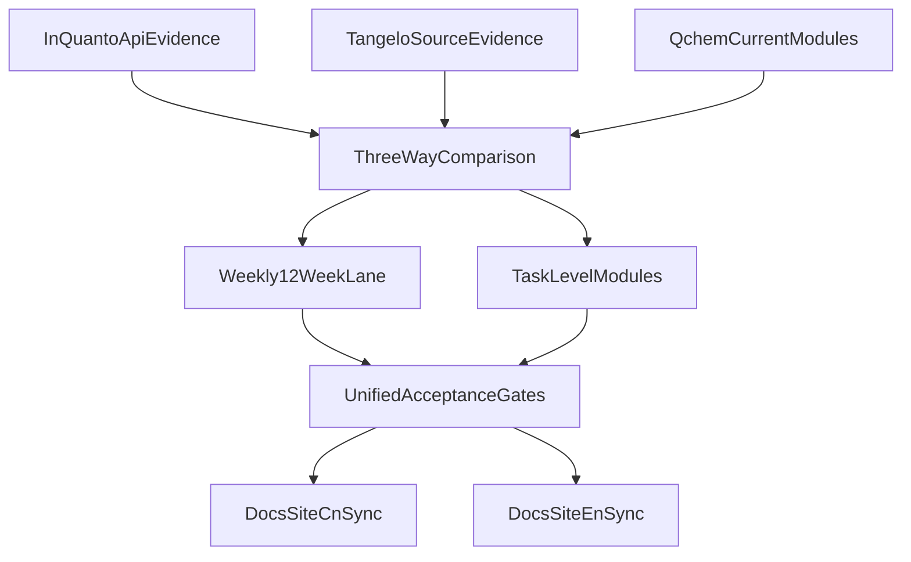

# InQuanto-PySCF × Tangelo 对比与实施总计划

## 0. 目的与适用范围

本文为单一权威实施文档，面向以下目标：

1. 以公开可核验证据对照 InQuanto `inquanto-pyscf` API、Tangelo 源码、`qchem_stack` 当前实现。
2. 形成“差距 -> 借鉴 -> 落地”的闭环，不停留在概念层。
3. 给出可执行实施计划，包含两条并行视图：
   - 周历视图（12 周，里程碑与闸门）
   - 任务级视图（到模块/接口/测试/回滚）

边界声明：

- 本计划对齐层级为 L1（公开文档与开源代码可核验层），不宣称闭源 L0 数值/对象同构。
- 不覆盖 Quantinuum 真云服务、硬件校准与商业二进制等非公开可检证能力。

---

## 1. 证据来源

### 1.1 InQuanto 公开 API（核心锚点）

来源：`https://docs.quantinuum.com/inquanto/api/extensions/inquanto-pyscf_api.html`

重点能力面（用于后续逐项比对）：

- 活性空间策略：`AVAS`、`CASSCF`、`frozen` 组合。
- 多系统输出：`get_system()`、`get_system_ao()`、`get_lowdin_system()`。
- 经典基准：`run_hf/mp2/ccsd/casci`。
- 嵌入与子系统：`EmbeddingGamma*`、`get_subsystem_driver()`、`from_mf()`。
- RDM/校正接口：`get_casci_12rdms`、`get_casci_1234pdms`、`get_nevpt2_correction`、`get_ac0_correction`。
- 过程控制：`set_checkfile`、`set_level_shift`、`set_max_scf_cycles`、`make_actives_contiguous`。

### 1.2 Tangelo 源码（架构借鉴锚点）

核心文件（上游开源）：

- `tangelo/toolboxes/molecular_computation/integral_solver.py`
- `tangelo/toolboxes/molecular_computation/integral_solver_pyscf.py`
- `tangelo/toolboxes/molecular_computation/molecule.py`

可借鉴架构模式：

- `IntegralSolver` 三方法抽象：`set_physical_data` / `compute_mean_field` / `get_integrals`。
- `get_default_integral_solver()` + named solver 选择机制。
- `SecondQuantizedMolecule` 统一承载 active/frozen、UHF/RHF、积分折叠、费米子哈密顿量。
- QMMM 通过 solver 子类扩展，不污染主分子流程。

### 1.3 当前仓库实现（对照锚点）

关键模块：

- `src/qchem_stack/chem/drivers/pyscf_driver.py`
- `src/qchem_stack/config.py`
- `src/qchem_stack/chem/molecular_problem.py`
- `src/qchem_stack/chem/restricted_integral_operator.py`
- `src/qchem_stack/integrations/rdm_corrections.py`
- `src/qchem_stack/chem/embedding/dmet.py`
- `src/qchem_stack/chem/embedding/decomposition_plugin.py`
- `src/qchem_stack/chem/inquanto_driver_surface.py`
- `src/qchem_stack/protocols/inquanto_contract.py`

---

## 2. 三方能力对照矩阵（InQuanto / Tangelo / qchem_stack）

| 维度 | InQuanto 公开面 | Tangelo 源码模式 | `qchem_stack` 现状 | 差距性质 | 直接借鉴动作 |
|---|---|---|---|---|---|
| 后端抽象层 | driver 家族化 | `IntegralSolver` 协议化 | 单 `PySCFDriver` | 架构级差距 | 引入 `ChemIntegralSolver` 协议 + registry |
| 后端选择 | 名称化入口 | `get_default_integral_solver` | `scf.driver` 仅 `pyscf` | 扩展性差距 | 增加 provider 能力探测与回退策略 |
| 活性空间策略 | AVAS/CASSCF/manual 多策略 | freeze/active 统一管理 | `manual/cas/avas_stub` | 能力深度差距 | 将 AVAS 升级为真实策略插件 |
| AO/MO/Lowdin 多视图 | `get_system*` 多视图 | 分子对象统一转换 | 已有 `get_system_ao/get_lowdin_system` | 小-中差距 | 保持多视图，明确“何时 dense 展开”契约 |
| 紧凑积分存储 | `symmetry=s1/s4/s8` | frozen folding + reduction | compact 容器已实现 | 中差距 | 增加 compact->dense 触发点与成本标注 |
| PBC/k 点 | Gamma 与 momentum 分层 | 分子主线，PBC较弱 | `run_pbc_rhf` + kmesh + kindex | 中差距 | 补 PBC 语义元数据与回归矩阵 |
| 后HF基准 | run_hf/mp2/ccsd/casci 标准化 | 同对象衍生哈密顿量 | `run_classical_benchmarks` 已有 | 小差距 | 扩展失败分类与方法可用性报告 |
| RDM 与高阶校正 | CASCI/CCSD RDM + NEVPT/AC0 入口 | `energy_from_rdms` 统一回算 | `RDMBundle` + stub + `pyscf_nevpt2_casci` | 中高差距 | 定义量子RDM输入协议并贯通 correction kernel |
| 嵌入/子系统 | embedding driver 家族化 | solver 可插拔 | DMET/Schmidt/plugin 基础骨架 | 中高差距 | fragment solver SPI 升级与最小可跑主线 |
| QMMM/环境 | driver 内建语义 | `IntegralSolverPySCFQMMM` 子类 | 仅 ddCOSMO | 明显差距 | 新增 QMMM solver adapter（不侵入主 driver） |
| SCF 工程控制 | checkfile/init/level_shift 等 | chkfile/newton/broken-sym 处理 | 目前 `max_cycle` 为主 | 中差距 | 扩展 SCF control block 与审计元数据 |
| 开壳层完备性 | RHF/ROHF/UHF 各分支 | UHF 细粒度积分路径 | 已有三分支入口，细节不足 | 中差距 | 增加开壳层专项测试集与契约字段 |
| 可视化导出 | cube/report/json | 对象导向报告 | `df` 与 `run_summary` 为主 | 低优先 | 可选补可视化导出接口 |
| 多开源软件可接入性 | 扩展包驱动 | solver 协议天然支持 | 当前 PySCF 单栈 | 战略差距 | 第二后端 PoC 验证架构可迁移性 |

结论：

- 现阶段核心问题不是“没有功能”，而是“多后端可扩展内核尚未成型”。
- 应优先完成协议层抽象，再做 AVAS 深化、第二后端接入和嵌入/校正深水区。

---

## 3. 优先级分层与里程碑

### 3.1 分层

- P0（架构地基）：后端抽象、统一问题对象、能力声明。
- P1（PySCF 深化）：AVAS、SCF 控制、开壳层、RDM桥接。
- P2（第二后端）：以 Psi4 为第一目标验证跨后端设计。
- P3（生态化）：插件 SPI、更多开源后端、nightly 兼容矩阵。

### 3.2 里程碑定义

- M1：完成协议层抽象并保持 PySCF 行为不回归。
- M2：PySCF 深化完成，形成稳定可维护标准实现。
- M3：第二后端最小闭环通过，具备跨后端回归基线。
- M4：插件化与持续兼容机制上线。

---

## 4. 详细实施（周历，12 周）

| 周次 | 主题 | 主要产出 | 验收门槛（DoD） | 风险与缓解 |
|---|---|---|---|---|
| W1 | 架构重构启动 | `ChemIntegralSolver` 协议草案，registry 草案 | 协议评审通过，旧路径可并行保留 | 破坏兼容 -> 先 adapter 包装 |
| W2 | PySCF adapter 接入协议 | `PySCFIntegralSolverAdapter` 初版 | 现有最小样例不回归 | 语义漂移 -> 增加契约快照测试 |
| W3 | 统一问题对象 | `ChemistryProblemBundle` + pipeline 接口适配 | VQE 主路径可跑通 | 对象重复 -> 旧结构只读兼容层 |
| W4 | SCF 控制块 | chkfile/init_guess/level_shift/newton 参数贯通 | 分子分支可设置并写入 meta | 参数组合爆炸 -> 限定首批支持矩阵 |
| W5 | 活性空间深化 I | AVAS 策略插件接口 + `avas_stub` 迁移路径 | `manual/cas/avas` 三策略可配置 | AVAS 数值不稳 -> 先小体系白名单 |
| W6 | 活性空间深化 II | AVAS 首批可用实现 + 文档 caveat | 至少 2 个分子案例回归 | 版本差异 -> 记录 PySCF 版本门槛 |
| W7 | RDM 桥接 I | `QuantumRDMInput` 协议 + 来源元数据 | RDMBundle 兼容迁移完成 | 数据不一致 -> 添加 schema 校验 |
| W8 | RDM 桥接 II | correction kernel 统一入口（stub/nevpt2） | correction 报告字段固定 | 失败不可解释 -> 增强失败分类 |
| W9 | 第二后端 PoC I | `Psi4IntegralSolverAdapter` 最小实现 | 小体系可出 h1/h2/constant | 依赖安装复杂 -> CI optional lane |
| W10 | 第二后端 PoC II | 跨后端对比脚本与容差基线 | 3 个标准算例通过 | 数值差异大 -> 设方法级容差档位 |
| W11 | 插件化与嵌入SPI | fragment solver SPI v2 + 示例插件 | plugin 路径可跑通并导出 | 插件失控 -> 能力声明与安全校验 |
| W12 | 收口与签字 | 文档、测试、导出、矩阵同步 | 全量闸门通过，形成发布说明 | 文档漂移 -> docs/docs-site 同步检查 |

---

## 5. 详细实施（任务级，模块/接口/测试）

### 5.1 任务组 A：后端抽象与统一对象（P0）

**A1. 新增求解器协议与能力声明**

- 目标文件：
  - `src/qchem_stack/chem/solvers/base.py`（新建）
  - `src/qchem_stack/chem/solvers/registry.py`（新建）
- 交付：
  - `class ChemIntegralSolver(Protocol)`：`set_physical_data`、`compute_mean_field`、`get_integrals`
  - `SolverCapabilities`：`supports_uhf`、`supports_pbc`、`supports_qmmm` 等
- 测试：
  - `tests/test_solver_registry_contract.py`（新建）
- 回滚：
  - 保留 `PySCFDriver` 旧入口，不删除旧调用点

**A2. 统一问题对象**

- 目标文件：
  - `src/qchem_stack/chem/problem_bundle.py`（新建）
  - `src/qchem_stack/chem/molecular_problem.py`（改造适配）
- 交付：
  - `ChemistryProblemBundle`（constant/h1/h2/space/state/meta）
  - 与 `RestrictedActiveSpaceQuantumProblem` 的桥接
- 测试：
  - `tests/test_problem_bundle_compat.py`（新建）
- 回滚：
  - bundle 作为增量层，不替换现有 dataclass 名称

### 5.2 任务组 B：PySCF 深化（P1）

**B1. PySCF adapter 化**

- 目标文件：
  - `src/qchem_stack/chem/solvers/pyscf_solver.py`（新建）
  - `src/qchem_stack/chem/drivers/pyscf_driver.py`（保留编排角色）
- 交付：
  - 计算逻辑下沉到 solver adapter
  - driver 负责配置与 pipeline 协调
- 测试：
  - `tests/test_pyscf_solver_adapter.py`（新建）

**B2. SCF 控制增强**

- 目标文件：
  - `src/qchem_stack/config.py`
  - `src/qchem_stack/chem/drivers/pyscf_driver.py`
- 交付：
  - `scf` 增加 `init_guess/chkfile/level_shift/use_newton/diis_space`
  - `driver_meta` 写入控制参数回显
- 测试：
  - `tests/test_pyscf_driver_meta_contract.py`（扩展）

**B3. 活性空间 AVAS 升级**

- 目标文件：
  - `src/qchem_stack/chem/active_space/`（新建目录）
  - `src/qchem_stack/config.py`（策略参数扩展）
- 交付：
  - `manual/cas/avas` 统一策略接口
  - `avas_stub` 仍保留，作为兼容策略
- 测试：
  - `tests/test_active_space_strategy_unified.py`（扩展）
  - `tests/test_avas_stub_pipeline_meta.py`（已有基础上升级）

### 5.3 任务组 C：RDM 与校正桥接（P1）

**C1. 量子 RDM 输入协议**

- 目标文件：
  - `src/qchem_stack/chem/rdm_bundle.py`
  - `src/qchem_stack/integrations/rdm_corrections.py`
- 交付：
  - `rdm_basis`、`rdm_source`、`spin_model` 强制字段
  - 校正接口统一接受 `RDMBundle`
- 测试：
  - `tests/test_rdm_bundle_contract.py`（新建）

**C2. correction kernel 统一入口**

- 目标文件：
  - `src/qchem_stack/integrations/rdm_corrections.py`
  - `src/qchem_stack/orchestration/pipeline.py`
- 交付：
  - `stub_nevpt2/stub_ac0/pyscf_nevpt2_casci` 共用入口与报告 schema
- 测试：
  - `tests/test_phase_bc_pipeline_wiring.py`（扩展）
  - `tests/test_energy_components_pipeline.py`（扩展）

### 5.4 任务组 D：第二后端 PoC（P2）

**D1. Psi4 最小 adapter**

- 目标文件：
  - `src/qchem_stack/chem/solvers/psi4_solver.py`（新建）
  - `src/qchem_stack/config.py`（driver 枚举扩展）
- 交付：
  - RHF + 分子积分最小闭环
- 测试：
  - `tests/test_psi4_solver_smoke.py`（新建，允许 skip）

**D2. 跨后端一致性基线**

- 目标文件：
  - `scripts/check_cross_solver_parity.py`（新建）
  - `tests/test_backend_conformance.py`（扩展）
- 交付：
  - 3 个小体系容差对比报告
- 测试：
  - CI optional job（依赖可选）

### 5.5 任务组 E：插件 SPI 与嵌入升级（P3）

**E1. fragment solver SPI v2**

- 目标文件：
  - `src/qchem_stack/chem/embedding/dmet.py`
  - `src/qchem_stack/chem/embedding/decomposition_plugin.py`
- 交付：
  - 标准输入输出协议（含能量账本、RDM、失败语义）
- 测试：
  - `tests/test_decomposition_plugin_pipeline.py`（扩展）
  - `tests/test_dmet_fragment_exact.py`（扩展）

---

## 6. 验收闸门（每阶段统一）

1. `python -m pytest`（含新增契约测试）通过。
2. `python scripts/check_parity_export_sample.py` 通过。
3. `repro.parity_snapshot` 与 `run_summary` 未新增未注册字段。
4. `docs/` 与 `docs-site` 回链一致，中文/英文语义一致。
5. 里程碑收口页记录风险与残余项，不把 `partial` 冒充 `yes`。

---

## 7. 风险清单与缓解

| 风险 | 影响 | 缓解方案 | 触发回滚条件 |
|---|---|---|---|
| 积分约定错位（PySCF/OpenFermion） | 能量系统偏移 | 固化 `integral_convention` 回归集 | 小体系基准偏差超阈值 |
| UHF/ROHF 分支回归 | 开壳层不可用 | 开壳层专项测试矩阵 | 任一开壳层主路径失败 |
| PBC 复数路径误处理 | 隐性数值错误 | 严格虚部阈值 + 报错 | 出现 silent cast |
| SCF 控件组合复杂 | 配置不可控 | 限定首批支持组合 + 能力声明 | 组合导致不可重现结果 |
| 第二后端引入依赖脆弱 | CI 不稳定 | optional lane + skip 策略 | 主 CI 受影响 |
| 文档双站漂移 | 维护成本上升 | 单母稿 + docs-site 摘要回链 | 关键结论不一致 |

---

## 8. 与现有文档关系

- 本文为“实施主计划”文档，聚焦 InQuanto-PySCF × Tangelo × 本仓三方落地。
- 战略叙事与年度台账仍以既有文档为准：
  - `docs/竞争定位与路线图_对标Quantinuum产品与技术路线.md`
  - `docs/与InQuanto能力差距与实施计划.md`
- docs-site 页面仅保留摘要与入口，避免双写漂移。
- **深水区里程碑**（Fragment SPI v2、真实 AVAS、Tangelo 三方法协议对齐、Psi4 全路径）拆分与 DoD：**[里程碑_后端深化与嵌入SPI_v2.md](./里程碑_后端深化与嵌入SPI_v2.md)**（与本文周历并行：主计划定方向，里程碑文档定收口闸门）。

---

## 9. 执行图（周历 + 任务级双轨）

