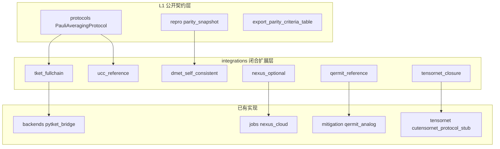

# qchem_stack 工程记忆：与 Quantinuum / InQuanto 公开路线对标及优化路线图

- 能力矩阵：`docs/inquanto_public_parity_matrix.md`
- **开放栈「记忆 + 缺口清单」**：见本文 **[§13](#13-开放栈对标完成度与待闭合项原独立记忆合并)**。
- **DMET / `parity_snapshot` 契约**：[技术文档_DMET与parity_snapshot开放契约.md](技术文档_DMET与parity_snapshot开放契约.md)
- **详细技术说明（本包）**：[技术文档_CircuitIR与TKET桥接及作业契约.md](技术文档_CircuitIR与TKET桥接及作业契约.md)（`CircuitIR`↔pytket、资源双轨、`JobHandle`/`protocol_hash`、与 Nexus **语义**类比）
- 异步提交/拉结果短表：`docs/launch_retrieve_nexus_analog.md`
- **HTTP + SQLite 队列 + 可观测性（契约）**：[技术文档_HTTP_API与SQLite作业队列及可观测性契约.md](技术文档_HTTP_API与SQLite作业队列及可观测性契约.md)
- **HTTP 维护决策与 Checklist**：[技术文档_HTTP_API与SQLite作业队列及可观测性契约.md](技术文档_HTTP_API与SQLite作业队列及可观测性契约.md) **§9**（原 `记忆_HTTP_API与作业队列_工程记忆.md` 已合并）

---

---

## 0. 闭源边界与可复现层级（合并收录；原 `架构_InQuanto闭源能力闭合与可复现边界.md`）

### 1. 必须先写清的「复现」含义

| 层级                  | 含义                                                                 | 本项目是否追求                                   |
| ----------------------- | ---------------------------------------------------------------------- | -------------------------------------------------- |
| **L0 二进制等价**     | 与未公开的 InQuanto wheel / Nexus 私有 API 完全一致                  | **否**（无源码与合同则无意义）                   |
| **L1 公开契约等价**   | 与官方文档/API/教程描述的对象流、阶段、字段语义一致                  | **是**（当前主目标）                             |
| **L2 数值比特级等价** | 同一输入下单次实验数值逐比特一致                                     | **通常**否（依赖随机性、闭源优化器、私有编译器） |
| **L3 统计与资源等价** | 在相同测量计划、门集、shots 模型下，能量/方差/资源表在允许误差内一致 | **可作为**论文级对照目标                         |

**结论**：所谓「闭合」闭源产品，在工程上应落实为：**用开放栈覆盖公开文档中可检证的全部工作流关节**，并对照公开仓库（`qnexus`、`pytket-quantinuum`、教程）做行为回归；**不**声称替代未公开的算法默认与商业后端实现。

**对「完全复现功能与细节」的答复**：若理解为与 InQuanto **闭源 wheel / 内部默认 / 全部 driver 组合**在功能与数值上完全一致，则属于 **§1 表中的 L0/L2**，在无源码、无许可与无对照实验协议的前提下**不应立项为可交付 KPI**。可交付的是：**选定子能力**（例如某一类嵌入、某一算法族、某一缓解图语义）在 **L1/L3** 下的逐项加深，并对照公开资料或可逆合成基准验收。

---

### 2. 六大难点的逐条剖析（证据与可闭合方式）

### 2.1 默认 TKET box 全链

**闭源侧究竟难在哪**：教程强调 `build` 保留 `pytket` boxes，再在 `compile` 阶段统一 `rebase` 与优化（见 InQuanto Protocols 文档）。

**可闭合部分**：逻辑电路 → `pytket.Circuit` → `depth`/`depth_2q`/native 门统计 →（可选）`get_compiled_circuit`。

**不可闭合部分**：与 InQuanto 私有 `preoptimize_passes` 实现细节完全一致；离子阱上最终 routing 与 Quantinuum 私有 pass 包。

**开放实现策略**：见 `qchem_stack.integrations.tket_fullchain`：在已有 `pytket_bridge` 上增加「全链位」——统一入口、缺失门类清单、与 `CircuitIR` 对齐的扩展表。

### 2.2 chemically aware UCC 默认

**闭源侧究竟难在哪**：官方文档描述激发**重组**以降低两比特门数（有 overhead  trade-off），属于**合成策略**，不是仅「是否有 UCCSD」。

**可闭合部分**：同一活性空间下的 **UCCSD 费米子生成元集合**、JW 后的 Pauli/线路复杂度对照、与 HEA/ADAPT 的**门数对比表**（Methods 可写）。

**不可闭合部分**：与 InQuanto 内部完全相同的 regrouping 与 Trotter 剖分；未公开常数与启发式。

**开放实现策略**：见 `qchem_stack.integrations.ucc_reference`：`IdentityRegrouping`（基线）+ 可插入的 `ChemicallyAwareUCCPolicy` 协议；未来可接论文 2210.14834 的可公开算法实现。

### 2.3 真 Nexus / qnexus 与 HQC

**闭源侧究竟难在哪**：账户、项目、编译产物上传、队列、HQC 计价与配额在**商业域**。

**可闭合部分**：`pip install qnexus` 后的**客户端可导入性**、与本地 `repro` 并行的**job 元数据侧车**、保留现有 `nexus_cloud` HTTP mock。

**不可闭合部分**：无 API Key/合同时的真实提交成功；HQC 数值与官方账单比特级一致。

**开放实现策略**：见 `qchem_stack.integrations.nexus_optional`：纯探测 API，不把密钥写入仓库；业务调用在用户的应用层组合。

### 2.4 完整 DMET 自洽循环

**闭源侧究竟难在哪**：多 fragment 与环境势更新、经典/量子 fragment solver 切换、收敛判据与数值稳定性。

**可闭合部分**：**状态机与数据契约**（bath → fragment 求解 → 全局更新）、自洽轮数进 `repro`、与 `EmbeddingSpec` 对齐的 falsifiability 字段。

**不可闭合部分**：与某篇文献或 InQuanto 私有 DMET 默认参数完全一致而不设验证集。

**开放实现策略**：见 `qchem_stack.integrations.dmet_self_consistent`：`DMETSelfConsistencyLoop` 协议 + `OneShotEmbeddingDriver`（单轮、用于 CI）；真实循环由用户注入 `FragmentSolverProtocol` 与 bath 更新规则。

### 2.5 Qermit 商业运行时（MitRes / MitEx）

**闭源侧究竟难在哪**：图调度、与硬件批处理对齐的**同步屏障**、闭源二进制。

**可闭合部分**：本校已有 `qermit_analog`（DAG 报告）+ `qermit_runtime`（线性执行）；对外统一说明「**行为类比**」与「**非** CQCL 二进制」。

**不可闭合部分**：与 Qermit 完全相同的数值缓解曲线与延迟模型。

**开放实现策略**：见 `qchem_stack.integrations.qermit_reference`：字段级映射表 + 何时用 `mitigation.execution_class = sync_graph` 的自述。

### 2.6 cuTensorNet 化学收缩「等价物」

**闭源侧究竟难在哪**：`inquanto-cutensornet` 与 GPU 栈深度绑定；化学哈密顿量到 TN 的图构造多为产品内逻辑。

**可闭合部分**：同一 Pauli/哈密顿量下的 **期望值在 SV/TN 双轨**上交叉检查（小体系）；`allow_partial` 语义在 stub 中已有对应思想。

**不可闭合部分**：与大体系 scalable TN chem 完全同构的收缩图与精度。

**开放实现策略**：见 `qchem_stack.integrations.tensornet_closure`：闭合策略枚举 + 与 `tensornet/cutensornet_protocol_stub` 的对接说明。

---

### 3. 推荐分层架构（与代码目录对应）

---

### 4. 验收：怎样算「闭合成功」

1. **工作流**：`tutorial_inquanto_chain_h2.yaml` 级链 + 可选 extras（pytket / qnexus）探测通过。
2. **元数据**：`compiler_bundle_signature`、`hamiltonian_fingerprint`、`protocol_counts` 支撑集、PMSV 三元组齐全。
3. **扩展点**：DMET/UCC/Qermit/Nexus/TN 均有 **Protocol/探测函数**，可在无商业合同时 CI 绿灯。
4. **文档**：本文 + `inquanto_contract.inquanto_gap_categories()` 同步更新口径；**维护用记忆与缺口清单**见 [工程记忆_Quantinuum对标与数据流技术文档.md](工程记忆_Quantinuum对标与数据流技术文档.md) **§13**；**DMET/`parity_snapshot` 字段契约**见 [技术文档_DMET与parity_snapshot开放契约.md](技术文档_DMET与parity_snapshot开放契约.md)。

---

### 5. 与 README「不对齐」声明的关系

本仓库**继续**不声称 L0；在 L1/L3 上通过上述层持续增厚。若 Quantinuum 公开新 API，优先更新 `integrations.*` 与 parity 导出，而非猜测闭源内部。

---

## 1. 纵向物化链在本工程中的落点

竞品文强调：可对标深度在「哪一层把数学对象物化成电路与测量统计」，而非「有没有 VQE」。

| 物化阶段        | 竞品要点                                        | `qchem_stack` 现状                                                                                                                                                                                                                                                       | 备注                                                                                                                                                                                                              |
| ----------------- | ------------------------------------------------- | -------------------------------------------------------------------------------------------------------------------------------------------------------------------------------------------------------------------------------------------------------------------------- | ------------------------------------------------------------------------------------------------------------------------------------------------------------------------------------------------------------------- |
| 积分与活性空间  | 同一组轨道、同一 JW/BK、同一常数/冻结核         | `molecular_hamiltonian_from_classical_reference` → JW `QubitOperator`；`FermionSpace` 元数据                                                                                                                                                                                          | 可扩展：显式在`QubitHamiltonian.meta` 中序列化积分来源、CAS 标签、映射名                                                                                                                                          |
| 费米子 → Pauli | 门综合复杂度与测量复杂度分叉                    | `PauliAveragingProtocol` + `build_measurement_plan`                                                                                                                                                                                                                      | 与 UCC/ADAPT 线路深度分开追踪（parity 矩阵已承认）                                                                                                                                                                |
| Protocol        | instantiate→build→compile→run→evaluate；支撑集与 shots   | `PauliAveragingProtocol`（`protocols/protocol.py`）+ `dataframe_circuit_shot_rows`                                                                                                                                                                                          | `run()` 在 **默认** 路径用 `HamiltonianExpectationExecutor` 精确期望 + `energy_stderr_model=conservative_sum_bound_equal_shots`；可选 **`run_sampled`**（statevector 分组 MC）或 **`run_qiskit_shots`**（`get_counts`），三者互斥（见 [技术文档_设备比特串与Qiskit采样路径.md](技术文档_设备比特串与Qiskit采样路径.md) 与本文 **§4**）。资源行 depth/2Q：见 **§11** 与 [技术文档_CircuitIR与TKET桥接及作业契约.md](技术文档_CircuitIR与TKET桥接及作业契约.md)（自研 `spec` vs 可选 **pytket** 双轨） |
| 缓解            | PMSV 有效样本、方差权衡；竞品另有 Qermit 产品图 | `PMSVConfig` + `filter_shots_pmsv`；**机读** `mitigation/qermit_analog.py`（DAG，`qermit_analog_v2`）+ `mitigation/qermit_runtime.py`（`mitigation_dag_execution` 线性迹）；ZNE **`MitigationSpec.zne_scales`** 接协议 `zne_scales`；仍会报 retention / stderr（见 §7） | **非** Qermit 商业运行时；ZNE 仍为标度 stub，真多电路放大见 §7「优化」                                                                                                                                           |
| Embedding       | DMET 量子在 fragment                            | `chem/embedding/dmet.py`；`EmbeddingSpec.dmet_hamiltonian_source`（`parity_stub` / `whole_active_system` 单片段真 VQE）；`repro.parity_snapshot` 中 `dmet_*`；`integrations/dmet_self_consistent` 自洽骨架                                                               | 与竞品 §4 一致：论文需写清自洽轮数与经典基线档；**多片段 bath DMET 仍依赖用户钩子**                                                                                                                              |

---

## 2. 可证伪判据表 → 本工程自检清单

竞品「§7 判据表」建议任何对标至少固定：几何、活性空间、映射、哈密顿量常数、目标量、估计器（分组/shots）、缓解、编译门集、经典强相关基线。

**本工程已具备的复现钩子**：

- YAML 实验配置 + `collect_repro_metadata`（config SHA、包版本）。
- `protocol_hash`、`SqliteJobStore` 作业载荷。
- `resource_summary`：`sum_shots`、`max_depth`、`sum_twoq` 等。

**首轮已落地（判据表友好）**：

- `repro.parity_snapshot`：`pauli_grouping`、`shots_per_circuit`、`target_energy_stderr`（YAML `backend.target_energy_stderr`）、缓解与编译字段、以及 `hamiltonian_meta`（含 JW 映射名与活性空间）；**嵌入**：`embedding_mode`、`n_scf_cycles_embedding`、`classical_reference_method`、`embedding_fragment_labels`（来自 `ExperimentConfig.embedding`）。
- `QubitHamiltonian.meta`：`fermion_to_qubit_map`、`integral_source`、`n_active_*`。

**仍建议后续补齐**：

1. 论文级导出：单表汇总「判据表 §7」各行取值，由脚本从 `ExperimentConfig` + protocol 结果生成。

---

## 3. 激发态：与竞品三算法的差距与路线

竞品文核心：**VQD** 是三通道（objective / weight / overlap）估计问题；**QSE** 是 \(O(K^2)\) 个 \(H_{ij},S_{ij}\) 与广义本征；**SCEOM** 是 EOM 型 \(M\) 矩阵与相关激发流形。

| 算法  | 竞品抽象                                  | 本工程                                                                                                                       | 差距                                               |
| ------- | ------------------------------------------- | ------------------------------------------------------------------------------------------------------------------------------ | ---------------------------------------------------- |
| VQD   | 三`Protocol`、重叠线路、粒子数守恒 ansatz | 优化仍单目标；`vqd_channels[*].three_protocol` 分 **objective / overlap / weight** 报告（可选 shots；重叠为 swap-test 模型） | 缺：优化内环三线路严格解耦、粒子数守恒 ansatz      |
| QSE   | `QSEMatricesComputable` 式打包            | `qse_transition.py` + `run_from_vqe_hea_basis_pauli_transitions`（逐 $(i,j)$ Pauli 贡献 + `QSEPauliTransitionSchedule`）     | 缺：fermionic 激发池与 InQuanto composite 完全同构 |
| SCEOM | shot-\(M\)、分析 DataFrame                | `run_sceom_nested_commutator` / `from_hea`：嵌套对易子 \(M\) + 可选矩阵噪声；仍为 Pauli 玩具 \(S\)                           | 缺：文献费米激发算符、自洽迭代、全部分析 DataFrame |

### 3.1 激发态与 `repro.run_summary`（主线 pipeline）

完成管线后，`orchestration.pipeline._attach_run_summary` 在对应阶段实际运行时写入 Methods 友好键：

| 键                               | 含义                                                                                                                                                 |
| ---------------------------------- | ------------------------------------------------------------------------------------------------------------------------------------------------------ |
| `vqd_three_protocol_present`     | 任一`vqd.meta.vqd_channels[*]` 含 `three_protocol`（与 `scripts/export_parity_criteria_table.py` 中 `vqd_three_protocol_present_from_run` 判定一致） |
| `vqd_reused_pipeline_ground`     | VQD 复用 variational 基态角标（既有）                                                                                                                |
| `qse_shot_mode`                  | YAML`quantum.qse_shot_mode`（`exact` / `gaussian_h` / `pauli_transitions`）；`out["qse"].meta` 同步写入同名键                                        |
| `qse_shot_noise_model`           | 当 QSE meta 含`shot_noise_model` 时_mirror（`gaussian_h` / `pauli_transitions` 路径）                                                                |
| `sceom_shot_noise_model`         | SCEOM meta：`none` / `symmetric_gaussian_on_real_M` 等（`quantum/algorithms/sceom.py`）                                                              |
| `sceom_shots_per_matrix_element` | YAML 预算_echo                                                                                                                                       |

**回归**：`tests/test_orchestration_pipeline.py`（`test_run_pipeline_sync_h2_vqd_yaml_shots`、`test_run_pipeline_sync_h2_qse_sceom_yaml`、`test_run_pipeline_sync_h2_qse_pauli_transitions_run_summary`）。**Export**：`--results` 合并时若 `repro.run_summary` 已含上列键，脚本另输出 `vqd_three_protocol_present_from_run_summary`、`qse_shot_mode_from_run_summary`、`sceom_shot_noise_model_from_run_summary`。

**与 `PauliAveragingProtocol` 的咬合方向（推荐实现顺序）**：

1. **QSE 矩阵元协议**：对固定子空间基，引入 `TransitionPauliProtocol`（或扩展现有 plan）：对每组 \((i,j)\) 与 Pauli 项 \(P_p\)，估计 \(\langle\phi_i|P_p|\phi_j\rangle\)；在类上复用 `build_measurement_plan` 的**分组思想**，但测量态为 \(U_j|0\rangle\) 与 \(U_i|0\rangle\) 的线性组合——需选定分解（Hadamard test / LCU 等）并在文档中固定。
2. **VQD**：将 `overlap_penalty` 拆成 `PauliAveragingProtocol`（能量）+ 独立 `OverlapSquared` 估计模块；YAML 中 `shots_budget_vqd: {objective, overlap, weight}`。
3. **SCEOM**：在文献锚点不变前提下，先实现「小体系 \(M\) 稠密参考」与「Pauli 展开 \(M_{ij}\)」的符号层，再挂 shot 估计。

---

## 4. Protocol `run` 语义与竞品「evaluate」差异（重要）

### 4.0 五阶段状态机（与 InQuanto 公开「阶段」叙事对齐）

`PauliAveragingProtocol` 使用 `ProtocolPhase` 枚举：`instantiate` → `build` → `compile` → `run` → `evaluate`（见 `protocols/protocol.py`）。**管线内**（`orchestration/pipeline.py::_protocol_for_job`）在单进程路径上依次调用：`proto.build(...)` → `proto.compile()` → `proto.run()` → `proto.evaluate()`；其中 **`run` 写入 `proto._counts`**（含 `expectation` / `expectation_source` / `energy_stderr_model` 等），`evaluate` 返回最终能量并与 `dataframe_circuit_shot_rows` 的资源表一致。**异步 Pauli pickle 作业**仍走同一协议对象序列化，由 worker 在 `dispatch_job` 中恢复执行。

**与「整条化学管线」的关系**：`run_pipeline_sync` 的 `pipeline_profile` 阶段名（`scf_done`、`variational_done`、`pauli_protocol_done` 等）描述 **SCF→变分→嵌入→激发→Pauli 协议** 的粗粒度墙钟；**不**与 `ProtocolPhase` 枚举一一字面同名，但 `pauli_protocol_*` 段对应本节的五阶段块。

当前 `PauliAveragingProtocol.run()`（`protocol.py`）：

- 能量均值来自 `executor.expectation_hea(...)`（statevector / 模拟器为**精确**或后端定义的单标量）。
- `energy_stderr`、`total_shots_budget` 来自 `energy_estimate_with_uncertainty` 的**经典保守界**，不是从有限 shot 样本重估 \(\langle H\rangle\)。

竞品 InQuanto：`run` 产生测量 DataFrame，`evaluate_expectation_value` 在**同一支撑集**上做线性重组。

**优化建议**：

- **文档**：README 与本节已写明：机读字段 `expectation_source`、`energy_stderr_model` 见 `PauliAveragingProtocol._counts`。
- **二轮已落地**：`PauliAveragingProtocol.run_sampled` + `backends/pauli_shot_sim.py`：在 statevector 上对分组 Pauli 做同时（或 greedy 下逐项）采样重组能量；`_counts` 中 `expectation_source=grouped_shot_simulation_statevector`。YAML：`quantum.run_sampled_pauli_protocol`。
- **Qiskit 真比特串已落地**：`run_qiskit_shots` + `backends/qiskit_pauli_shots.py`（`get_counts`、与 `pauli_shot_sim` 同构的 `comp_index` 与直方图）；`expectation_source=qiskit_shot_counts_get_counts`；见 [技术文档_设备比特串与Qiskit采样路径.md](技术文档_设备比特串与Qiskit采样路径.md)。
- **仍可选**：非 Qiskit 前端的 `HamiltonianExpectationExecutor` 与设备作业 JSON 1:1 行级契约。
- **PMSV（首轮）**：当 `0 < retention_rate < 1` 时，对保守 `energy_stderr` 乘以 \(1/\sqrt{\eta}\)，并记录 `pmsv_stderr_scale`；真实 stabilizer 比特串后筛选仍为后续项。

---

## 5. Shots 与分组：已有能力与改进点

- `recommended_shots_per_circuit`：反演 `conservative_stderr_equal_shots`，满足目标 `target_energy_stderr`（YAML 可配）。
- **首轮已落地**：`resource_summary` 与 `protocol_counts` 含 `n_pauli_terms`（\(L\)）、`n_pauli_groups`（\(G\)）。
- **改进**：支持**不等 shots**（难测 Pauli 组多分配）、或按组权重闭式分配（在总预算约束下最小化方差上界）。

---

## 6. 控制论视角：流水线外环/内环

- **外环**：`run_pipeline_sync` 中 VQE/ADAPT 更新 \(\theta\)。
- **内环**：可选 `PauliAveragingProtocol` 对固定 \(\theta\) 做能量估计与资源表。

**首轮已落地**：`FermionicAdaptVQE` 的 `meta` 含 `adapt_steps`（每步 `n_pool_candidates_scanned`、`n_gradient_evals`、`best_grad_mag`、`selected_pair`）与 `total_gradient_evals`。

**仍存缺口**：每步与 `PauliAveragingProtocol` 的统一计费、以及真实费米池的 Pauli 梯度项数——需后续与 `adapt_meta` 联合导出。

---

## 7. 缓解与编排

**竞品**：Qermit 产品图与云上异步；本工程：**SQLite** job + `process_job_with_retry`；另有与 InQuanto **公开叙事可对表**的开放栈类比（**非** 二进制等价）：

- **缓解图 + 线性执行**：`mitigation_graph_report`（`qermit_analog`）与管线输出的 `mitigation_dag_execution`（`qermit_runtime`）。详见 [与InQuanto能力差距与实施计划 — 附录 F](与InQuanto能力差距与实施计划.md)、[inquanto_public_parity_matrix.md](inquanto_public_parity_matrix.md)。
- **真云**：不设 Quantinuum SDK；`jobs/nexus_cloud.py` 为 **http/mock 侧车**（`ExperimentConfig.nexus_cloud`），仅 repro/探活，**非** Nexus 作业 API。
- **计价类比**：`jobs/nexus_analog.py` + YAML `nexus_analog`；异步作业 pickle 上带 **`NexusAnalogSpec`**，`nexus_analog_billing` 与同步 `nexus_analog_ledger` 权重一致。

**与 Nexus 的语义（已文档化，非 1:1 实现）**：

- 短表：[launch_retrieve_nexus_analog.md](launch_retrieve_nexus_analog.md)（`launch` / `retrieve` / worker 与 `JobHandle`）。
- **本地 FastAPI 类比**（提交/列表/轮询、`parity-gaps`、`computables-preview`、`queue-stats`、`repro`-only）：[技术文档_HTTP_API与SQLite作业队列及可观测性契约.md](技术文档_HTTP_API与SQLite作业队列及可观测性契约.md)（契约 **§2–§7**；决策 **§9**）。
- **`JobHandle.protocol_hash`**：与入队时 `SqliteJobStore` 中 `protocol_hash` 列一致，为 pickled 协议体的 SHA-256 前缀，便于和 `repro` 中作业指纹对账，**不** 等价于云侧项目 ID。
- **`retrieve`**：语义同 `store.result(job_id)`；`status != DONE` 时**不**应假定存在 `expectation`（见 `PauliAveragingProtocol.retrieve` docstring）。

**优化**：

- PMSV：从 stub 升级为「stabilizer 列表 + 每 stabilizer 投影」接口，与 `filter_shots_pmsv` 或真实比特串过滤衔接。
- ZNE：当前为 `zne_scale_energy` 标度；若走真实电路放大，需与 `dataframe_circuit_shot_rows` 多倍行对齐。

---

## 8. DMET / MD / ML（差异化长板）

- `md_bridge`、`QMEFDataset`、surrogate/active learning 是相对于「纯 InQuanto 化学核」的扩展长板。
- 竞品文 §4：大体系论文应写清 fragment 自洽轮数与经典参考档。**二轮**：`DMETContext` 增加可选字段 `n_scf_cycles_embedding`、`classical_reference_method` 供流水线写入；全量 DMET 自洽循环仍为扩展项。

---

## 9. 优先实施顺序（已归档）

原「按对标可证伪性排序」的逐项 checklist 已由 **[与InQuanto能力差距与实施计划 — 附录 E/C](与InQuanto能力差距与实施计划.md)** 与正文 **§3 摘要表**收束；**勿在本节追加新 checkbox**。物化链、判据与缺口仍以 **§1–§8**、**§13** 为准；路线图 **P2** 见 [与InQuanto能力差距与实施计划 — 附录 A](与InQuanto能力差距与实施计划.md)。

---

## 10. 模块索引（便于维护者跳转）

| 主题                              | 路径                                                                                                                             |
| ----------------------------------- | ---------------------------------------------------------------------------------------------------------------------------------- |
| 五阶段协议                        | `src/qchem_stack/protocols/protocol.py`                                                                                          |
| Shots 界                          | `src/qchem_stack/backends/shot_budget.py`                                                                                        |
| Pauli 分组                        | `src/qchem_stack/backends/pauli_grouping.py`                                                                                     |
| 哈密顿量 / JW                     | `src/qchem_stack/chem/hamiltonian.py`                                                                                            |
| VQE / ADAPT                       | `quantum/algorithms/vqe.py`, `adapt.py`                                                                                          |
| VQD / QSE                         | `quantum/algorithms/excited.py`, `quantum/qse_transition.py`                                                                     |
| SCEOM                             | `quantum/algorithms/sceom.py`                                                                                                    |
| 流水线                            | `orchestration/pipeline.py`（含 `nexus_analog_ledger`、`mitigation_*`、`nexus_cloud_repro`、`tensornet_protocol_stub` 挂接）     |
| 能力矩阵                          | `docs/inquanto_public_parity_matrix.md`                                                                                          |
| **缓解（Qermit 风格 + 存根）**    | `mitigation/qermit_analog.py`, `mitigation/qermit_runtime.py`, `mitigation/pmsv.py`, `mitigation/zne.py`                         |
| **张量网（CuTensorNet 类比）**    | `tensornet/cutensornet_protocol_stub.py`（`quantum.tensornet_expectation_stub`、`tensornet_contraction_engine`）                 |
| **计价 / 云侧车**                 | `jobs/nexus_analog.py`, `jobs/cost.py`, `jobs/nexus_cloud.py`                                                                    |
| **周期 / 溶剂（PySCF）**          | `chem/drivers/pyscf_driver.py`, `config.ChemistryExtendedSpec`（PBC、k 网、ddCOSMO）；名称映射 `chem/inquanto_driver_surface.py` |
| **资源行（自研）**                | `backends/spec.py`（`CircuitIR`, `circuit_resource_row`）                                                                        |
| **TKET 桥（可选）**               | `backends/pytket_bridge.py`；`pip install qchem-stack[pytket]`                                                                   |
| 作业与队列                        | `jobs/store.py`（`JobHandle`, `SqliteJobStore`，`full_pipeline` + `list_jobs`/`count_by_status`）                                |
| **HTTP API（可选）**              | `api/app.py`                                                                                                                     |
| **可观测性**                      | `orchestration/run_context.py`（`RunContext`, `PipelineStageTimer`）                                                             |
| 全管线异步入队                    | `jobs/pipeline_jobs.py`, `jobs/pipeline_runner.py`, `jobs/worker_dispatch.py`                                                    |
| 详细技术                          | [技术文档_CircuitIR与TKET桥接及作业契约.md](技术文档_CircuitIR与TKET桥接及作业契约.md)                                           |
| **HTTP / SQLite 队列 / 可观测性** | [技术文档_HTTP_API与SQLite作业队列及可观测性契约.md](技术文档_HTTP_API与SQLite作业队列及可观测性契约.md)（含 §9 维护决策）      |

---

## 11. TKET / README / `protocol_hash`（A/B/C 轮次已收口）

可选 **pytket** 资源双轨、`README` 的 parity 入口表、`JobHandle.protocol_hash` 与 `retrieve` 语义已落地。**维护入口**：[技术文档_CircuitIR与TKET桥接及作业契约.md](技术文档_CircuitIR与TKET桥接及作业契约.md)（自研 `spec` vs 可选 pytket）、`backends/pytket_bridge.py`、`README.md`、`jobs/store.py`、[launch_retrieve_nexus_analog.md](launch_retrieve_nexus_analog.md)。自研 `depth`/`twoq` 与 `pytket_*` 列的论文写法见该技术文档 **§3**。更广的「开放栈 gap 闭合」见 **§13**。

---

## 12. 一句话收束

**深度对标**应钉在：活性空间与 Pauli 支撑、Protocol 支撑集与总 shots、激发态矩阵元/重叠的**独立统计通道**、缓解下的有效样本与方差——本工程在「编排 + 公开可审计」上有优势；下一阶段应把 **QSE/VQD 的 shot 级对象** 与 **Protocol run 的采样语义** 做成与竞品 Methods 同构的可发表闭环。

---

## 13. 开放栈对标完成度与待闭合项（原独立记忆合并）

**文档性质**：维护者决策记忆；口径与本文 **§0（闭源边界与可复现层级）** 一致：**L1 可审计**，非 **L0 闭源等价**。

**关联技术说明**：

- [技术文档_DMET与parity_snapshot开放契约.md](技术文档_DMET与parity_snapshot开放契约.md)
- [技术文档_HTTP_API与SQLite作业队列及可观测性契约.md](技术文档_HTTP_API与SQLite作业队列及可观测性契约.md)
- 机读差距：`qchem_stack.protocols.inquanto_contract.inquanto_gap_categories`
- **聚合开放参考单包**：`parity_snapshot.open_gap_closure_reference`（`integrations/gap_closure_bundle.py`）

### 13.1 我们「自己设计」的原则（闭源看不见时）

| 原则           | 含义                                                                                    |
| ---------------- | ----------------------------------------------------------------------------------------- |
| 阶段对齐       | SCF → 嵌入标签/意图 → 变分 → Pauli/编译/缓解 → 台账，与公开教程叙事同构             |
| 合同优先       | 用 JSON schema 式字段（`parity_snapshot`、`embedding_workflow`）固定语义，便于审稿与 CI |
| 参考实现可替换 | Protocol/钩子保留；stub 仅用于无 PySCF/无账户的 CI                                      |
| 诚实标注       | `epistemic_binding`、`caveat`、`dmet_solver_mode` 写明假设与不可冒充边界                |

### 13.2 已在仓库落地的「开源侧」能力（≠ 对方闭源默认逐比特一致）

| 原「缺口」叙事项        | 开源侧落地                                                                                                                                    | 说明                                                 |
| ------------------------- | ----------------------------------------------------------------------------------------------------------------------------------------------- | ------------------------------------------------------ |
| Chemically aware UCC    | `SinglesBeforeDoublesLexicographic`、`GreedyCommutingFermionicLayers`（OpenFermion commutator 分层）、`ChemicallyAwareUCCPolicy` 仍保留       | 文献可解释重组，**非** InQuanto 内部启发式           |
| TKET 全链 / 编译        | `circuit_ir_tket_peephole_optimize_stats_or_none`（`FullPeepholeOptimise` before/after）、原 `circuit_ir_to_tket_stats_or_none`               | **无** 商业离子阱私有 pass                           |
| Nexus / HQC 工作流      | `nexus_public_workflow_blueprint`、既有 `nexus_cloud` / `nexus_analog` / `qnexus_probe`；**本地**可选 HTTP + `SqliteJobStore`（`api/app.py`） | **无** 真计费/队列二进制                             |
| Qermit                  | `qermit_mitigation_execution_overlays`、`mitigation_graph_report.execution_class_manifest`                                                    | **非** CQCL MitEx/MitRes                             |
| cuTensorNet / TN 期望   | `tensornet.dense_expectation_reference`、stub + cuQuantum 探测保持                                                                            | **无** 大规模化学 TN 拓扑自动生成                    |
| 多片段 DMET             | `DMETSelfConsistencyLoop` + **`run_uniform_hamiltonian_multifragment_toy`**                                                                   | **非物理** bath：每片段同一全局 H，仅验证多片段循环  |
| Schmidt 嵌入 + 外层 SCF | **`run_schmidt_density_feedback_cycles`**、**`run_schmidt_multifragment_density_cycles`** + 单片段 `schmidt_atomic_production`                | **工程**对标 DMET *工作流形态*；**非**闭源 bath 拟合 |
| L3 统计                 | `l3_statistics_reference.energy_bootstrap_ci_stub`                                                                                            | bootstrap**示意**                                    |
| COSMO/PBC 驱动          | `open_driver_coverage_matrix`                                                                                                                 | **声明式**覆盖表 + PySCF 已实现路径                  |

**默认进快照的大包**：`ParityIntegrationsSpec.gap_closure_reference_bundle`（默认 `True`）→ `open_gap_closure_reference`（`open_gap_closure_reference_v1`）。

### 13.3 原则上无法由本仓库「做完」的部分（L0 / 商业域）

- 与 **闭源 wheel / 未公开 API** 的二进制或秘传超参一致（L0）。
- **真实 HQC 账单、Nexus 生产 SLA、专用服务器侧 MitEx 调度延迟**。
- **与某台 H 系列硬件** 在无人值班条件下的逐 shot 复现（L2/L3 需共同实验协议与原始数据）。

若将来对方公开可检证接口，优先增厚 `integrations.*` 与 `parity_snapshot`，而非猜测闭包内行为。

### 13.4 维护动作备忘

- 能力变化时同步：`inquanto_gap_categories()`、[inquanto_public_parity_matrix.md](inquanto_public_parity_matrix.md)。
- 新增 `parity_snapshot` 顶层键时：更新本节 §13.2、[技术文档_DMET与parity_snapshot开放契约.md](技术文档_DMET与parity_snapshot开放契约.md)（若 DMET 相关）。
- 变更 **HTTP 路由** / **作业表 `meta`** / **`run_context` 头** / **`pipeline_profile`** 时：同步 [技术文档_HTTP_API与SQLite作业队列及可观测性契约.md](技术文档_HTTP_API与SQLite作业队列及可观测性契约.md) **§9**，并跑 `tests/test_api_runs.py`、`tests/test_job_store_list.py` 等。

---

---

## 14. InQuanto How-to 与仓库映射（合并收录；原 `InQuanto_manual_howto_与_qchem_stack_映射.md`）

**钉扎文档（维护时对照）**：[How to use InQuanto](https://docs.quantinuum.com/inquanto/manual/howto.html)（站内手册；截图/版本以当时公开页为准）。

**用途**：把对方 **用户指南级** 叙事（算法 ↔ 可计算量 ↔ 协议 ↔ pytket 后端）映射到本仓库**可检证**的模块与 JSON 出口。**不**声称与 InQuanto 闭源包或默认工作流二进制一致；边界见 [竞争定位与路线图_对标Quantinuum产品与技术路线.md](竞争定位与路线图_对标Quantinuum产品与技术路线.md) §4。

---

### 1. Chemistry workflows（手册「算法用 computables；协议执行 computables」）

| 公开叙事要点                             | `qchem_stack` 落点                                                                                                                                                          | 机读 / 运维                                                                                                                |
| ------------------------------------------ | ----------------------------------------------------------------------------------------------------------------------------------------------------------------------------- | ---------------------------------------------------------------------------------------------------------------------------- |
| `Algorithm*` 求解化学量（基态/激发等）   | `qchem_stack/quantum/algorithms/`（VQE、ADAPT、IQEB、VQD/QSE/SCEOM 等）；激发态 `run_summary` 见 [工程记忆 §3.1](工程记忆_Quantinuum对标与数据流技术文档.md)               | `repro.parity_snapshot` 量子段；`export_parity_criteria_table.py`                                                          |
| 符号层**Computable** + **Protocol** 评估 | `protocols/computable.py`、`protocols/protocol.py`（`PauliAveragingProtocol` 五阶段）；**图预览** `integrations/inquanto_workflow_preview.py`（`qchem_stack.integrations.inquanto_workflow_preview`；re-export，`internal_reports/competitor/` 见 [CONTRIBUTING](../CONTRIBUTING.md#parity-and-workflow-preview-stable-imports)）                               | `POST /v1/meta/workflow-preview`、`POST /v1/meta/computables-preview`；[parity 矩阵 §1](inquanto_public_parity_matrix.md) |
| **pytket** 驱动编译与后端                | 可选：`backends/pytket_bridge.py`、`integrations/tket_fullchain.py`；资源/门集叙事见 [技术文档_CircuitIR与TKET桥接及作业契约.md](技术文档_CircuitIR与TKET桥接及作业契约.md) | `parity_snapshot.tket_first_compiled_circuit_probe`（若启用）                                                              |
| 端到端编排                               | `orchestration/pipeline.py`、`config.ExperimentConfig` + YAML                                                                                                               | `run_pipeline_sync` / `run_pipeline_from_config`；`repro.run_summary`                                                      |

---

### 2. Preparing chemical systems（几何、驱动、活性空间）

| 公开叙事要点                    | `qchem_stack` 落点                                                                                                    | 备注                                                                                   |
| --------------------------------- | ----------------------------------------------------------------------------------------------------------------------- | ---------------------------------------------------------------------------------------- |
| Geometry / drivers / mean-field | `chem/drivers/pyscf_driver.py`、`chem/hamiltonian.py`；扩展 `chemistry_extended`（ddCOSMO、PBC、k 点等）              | 名称别名：`src/qchem_stack/chem/inquanto_driver_surface.py`                            |
| FCIDUMP 互操作                  | 以 PySCF 为主路径；FCIDUMP**未**作为一等入口时在 [parity 矩阵 §3](inquanto_public_parity_matrix.md) 标保守 `partial` |                                                                                        |
| Embedding（DMET 等手册分支）    | `chem/embedding/`、`integrations/schmidt_dmet_self_consistent.py` 等                                                  | [技术文档_DMET与parity_snapshot开放契约.md](技术文档_DMET与parity_snapshot开放契约.md) |

---

### 3. Spaces, operators, states, mappings（费米子 → Pauli）

| 公开叙事要点                    | `qchem_stack` 落点                                                                                                         |
| --------------------------------- | ---------------------------------------------------------------------------------------------------------------------------- |
| Fermionic space / qubit mapping | `chem/fermion.py`、`chem/hamiltonian.QubitHamiltonian`；JW 等见 Hamiltonian `meta`                                         |
| Ansatz / HEA / UCC 家族叙事     | `quantum/algorithms/`、`integrations/gap_closure_bundle.py`（UCC 钩子等）；与闭源 **ChemicallyAware** 完整对齐为 `partial` |

---

### 4. Running computables and algorithms（build / run / 结果对象）

| 公开叙事要点                | `qchem_stack` 落点                                                                                                       |
| ----------------------------- | -------------------------------------------------------------------------------------------------------------------------- |
| Protocol 上挂缓解           | `mitigation/`、`MitigationSpec`；叙事对照 [mitigation_PMSV_ZNE_Qermit_mapping.md](mitigation_PMSV_ZNE_Qermit_mapping.md) |
| 资源估计                    | `backends/spec.py`：`dataframe_circuit_shot_rows` 等                                                                     |
| 作业队列（产品向「云 UX」） | **本地类比**：`qchem_stack.api`、`jobs/`；见 [launch_retrieve_nexus_analog.md](launch_retrieve_nexus_analog.md)          |

---

### 5. Expert use（自定义映射、pytket 电路、`get_circuit`）

| 公开叙事要点                           | `qchem_stack` 落点                                                                |
| ---------------------------------------- | ----------------------------------------------------------------------------------- |
| 自定义 compiler pass / pytket 对象注入 | `config.CompilerSpec`、`backends/compile_passes.py`；可选 pytket 桥接（上文 §1） |
| 真云 / Nexus / HQC                     | 本栈**刻意不对齐** 真 Nexus；见本文 **§0**                                       |

---

### 6. 维护约定

- 公开站结构改版时：对照 [howto](https://docs.quantinuum.com/inquanto/manual/howto.html) 侧边栏是否重排；更新本页 **章节标题对齐** 与 [与InQuanto — 附录 C](与InQuanto能力差距与实施计划.md) 钉扎说明。
- 单一真相顺序不变：**代码键** → `export` / `repro` → [parity 矩阵](inquanto_public_parity_matrix.md) → `inquanto_gap_categories()`。

---

*版本：初版；与 Y1 台账 [与InQuanto — 附录 B](与InQuanto能力差距与实施计划.md) 的「公开文档周一对照」一致。*

---

## 15. P1 化学与嵌入镜像对照（合并收录；原 `P1_化学与嵌入_InQuanto镜像与qchem_stack复现程度对照.md`）

**版本**：与仓库当前源码及公开 parity 叙述对齐；镜像页 `frontmatter` 可能与本文不一致时，**以本文 + 源码 + 下列权威引用为准**。

**权威引用**

- 能力差距与边界：[与InQuanto能力差距与实施计划.md](与InQuanto能力差距与实施计划.md)、本文 **§0**
- 机读 driver 表面：`qchem_stack.chem.inquanto_driver_surface`、`qchem_stack.integrations.open_driver_surface.open_driver_coverage_matrix`
- 经典化学主实现：`qchem_stack.chem.drivers.pyscf_driver`、`qchem_stack.chem.embedding.*`
- **P1 跨后端 / 映射 conformance（pytest）**：`tests/test_backend_conformance.py`（`statevector`、`qiskit`·statevector/estimator、`ionstack`·注入、`JW/BK/SCBK`、TKET probe 字典；无 PySCF 则 skip，无 Qiskit/pytket 则对应 case skip）。
- 站点镜像树：`docs-site/docs/.vitepress/mirror-data.json`、`docs-site/scripts/mirror-doc-tree.yaml`（各 mirror 页 `index.md` 的 `status` / `qchem_module`）

---

### 1. 文档目的与口径

### 1.1 目的

将 **InQuanto 公开文档树中「化学 / 嵌入 / PySCF 扩展」镜像节点** 与 **本仓库 `qchem_stack` 实际实现** 做逐项对照，给出可维护的 **复现程度** 评级与 caveat，供：

- Y1 台账与 [与InQuanto — 附录 B](与InQuanto能力差距与实施计划.md) 引用；
- 镜像页 `status`（shipped / partial / placeholder / not-applicable）的**二次校验**；
- 论文 Methods 中「开放栈做了什么 / 未声称什么」的表述依据。

### 1.2 不声称的范围（L0 排除）

本对照 **不** 声称与 **闭源 `inquanto-pyscf` wheel**、**InQuanto 内部默认启发式** 或 **类名级 API 一一对应**（L0）。对齐口径为公开资料可追溯 + 本仓可跑路径 + `repro` / parity 机读键（L1），见 [与InQuanto — 附录 D](与InQuanto能力差距与实施计划.md)。

### 1.3 镜像 `status` 与源码的关系

- 镜像节点 `status` 来自站点生成配置（如 `mirror-doc-tree.yaml` → `mirror-data.json`），本质是 **IA 审计与导航标签**。
- 个别页面存在 **标签与正文矛盾**（例如 `AVAS` 标 `shipped` 但 `qchem_module` 为空、正文仍写未实现）。**复现程度以源码与差距总表为准**；若需与附录 C / backlog 计数一致，应单独维护「镜像 status ↔ 源码证据」纠偏列。

#### 1.3.1 纠偏清单（与 Phase0 对账同源）

| 纠偏项                 | 权威依据                                               | 维护动作                                                                                   |
| ------------------------ | -------------------------------------------------------- | -------------------------------------------------------------------------------------------- |
| 镜像`status` vs 正文   | 本文 §2–§4、`open_driver_coverage_matrix`           | 改版镜像 YAML 时对照[与InQuanto — 附录 D](与InQuanto能力差距与实施计划.md) **附录 A**     |
| AVAS / CASSCF 产品深度 | `integrations/open_driver_surface.py` 行 `not_claimed` | 矩阵 §3 与 gap`drivers_cosmo_pbc` 不升级为 `yes` 除非实现                                 |
| UCCSD 变分 × 映射     | `quantum/algorithms/uccsd_vqe.py`（JW-only）           | 与`ucc_chem_ansatz` 机读条一致；BK/SCBK 用于 Hamiltonian+VQE 见 `test_backend_conformance` |

### 1.4 复现程度等级定义

| 等级   | 含义                                                                                              |
| -------- | --------------------------------------------------------------------------------------------------- |
| **高** | 主路径可跑；有配置 / 管线 /`repro` 或 pytest；**不**宣称与 InQuanto 闭源数值或 API 等价           |
| **中** | 子路径可跑或仅覆盖公开叙事的一部分（积分、嵌入子步骤等）；caveat 在 parity 矩阵或技术文档中已固定 |
| **低** | 主要为文档镜像、机读 gap、或`open_driver_coverage_matrix` 一行声明；无 InQuanto 同名 Python API   |
| **无** | 当前无对应实现，或列为「刻意不做」                                                                |

---

### 2. 手册 / 教程 / 扩展层（与镜像「manual / tutorials / extensions」对应）

| 镜像主题                          | 典型镜像路径                   | 镜像常见 status       | `qchem_stack` 对应实现                                                                 | 复现程度   | 说明与 caveat                                                                                                                                                                                                       |
| ----------------------------------- | -------------------------------- | ----------------------- | ---------------------------------------------------------------------------------------- | ------------ | --------------------------------------------------------------------------------------------------------------------------------------------------------------------------------------------------------------------- |
| 几何                              | `manual`（几何）               | partial               | `MoleculeSpec`（`qchem_stack.config`）、`MolecularSystem`（`qchem_stack.chem.system`） | **高**     | 符号、Bohr 坐标、电荷、多重度、基组进入 PySCF`gto.M`                                                                                                                                                                |
| 嵌入与 DMET（总述）               | `manual` / embedding           | partial               | `EmbeddingSpec`、`chem/embedding/*`、`orchestration.pipeline`                          | **中**     | `none` / `dmet` / `projection`；Schmidt 生产、whole_active 单碎片、stub 账本；**非**闭源 bath 全拟合                                                                                                                |
| DMET 概览                         | `manual` / embedding           | partial               | `chem/embedding/dmet.py` + 管线 DMET 钩子                                              | **中**     | `DMETContext`、占位 solver；字段契约见 [技术文档_DMET与parity_snapshot开放契约.md](技术文档_DMET与parity_snapshot开放契约.md)；口径与 [inquanto_public_parity_matrix.md](inquanto_public_parity_matrix.md) §3 一致 |
| 投影嵌入                          | `manual` / embedding           | partial               | `projection.py`、`projection_hamiltonian.py`                                           | **中**     | Mulliken 片段排序 + PySCF CASCI 活性积分 + JW；**非** full many-body projection embedding                                                                                                                           |
| NEVPT2 / AC0                      | `manual` / embedding           | placeholder           | —                                                                                     | **无**     | 无独立量子化学实现；配置中`classical_reference_method` 等为文档 / parity 占位                                                                                                                                       |
| Fe4N2 案例（AVAS+CASSCF 等）      | `tutorials/case_study_fe4n2/*` | placeholder           | 无单独「Fe4N2」化学包                                                                  | **低**     | 教程树为镜像占位；量子管线见`configs/`、`quantum.*`                                                                                                                                                                 |
| Fe4N2：噪声硬件评估               | tutorials                      | 刻意不做              | —                                                                                     | **无**     | 与公开矩阵「非专有硬件专优」一致                                                                                                                                                                                    |
| 碎片化教程 / 大体系 DMET 等       | `tutorials/fragmentation`      | partial / placeholder | 同嵌入与`PySCFDriver`                                                                  | **中～低** | 与 manual 同源能力，无第二套代码路径                                                                                                                                                                                |
| InQuanto-PySCF（扩展叙事）        | `extensions`                   | partial               | `chem/drivers/pyscf_driver.py`                                                         | **中**     | 气相 RHF/ROHF/UHF、ddCOSMO、PBC（Γ / KRHF）；**非** inquanto-pyscf 二进制                                                                                                                                          |
| InQuanto-NGLView                  | `extensions`                   | 刻意不做              | —                                                                                     | **无**     | 无 3D 可视化栈                                                                                                                                                                                                      |
| `inquanto.embeddings`（厂商包名） | api / 文档                     | 刻意不做              | `EmbeddingSpec` 等 YAML 表达                                                           | **无**     | 不复制厂商包名级 API                                                                                                                                                                                                |

---

### 3. `api` 层：公开 API 名与开源栈映射

| 镜像 / InQuanto 相邻名                   | 镜像常见 status | 复现程度 | `qchem_stack` 锚点                     | 备注               |
| ------------------------------------------ | ----------------- | ---------- | ---------------------------------------- | -------------------- |
| `inquanto.geometries`                    | partial         | **高**   | `MoleculeSpec`、`MolecularSystem`      | 与「几何」行一致   |
| `inquanto.extensions.pyscf`              | partial         | **中**   | `PySCFDriver`、`ChemistryExtendedSpec` | 见 §4 driver 细表 |
| `qchem_stack.chem.embedding`（镜像指向） | partial         | **中**   | `chem/embedding`                       | 与 §2 嵌入行一致  |
| `qchem_stack.chem.drivers.pyscf_driver`  | partial         | **中**   | `chem/drivers/pyscf_driver.py`         | 同上               |

---

### 4. `api/extensions_pyscf/classes`：Driver 与碎片类名细表

下列 InQuanto **类名片段** 在开源栈中**多数无同名 Python class**；对照的是 **「化学意图 → 本仓实际调用的 PySCF / 配置路径」**。

### 4.1 AVAS / CASSCF（高关注）

| InQuanto 镜像类 | 镜像 status（常见）   | 复现程度                                          | 源码事实                                                                                                         | 纠偏说明                                                                                                                                                              |
| ----------------- | ----------------------- | --------------------------------------------------- | ------------------------------------------------------------------------------------------------------------------ | ----------------------------------------------------------------------------------------------------------------------------------------------------------------------- |
| **AVAS**        | shipped（部分镜像页） | **中（开放栈：`strategy=avas`）**                                              | **`active_space.strategy=avas`** → `chem.active_space.pyscf_active_space_hooks`；`qchem_canonical`/parity 链路；示例 `configs/example_h2_avas.yaml`                                                               | **非**闭源 **`ChemistryDriver*`** UX/L0；需与差距表 **`partial`** 含义一致：**产品预设 ≠ 已实现**                                                                   |
| **CASSCF**      | partial               | **中**                                            | `active_space_integrals` 使用 `pyscf.mcscf.CASCI` 的 `get_h1eff` / `get_h2eff`；projection 路径亦用 CASCI 活性块 | InQuanto**CASSCF** 与开源栈 **CASCI 积分 + 固定活性空间** 语义**部分重叠**，**非**完整 CASSCF 产品行为                                                                |

### 4.2 ChemistryDriverPySCF*（分子气相 + 溶剂 + 周期）

| InQuanto 镜像类                            | 镜像 status（常见）  | 复现程度 | `qchem_stack` 行为                                                                                          |
| -------------------------------------------- | ---------------------- | ---------- | ------------------------------------------------------------------------------------------------------------- |
| ChemistryDriverPySCFMolecular**RHF**       | partial              | **高**   | `PySCFDriver.run_rhf()` → `scf.RHF`                                                                        |
| ChemistryDriverPySCFMolecular**ROHF**      | partial              | **高**   | `run_rohf()` → `scf.ROHF`                                                                                  |
| ChemistryDriverPySCFMolecular**UHF**       | 占位（若树中为占位） | **高**   | `run_uhf()` → `scf.UHF`；若镜像标占位，**应以源码为准改镜像**                                              |
| …Molecular**RHF**QMMMCOSMO                | partial              | **中**   | `solvent_model=ddcosmo` 时 `solvent.ddCOSMO(mf)` 接在 **已构建的 mf** 上；当前主路径与 **RHF+ddCOSMO** 一致 |
| …Molecular**ROHF**/…**UHF**QMMMCOSMO     | 占位                 | **低**   | **无**与 InQuanto 一一对应的独立 ROHF/UHF+QM/MM driver 类；是否可接 PySCF 视版本，**未**作产品级承诺        |
| ChemistryDriverPySCF**GammaRHF**           | partial              | **中**   | `run_pbc_rhf` + `pbc_kpoint_mesh=[1,1,1]` → Γ 点 RHF                                                      |
| ChemistryDriverPySCF**GammaROHF**          | 占位                 | **低**   | `run_pbc_rhf` **要求** `scf.method=RHF`；**无** Γ 点 ROHF 周期支路                                         |
| ChemistryDriverPySCF**MomentumRHF**        | partial              | **中**   | `mesh` 非全 1 → `KRHF` + `make_kpts`                                                                       |
| ChemistryDriverPySCF**MomentumROHF**       | 占位                 | **低**   | 同上，周期 ROHF**未**单独实现                                                                               |
| ChemistryDriverPySCF**Embedding***（多类） | 占位                 | **低**   | 嵌入由**`EmbeddingSpec` + 管线** 表达，**非** PySCF `ChemistryDriverPySCFEmbedding*` 同名封装               |
| ChemistryDriverPySCF**Integrals**          | 占位                 | **中**   | `active_space_integrals` 提供活性空间积分；**无** InQuanto 同名 Integrals driver 类                         |

### 4.3 DMET / FMO / 活性空间辅助类

| InQuanto 镜像类                                   | 镜像 status（常见） | 复现程度 | `qchem_stack` 行为                                                                                             |
| --------------------------------------------------- | --------------------- | ---------- | ---------------------------------------------------------------------------------------------------------------- |
| DMETRHFFragmentPySCF**Active**                    | partial             | **中**   | Schmidt 生产 / 活性哈密顿量 +`DMETContext` 等钩子；**非** PySCF fragment 类 API                                |
| DMETRHFFragmentPySCF**RHF**                       | partial             | **中**   | RHF 参考与碎片叙事部分覆盖                                                                                     |
| DMETRHFFragmentPySCF**{CCSD,FCI,MP2}**            | 占位                | **低**   | **未**以同名 fragment solver 矩阵暴露；部分相关能力出现在 Schmidt / FCI 审计子路径，**不等价**于 InQuanto 全表 |
| ImpurityDMETROHF* 系列                            | 占位                | **低**   | 无 ROHF 杂质专用 driver 族                                                                                     |
| FromActiveOrbitals / FromActiveSpace / FrozenCore | 占位                | **低**   | 概念由`ActiveSpaceSpec` 等承载，**无**同名类                                                                   |
| FMO / FMOFragment*                                | 占位                | **无**   | 未实现                                                                                                         |

### 4.4 积分算子类

| InQuanto 镜像类                                | 镜像 status（常见） | 复现程度 | `qchem_stack` 行为                                                  |
| ------------------------------------------------ | --------------------- | ---------- | --------------------------------------------------------------------- |
| PySCFChemistry**Restricted**IntegralOperator   | partial             | **中**   | `active_space_integrals` + OpenFermion 下游；**无**该类名文件级实现 |
| PySCFChemistry**Unrestricted**IntegralOperator | 占位                | **低**   | 主路径以闭壳 / CASCI 常用分支为主；**未**对标 UHF 积分算子类        |

---

### 5. 机读汇总：`open_driver_coverage_matrix`

`qchem_stack.integrations.open_driver_surface.open_driver_coverage_matrix()` 返回的 `rows` 为 **四行** 声明式汇总，可与上表对照：

| `inquanto_adjacent_name`                            | `status`          | 与 §2–§4 关系                                  |
| ----------------------------------------------------- | ------------------- | --------------------------------------------------- |
| gas-phase RHF/UHF/ROHF                              | `yes_pyscf`       | 对应 §4.2 分子气相**高**                         |
| ddCOSMO / implicit solvent                          | `partial_ddCOSMO` | §4.2 COSMO 行**中**                              |
| PBC / k-point mesh                                  | `partial_kmesh`   | §4.2 周期**中**                                  |
| Full COSMO/PBC feature parity with InQuanto drivers | `not_claimed`     | 占位 / 刻意不做 / 未拆分 QM/MM 类名等**统一口径** |

更细的 YAML 别名见 `qchem_stack.chem.inquanto_driver_surface.INQUANTO_DRIVER_ALIAS_TO_CONFIG`（当前为 **短表**，不覆盖全部 InQuanto 类名）。

---

### 6. 节点计数（如 1 shipped / 20 partial / …）与本文关系

附录 C / `inquanto-node-backlog.generated.*` 中的 **按节点 `status` 计数** 可与镜像站点一致，但 **「shipped」数量不自动等于源码已交付」**——至少 **AVAS** 需在台账中单独纠偏（见 §4.1）。

建议在 Y1 台账增加一列：

- **evidence**：`pytest` 路径 / `configs/*.yaml` / `repro` 键 / `open_driver_coverage_matrix` 行 id。

---

### 7. 维护约定

- 镜像页 `status` 或 `qchem_module` 变更时：同步检查本文 §4 对应行，并更新 [与InQuanto能力差距与实施计划.md](与InQuanto能力差距与实施计划.md) §1 经典化学行（若涉及公开承诺）。
- 新增 PySCF 支路时：更新 `pyscf_driver.py`、`open_driver_coverage_matrix`、必要时 `inquanto_driver_surface.py` 与本文 §4。

---

*本文档由仓库内实现与公开差距叙述整理而成；不替代 Quantinuum 官方 API 文档。*

---

## 16. MD/ML `repro` 字段冻结（合并收录；原 `md_bridge_repro_freeze_list.md`）

**母稿**：[与InQuanto能力差距与实施计划 — 附录 A](与InQuanto能力差距与实施计划.md) §6 序 5、§8 第 1–2 周；SLA 行见 [附录 B §6 — `y1-residual-partial-sla-template`](与InQuanto能力差距与实施计划.md#y1-residual-partial-sla-template)。

**范围**：`l1_md_ml` 契约与导出到扩展 XYZ / stub 训练器；与量子管线 `repro` 全量并集时，下列字段为 **稳定性承诺**（改名须 bump 导出 schema 或显式 major）。

---

### 1. `QMFrame`（Pydantic）

| 字段                         | 类型（概念）         | 冻结说明                                    |
| ------------------------------ | ---------------------- | --------------------------------------------- |
| `atomic_numbers`             | `list[int]`          | 与帧一致                                    |
| `positions_bohr`             | `list[list[float]]`  | 长度 3，Bohr                                |
| `energy_hartree`             | `float`              | Hartree                                     |
| `forces_hartree_bohr`        | `list[list[float]]`  | 可空列表，与原子数对齐                      |
| `charge`                     | `int`                | 默认 0                                      |
| `multiplicity`               | `int`                | 默认 1                                      |
| `box`                        | `list[float] | None` | 可选周期盒                                  |
| `method_tag`                 | `str`                | 自由文本，建议短 token                      |
| `active_space_hash`          | `str`                | 与量子侧 active space 摘要对齐用占位        |
| `protocol_hash`              | `str`                | 与 job / protocol 摘要弱关联                |
| `repro_config_sha256_prefix` | `str`                | **对齐** `repro.config_sha256` 类前缀时填写 |
| `backend_noise_tag`          | `str`                | 噪声 / 后端标签                             |

源码：`src/qchem_stack/md_bridge/schema.py`。

---

### 2. `QMEFDataset`

| 字段              | 说明                               |
| ------------------- | ------------------------------------ |
| `frames`          | 非空`list[QMFrame]`                |
| `provenance_yaml` | 来源 YAML 片段或路径摘要，便于审计 |

---

### 3. 与量子 `repro` 的衔接（约定）

- 从同一次实验写入 `QMFrame.repro_config_sha256_prefix` 时，应与 `repro.config_sha256` **前缀策略**一致（见 L1 signoff 与 pipeline 元数据）。
- 新增顶层 `repro` 键不得 shadow MD 侧字段名；若合并 JSON-LD 式导出，使用 **命名空间前缀**（例如 `md_bridge.*`）在 ADR 中另行登记。

---

### 4. 回归

- `pytest -m l1_md_ml`（见 [CONTRIBUTING.md](../CONTRIBUTING.md)）。
- 代表测：`tests/test_md_bridge.py`。

*文档版本：与仓库源码同步维护；重大行为变更时请更新 §1（缓解行）、§4、§7、**§11**、**§13** 及 [技术文档_CircuitIR与TKET桥接及作业契约.md](技术文档_CircuitIR与TKET桥接及作业契约.md)；**§9** 仅保留归档指针。必要时 bump 配置 `schema_version`（若引入破坏性 YAML 字段）。*
