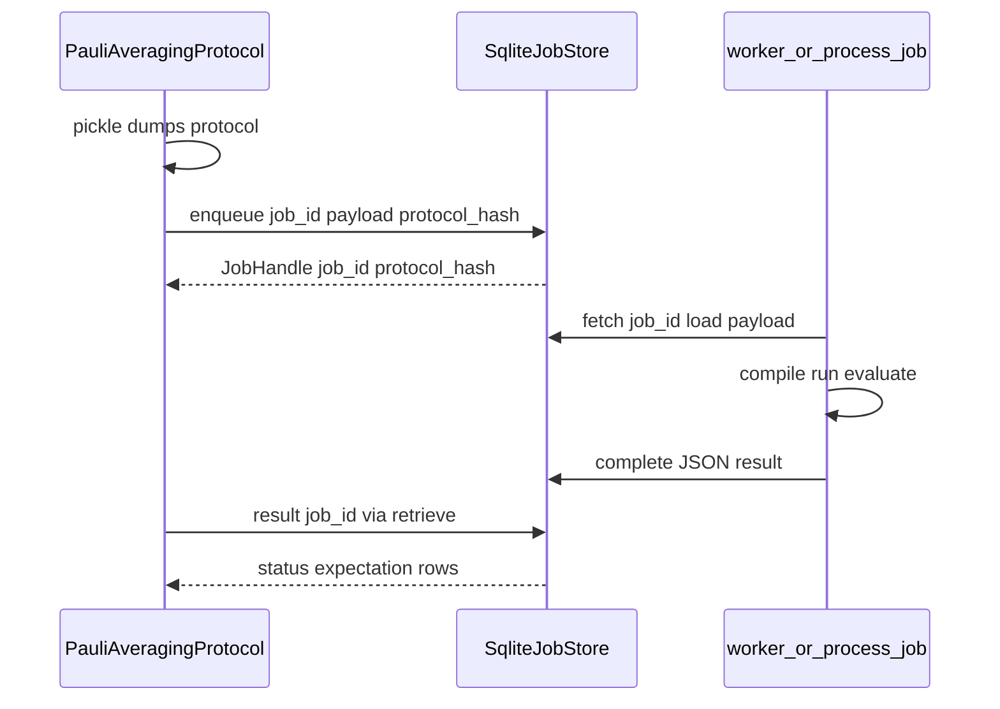

# 技术文档：`CircuitIR`、TKET 桥接与异步作业契约

**版本**：与 `qchem-stack` 源码同步；依据为仓库实现与 [Vendor platform 公开文档](https://www.quantinuum.com/) 的概念对照，**不**声称与闭源 Vendor platform 或 Nexus 二进制 API 兼容。

**读者**：维护者、需要做 Methods 级对标的合作者、写论文补充材料时需要说明「资源数字从哪来」的作者。

**与 Pauli 协议的关系**：`PauliAveragingProtocol.compile` 对每条 `CircuitIR` 应用 `CompilerPassBundle` 后，`dataframe_circuit_shot_rows` / `resource_rows` 中的 **`spec`** 列即此处的 `CircuitIR` 资源行（与 `run_qiskit_shots` / 精确期望路径共用同一套 depth/2Q 叙事）。五阶段 `run` 的能量来源见 [技术文档_设备比特串与Qiskit采样路径.md](技术文档_设备比特串与Qiskit采样路径.md)。

---

## 1. 目的与边界

| 主题 | 本仓库做法 | 非目标 |
|------|------------|--------|
| 每电路 depth / 2Q 计数 | `spec.circuit_resource_row` 基于 `CircuitIR` 的**自研**层数与门名启发式 | 不冒充已跑 Quantinuum 硬件编译器 |
| TKET 对齐统计 | 可选 `pytket`：`backends/pytket_bridge.py` 将**可映射**门转为 `pytket.circuit.Circuit` 后读 `depth()`、`n_2qb_gates()` 等 | 不默认安装 pytket；无库时 `enrich_row_with_pytket` 置 `pytket: None` |
| 异步作业 | 本地 `SqliteJobStore` + `JobHandle`；**非** Nexus API | 不实现 HQC 云计价、项目租约 |

---

## 2. `CircuitIR` 门名与 pytket 映射

`CircuitIR` 是逻辑中间表示：`n_qubits`、`operations: list[{name, qubits, params}]`、`boxes` 元数据。

| `op["name"]` | 行为 |
|--------------|------|
| `RY` / `RX` | `params["theta"]` → `Circuit.Ry` / `Rx` |
| `CX` / `CNOT` | `Circuit.CX` |
| `H` | `Circuit.H` |
| `SDG` | `Circuit.Sdg` |
| `MEASURE` | 按出现顺序绑定经典线 `Circuit(n_q, n_meas)` 的 `Measure(q, bit_i)` |
| `PAULI_GROUP` | **跳过**（占位，非门表）；`pytket_skipped_ops` 可含 `PAULI_GROUP` |
| `ANNOTATION` | **跳过**（`compile_passes` 注入的元数据，不参与 TKET 门统计） |

未列出的门名：`circuit_ir_to_pytket` 抛 `ValueError`，需扩展桥接模块。

**代码锚点（与上表逐行一致）**：实现见 [`pytket_bridge.py`](../src/qchem_stack/backends/pytket_bridge.py) `circuit_ir_to_pytket`；矩阵 §4「默认 CircuitIR / 可选 pytket」叙事以此为单一事实源。

---

## 3. 自研 `circuit_resource_row` 与 pytket 统计为何可能不同

- **自研**（[`spec.py`](../src/qchem_stack/backends/spec.py)）：`_depth_estimate` 按门在 qubit 上的层推进；`_twoq_gate_count` 统计名称属于集合 `CX|CNOT|ZZ|ZZPhase|MS|CP` 等。`ANNOTATION` 若带 `qubits` 可能仍影响层数（取决于实现细节）；**与 pytket 不完全同构**。
- **pytket**：跳过 `ANNOTATION` / `PAULI_GROUP` 后建图，故 `pytket_depth` 可与表内 `depth` **不同**（演示中常见：`pytket_depth` 更小，因忽略 ANNOTATION 推层）。

**论文建议**：同时报告「编排器自研行」与「TKET 行」（若安装），并在补充材料写清：前者用于与历史 `qchem_stack` 结果一致，后者用于与 **TKET/Vendor platform 文档** 叙事对齐。

---

## 4. `enrich_row_with_pytket` 输出字段

在 `circuit_resource_row(...)` 得到的 `base_row` 上浅拷贝并追加：

| 键 | 含义 |
|----|------|
| `pytket_depth` | `Circuit.depth()` |
| `pytket_depth_2q` | `Circuit.depth_2q()` |
| `pytket_twoq_count` | `Circuit.n_2qb_gates()` |
| `pytket_n_gates` | `n_gates`（兼容 property 与可调用实现） |
| `pytket_skipped_ops` | 若存在跳过的占位/注解，如 `["ANNOTATION"]` |
| `pytket` | 仅当未安装 pytket 且走 `ImportError` 分支时为 `None` |

---

## 5. 安装与命令行演示

```bash
pip install "qchem-stack[pytket]"
# 或已装包时
pip install "pytket>=1.25"
```

```bash
python scripts/resource_estimation_demo.py
python scripts/resource_estimation_demo.py --pytket
```

第二行在每行资源上附加 §4 列；需本机已能 `import pytket`。

---

## 6. 作业契约：`JobHandle` 与 `protocol_hash`



- **`protocol_hash`**：`launch` 内对 **pickle 负载** 做 SHA-256 的**前 32 个十六进制字符**，与表 `jobs.protocol_hash` 一致；`JobHandle.protocol_hash` 便于在**不查库**时对账「句柄 ↔ 已排队载荷」。
- **`retrieve(store, handle)`**：等同 `SqliteJobStore.result(handle.job_id)`。`status != DONE` 时**不得**假定存在 `expectation`；详见 [launch_retrieve_nexus_analog.md](launch_retrieve_nexus_analog.md)。

流水线 `repro` 中的 `protocol_hash_prefix`、`async_job_id` 等与 YAML/运行路径相关，与单次 `launch` 的 `JobHandle` **同一思想**（可审计指纹），字段名以 `orchestration` 输出为准。

---

## 7. 测试与回归

- `tests/backends/test_pytket_bridge.py`：有 pytket 时校验 HEA+CX；`ImportError` 路径用 monkeypatch 测 `pytket: None`。
- `tests/jobs/test_pipeline_job_store.py`：`launch` 后 `protocol_hash` 长度 32，`retrieve` 后 `status == DONE`。

---

## 8. 相关文档

| 文档 | 内容 |
|------|------|
| [public_parity_matrix.md](public_parity_matrix.md) | 公开能力 vs 本包 |
| [工程记忆_Quantinuum对标与数据流技术文档.md](工程记忆_Quantinuum对标与数据流技术文档.md) | 路线图与判据落点 |
| [launch_retrieve_nexus_analog.md](launch_retrieve_nexus_analog.md) | Nexus 语义类比短表 |
| [README.md](../../README.md)（仓库根） | 安装、YAML 入口与四柱导航 |
