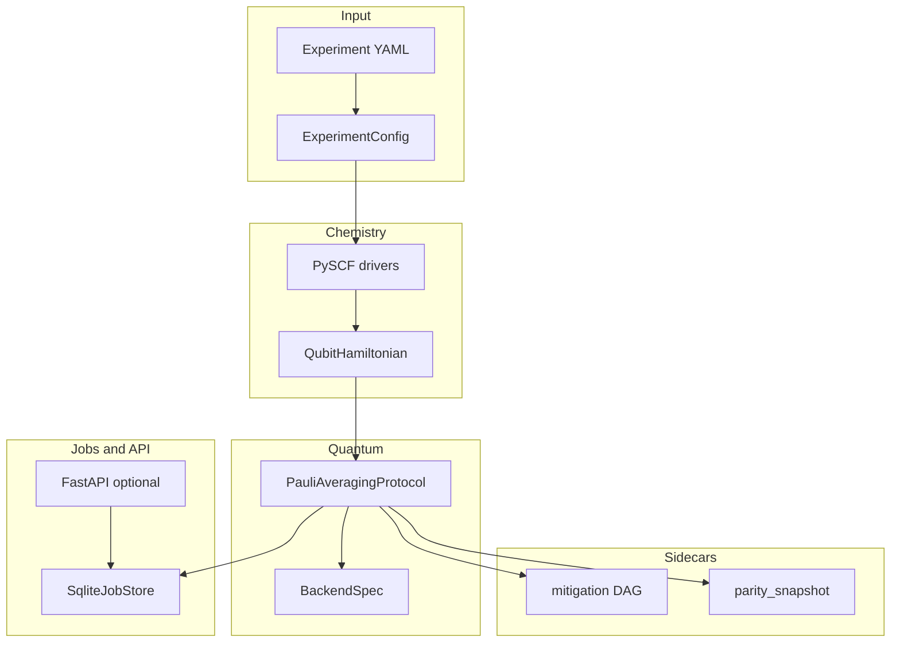

# qchem_stack 软件工程文档总索引（母稿）

**用途**：单一入口整理仓库 `docs/` 下**全部**工程/对标/技术母稿；说明**阅读顺序**、**双站（仓库 ↔ VitePress）**关系与 **2026-05 文档合并**记录。  
**非目标**：不替代 `docs-site/` 教程步进页；不内嵌 `architecture-report-*` 全书（体积过大，见下表链接）。

---

## 0. 文档合并与废弃记录（维护者必读）

| 日期 | 动作 | 替代位置 |
|------|------|----------|
| 2026-05 | **删除** `记忆_HTTP_API与作业队列_工程记忆.md` | [技术文档_HTTP_API与SQLite作业队列及可观测性契约.md](技术文档_HTTP_API与SQLite作业队列及可观测性契约.md) **§9**（决策、非目标、Checklist、CI） |
| 2026-05 | **删除** `记忆_开放栈对标完成度与待闭合项.md` | [工程记忆_Quantinuum对标与数据流技术文档.md](工程记忆_Quantinuum对标与数据流技术文档.md) **§13**（开放栈落地表、L0 排除、维护备忘） |
| 站点 | `/parity/open-stack-memory`、`/concept/http-api-worker-memory` | **别名页** → 同上锚点（避免外链 404） |

---

## 1. 推荐阅读顺序（从「能跑」到「能签 L1」）

1. 根目录 [README.md](../README.md) — 安装、一键管线、`pytest`/CI 提示。  
2. [CONTRIBUTING.md](../CONTRIBUTING.md) — PR 闸门、`l1_excited` / `l1_md_ml`、`check_parity_export_sample`、新用户三条路径。  
3. [ENGINEERING_ARCHITECTURE.md](ENGINEERING_ARCHITECTURE.md) — **英文化**分层、公共错误类型、HTTP 章节索引。  
4. [架构_InQuanto闭源能力闭合与可复现边界.md](架构_InQuanto闭源能力闭合与可复现边界.md) — **L0/L1/L2/L3** 定义（全文较短，建议精读）。  
5. [inquanto_public_parity_matrix.md](inquanto_public_parity_matrix.md) + [与InQuanto能力差距与实施计划.md](与InQuanto能力差距与实施计划.md) — 能力总表与差距叙事。  
6. [L1_InQuanto_alignment_signoff.md](L1_InQuanto_alignment_signoff.md) + [InQuanto_B_J_逐项闭合计划.md](InQuanto_B_J_逐项闭合计划.md) — 签字与 B→J 序。  
7. 深度技术契约（按需）：HTTP（上）、[技术文档_CircuitIR与TKET桥接及作业契约.md](技术文档_CircuitIR与TKET桥接及作业契约.md)、[技术文档_DMET与parity_snapshot开放契约.md](技术文档_DMET与parity_snapshot开放契约.md)、[技术文档_设备比特串与Qiskit采样路径.md](技术文档_设备比特串与Qiskit采样路径.md)、[mitigation_PMSV_ZNE_Qermit_mapping.md](mitigation_PMSV_ZNE_Qermit_mapping.md)。

**对外站点**：`docs-site/`（`npm run docs:dev`）镜像上述多文；**母稿以 `docs/*.md` 为准**，合并 PR 时双改或同一 PR 内说明「仅站点滞后」。

---

## 2. 母稿全表（`docs/` 根目录 Markdown）

| 文件 | 类型 | 摘要 |
|------|------|------|
| [ENGINEERING_ARCHITECTURE.md](ENGINEERING_ARCHITECTURE.md) | 架构 | 分层、模块边界、错误模型、HTTP 索引 |
| [架构_InQuanto闭源能力闭合与可复现边界.md](架构_InQuanto闭源能力闭合与可复现边界.md) | 战略/定义 | L0–L3、六大难点剖析 |
| [竞争定位与路线图_对标Quantinuum产品与技术路线.md](竞争定位与路线图_对标Quantinuum产品与技术路线.md) | 战略 | P0–P3、§141 残余 |
| [与InQuanto能力差距与实施计划.md](与InQuanto能力差距与实施计划.md) | 差距 | §1 总表、阶段计划、维护约定 |
| [inquanto_public_parity_matrix.md](inquanto_public_parity_matrix.md) | 契约 | 公开能力矩阵 §0–§5 |
| [L1_InQuanto_alignment_signoff.md](L1_InQuanto_alignment_signoff.md) | 闸门 | L1 表、回归命令 |
| [InQuanto_B_J_逐项闭合计划.md](InQuanto_B_J_逐项闭合计划.md) | 闸门 | B→J 序、附录 YAML 表 |
| [InQuanto_Y1_public_alignment_ledger.md](InQuanto_Y1_public_alignment_ledger.md) | 台账 | 季度 OKR、钉扎 |
| [Y1_residual_partial_SLA_template.md](Y1_residual_partial_SLA_template.md) | 台账 | `partial` 残余 SLA |
| [P1_completion_audit.md](P1_completion_audit.md) | 审计 | P1 全量核对、§5 队列、§6 声明 |
| [P2_详细实施计划.md](P2_详细实施计划.md) | 路线图 | WBS、§6 执行序、§8 双月历 |
| [P2_W5_algorithm_registry_alignment.md](P2_W5_algorithm_registry_alignment.md) | 技术 | 算法/registry 对照 |
| [P2_W3_classical_avas_casscf_boundary.md](P2_W3_classical_avas_casscf_boundary.md) | 技术 | AVAS/CASSCF 边界 |
| [ADR_P2_decomposition_scope.md](ADR_P2_decomposition_scope.md) | ADR | 分解范围钉扎 |
| [md_bridge_repro_freeze_list.md](md_bridge_repro_freeze_list.md) | 契约 | MD/ML `repro` 字段 |
| [工程记忆_Quantinuum对标与数据流技术文档.md](工程记忆_Quantinuum对标与数据流技术文档.md) | 技术/记忆 | 物化链、判据、**§13** 开放栈表 |
| [技术文档_HTTP_API与SQLite作业队列及可观测性契约.md](技术文档_HTTP_API与SQLite作业队列及可观测性契约.md) | 契约 | API/schema、**§9** HTTP 决策 |
| [技术文档_CircuitIR与TKET桥接及作业契约.md](技术文档_CircuitIR与TKET桥接及作业契约.md) | 契约 | 编译、资源双轨、`JobHandle` |
| [技术文档_DMET与parity_snapshot开放契约.md](技术文档_DMET与parity_snapshot开放契约.md) | 契约 | DMET、`embedding_workflow` |
| [技术文档_设备比特串与Qiskit采样路径.md](技术文档_设备比特串与Qiskit采样路径.md) | 契约 | Qiskit shots 路径 |
| [mitigation_PMSV_ZNE_Qermit_mapping.md](mitigation_PMSV_ZNE_Qermit_mapping.md) | 契约 | 缓解映射、ZNE 合一 |
| [launch_retrieve_nexus_analog.md](launch_retrieve_nexus_analog.md) | 契约 | Nexus 语义类比 |
| [InQuanto_manual_howto_与_qchem_stack_映射.md](InQuanto_manual_howto_与_qchem_stack_映射.md) | 映射 | 官方 How-to 主题映射 |
| [P1_化学与嵌入_InQuanto镜像与qchem_stack复现程度对照.md](P1_化学与嵌入_InQuanto镜像与qchem_stack复现程度对照.md) | 对照 | 镜像节点 vs 源码 |
| [不排期项_转排期与实现说明.md](不排期项_转排期与实现说明.md) | 实现说明 | 原「不排期」已落代码项 |
| [L3_benchmark_suite_roadmap.md](L3_benchmark_suite_roadmap.md) | 路线图 | L3 数值套件 |
| [MAINTAINERS.md](MAINTAINERS.md) | 流程 | 角色、合并闸门 |
| `inquanto-node-backlog.generated.json` + [inquanto-node-backlog.generated.md](inquanto-node-backlog.generated.md) | 生成物 | 295 节点 backlog |
| [architecture-report-quantinuum-inquanto-web/INDEX.md](architecture-report-quantinuum-inquanto-web/INDEX.md) | 报告 | 多卷 IA 报告入口 |
| [architecture-report-quantinuum-inquanto-web/vol-*.md](architecture-report-quantinuum-inquanto-web/vol-00-executive-summary.md) | 报告 | vol-00 … vol-11 |
| [architecture-report-quantinuum-inquanto-web/appendix-*.generated.md](architecture-report-quantinuum-inquanto-web/appendix-A-full-node-list.generated.md) | 生成物 | 附录 A/B/C（大文件） |

---

## 3. 端到端数据流（总览）

**机读出口**：`repro`（`run_summary`、`parity_snapshot`、`workflow_preview_v1`）、`scripts/export_parity_criteria_table.py`、`GET /v1/meta/capability-surface`。

---

## 4. `repro` / export 关键键（速查，非全表）

| 键区 | 权威说明位置 |
|------|----------------|
| `run_context` / `pipeline_profile` | HTTP 技术文档 §2 |
| `parity_snapshot` 全表附录 | DMET 技术文档 §3 附录 |
| `mitigation_dag_execution` | 工程记忆 §1 表、mitigation 映射文档 |
| `methods_resource_unified_v1` / `resource_estimation_preview_v1` | `export_parity_criteria_table.py`、`P2_详细实施计划` §6 |
| `open_stack_differentiators` | `inquanto_contract`、`L1_signoff` |

完整键注册：`src/qchem_stack/protocols/inquanto_contract.py`（`PARITY_SNAPSHOT_DOCUMENTED_KEYS`、`PARITY_EXPORT_V2_STABLE_KEYS` 等）。

---

## 5. CI 与脚本闸门（摘要）

| 命令 / 文件 | 作用 |
|-------------|------|
| `pytest tests` | 全量单测 |
| `pytest -m l1_excited` / `l1_md_ml` | 激发态、MD/ML |
| `python scripts/check_parity_export_sample.py` | export v2 抽样 |
| `python scripts/export_parity_criteria_table.py` | Methods 判据表 |

详见 [CONTRIBUTING.md](../CONTRIBUTING.md)、[P1_completion_audit.md](P1_completion_audit.md)。

---

## 6. 维护规则（避免文档再分裂）

1. **新增「记忆型」短文前**：优先并入现有技术文档某一节（如 HTTP §9、工程记忆 §13），避免再增平行 `记忆_*.md`。  
2. **战略与闸门**单主题单文件：不复制粘贴全文到 `docs-site`；站点页应摘要 + 链母稿或定期同步。  
3. **改名/删文**：全仓 `grep` 旧文件名；更新 `docs-site/scripts/fix-internal-links.mjs` 与 `IA_MAPPING.md`。

---

*索引版本：2026-05；新增母稿时请在本表 §2 增行。*
