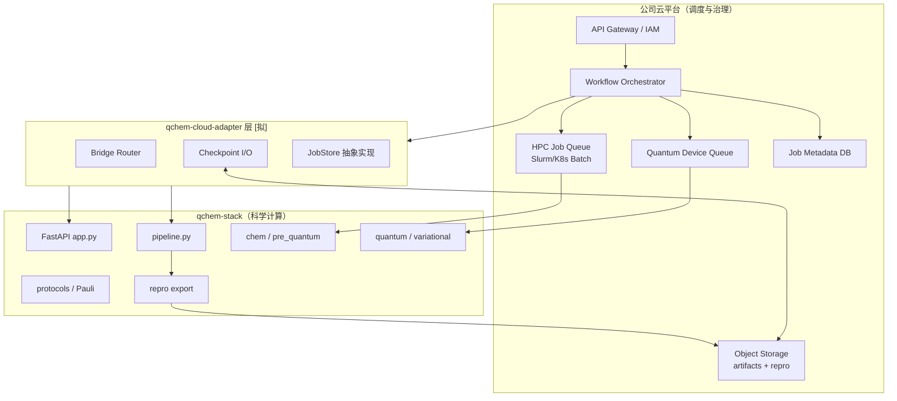

# 混合调度架构设计草案

---

## 1. 目标

1. **不改算法层**：经典化学、变分优化、Pauli 协议逻辑仍由 `qchem_stack` 各层模块执行；调度层只负责**何时、在哪类资源上、以何种 handoff 格式**调用。
2. **支持三种执行形态**：
   - 单机/单节点 monolith（当前默认，兼容 CI 与研发）
   - 阶段式批处理（经典 HPC → 量子 QPU）
   - 在线混合变分（真机 tight loop）
3. **对接公司云平台**：以现有 HTTP API + SQLite 占位**，云平台负责 IAM、配额、HPC 队列、对象存储、QPU 预约；qchem-stack 负责科学计算与 `repro` 契约。

其他

- 实现 Quantinuum Nexus / IBM Quantum 真云 SDK 二进制 parity

---

## 2. 缺口


| 缺口                       | 影响                                   |
| ---------------------------- | ---------------------------------------- |
| 无 stage 级 checkpoint API | 无法「经典在 Slurm、量子在 QPU」分作业 |
| 无`ExecutionPlan` 资源声明 | YAML 不能指定 partition/GPU/QPU        |
| 变分 executor 同步阻塞     | 真机 VQE 每次迭代排队                  |
| 无`JobStore` 抽象变分      | 难以替换为云 Redis/PostgreSQL 队列     |
|                            |                                        |

---

## 3. 执行模型三态


| 模式           | ID               | 描述                                                    | 典型资源                      | 工程阶段       |
| ---------------- | ------------------ | --------------------------------------------------------- | ------------------------------- | ---------------- |
| **本地单体**   | `local_monolith` | 单进程跑完整 pipeline                                   | 开发机 / CI / 单 Slurm 节点   | **已有**       |
| **阶段批处理** | `staged_batch`   | 经典 stage 与量子 stage 分作业，artifact 经对象存储传递 | HPC 分区 + QPU 队列           | **第一期上云** |
| **在线混合**   | `hybrid_online`  | 变分循环跨 HPC optimizer 与 QPU sampler                 | Session 级 QPU + HPC 常驻进程 | **第二期+**    |

---

## 4. 总体架构

### 4.1 逻辑分层



**原则**：云平台 **不解析** YAML 化学语义；只调度「已注册的 stage 镜像/命令 + artifact URI」。科学语义校验在 qchem-stack 内完成（`ExperimentConfig` 加载期 + `workflow-preview`）。

## 5. ExecutionPlan 配置扩展 `[拟但不建议]`

在 `ExperimentConfig` 顶层新增可选段（与 `schema_version: "2"` 并存，独立 `execution_plan_version: "1"`）：

```yaml
schema_version: "2"
experiment_id: h4_hybrid_demo

execution_plan:
  mode: staged_batch          # local_monolith | staged_batch | hybrid_online
  artifact_store:
    type: s3                    # s3 | minio | company_blob | file
    bucket: qchem-artifacts
    prefix: "runs/${experiment_id}/${trace_id}/"
    # 凭证走环境变量 QCHEM_ARTIFACT_*，不写进 YAML

  stages:
    classical_scf:
      resource: hpc_cpu
      template: slurm:qchem-classical-v1
      timeout_s: 7200
    pre_quantum:
      resource: hpc_cpu
      depends_on: [classical_scf]
    variational:
      resource: qpu_ibm        # 或 sim_gpu / hpc_cpu
      depends_on: [pre_quantum]
      allow_backend_override: true
    pauli_protocol:
      resource: qpu_ibm
      depends_on: [variational]
      async: true              # 映射现有 pauli_protocol job kind

  resources:
    hpc_cpu:
      scheduler: slurm
      partition: chem-cpu
      cpus: 32
      memory_gb: 128
    sim_gpu:
      scheduler: k8s
      node_selector:
        accelerator: nvidia-a100
    qpu_ibm:
      scheduler: company_qpu   # 云平台量子子系统
      device: ibm_kyoto
      reservation: shared      # shared | dedicated_slot
```

## 6. 资源池与调度策略

### 资源池


| 池 ID       | 底层            | qchem 工作负载                             | 调度粒度                     |
| ------------- | ----------------- | -------------------------------------------- | ------------------------------ |
| `hpc_cpu`   | Slurm CPU 分区  | PySCF/Psi4 SCF、AVAS、Schmidt、pre_quantum | 每分子/每 fragment 一 job    |
| `hpc_gpu`   | Slurm GPU / K8s | Qiskit Aer GPU、TN stub                    | 按 qubit 数选节点            |
| `sim_local` | 容器内          | statevector、小体系 CI                     | 同步                         |
| `qpu_*`     | 云量子子系统    | variational shots、Pauli grouping          | circuit batch / protocol job |

## 7. 公司云平台作业方案

### docker镜像拉取

docker镜像拉取

**镜像内容**：`pip install qchem-stack[chem,quantum,api]` + PySCF；Psi4/ORCA 可选分层镜像（`qchem-classical-pyscf`、`qchem-quantum-qiskit`）。

### 接入流程

#### 镜像与注册

1. 构建并推送容器镜像到公司镜像仓库。
2. 在云平台「应用市场 / 算力服务」注册 qchem-stack：

**示例**：

{
"job_name": "qc-chem",
"command": " conda init && source ~/.bashrc && conda activate qc-chem && sh qc.sh > r.out ",
"log_file": "./r.out",
"project_id": 29139,
"platform": "ali",
"machine_type": "c8_m32_1 * NVIDIA V100",
"job_type": "container",
"image_address": "registry.dp.tech/dptech/dp/native/prod-16346/qc-chembatch-ave:new02"
}

#### HPC 经典

**Slurm 脚本模板**：

```bash
#!/bin/bash
#SBATCH --job-name=qchem-classical
#SBATCH --partition=chem-cpu
#SBATCH --cpus-per-task=32
#SBATCH --mem=128G
#SBATCH --output=/scratch/%u/qchem/%j.out

module load python/3.12 openblas
source /opt/qchem/venv/bin/activate
export OMP_NUM_THREADS=$SLURM_CPUS_PER_TASK

python -m qchem_stack.cloud.cli run-stage classical_through_pre_quantum \
  --config "$CONFIG_PATH" \
  --artifact-out "$ARTIFACT_URI"
```

#### 量子阶段与 QPU

1. **模拟路径**：Slurm GPU 节点或 K8s Job 跑 `run_quantum_from_bundle`，`backend.provider: statevector|qiskit`。
2. **真机路径**：
   - 注册
   - 从环境变量读 QPU 凭据（`QCHEM_QPU_API_KEY`）
   - `BackendSpec.meta` 传入 `device_id`、`reservation_id`（云平台量子门户分配）
3. **Pauli 异步**：保持 `PauliAveragingProtocol.launch` → 云 worker 消费；结果写对象存储 + `store.complete`

#### 控制台与 repro 交付

## 8. 附录

### 现有代码索引（对接开发起点）


| 模块          | 路径                                           |
| --------------- | ------------------------------------------------ |
| HTTP 入口     | `src/qchem_stack/api/app.py`                   |
| 异步入队      | `src/qchem_stack/jobs/pipeline_jobs.py`        |
| Worker 分发   | `src/qchem_stack/jobs/worker_dispatch.py`      |
| 全管线执行    | `src/qchem_stack/jobs/pipeline_runner.py`      |
| 追踪          | `src/qchem_stack/orchestration/run_context.py` |
| Handoff 类型  | `src/qchem_stack/chem/pre_quantum_input.py`    |
| 量子 executor | `src/qchem_stack/backends/factory.py`          |
| 云探针侧车    | `src/qchem_stack/jobs/nexus_cloud.py`          |
