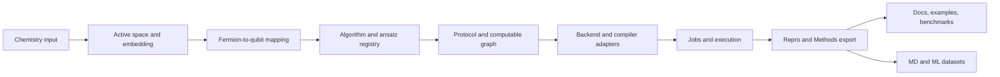

# 三方竞品对比与路线图：InQuanto / Tangelo / `qchem-stack`

**文档角色**：在 [`Quantinuum_竞争判断与对标建议.md`](../../PandM/materials/learning/quantum-chem/literature/Quantinuum_竞争判断与对标建议.md)、[公开 parity 矩阵](inquanto_public_parity_matrix.md) 与 [工程架构](ENGINEERING_ARCHITECTURE.md) 之上，规定本仓库（`qchem-stack`）作为「可竞争开源产品」的边界、差异化与分阶段工程目标。本文新增 [Tangelo](https://github.com/sandbox-quantum/Tangelo) 作为开源竞品参照，用于回答「如果要开发一个全新的、更好的同类软件，应如何取舍」。

**边界**：本文只对齐公开资料与本仓可检证能力。它**不**声称在 InQuanto 闭源 wheel、Quantinuum Nexus / HQC / H-Series、商业 Qermit、商业 cuTensorNet 上功能等价；也不把 Tangelo 源码中的每个算法实现视为本仓必须逐行复刻的目标。

---

## 1. 三方定位总览

| 维度 | InQuanto / Quantinuum | Tangelo / SandboxAQ | `qchem-stack` 当前定位 | 新软件应采取的策略 |
|------|------------------------|---------------------|-------------------------|--------------------|
| 产品形态 | 商业量子化学平台，深度绑定 Quantinuum 文档、TKET、Nexus 与硬件生态 | Apache-2.0 开源 Python 工具包，偏研究和教程，覆盖端到端量子化学 workflow | 独立开源编排层：YAML、`repro`、parity、作业类比、MD/ML 扩展 | 采用开源许可与可审计设计，同时吸收商业平台的产品化对象模型 |
| 核心抽象 | `Algorithm*`、`Computable`、`Protocol`、extensions、Nexus jobs | `SecondQuantizedMolecule`、solver、ansatz、toolbox、`linq` circuit/backend | `ExperimentConfig`、`run_pipeline_from_config`、`Protocol`、`BackendSpec`、`parity_snapshot` | 把「分子-算法-协议-后端-作业-repro」做成稳定组合，而非散装脚本 |
| 主要优势 | 产品叙事完整、API/Manual/Tutorial 层级强、硬件/云闭环 | 全开源、算法与 ansatz 广、problem decomposition 和多后端生态丰富 | 可检证 Methods / parity 强、边界诚实、HTTP/SQLite job 类比、MD/ML 长板 | 让 Tangelo 的算法广度与 InQuanto 的工作流对象模型在开放体系中合流 |
| 主要短板 | 闭源与厂商锁定；云/HQC/硬件能力外部不可完全检证 | 文档入口较轻，许多能力需从源码和 notebooks 反推；统一 Methods/repro 弱 | 算法深度和大体系 solver 仍需加强；社区与教程生态未达成熟开源包水平 | 路线图优先补「开源可信度 + 产品化 workflow + 算法深度」三条线 |

**一句话判断**：新的目标不是「再做一个 InQuanto」，也不是「把 Tangelo 包一层壳」，而是做一个 **开源、可审计、可写进论文 Methods、同时具有产品化工作流体验的量子化学编排平台**。

---

## 2. InQuanto 路线：商业平台的可借鉴部分

公开 InQuanto 文档根页以 **Chemical Specification / Program Construction / Execution and Analysis** 三支柱组织产品心智；How-to 入口见官方 [How to use InQuanto](https://docs.quantinuum.com/inquanto/manual/howto.html)，本仓映射见 [InQuanto_manual_howto_与_qchem_stack_映射.md](InQuanto_manual_howto_与_qchem_stack_映射.md)。

| 层次 | 代表组件 | 作用 | 对新软件的启发 |
|------|----------|------|----------------|
| 化学前处理与嵌入 | InQuanto-PySCF、active space、AVAS/CASSCF、DMET、projection、QM/MM | 把大体系下折叠为量子子问题，支撑药化、MOF、催化、生物与锕系叙事 | 采用 embedding-first 产品线，所有 fragment / active-space 决策必须写入 `repro` |
| 量子工作流中枢 | `FermionSpace`、operators、`Computable`、`Protocol`、`Algorithm*` | 将「要算什么」与「如何构造、编译、运行、评估」封装成可复用对象 | 建立稳定的一等 workflow graph，而非只暴露单次 pipeline 函数 |
| 算法线 | VQE、ADAPT、IQEB、VQD、QSE、SCEOM、QPE、Bayesian/Phayes | 近端和容错两条路线统一在同一平台叙事中 | 近端 NISQ、激发态、QPE/FT 必须共享配置树与结果 schema |
| 编译与后端 | TKET / pytket、Passes、资源表 | 线路优化、资源度量、硬件门集重定向 | 保留 TKET 桥，但以 vendor-neutral `CompilerSpec` 抽象承接 |
| 云与资产 | Nexus / `qnexus`、项目、作业、HQC、配额 | 客户资产管理、计费、异步运行、作业检索 | 可做本地/自托管 job analog，不伪造 Quantinuum 商业云等价 |
| 扩展 | InQuanto-PySCF、Nexus、NGLView、Phayes、cuTensorNet | 产品包按能力拆分 | 新软件也应插件化，但插件契约优先于品牌命名 |

**应借鉴**：Protocol 五阶段、Computable/Algorithm 对象模型、三柱文档、extensions 分层、异步 launch/retrieve 体验、资源表与 Methods 友好叙事。

**不应照搬**：闭源 wheel、Nexus/HQC/厂商身份体系、H-Series 专有校准、商业 Qermit/cuTensorNet 二进制、不可公开检证的默认启发式。上述能力在 [parity 矩阵](inquanto_public_parity_matrix.md) 中保持 `n/a`、本地类比或 `partial + caveat`。

---

## 3. Tangelo 路线：开源工具包的可借鉴部分

[Tangelo](https://github.com/sandbox-quantum/Tangelo) 是 SandboxAQ 维护的 Apache-2.0 Python 包，官方定位是面向量子计算机与模拟器的端到端量子化学 workflow。文档入口见 [Tangelo docs](https://sandbox-quantum.github.io/Tangelo/)，教程仓库见 [Tangelo-Examples](https://github.com/sandbox-quantum/Tangelo-Examples)。

| 层次 | Tangelo 公开能力 | 对 `qchem-stack` 的意义 |
|------|------------------|--------------------------|
| 安装与生态 | `pip install tangelo-gc`；核心依赖 `openfermion`、`h5py`、`bitarray`；PySCF/Psi4 可选 | 新软件应保持轻核心 + optional extras，避免强制安装所有量化学和硬件依赖 |
| 分子与积分 | PySCF、Psi4、预计算积分、frozen orbitals、FNO、RDM、MM charges | 补强本仓 driver 表面和积分输入格式，支持用户带自己的积分与活性空间 |
| 映射 | Jordan-Wigner、Bravyi-Kitaev、symmetry-conserving BK、HCB、JKMN 等 | 本仓不应长期只停在 JW；映射策略要成为可配置、可导出的 Methods 字段 |
| Ansatz / 变分 | UCCSD、UCCGD、RUCC、UpCCGSD、pUCCD、QCC、QMF、HEA、ADAPTAnsatz 等 | 补强化学感知 ansatz 与 pool 策略，同时保留简单 HEA smoke 路径 |
| Solver | VQE、ADAPT、SA-VQE、OO、iQCC、TETRIS-ADAPT、QPE、iQPE、QITE | 算法广度值得学习，但必须通过统一 workflow/repro 接口纳入产品 |
| Problem decomposition | DMET、ONIOM、QM/MM、incremental / iFCI / MI-FNO、fragment solver | 本仓的 embedding-first 路线应继续扩展 fragment solver 与多尺度耦合 |
| 后端抽象 | 自有 `Circuit`/`Gate` 与 `linq`，适配 Qiskit、Cirq、Qulacs、QDK、Sympy、Stim、Braket、IonQ 等 | 多后端是开源竞争核心；但要把后端差异写进 `BackendSpec` 与资源报告 |
| 误差缓解与测量 | histogram renormalization、post-selection、Richardson extrapolation、RDM purification、classical shadows、measurement grouping | 本仓应把 mitigation 从「存根 + 报告」推进到可组合 workflow block |
| 教程 | 独立 examples 仓库，Colab 友好，覆盖 variational、fault tolerant、hardware、measurement reduction、decomposition | 新软件需要教程资产，不只是 API 文档；每个产品路线应有可运行 notebook/YAML |

**应借鉴**：Apache-2.0 开源策略、多后端适配、丰富 ansatz/solver、problem decomposition、examples 仓库和 Colab 快速体验。

**不应照搬**：能力散落在源码和 notebooks、文档入口偏轻、统一 job/repro/Methods 契约弱、面向产品化交付的作业与审计边界不足。新软件应把 Tangelo 的算法广度纳入 InQuanto-style 的工作流纪律。

---

## 4. 逐项能力对比矩阵

图例：`领先` 表示当前公开资料/本仓已有长板；`追赶` 表示应补强；`类比` 表示开放实现只做语义类比；`不做` 表示不进入承诺。

| 能力项 | InQuanto | Tangelo | `qchem-stack` 当前 | 新软件决策 |
|--------|----------|---------|--------------------|------------|
| 产品定位 | 商业平台，闭源核心 + Quantinuum 生态 | 开源研究工具包 | 开源编排层 + parity/repro | 做开源产品化平台，避开闭源 L0 |
| 文档 IA | 三柱 + Manual + Tutorials + API + Extensions | Overview + Tutorials + examples + API，较轻 | `docs/` + VitePress + parity + 中文工程文档 | 建立用户站、Methods 站、开发者站三层 |
| 分子输入 | InQuanto-PySCF、geometry、express、active space | PySCF/Psi4/预计算积分 | PySCF、active space、PBC/ddCOSMO 扩展 | 支持 PySCF/Psi4/OpenFermion/预计算积分统一入口 |
| 嵌入/大体系 | DMET、projection、fragment、WFT-in-DFT | DMET、ONIOM、QM/MM、MI-FNO 等 | `chem/embedding`、DMET shape、projection L1 | P1 核心产品线，所有 fragment 决策可复现 |
| Fermion-to-qubit 映射 | 公开 API 含 spaces/mappings 体系 | JW、BK、SCBK、HCB、JKMN 等 | 以 JW 为主，局部 alias 表 | P1 补 JW/BK/SCBK，并导出映射元数据 |
| Ansatz | UCC、hardware-efficient、IQEB 等 | UCCSD/UCCGD/UpCCGSD/QCC/QMF/HEA/ADAPTAnsatz | HEA、ADAPT、IQEB 路径 | P1 建化学感知 ansatz registry |
| VQE/ADAPT | 产品级 Algorithm 对象 | `VQESolver`、`ADAPTSolver` 等 | `quantum/algorithms/vqe.py`、`adapt.py` | 保持 yes，并提升 pool/gradient/repro 深度 |
| 激发态 | VQD、QSE、SCEOM | 部分变分/投影方法，需源码核实 | VQD/QSE/SCEOM partial + shot accounting | P1 做 Methods 级激发态套件 |
| QPE/容错 | QPE、Bayesian/Phayes、QEC 叙事 | QPE、iQPE、QITE、LCU/QSP 构件 | `qpe_qec_demo` demo/stub | P2 与 NISQ 共用配置树，先 demo 后严肃资源估算 |
| 误差缓解 | Qermit / PMSV / ZNE / SPAM 叙事 | post-selection、Richardson、RDM purification、classical shadows | PMSV/ZNE/SPAM、`qermit_analog` | P1 从报告块升级为可组合 mitigation DAG |
| 张量网络 | `inquanto-cutensornet` 商业扩展 | 无同等产品叙事，需源码核实局部模拟 | `tensornet` stub + 引擎探测（矩阵 **`n/a`**：不宣称厂商化学尺度收缩） | 类比；诚实 **n/a** 关闭广义 P1 产品 parity 期望 |
| 编译 | TKET/pytket 中心 | 自有 circuit + 多格式翻译 | `CompilerSpec`、pytket bridge | P1 vendor-neutral compile bundle + TKET optional |
| 后端 | Quantinuum/Nexus 生态强 | Qiskit/Cirq/Qulacs/QDK/Stim/Braket/IonQ 等 | statevector/Qiskit/IonStack hooks | P1 多后端 adapter conformance tests |
| 作业/云 | Nexus、项目、配额、HQC | QPU connections，但非统一产品云 | FastAPI + SQLite + `nexus_analog` | 做自托管 job server，不伪造 Nexus |
| Repro/Methods | Protocol/resource 表强，闭源细节不可见 | 开源可读，但统一 Methods 契约弱 | `parity_snapshot`、`run_summary`、strict JSON | P0 核心壁垒，所有新能力先定义 schema |
| MD/ML | 非主公开产品线 | 有 neural quantum states 等教程，非 MD/ML 主线 | `md_bridge`、`QMEFDataset`、ML hooks | P2 差异化长板，连接势函数与主动学习 |
| 测试/CI | 商业不可见，公开 docs 强 | README 称 toolbox tests，release 提及高覆盖 | pytest、smoke、parity export | P0 建公开 benchmark + golden repro |
| 许可证/社区 | 商业闭源 | Apache-2.0 | Apache-2.0 | 保持 Apache-2.0，发展 examples 与插件生态 |

---

## 5. 我们要做得“更好”的准确定义

新的竞争产品定义：

> **开放、可审计、可插件化、可写进论文 Methods 的量子计算化学工作流平台。**
> 它吸收 InQuanto 的产品化对象模型和 Tangelo 的开源算法广度，但所有能力都必须落到稳定配置、可复现输出、测试判据和文档路径上。

**必须成为核心产品面**：

1. `ExperimentConfig` / YAML / Python API 双入口，配置即 contract。
2. 化学输入、active space、映射、ansatz、solver、protocol、backend、mitigation、job、repro 的统一 workflow graph。
3. `repro` / `parity_snapshot` / `run_summary` / resource rows / Methods sidecar 的严格 JSON schema。
4. 嵌入-first：DMET/projection/fragment solver 不是边角功能，而是大体系路线主线。
5. 多后端：statevector、Qiskit、TKET optional、IonStack/Braket/IonQ 等通过 conformance tests 接入。
6. 教程资产：每个核心场景有 YAML、notebook、结果样例和测试。

**应作为研究插件**：

- 高级 ansatz 与 solver：iQCC、TETRIS-ADAPT、QITE、LCU/QSP、多种 QPE 变体。
- 高级 decomposition：ONIOM、QM/MM、MI-FNO、iFCI。
- 高级 mitigation：classical shadows、RDM purification、真实 ZNE 电路放大。
- 张量网、GPU、FT resource estimation。

**明确不进入承诺**：

- InQuanto 闭源对象/默认值/数值同构。
- Quantinuum Nexus/HQC/OAuth/配额/H-Series 专有硬件 SLA。
- 商业 Qermit 或 `inquanto-cutensornet` 二进制等价。
- 未经公开资料或本仓测试证明的“比商业软件更准/更省资源”营销声明。

---

## 6. 分阶段工程路线图

下表将三方对比落为仓库内可执行目标。优先级从可信地基到开源超越，再到研究深度和产品生态。

| 阶段 | 竞争目标 | 工程动作 | 主要模块/文档 | 验收口径 |
|------|----------|----------|---------------|----------|
| **P0 基础可信度** | 把 qchem-stack 做成比普通 research toolkit 更可信的 Methods 引擎 | 冻结 `repro` / `parity_snapshot` / `run_summary` schema；完善 `export_parity_criteria_table` golden 样例；所有 pipeline 大改同步 parity | `repro/`、`protocols/inquanto_contract.py`、`scripts/`、[parity 矩阵](inquanto_public_parity_matrix.md) | `pytest` + parity export sample；无未解释 `partial` |
| **P0 基础可信度** | Protocol run/evaluate 语义可审计 | 默认文档讲清 exact / sampled / Qiskit bitstring 三条 expectation path；resource rows 与 shot ledger 固定 | `protocols/protocol.py`、`backends/qiskit_pauli_shots.py`、[设备比特串文档](技术文档_设备比特串与Qiskit采样路径.md) | H2 exact/sample/qiskit smoke 均可导出一致 Methods 字段 |
| **P1 开源工作流超越** | 吸收 InQuanto 的对象模型纪律 | 建一等 workflow/computable graph；Python API 与 YAML 共用 graph；`POST /workflow-preview` 输出与 pipeline run 后 `repro` 对齐 | `protocols/computable.py`、`integrations/inquanto_workflow_preview.py`、`api/app.py` | workflow preview golden 与实际 run sidecar 对齐 |
| **P1 开源工作流超越** | 吸收 Tangelo 的多算法与多后端广度 | 建 ansatz/solver/mapping registry；补 JW/BK/SCBK；为 statevector/Qiskit/TKET optional 建 adapter conformance tests | `quantum/`、`chem/hamiltonian.py`、`backends/` | 同一小分子在多映射/多后端下输出 schema 稳定 |
| **P1 开源工作流超越** | embedding-first 成为主线 | 扩展 `DMETContext`、projection Hamiltonian、fragment solver protocol；所有 fragment、bath、classical reference 写入 `repro` | `chem/embedding/`、`orchestration/pipeline.py`、[DMET 契约](技术文档_DMET与parity_snapshot开放契约.md) | 小体系 DMET/projection 样例有可复现 trace |
| **P1 开源工作流超越** | mitigation 从报告升级为 workflow block | PMSV/ZNE/SPAM 统一 DAG；保留 Qermit analog，不宣称商业运行时 | `mitigation/`、`protocols/` | mitigation DAG 与 linear execution trace 同源 |
| **P2 研究深度与大体系** | 向 Tangelo 的 problem decomposition 广度追赶 | 增加 ONIOM/QM-MM/MI-FNO 或预计算 fragment input 的插件接口 | `chem/embedding/`、`integrations/` | 至少一个非 DMET decomposition demo 可跑通 |
| **P2 研究深度与大体系** | QPE/FT 与 NISQ 同平台 | QPE/iQPE/Bayesian stub 从 demo 接入主配置树；先做资源和 Methods，不急于宣称化学精度 | `qpe_qec_demo/`、`config.py`、`orchestration/` | `configs/qpe_dual_track_demo.yaml` 与普通 VQE run 可比较 |
| **P2 研究深度与大体系** | MD/ML 成为差异化长板 | `QMEFDataset`、主动学习、势函数训练 hooks 与上游 `repro` 字段稳定连接 | `md_bridge/`、`ml/` | H2/H4 级玩具数据集到 trainer protocol smoke |
| **P3 产品化与社区生态** | 形成开源软件而非内部工程仓 | 分离 examples/tutorials；补 API reference；建立插件模板、贡献指南、benchmark dashboard | `docs-site/`、`examples/`、`CONTRIBUTING` | 新用户可从安装到运行三条教程，不读内部中文台账 |

**已落地（工程执行）**：P0 已有 `export_parity_criteria_table`（含 `protocol_expectation_semantics_v1` 与 golden fixture）、`RUN_SUMMARY_DOCUMENTED_KEYS` + `tests/test_run_summary_key_registry.py`、`check_parity_export_sample.py` 覆盖 exact / sampled / Qiskit shots 等样例 YAML、sampled/Qiskit shots/QPE track smoke、`EmbeddingSpec`、PMSV report、`excited_shot_accounting`、`pauli_measurement_ledger`、`QMFrame.repro_config_sha256_prefix`、`nexus_analog` / `nexus_cloud` 侧车、`qermit_*`、`tensornet` stub + 引擎钩子、PBC+k 点/ddCOSMO。**P1（本仓已执行）**：`repro.workflow_preview_v1` 与 `POST /v1/meta/workflow-preview` 同源；`protocols/computable.py` 薄层与 workflow-preview round-trip；`export_parity_criteria_table` **Methods/QPE 资源合一**（`methods_resource_*_v1`）；**JW UCCSD Trotter**：`quantum.uccsd_trotter_steps` + `configs/example_h2_uccsd_trotter.yaml`；**ZNE×Qiskit Pauli 机读合一**：`parity_snapshot.zne_qiskit_unification_v1`（见 `docs/mitigation_PMSV_ZNE_Qermit_mapping.md`）；**Schmidt bath JSON 侧车** `embedding.schmidt_bath_sidecar_json_path`、**ONIOM 玩具层元数据** `embedding.oniom_layers_v1`（`configs/example_oniom_toy.yaml`）；**最小 CASSCF 轨道优化审计** `chemistry_extended.casscf_orbital_optimization_audit`（`configs/example_h2_casscf_audit.yaml`）；OpenFermion **SCBK/BK** 映射及 `chem/fermion_mapping_registry`、`quantum/algorithm_registry`；`MitigationSpec.spam_calibration_enabled` 与 `qermit_analog` / `qermit_runtime` 同序 SPAM 节点；`tests/test_backend_conformance.py`（多 provider + 三映射 + TKET probe）；`ANSATZ_REGISTRY` 中 Trotter 条目指向 `UCCSDTrotterVQE`。矩阵对 **`inquanto-cutensornet` 化学收缩** 诚实 **`n/a`**（判据闭合，非无限期 partial）。详见 [README](../README.md)、[工程架构](ENGINEERING_ARCHITECTURE.md)、[工程记忆](工程记忆_Quantinuum对标与数据流技术文档.md) 与 [与 InQuanto 能力差距与实施计划](与InQuanto能力差距与实施计划.md)。

**仍需推进（§141 五项收口后的诚实 residual，多为 P2）**：QPE/FT **资源估计与编译器级深度合一**（与 P1 分界：演示轨 `configs/example_h2_qpe_track.yaml`、`configs/example_h2_qpe_track_parity_integrations.yaml` 已承载 Methods + 可选 TKET 的浅层验收；**深度**见 [P2_详细实施计划.md](P2_详细实施计划.md) P2-W1）；**化学意义上**完整的 DMET bath 自洽与 **产品级** ONIOM/QM-MM（开放栈已提供 Schmidt 生产 + 用户 bath 侧车 + ONIOM **玩具**层字段）；**AVAS / InQuanto 级 CASSCF 产品深度**（开放栈：`casscf_orbital_optimization_audit` 仅审计轨道一步，变分 Hamiltonian 仍以 CASCI 积分为默认）；**BK/SCBK 参考态上的 UCCSD Trotter**（矩阵 **`n/a`**）；**教程与 examples 深度扩展**（docs-site 已增 UCCSD/Trotter、ZNE repro、projection 深入页，可与 `examples/` 并行扩充）。**分季度 backlog** 见 [与InQuanto能力差距与实施计划.md](与InQuanto能力差距与实施计划.md) §6；**WBS / 里程碑 / 闸门** 见 [P2_详细实施计划.md](P2_详细实施计划.md)。**已收窄交付（延续）**：`configs/example_h2_uccsd.yaml`；`configs/example_h2_zne_circuit_fold.yaml`；`configs/qpe_dual_track_demo.yaml`；`configs/example_h4_dmet_fragment_exact_small.yaml`；`configs/example_decomposition_plugin_toy.yaml`；`configs/example_h2_pbc_gamma.yaml`。**跨后端 conformance**：`tests/test_backend_conformance.py` 覆盖 ``statevector``、``qiskit``（``statevector``/``estimator``）、``ionstack``（``meta.expectation_fn``）、JW/BK/SCBK 与 TKET probe（PySCF/Qiskit/pytket 缺失时相应 skip）。

---

## 7. 产品架构目标图

这张图也是三方对比后的工程主线：InQuanto 强在 `Protocol` / `Jobs` / 产品叙事，Tangelo 强在 `Mapping` / `Algorithm` / `Backend` 广度，`qchem-stack` 应把二者收束到 `Repro` / `Methods` / `Docs` 可审计出口。

---

## 8. 与现有文档的衔接

- InQuanto 公开能力逐项覆盖见 [inquanto_public_parity_matrix.md](inquanto_public_parity_matrix.md)。
- B-J 闭合顺序与 L1 验收哲学见 [InQuanto_B_J_逐项闭合计划.md](InQuanto_B_J_逐项闭合计划.md)。
- 模块边界、HTTP API、作业队列和稳定公共面见 [ENGINEERING_ARCHITECTURE.md](ENGINEERING_ARCHITECTURE.md)。
- 详细差距与实现顺序见 [工程记忆_Quantinuum对标与数据流技术文档.md](工程记忆_Quantinuum对标与数据流技术文档.md) 与 [与InQuanto能力差距与实施计划.md](与InQuanto能力差距与实施计划.md)；路线图 **P2** 分解见 [P2_详细实施计划.md](P2_详细实施计划.md)。
- Tangelo 公开参考入口：[GitHub](https://github.com/sandbox-quantum/Tangelo)、[Docs](https://sandbox-quantum.github.io/Tangelo/)、[Examples](https://github.com/sandbox-quantum/Tangelo-Examples)。

**维护约定**：本文负责三方战略和路线图；[parity 矩阵](inquanto_public_parity_matrix.md) 负责 InQuanto 公开能力状态；工程记忆负责模块级机读字段。任何新能力从 `partial` 收束为可发表状态时，至少同步更新本文路线图、parity 行或对应技术文档之一。

---

## 9. 一句话收束

最有价值的竞争方向是：**用 Tangelo 式开源算法广度补齐研究能力，用 InQuanto 式 workflow discipline 提升产品体验，再用 `qchem-stack` 已有的 strict repro / parity / MD-ML 扩展形成自己的壁垒**。如果只能选一条主线，优先做 **可审计 workflow + embedding-first + 多后端 + Methods export**；这是开源软件最可能超过闭源平台和研究工具包的地方。
