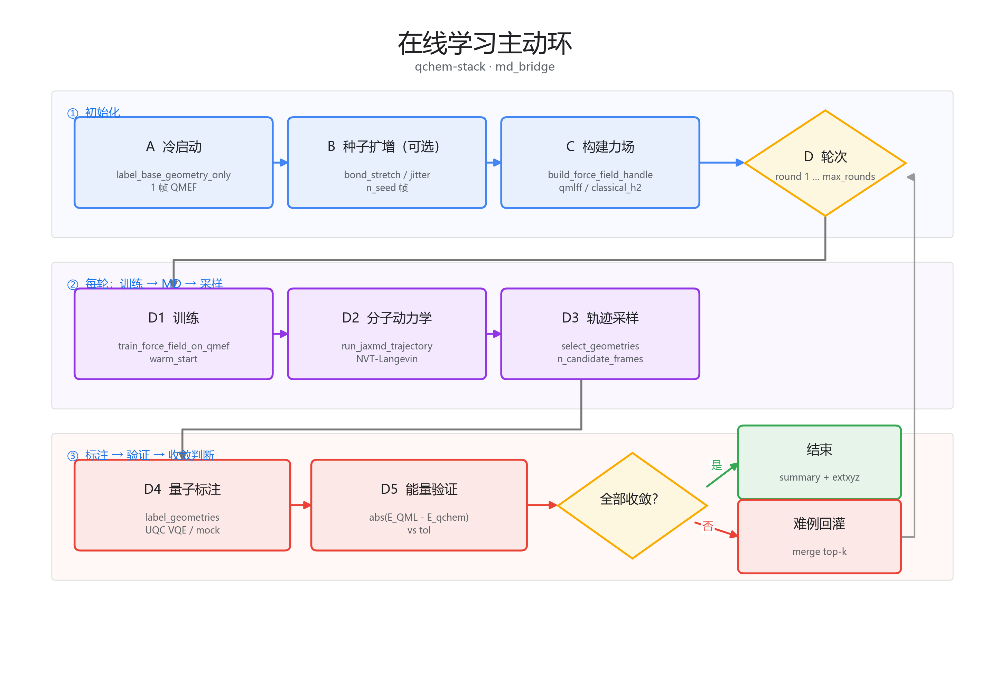
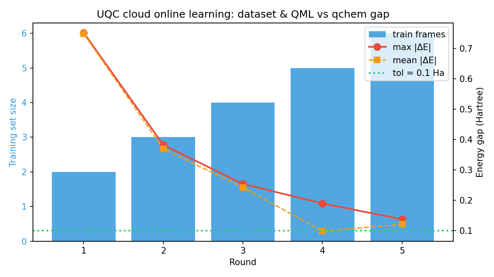

# 组会汇报：在线学习力场 × UQC 云上调度

> **建议页数**：8–10 页 · **系统**：qchem-stack → UQC → QML-FF → JAX-MD  
> **完整 5 轮结果**（本地输出，不在 git 中）：`results/uqc_cloud_sim_md_ml_optimized/`（2026-05-28；见 [`results/README.md`](../results/README.md)）

---

## Slide 1 · 标题

**在线学习量子力场与 UQC 云上标注**

副标题：H₂ 五轮主动学习闭环验证 · qchem-stack · md_bridge

**一句话**：用量子化学（PySCF + VQE + UQC）标注少量构型 → 训练 QML 力场 → JAX-MD 采样 → 误差大的帧回灌再训，直到能量验证收敛。

---

## Slide 2 · 背景与原理

### 为什么要做

| 痛点 | 做法 |
|------|------|
| 全量子化学每帧代价高，无法长 MD | 用 **QML-FF** 拟合少量标注，**JAX-MD** 外推动力学 |
| 初始训练数据少、力场不准 | **主动学习**：MD 轨迹上 \|ΔE\| 大的构型 → 回 UQC 标注 → 扩训练集 |

### 核心验证公式

\[
|\Delta E| = \bigl| E_{\mathrm{QML}}^{\mathrm{(shifted)}} - E_{\mathrm{qchem}} \bigr| < \texttt{energy\_tolerance\_hartree}
\]

- **E_qchem**：`run_pipeline_sync` 标注（本实验统一 **VQE / variational**）
- **E_QML**：QML-FF 预测 + 训练集均值能量偏移校准
- **收敛**：每轮 MD 采样帧全部通过 → 提前结束；否则 merge top-k 难例进入下一轮

### 工程要点（踩坑一句）

训练与验证的 **energy_reference 必须一致**（均用 `variational`），否则 HF vs VQE 混比会出现 ~0.8 Ha 的假失败。

---

## Slide 3 · 系统架构

```
┌─────────────┐     ┌──────────────────┐     ┌─────────────┐
│ 实验 YAML   │────▶│ run_pipeline_sync │────▶│ UQC 云       │
│ 分子/VQE/   │     │ PySCF→JW→VQE     │     │ iontrap-sim │
│ backend:uqc │     └────────┬─────────┘     └─────────────┘
└─────────────┘              │
                             ▼
┌─────────────┐     ┌──────────────────┐     ┌─────────────┐
│ 环 YAML     │────▶│ md_validation_   │────▶│ QML-FF      │
│ 轮数/MD/容差│     │ loop (md_bridge) │     │ + jax-md    │
└─────────────┘     └──────────────────┘     └─────────────┘
```

| 层次 | 模块 | 职责 |
|------|------|------|
| 配置 | `ExperimentConfig` + `MdValidationLoopConfig` | 化学/量子/云 + 主动学习环参数 |
| 量子流水线 | `orchestration/pipeline.py` | 标注入口；**不直接调 UQC SDK**，读 YAML `backend.provider: uqc` |
| 主动学习 | `md_bridge/md_validation_loop.py` | 冷启动 → 多轮 训/MD/验证/回灌 |
| 云后端 | `backends/profiles.py` | `uqc_cloud`（真云）/ `uqc_mock`（离线 CI） |
| 运行 | `scripts/run_uqc_md_ml.py` | 统一入口 + preflight + 结果 JSON |

---

## Slide 4 · 主动学习流程



> 出图：`python3 docs/assets/generate_md_ml_flowchart.py`

**每轮循环**：训练 QML-FF → NVT-Langevin MD → 采样候选帧 → UQC/VQE 标注 → 算 \|ΔE\| → 未收敛则 top-k 回灌。

---

## Slide 5 · 关键参数

### 化学与量子（`example_h2_uqc_cloud_sim_md_ml.yaml`）

| 项 | 值 |
|----|-----|
| 体系 | H₂，STO-3G，2e/2o 活跃空间 |
| 变分 | HEA-VQE，depth=1，maxiter=150，COBYLA |
| UQC | `iontrap-sim`，shots=500，`uqc_multi_basis_pauli: true` |
| 标注能量 | `energy_reference: variational` |

### 主动学习环（五轮实验实际配置）

| 项 | 值 | 说明 |
|----|-----|------|
| max_rounds | 5 | 跑满 5 轮 |
| energy_tolerance | 0.1 Ha | 收敛容差 |
| n_epochs_per_round | 2 | 每轮训练 epoch |
| n_candidate_frames | 2 | 每轮 MD 验证帧数 |
| add_top_k_per_round | 1 | 每轮回灌难例数 |
| md_n_steps / save_stride | 12 / 3 | NVT-Langevin，300 K |
| validation_reference | variational + full_pipeline | 与训练对齐 |
| 力场 | QML-FF `atomic_amplitude` preset | warm_start |

### 一条命令复现

```bash
python3 scripts/run_uqc_md_ml.py --backend-profile uqc_mock \
  --output results/uqc_cloud_sim_md_ml_optimized
python3 scripts/restore_uqc_5round_md_summary.py   # 若 summary 被覆盖
python3 scripts/analyze_uqc_md_ml_results.py results/uqc_cloud_sim_md_ml_optimized
```

---

## Slide 6 · 实验结果

### 五轮 \|ΔE\| 逐轮下降（H₂，UQC mock，2026-05-28）

| 轮次 | 训练集 | max \|ΔE\| (Ha) | mean \|ΔE\| (Ha) |
|------|--------|-----------------|-------------------|
| 1 | 2 | 0.751 | 0.748 |
| 2 | 3 | 0.382 | 0.369 |
| 3 | 4 | 0.254 | 0.242 |
| 4 | 5 | 0.189 | 0.098 |
| 5 | 6 | **0.137** | 0.121 |

**结论摘要**

- max \|ΔE\| 从 **0.75 → 0.14 Ha**，相对下降 **~82%**
- 第 5 轮已 **接近 0.1 Ha 容差**，5/5 轮跑满，云上链路无失败
- 训练集由 1 帧冷启动扩至 **6 帧**（主动学习有效增广）

### 主图（PPT 核心一页）



辅图（可选）：`docs/assets/frame_abs_delta_e.png` · `force_rmse_per_round.png`

---

## Slide 7 · 工程结论

| 维度 | 状态 |
|------|------|
| UQC 云连通 + 多轮 submit | ✅ 内网 iontrap-sim 稳定 |
| qchem ↔ QML-FF ↔ JAX-MD 闭环 | ✅ `md_bridge` 端到端 |
| 主动学习 \|ΔE\| 趋势 | ✅ 五轮单调改善 |
| 科学收敛（< 0.1 Ha） | ⏳ 第 5 轮 0.137 Ha，差一步 |
| 力场泛化 / 更长 MD | ⏳ 待更大体系与训练预算验证 |

---

## Slide 8 · 在线学习测试配置

本组五轮实验由 **两份 YAML** 驱动（具体数值见仓库内文件，此处不展开默认参数）：

| 配置文件 | 作用 |
|----------|------|
| [`configs/example_h2_uqc_mock_md_ml.yaml`](../configs/example_h2_uqc_mock_md_ml.yaml) | **实验层**：分子、SCF、VQE、UQC backend、`md_ml_export` |
| [`configs/example_h2_uqc_cloud_sim_md_ml.yaml`](../configs/example_h2_uqc_cloud_sim_md_ml.yaml) | 同上，用于 **UQC 真云**（`uqc_mode: real`，`iontrap-sim`） |
| [`configs/example_h2_uqc_cloud_sim_qmlff_loop_5rounds.yaml`](../configs/example_h2_uqc_cloud_sim_qmlff_loop_5rounds.yaml) | **主动学习环**：轮数、MD、QML-FF 训练、标注/验证 reference、收敛容差 |

**运行入口**：[`scripts/run_uqc_md_ml.py`](../scripts/run_uqc_md_ml.py)（默认即上述 experiment + loop 路径；云/离线通过 `--backend-profile` 切换 `uqc_cloud` / `uqc_mock`）。

```bash
python3 scripts/run_uqc_md_ml.py --backend-profile uqc_mock \
  --output results/uqc_cloud_sim_md_ml_optimized
```

**结果与出图**：`results/<output>/md_validation_summary.json` · [`scripts/analyze_uqc_md_ml_results.py`](../scripts/analyze_uqc_md_ml_results.py) · 五轮 summary 恢复 [`scripts/restore_uqc_5round_md_summary.py`](../scripts/restore_uqc_5round_md_summary.py)

**延伸阅读**：[`docs/说明_UQC_mock与分子力场在线学习.md`](说明_UQC_mock与分子力场在线学习.md) · [`docs/qmlff_md_integration_说明.md`](qmlff_md_integration_说明.md)
