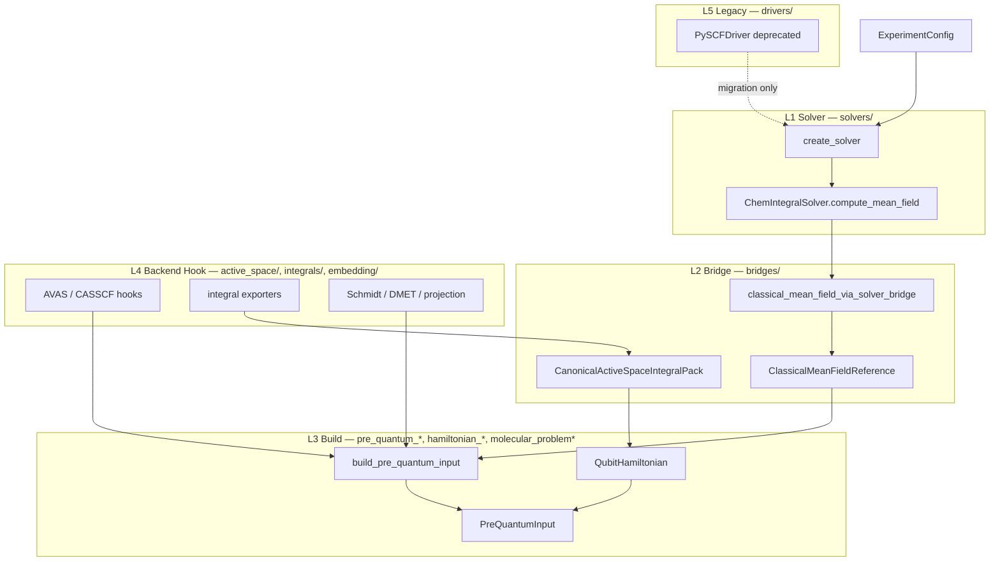
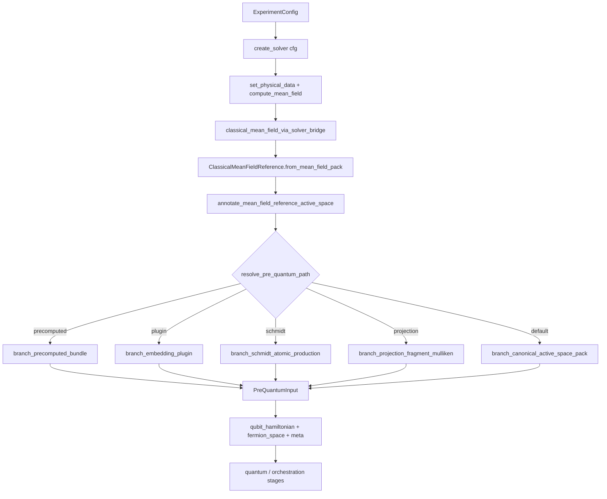

# `qchem_stack.chem` 模块技术参考手册

| 属性 | 值 |
|------|-----|
| **文档类型** | 模块级技术参考（Module Technical Reference） |
| **适用版本** | `schema_version: "2"`（nested YAML canonical） |
| **源码路径** | `src/qchem_stack/chem/` |
| **维护状态** | 与仓库 main 同步；公开 API 以各子包 `__all__` 为准 |
| **目标读者** | 贡献者、集成开发者、技术文档撰写者（Docusaurus / 内部 wiki） |
| **权威风格标准** | [chem_模块风格约定.md](chem_模块风格约定.md) |
| **包内索引** | [src/qchem_stack/chem/README.md](../src/qchem_stack/chem/README.md) |

---

## 1. 文档目的与范围

### 1.1 目的

本文档为 `qchem_stack.chem` 包提供**可发布级**技术参考，供后续在网页（如 Docusaurus）上撰写用户手册与开发者指南时使用。内容涵盖：

- 经典化学层在整体软件栈中的职责与 L1–L5 分层边界
- `ExperimentConfig` → 平均场 → pre-quantum → qubit 哈密顿量的完整构建链
- 顶层公开 API（`chem.__all__` 共 29 个符号）及 `chem.solvers` 子包类型
- 各源文件与子包的职责、在工作流中的消费点
- `SolverCapabilities` 能力位与 `pre_quantum_yaml_matrix` 交叉索引
- 扩展新 solver、新 pre-quantum 分支、新 active-space hook 的标准流程

### 1.2 范围（In Scope）

- Solver registry（`scf.driver` → `ChemIntegralSolver`）
- Bridge 交换物（`ClassicalMeanFieldReference`、`CanonicalActiveSpaceIntegralPack`）
- Pre-quantum 组装（`PreQuantumPath` 分支、`build_pre_quantum_input`）
- 哈密顿量构建（fermion → qubit mapping → `QubitHamiltonian`）
- 积分导出、活性空间 hook、嵌入（Schmidt / DMET / projection）、L3 kernels
- 集成 checklist 与 capability presets

### 1.3 非范围（Out of Scope）

- 变分 VQE / 激发态 / Pauli 协议数值细节（见 `quantum/` 模块文档）
- YAML 字段完整表（见 `config/` 与各 `docs/说明_*配置.md`）
- 量子后端编译与 shots 执行（见 `backends/`、`compiler` config section）
- Flat legacy YAML（`schema_version != "2"`）——由 config 层拒绝

### 1.4 与其他文档的分工

| 文档 | 侧重 |
|------|------|
| **本文** | 模块架构、API、文件布局、构建流水线、扩展流程、工作流映射 |
| [chem_模块风格约定.md](chem_模块风格约定.md) | 分层、import 纪律、布局标准、PR 自检 |
| [统一经典化学接口_ChemIntegralSolver与下游无关性.md](统一经典化学接口_ChemIntegralSolver与下游无关性.md) | L1–L3 理念与维护纪律 |
| [说明_经典化学后端驱动_registry与能力位.md](说明_经典化学后端驱动_registry与能力位.md) | 能力位表、driver 对照 |
| [pre_quantum_yaml_matrix.md](pre_quantum_yaml_matrix.md) | driver × embedding × active_space 允许组合 |
| [说明_config模块技术参考手册.md](说明_config模块技术参考手册.md) | 配置契约层（chem 的上游） |

---

## 2. 架构概览

### 2.1 模块定位

`qchem_stack.chem` 是**经典化学 → pre-quantum 交换层**：

```text
ExperimentConfig (qchem_stack.config)
        │
        ▼
  qchem_stack.chem                 ← SCF、积分、嵌入、qubit 哈密顿量
        │
        ├── orchestration/         ← 阶段调度（SCF → pre-quantum → VQE → …）
        ├── quantum/               ← 变分、激发态、Pauli 协议（消费 PreQuantumInput）
        ├── backends/              ← 模拟器 / 硬件（消费 QubitHamiltonian）
        └── protocols/             ← parity / product contract 导出
```

**核心不变量：**

1. **编排层不为选路而 `import pyscf` / `import psi4`** — 通过 `create_solver` + `SolverCapabilities` 门控
2. **L2 之后下游只依赖 bridge 类型** — `ClassicalMeanFieldReference`、`CanonicalActiveSpaceIntegralPack`、`PreQuantumInput`
3. **Pre-quantum 分支由 `PreQuantumPath` 单一真源** — config 校验、build、parity meta 共用同一枚举
4. **Backend 专属逻辑在 hook / integrals 子包** — 不在 orchestration 散落 `if driver == "pyscf"`

### 2.2 L1–L5 分层模型



| 层级 | 目录 | 职责 | 典型入口 |
|------|------|------|----------|
| L1 | `solvers/` | 注册表、SCF 适配、`SolverCapabilities` | `create_solver`, `ChemIntegralSolver` |
| L2 | `bridges/` | 交换物、reference 工厂、driver meta | `classical_mean_field_reference_from_config` |
| L3 | 根模块 `pre_quantum_*`, `hamiltonian_*`, `molecular_problem*` | pre-quantum 组装、qubit 映射 | `build_pre_quantum_input` |
| L4 | `active_space/`, `integrals/`, `embedding/`, `kernels/` | 后端 hook、数值内核 | `run_avas`, `active_space_integrals` |
| L5 | `drivers/` | **仅** legacy 兼容 | `PySCFDriver`（DeprecationWarning） |

### 2.3 设计目标

| 目标 | 实现方式 |
|------|----------|
| 多后端 | `scf.driver` registry id；entrypoint 组 `qchem_stack.chem_solvers` |
| 可交换 | mean-field / integral pack 进入 L2 后与上游程序类名无关 |
| 可扩展 | 新 solver = `ChemIntegralSolver` + `register_solver`；新分支 = `register_pre_quantum_branch_builder` |
| 易维护 | 大文件按职责拆分；factory/build 薄入口；heavy 数值在 L4 |

---

## 3. 构建流水线

### 3.1 端到端流程（config → solver → bridge → pre_quantum → qubit）



### 3.2 各步骤说明

| 步骤 | 函数 / 类型 | 文件 | 行为 |
|------|-------------|------|------|
| ① Solver 解析 | `create_solver(cfg)` | `solvers/registry.py` | `scf.driver` → `ChemIntegralSolver` 实例 |
| ② SCF | `compute_mean_field(periodic=…)` | 各 `*_solver.py` | 返回 `MolecularMeanFieldResult` |
| ③ Bridge 归一化 | `classical_mean_field_via_solver_bridge` | `bridges/facade.py` | 合并 `driver_meta`、kernel binding |
| ④ Reference 包装 | `ClassicalMeanFieldReference.from_mean_field_pack` | `bridges/mean_field_reference.py` | `MeanFieldLike` + `MolecularSystem` |
| ⑤ 活性空间 meta | `annotate_mean_field_reference_active_space` | `active_space/mean_field_meta.py` | AVAS / CAS 策略元数据 |
| ⑥ 路径解析 | `resolve_pre_quantum_path(cfg)` | `pre_quantum_path.py` | → `PreQuantumPath` 枚举 |
| ⑦ 分支构建 | `get_pre_quantum_branch_builder(path)` | `pre_quantum_builder_registry.py` | 注册表 dispatch |
| ⑧ 输出 | `PreQuantumInput` | `pre_quantum_input.py` | schema `pre_quantum_input_v1` |

### 3.3 可选快捷路径（Restricted RAS 三元组）

与 PySCF `get_system()` 类比，跳过 orchestration 时可一步得到完整 quantum problem：

```text
ExperimentConfig
  → classical_mean_field_reference_from_config(cfg)   # 可选：传入已有 reference
  → restricted_active_space_quantum_problem_from_config(cfg, reference)
  → RestrictedActiveSpaceQuantumProblem
       (compact_mo_operator, interaction_operator, fermion_space,
        hartree_fock_state_jw, qubit_hamiltonian)
```

### 3.4 PySCF 便利路径（测试 / legacy）

```text
  → pyscf_rhf_result_from_config(cfg)          # 要求 scf.driver=pyscf
  → pyscf_ao_system_from_config(cfg)
  → pyscf_lowdin_system_from_rhf(rhf)
```

**注意：** 新代码应优先 `ClassicalMeanFieldReference` + bridge factory，而非 `PySCFDriver`。

### 3.5 SCF 阶段 refinement（orchestration 委托）

`orchestration/scf_stage.py` 在 SCF 之后、pre-quantum 之前可调用：

| 函数 | chem 依赖 | 条件 |
|------|-----------|------|
| `refine_mean_field_for_active_space` | `kernels.dispatch.run_avas`, `active_space.backend_hooks` | `strategy=avas` 或 CASSCF audit/feed |
| `embedding_input_system_payload` | `solver.build_embedding_input_system` | `embedding_input_representation` ∈ `{ao, lowdin_orth_ao}` |

二者均通过 `create_solver(cfg).capabilities` 门控，**不**直接 import PySCF。

---

## 4. 公开 API 参考

以下符号均从 `qchem_stack.chem` 导入（见 `__init__.py` 的 `__all__`，共 **29** 项）。重符号通过 lazy `__getattr__` 加载以避免测试收集期循环 import。

> **`ChemIntegralSolver` / `SolverCapabilities`  intentionally 不在顶层 `__all__`** — 从 `qchem_stack.chem.solvers` 导入（见 §4.2）。

### 4.1 顶层 `chem.__all__`（29 符号）

#### Solver registry

| 符号 | 签名摘要 | 说明 |
|------|----------|------|
| `create_solver` | `(cfg: ExperimentConfig) -> ChemIntegralSolver` | `scf.driver` 解析入口 |
| `registered_solver_ids` | `() -> tuple[str, ...]` | 已注册 backend id 稳定排序 |

#### Bridge / reference

| 符号 | 签名摘要 | 说明 |
|------|----------|------|
| `classical_mean_field_reference_from_config` | `(cfg) -> ClassicalMeanFieldReference` | SCF + bridge + active-space meta |
| `classical_mean_field_via_solver_bridge` | `(cfg) -> MolecularMeanFieldResult` | 仅 SCF pack（无 `MolecularSystem` 包装） |
| `pyscf_rhf_result_from_config` | `(cfg) -> PySCFRHFResult` | PySCF 专属；非 pyscf driver → `ValueError` |
| `fork_driver_meta` | `(meta: dict) -> dict` | 浅拷贝 driver meta（parity 安全） |
| `molecular_system_from_experiment` | `(cfg) -> MolecularSystem` | config → 后端无关分子对象 |

#### Pre-quantum assembly

| 符号 | 签名摘要 | 说明 |
|------|----------|------|
| `build_pre_quantum_input` | `(cfg, reference, *, cfg_path=None, cache=None) -> PreQuantumInput` | 主 pre-quantum 入口 |

#### Restricted active-space problem

| 符号 | 签名摘要 | 说明 |
|------|----------|------|
| `restricted_active_space_quantum_problem_from_config` | `(cfg, reference=None, *, n_active_orbitals=None, …) -> RestrictedActiveSpaceQuantumProblem` | RAS 三元组工厂 |

#### PySCF system views

| 符号 | 签名摘要 | 说明 |
|------|----------|------|
| `pyscf_ao_system_from_config` | `(cfg) -> PySCFAOSystem` | AO 视图（无 PySCFDriver） |
| `pyscf_ao_system_from_rhf` | `(rhf) -> PySCFAOSystem` | 自 reference / PySCFRHFResult |
| `pyscf_lowdin_system_from_rhf` | `(rhf) -> PySCFLowdinSystem` | Löwdin 正交 AO |

#### Data types

**Eager import（`import qchem_stack.chem as chem` 立即可用）：**

| 符号 | 类型 | 说明 |
|------|------|------|
| `MolecularSystem` | `@dataclass` | 符号、Bohr 坐标、charge、multiplicity、basis |
| `ReferenceState` | `@dataclass` | 嵌入 / QSE 参考（mo_coeff、rdm1） |
| `FermionSpace` | class | 自旋轨道空间描述 |
| `RestrictedActiveSpaceIntegralOperatorCompact` | class | 紧凑 MO 积分块 |

**Lazy import（`__getattr__` 按需加载）：**

| 符号 | 类型 | 说明 |
|------|------|------|
| `ClassicalMeanFieldReference` | `@dataclass` | L2 统一 mean-field 容器 |
| `QubitHamiltonian` | `@dataclass` | `QubitOperator` + `n_qubits` + meta |
| `RestrictedActiveSpaceQuantumProblem` | `@dataclass` | compact + InteractionOperator + JW HF |
| `FermionQubitMappingName` | `Literal` alias | `"jordan_wigner"` / `"bravyi_kitaev"` / `"symmetry_conserving_bravyi_kitaev"` |
| `ClassicalBenchmarkContext` | dataclass | 后 HF benchmark 上下文 |
| `IntegrationChecklistReport` | dataclass | 集成 checklist 结果 |

#### Hamiltonian / fermion utilities

| 符号 | 签名摘要 | 说明 |
|------|----------|------|
| `jordan_wigner_interaction_operator_sparse` | `(operator, n_qubits, *, coeff_atol=None) -> sparse` | JW 稀疏矩阵 |
| `restricted_spatial_integrals_to_fermion_operator` | `(h1, h2, …) -> InteractionOperator` | 空间 MO → fermion |

#### Integration / benchmarks

| 符号 | 签名摘要 | 说明 |
|------|----------|------|
| `capabilities_pyscf_production` | `() -> SolverCapabilities` | PySCF 生产 capability preset |
| `capabilities_psi4_production` | `() -> SolverCapabilities` | Psi4 生产 preset（含 L3 委托说明） |
| `capabilities_precomputed_offline` | `() -> SolverCapabilities` | precomputed bundle driver preset |
| `run_integration_checklist` | `(solver) -> IntegrationChecklistReport` | 新 backend 集成自检 |
| `run_classical_post_hf_benchmarks` | `(ctx) -> dict` | HF/MP2/CCSD/CASCI benchmark 分发 |

**示例：**

```python
import qchem_stack.chem as chem
from qchem_stack.config import load_experiment_config

cfg = load_experiment_config("configs/example_h2.yaml")

solver = chem.create_solver(cfg)
assert solver.capabilities.backend_id == cfg.scf.driver

ref = chem.classical_mean_field_reference_from_config(cfg)
pre_q = chem.build_pre_quantum_input(cfg, ref)

assert pre_q.schema == "pre_quantum_input_v1"
assert pre_q.qubit_hamiltonian.n_qubits > 0
```

### 4.2 `qchem_stack.chem.solvers` 子包（非顶层 re-export）

| 符号 | 说明 |
|------|------|
| `ChemIntegralSolver` | `@runtime_checkable` Protocol；SCF + 可选 `get_integrals` |
| `SolverCapabilities` | `@dataclass(frozen=True)` 能力位集合 |
| `MolecularMeanFieldResult` | SCF 输出容器（`mf`, `e_tot`, `mo_energy`, `driver_meta`） |
| `register_solver` | 运行时注册 factory |
| `UnknownSolverError` | `scf.driver` 未注册 |
| `InvalidSolverIdError` | malformed solver id |
| `MockExternalIntegralSolver` | 可复制的外部 backend 样板 |
| `CustomExternalIntegralSolver` | 更完整的自定义模板基类 |
| `validate_solver_adapter_contract` | adapter 契约校验 |

**`ChemIntegralSolver` 核心方法：**

```python
@property
def capabilities(self) -> SolverCapabilities: ...

def set_physical_data(self, cfg: ExperimentConfig) -> None: ...

def compute_mean_field(self, *, periodic: bool = False) -> MolecularMeanFieldResult: ...

def get_integrals(self, *args, **kwargs) -> dict[str, Any]: ...  # 可选；默认 NotImplementedError

def build_embedding_input_system(
    self, reference: ClassicalMeanFieldReference, *, representation: str
) -> dict[str, Any]: ...
```

### 4.3 常见异常

| 异常 | 典型场景 |
|------|----------|
| `UnknownSolverError` | `scf.driver` 不在 registry |
| `InvalidSolverIdError` | 空或含空白的 solver id |
| `ValueError` | 非 RHF 的 restricted RAS、PySCF-only 路径用于非 pyscf driver |
| `ImportError` | 选定 solver 需要 PySCF/Psi4 但未安装 |
| `PipelineError` | orchestration 层 capability 不满足（chem 抛出后包装） |
| `PreQuantumCapabilityError` | pre-quantum 分支 registry 冻结后仍尝试注册 |

---

## 5. 能力位与校验

### 5.1 `SolverCapabilities` 字段

定义于 `solvers/base.py`。每个 `supports_*` 表示**管线是否允许尝试**该 YAML 路径，而非 feature 是否 100% 原生实现于 driver 可执行文件内。

| 字段 | YAML / 路径关联 |
|------|-----------------|
| `backend_id` | 与 `scf.driver` 对应 |
| `supports_molecular_scf` | 分子 SCF |
| `supports_pbc_scf` | `chemistry_extended.pbc` |
| `supports_pbc_k_mesh` | Monkhorst–Pack k-mesh > 1 |
| `supports_rhf` / `rohf` / `uhf` | `scf.method` |
| `supports_implicit_solvent_ddcosmo` | 隐式溶剂 |
| `supports_restricted_active_space_qubit_hamiltonian` | canonical pack 默认路径 |
| `supports_projection_fragment_mulliken_hamiltonian` | `embedding.projection.quantum_hamiltonian=fragment_mulliken_mo` |
| `supports_schmidt_atomic_hamiltonian` | `embedding.dmet.hamiltonian_source=schmidt_atomic_production` |
| `supports_embedding_input_ao_lowdin` | `embedding_input_representation` ∈ `{ao, lowdin_orth_ao}` |
| `supports_casscf_orbital_audit` | `chemistry_extended.casscf.orbital_optimization_*` |
| `supports_avas_active_space_projection` | `active_space.strategy=avas` |
| `supports_rdm_correction_hooks` | RDM bundle 提取 |
| `supports_rdm_nevpt2_casci` | NEVPT2-CASCI 校正 hook |
| `supports_get_integrals` | `get_integrals` 已实现 |
| `capability_notes` | 人类可读说明（如 Psi4 委托 PySCF 核） |

### 5.2 生产 preset 对照

| Preset 函数 | `backend_id` | 典型用途 |
|-------------|--------------|----------|
| `capabilities_pyscf_production()` | `pyscf` | 全功能 pre-quantum |
| `capabilities_psi4_production()` | `psi4` | L1 SCF + L3 委托（见 notes） |
| `capabilities_precomputed_offline()` | `precomputed` | bundle-only；禁 live hooks |

### 5.3 与 config 校验的交叉

| 校验位置 | 能力位相关规则 |
|----------|----------------|
| `EXPERIMENT_CROSS_VALIDATORS` | AVAS、Schmidt、Mulliken projection、precomputed 禁 live embedding |
| `validate_pre_quantum_contract` | 上述规则**子集** + precomputed benchmark 禁 |
| `validate_backend_capabilities_for_pre_quantum_path` | 默认 pre-quantum 路径所需 capability |
| `orchestration/scf_stage.py` | AVAS / CASSCF / embedding_input 运行时二次门控 |

完整组合矩阵见 [pre_quantum_yaml_matrix.md](pre_quantum_yaml_matrix.md)：

| scf.driver | embedding.mode | active_space.strategy | 默认 qubit 路径 |
|------------|----------------|----------------------|-----------------|
| pyscf | none | cas / manual | canonical pack |
| pyscf | dmet | cas + schmidt_atomic_production | Schmidt impurity |
| pyscf | projection | cas + fragment_mulliken_mo | Mulliken MO |
| psi4 | * | *（capability 门控） | 同上（L3 委托） |
| precomputed | none | * | precomputed bundle |
| * | plugin | * | embedding plugin JSON |

### 5.4 `PreQuantumPath` 与 capability 门禁

`build_pre_quantum_input_with_context` 在以下路径会读取 `create_solver(cfg).capabilities`：

- `SCHMIDT_ATOMIC_PRODUCTION` → `supports_schmidt_atomic_hamiltonian`
- `PROJECTION_FRAGMENT_MULLIKEN_MO` → `supports_projection_fragment_mulliken_hamiltonian`
- `CANONICAL_ACTIVE_SPACE_INTEGRAL_PACK` → `supports_restricted_active_space_qubit_hamiltonian`

`PRECOMPUTED_BUNDLE` 与 `EMBEDDING_PLUGIN` 不依赖 live solver capability（precomputed 在 config 层已禁 live hooks）。

---

## 6. 源文件清单

### 6.1–6.10 子包文件（按 area）

| 子包 | 关键文件 | 职责摘要 |
|------|----------|----------|
| **solvers/** | `base.py`, `registry.py`, `pyscf_solver*.py`, `psi4_solver*.py`, `precomputed_solver.py`, `mock_external_solver_example.py` | L1 registry、SCF 适配、能力位 |
| **bridges/** | `facade.py`, `reference_factory.py`, `mean_field_reference.py`, `canonical_integral_pack.py`, `driver_meta.py`, `run_build_cache.py` | L2 交换物、reference 工厂、构建缓存 |
| **integrals/** | `exporter_registry.py`, `pyscf_active_space*.py`, `psi4_active_space*.py`, `pyscf_onebody.py`, `pyscf_lowdin.py` | 活性空间积分提取与 exporter |
| **active_space/** | `hooks_registry.py`, `backend_hooks.py`, `*_active_space_hooks.py`, `avas_projection.py`, `mean_field_meta.py`, `sizing.py` | AVAS/CASSCF hook、策略 meta |
| **embedding/** | `dmet.py`, `schmidt_production*.py`, `projection_hamiltonian.py`, `decomposition_plugin.py`, `hamiltonian_semantics.py` | Schmidt/DMET/projection/plugin |
| **kernels/** | `catalog.py`, `dispatch.py`, `rdm_corrections.py`, `spin_ucc.py` | L3 共享算法 dispatch |
| **systems/** | `pyscf_views.py`, `pyscf_factory.py` | PySCF AO/Löwdin view |
| **drivers/** | `pyscf_driver.py`, `pyscf_driver_*.py` | **L5 deprecated** legacy shim |
| **classical_benchmarks/** | `registry.py`, `context.py`, `pyscf_backend.py` | 后 HF benchmark 分发 |
| **integration/** | `presets.py`, `checklist.py`, `meta_schema.py`, `crosscheck.py` | capability preset、集成 checklist |

### 6.11 根模块（L3 build + 共享类型）

| 类别 | 文件 |
|------|------|
| Pre-quantum | `pre_quantum_build.py`, `pre_quantum_branches.py`, `pre_quantum_path.py`, `pre_quantum_builder_registry.py`, `pre_quantum_input.py`, `pre_quantum_schmidt.py`, `precomputed_*.py` |
| Hamiltonian | `hamiltonian.py`, `hamiltonian_build*.py`, `hamiltonian_meta.py`, `hamiltonian_mapping.py` |
| RAS problem | `molecular_problem.py`, `molecular_problem_build.py`, `restricted_integral_operator.py` |
| System / fermion | `system.py`, `molecular_system_config.py`, `fermion.py`, `spatial_restricted_fermion.py`, `jordan_wigner_sparse.py`, `fermion_mapping_registry.py` |
| 辅助 | `energy_components.py`, `rdm_bundle.py`, `pauli_term_codec.py`, `integral_convention.py`, `pyscf_typing.py`, `problem_bundle.py` |

### 6.12 文件数量统计

- Python 源文件：约 127（含各子包）
- 顶层 `chem.__all__` 符号：29
- `PreQuantumPath` 分支：5
- 内置 solver：`pyscf`, `psi4`, `precomputed`（+ entrypoint / runtime 扩展）

---

## 7. 核心数据模型

### 7.1 `MolecularSystem`

**源码：** `system.py`  
**构造：** `molecular_system_from_experiment(cfg)`

| 字段 | 类型 | 说明 |
|------|------|------|
| `symbols` | `list[str]` | 元素符号 |
| `coordinates_bohr` | `np.ndarray (n_atoms, 3)` | Bohr 坐标 |
| `charge` | `int` | 总电荷 |
| `multiplicity` | `int` | 2S+1 |
| `basis` | `str` | 基组名 |
| `ecp` | `str \| dict \| None` | 有效核芯势 |
| `meta` | `dict` | 扩展 |

与 config `molecule` section 对应；坐标已在 config 预处理阶段统一为 Bohr。

### 7.2 `ClassicalMeanFieldReference`

**源码：** `bridges/mean_field_reference.py`  
**Schema 角色：** L2 统一 post-SCF 容器

| 字段 | 类型 | 说明 |
|------|------|------|
| `mf` | `MeanFieldLike` | 后端无关 mean-field 句柄 |
| `e_tot` | `float` | SCF 总能量 (a.u.) |
| `mo_energy` | `np.ndarray` | MO 能量 |
| `molecular_system` | `MolecularSystem` | 化学系统 |
| `driver_meta` | `dict` | kernel_bindings、upstream tag 等 |

**关键方法：**

- `from_mean_field_pack(pack, molecular_system=…)` — bridge 工厂
- `backend_tag() -> str` — 归一化 upstream id
- `ao_basis_view()` — AO 基视图
- `as_pyscf_rhf_result()` — PySCF 窄化（仅 pyscf 路径）
- `nuclear_repulsion_au()` — 核排斥能

### 7.3 `CanonicalActiveSpaceIntegralPack`

**源码：** `bridges/canonical_integral_pack.py`  
**Schema id：** `qchem_canonical_active_space_integral_pack_v1`

| 字段 | 类型 | 说明 |
|------|------|------|
| `compact` | `RestrictedActiveSpaceIntegralOperatorCompact` | MO 活性空间 h1/h2 紧凑块 |
| `provenance` | `dict` | `classical_backend`, `upstream_integral_source`, bridge id |

工厂：`from_classical_reference`, `from_pyscf_reference`（PySCF 窄化）。

### 7.4 `PreQuantumInput`

**源码：** `pre_quantum_input.py`  
**Schema id：** `pre_quantum_input_v1`（`PRE_QUANTUM_INPUT_SCHEMA_V1`）

| 字段 | 类型 | 说明 |
|------|------|------|
| `classical_reference` | `ClassicalMeanFieldReference` | SCF 参考 |
| `qubit_hamiltonian` | `QubitHamiltonian` | 映射后的 qubit 算符 |
| `canonical_active_space_integral_pack` | `CanonicalActiveSpaceIntegralPack \| None` | canonical 路径非空 |
| `meta` | `dict` | `source`（= `PreQuantumPath.value`）、hamiltonian semantics |

**方法：** `as_summary_dict()` — parity / repro 摘要；`hamiltonian` property 别名。

### 7.5 `QubitHamiltonian`

**源码：** `hamiltonian_build.py`（经 `hamiltonian.py` re-export）

| 字段 | 类型 | 说明 |
|------|------|------|
| `operator` | `QubitOperator` | OpenFermion qubit 算符 |
| `n_qubits` | `int` | 量子比特数 |
| `fermion_space` | `FermionSpace \| None` | 自旋轨道空间 |
| `meta` | `dict` | fingerprint、mapping、n_active_*、integral_source |

**方法：** `sparse_matrix()` — 稀疏矩阵缓存。

**构建入口（`hamiltonian` 子模块）：**

- `molecular_hamiltonian_from_classical_reference`
- `molecular_hamiltonian_from_canonical_active_space_pack`
- `qubit_hamiltonian_from_active_space_fermionic_operator`

### 7.6 `RestrictedActiveSpaceQuantumProblem`

**源码：** `molecular_problem.py`

| 字段 | 说明 |
|------|------|
| `compact_mo_operator` | PySCF-compact MO ERIs |
| `interaction_operator` | OpenFermion `InteractionOperator` |
| `fermion_space` | `FermionSpace` |
| `hartree_fock_state_jw` | JW 计算基 HF 向量 |
| `qubit_hamiltonian` | 映射后 qubit H |
| `meta` | symmetry snapshot 等 |

**限制：** 当前要求 RHF reference；ROHF/UHF → `ValueError`。完整 RAS 工厂见 `restricted_active_space_quantum_problem_from_config`。

---

## 8. 子包详细参考

### 8.1 `qchem_stack.chem.solvers`

**目的：** 可插拔经典 integral / mean-field backend（Tangelo `IntegralSolver` 形状类比）。

**关键入口：**

| 符号 | 说明 |
|------|------|
| `create_solver` | config → solver 实例 |
| `register_solver` | 运行时注册 |
| `registered_solvers_detail` | 诊断元数据 |
| `MockExternalIntegralSolver` | 外部 backend 样板 |

**`__all__`：** 见 §4.2（16+ 符号，含 lazy `PrecomputedIntegralSolver`）。

**内置 driver：**

| id | 实现模块 | preset |
|----|----------|--------|
| `pyscf` | `pyscf_solver.py` | `capabilities_pyscf_production` |
| `psi4` | `psi4_solver.py` | `capabilities_psi4_production` |
| `precomputed` | `precomputed_solver.py` | `capabilities_precomputed_offline` |

Entrypoint 组：`qchem_stack.chem_solvers`（`importlib.metadata.entry_points`）。

### 8.2 `qchem_stack.chem.bridges`

**目的：** 经典 QC 软件 → qchem_stack 交换格式。

**关键入口：**

| 符号 | 说明 |
|------|------|
| `ClassicalMeanFieldReference` | 统一 mean-field |
| `CanonicalActiveSpaceIntegralPack` | 活性空间积分 pack |
| `classical_mean_field_reference_from_config` | config 一键 reference |
| `classical_mean_field_via_solver_bridge` | 仅 SCF pack |
| `fork_driver_meta` | meta 浅拷贝 |
| `MeanFieldLike` / `wrap_mean_field_like` | 后端句柄抽象 |

**`__all__`（14 符号）：** 见 `bridges/__init__.py`；lazy 加载避免 `systems ↔ integrals` 循环。

### 8.3 Pre-quantum 根模块群

**目的：** 嵌入分支调度 → `PreQuantumInput`。

| 模块 | 职责 |
|------|------|
| `pre_quantum_path.py` | `PreQuantumPath` 枚举 + `resolve_pre_quantum_path` |
| `pre_quantum_builder_registry.py` | `register_pre_quantum_branch_builder` |
| `pre_quantum_branches.py` | 五分支实现 |
| `pre_quantum_build.py` | `build_pre_quantum_input` 公开入口 |
| `pre_quantum_schmidt.py` | Schmidt 上下文 |
| `precomputed_pre_quantum.py` | bundle 加载 |

**`pre_quantum_build.__all__`：** `build_pre_quantum_input`, `build_pre_quantum_input_with_context`, `hamiltonian`, `hamiltonian_with_schmidt_context`, `schmidt_hamiltonian_and_context`。

### 8.4 `qchem_stack.chem.hamiltonian`

**目的：** fermion → qubit 映射 facade。

**`__all__`（11 符号）：** `QubitHamiltonian`, `FermionQubitMappingName`, `molecular_hamiltonian_from_classical_reference`, `molecular_hamiltonian_from_canonical_active_space_pack`, `qubit_hamiltonian_from_*`, `hamiltonian_fingerprint_from_qubit_operator`, `molecular_hamiltonian_from_pyscf`（deprecated）。

实现拆分：`hamiltonian_meta.py`, `hamiltonian_mapping.py`, `hamiltonian_build*.py`。

### 8.5 `qchem_stack.chem.integrals`

**目的：** 活性空间积分提取；PySCF/Psi4 exporter registry。

**`__all__`（9 符号）：** `active_space_integrals`, `active_space_casci_raw_blocks`, `one_electron_operator_*`, `build_lowdin_system_from_rhf`, registry 三件套 + `ActiveSpaceIntegralExporter`。

**注册模式：** `register_active_space_integral_exporter(backend_tag, exporter)` → `get_active_space_integral_exporter(tag)`。

### 8.6 `qchem_stack.chem.active_space`

**目的：** CAS / manual / AVAS 策略 helper 与 backend hook。

**公开 `__all__`（11 符号）：** sizing（`ncas_nelec_couplet`, `classify_mean_field_spin_symmetry`）、mean_field_meta（AVAS meta keys、`annotate_mean_field_reference_active_space`、`build_active_space_recipe`）。

**内部 registry：** `hooks_registry.register_active_space_hooks(backend_tag, hooks)` — 供 CASSCF / AVAS / MO transform 后端实现挂载。

### 8.7 `qchem_stack.chem.embedding`

**目的：** Schmidt、DMET、projection、plugin 分解数值。

**`__all__`（9 符号）：** `DMETContext`, `FragmentSolverProtocol`, `ProjectionEmbeddingConfig`, Mulliken projection 函数（含 legacy `mulliken_mo_populations_on_atoms`，`DeprecationWarning`）, `QubitHamiltonianFragmentSolverExact`, `VQEFragmentSolverStub`；`QubitHamiltonianFragmentSolverVQE` 为 lazy deprecated re-export。

**首选 Mulliken 路径：** `embedding/ao_fragment.mulliken_mo_populations_on_atoms(ao_view, mo, atom_indices)`。

**注意：** `QubitHamiltonianFragmentSolverVQE` 已迁移至 `qchem_stack.integrations.dmet_fragment_solvers`（deprecated re-export）。

### 8.8 `qchem_stack.chem.kernels`

**目的：** L3 共享算法（可委托 PySCF / Psi4 / OpenFermion）。

**`__all__`（11 符号）：** `KERNEL_*` 常量, `KernelBinding`, `list_known_kernels`, `kernel_binding`, `run_nevpt2_casci`, `build_spin_uccsd_fermion_generators`, `count_uccsd_excitations`（后三者 lazy）。

**dispatch 入口（`kernels/dispatch.py`）：** `run_avas`, `ensure_mean_field_binding`, `run_nevpt2_casci`。

### 8.9–8.12 其余子包（摘要）

| 子包 | 目的 | `__all__` 要点 |
|------|------|----------------|
| `systems` | PySCF AO/Löwdin view | `PySCFAOSystem`, `PySCFLowdinSystem`；factory 在 `pyscf_factory.py` |
| `classical_benchmarks` | 后 HF benchmark | `ClassicalBenchmarkContext`, `run_classical_post_hf_benchmarks` |
| `integration` | checklist / presets / meta_schema | `capabilities_*`, `run_integration_checklist`, `kernel_bindings` helpers |
| `drivers` | **deprecated** | 仅 `PySCFDriver`（lazy）, `PySCFRHFResult`（eager）；`drivers/__init__.py` 不 eager 加载 `pyscf_driver.py` |

---

## 9. 工作流消费映射

### 9.1 管线阶段与 chem 导入

源码：`orchestration/pipeline.py` — `run_pipeline_sync`

```text
run_pipeline_sync(cfg)
  │
  ├─ [1] scf_stage
  │     create_solver, classical_mean_field_reference_from_config
  │     refine_mean_field_for_active_space (AVAS/CASSCF)
  │     embedding_input_system_payload
  │
  ├─ [2] build_pre_quantum_stage
  │     build_pre_quantum_input_with_context
  │
  ├─ [3] collect_repro_metadata
  │     QubitHamiltonian meta, spin_ucc count, hamiltonian_semantics
  │
  ├─ [4] run_variational_stage
  │     PreQuantumInput.qubit_hamiltonian
  │
  ├─ [5] apply_embedding_workflow_stage
  │     embedding.dmet (DMETContext, fragment solvers)
  │
  ├─ [6] run_excited_stages
  │     QubitHamiltonian
  │
  └─ [7] run_protocol_and_finalize_stage
        energy_components, classical_benchmarks, nevpt2, meta_schema bindings
```

### 9.2 orchestration 文件 → chem 符号

| orchestration 模块 | chem 导入 | 阶段 |
|--------------------|-----------|------|
| `scf_stage.py` | `create_solver`, `classical_mean_field_reference_from_config`, `run_avas`, `casscf_orbital_pass` | SCF + refinement |
| `pre_quantum_stage.py` | `build_pre_quantum_input`, `build_pre_quantum_input_with_context` | pre-quantum |
| `precomputed_stage.py` | `precomputed_bundle`, `precomputed_pre_quantum` | precomputed 快捷 |
| `pipeline.py` | `RunBuildCache`, `list_active_space_integral_exporters`, `list_pre_quantum_branch_builders` | 管线 bootstrap |
| `embedding_workflow_stage.py` | `embedding.dmet` | DMET 多 fragment |
| `stage_execution.py` | `build_energy_components_v1`, `run_classical_post_hf_benchmarks`, `run_nevpt2_casci` | finalize / sidecars |
| `repro_snapshot.py` | `count_uccsd_excitations`, `pre_quantum_hamiltonian_semantics` | repro |
| `build_cache.py` | `RunBuildCache`, `pack_cache_key` | 构建缓存 |
| `excited_stages*.py` | `QubitHamiltonian` | 激发态 |
| `protocol_finalize*.py` | `ClassicalMeanFieldReference`, `QubitHamiltonian` | 协议收尾 |

### 9.3 Config → chem Runtime 对象

| Config 访问 | chem 转换函数 | Runtime 类型 | 消费方 |
|-------------|---------------|--------------|--------|
| `cfg.scf.driver` | `create_solver(cfg)` | `ChemIntegralSolver` | SCF / caps |
| `cfg` (整体) | `classical_mean_field_reference_from_config` | `ClassicalMeanFieldReference` | pre-quantum / embedding |
| `cfg` + reference | `build_pre_quantum_input` | `PreQuantumInput` | quantum stages |
| `cfg.active_space` | `restricted_active_space_quantum_problem_from_config` | `RestrictedActiveSpaceQuantumProblem` | 测试 / 快捷 API |
| `cfg.molecule` | `molecular_system_from_experiment` | `MolecularSystem` | bridge 包装 |

### 9.4 典型调用链（H4 Schmidt 多 fragment）

```python
from qchem_stack.config import load_experiment_config, validate_pre_quantum_contract
from qchem_stack.config.embedding_helpers import is_schmidt_production
import qchem_stack.chem as chem

cfg = load_experiment_config("configs/example_h4_schmidt_multifragment.yaml")
validate_pre_quantum_contract(cfg)

assert cfg.scf.driver == "pyscf"
assert is_schmidt_production(cfg.embedding)

ref = chem.classical_mean_field_reference_from_config(cfg)
pre_q = chem.build_pre_quantum_input(cfg, ref)

assert pre_q.meta["source"] == "schmidt_atomic_production"
assert pre_q.qubit_hamiltonian.n_qubits > 0
```

---

## 10. 扩展开发指南

### 10.1 新增经典 backend（solver）

| 步骤 | 文件 / 动作 |
|------|-------------|
| 1 | 复制 `solvers/mock_external_solver_example.py` → `{your}_solver.py` |
| 2 | 实现 `ChemIntegralSolver`：`capabilities`, `set_physical_data`, `compute_mean_field` |
| 3 | 设置真实 `SolverCapabilities`（诚实标注 `supports_*`） |
| 4 | `solvers/registry.py` — `_bootstrap_builtin_solvers` 或 entrypoint / `register_solver` |
| 5 | `config/scf_specs.py` — 若需新 driver 子块字段 |
| 6 | `config/_experiment_validation.py` — capability 门禁 |
| 7 | `integration/presets.py` — 可选 preset 函数 |
| 8 | `tests/test_backend_capability_conformance.py` + `run_integration_checklist(solver)` |
| 9 | [说明_经典化学后端驱动_registry与能力位.md](说明_经典化学后端驱动_registry与能力位.md) |

**Entrypoint 注册（推荐第三方）：**

```toml
# pyproject.toml
[project.entry-points."qchem_stack.chem_solvers"]
my_backend = "my_pkg.chem_adapter:build_my_solver"
```

**样板 TODO 位（mock_external）：** TODO[1] capabilities；TODO[2] 真实 SCF 调用块。

### 10.2 新增 pre-quantum 分支

| 步骤 | 文件 / 动作 |
|------|-------------|
| 1 | `pre_quantum_path.py` — 新 `PreQuantumPath` 枚举值 |
| 2 | `pre_quantum_branches.py` — `branch_{name}(req: PreQuantumBuildRequest)` |
| 3 | `pre_quantum_builder_registry.py` — `register_pre_quantum_branch_builder` |
| 4 | `pre_quantum_build.py` — `_register_default_pre_quantum_branch_builders` |
| 5 | `pre_quantum_path.resolve_pre_quantum_path` — 判别逻辑 |
| 6 | `config/_experiment_validation.py` — 组合规则 + capability |
| 7 | `docs/pre_quantum_yaml_matrix.md` — 矩阵行 |
| 8 | `tests/test_pre_quantum_input_contract.py` |

**Builder 契约：**

```python
def branch_my_path(req: PreQuantumBuildRequest) -> tuple[PreQuantumInput, dict | None]:
    # 返回 (PreQuantumInput, optional_schmidt_context)
    ...
```

### 10.3 新增 active-space backend hook

| 步骤 | 文件 / 动作 |
|------|-------------|
| 1 | 实现 `ActiveSpaceBackendHooks`（`hooks_protocol.py`） |
| 2 | `{backend}_active_space_hooks.py` — CASSCF / AVAS / MO transform |
| 3 | `hooks_registry.register_active_space_hooks(backend_tag, hooks)` |
| 4 | `integrals/{backend}_active_space_exporter.py` — 若需 canonical pack |
| 5 | `integrals/exporter_registry.py` — 注册 exporter |
| 6 | 更新 `SolverCapabilities.supports_*` |
| 7 | `tests/test_*_active_space*.py` |

**禁止：** 在 `orchestration/` 新增 `if driver == "pyscf"` 选路。

### 10.4 Deprecation 迁移对照

| 旧入口 | 新入口 |
|--------|--------|
| `PySCFDriver.from_config` | `create_solver` + `classical_mean_field_reference_from_config` |
| `PySCFDriver.get_restricted_active_space_quantum_problem` | `restricted_active_space_quantum_problem_from_config` |
| `PySCFDriver.get_system_ao` | `pyscf_ao_system_from_config` |
| `molecular_hamiltonian_from_pyscf` | `build_pre_quantum_input` |
| `integration.driver_meta` | `integration.meta_schema` |

### 10.5 PR 自检清单

- [ ] 对照 [chem_模块风格约定.md](chem_模块风格约定.md) §6
- [ ] orchestration 无新增 `import pyscf` / `if scf.driver == "pyscf"` 选路
- [ ] 新 `supports_*` 已写入 `SolverCapabilities` 并在 config 校验门控
- [ ] 稳定 API 已加入子包 `__all__`；必要时加入 `chem/__init__.py` `_LAZY_ATTRS`
- [ ] `tests/test_chem_public_surface.py` 或 area 契约测试
- [ ] `chem/README.md` Layout 表已更新（若新增 area）
- [ ] [pre_quantum_yaml_matrix.md](pre_quantum_yaml_matrix.md) 已更新（若改分支）
- [ ] 本文对应章节已同步

---

## 11. 网页撰写指南

### 11.1 建议站点结构

```text
/docs/chem/
  overview.md              ← §1–§2 架构概览（L1–L5 mermaid）
  build-pipeline.md        ← §3 构建流水线
  api-reference.md         ← §4 公开 API（29 符号 + solvers 子包）
  capabilities.md          ← §5 能力位 + pre_quantum 矩阵链接
  data-models.md           ← §7 核心数据模型
  subpackages/
    solvers.md             ← §8.1
    bridges.md             ← §8.2
    pre-quantum.md         ← §8.3
    hamiltonian.md         ← §8.4
    integrals.md           ← §8.5
    active-space.md        ← §8.6
    embedding.md           ← §8.7
    kernels.md             ← §8.8
  extending.md             ← §10 扩展指南
  workflow-map.md          ← §9 工作流映射
  deprecation.md           ← §10.4 迁移表
```

### 11.2 页面模板建议

每个子包页面应包含：

1. **Overview** — 层级（L1–L5）、何时需要该子包
2. **Public API Table** — `__all__` 符号、签名摘要
3. **Build Chain Position** — 在 §3 流程图中的位置
4. **Capability Requirements** — 关联 `SolverCapabilities` 字段
5. **Pipeline Usage** — orchestration 消费点（§9 链接）
6. **Examples** — 链到 `configs/*.yaml` 与 `tests/fixtures/classical_reference`
7. **See Also** — config section 文档、quantum 消费文档

### 11.3 代码示例规范

- 顶层导入优先 `import qchem_stack.chem as chem`
- `ChemIntegralSolver` / `SolverCapabilities` 使用 `from qchem_stack.chem.solvers import …`
- 区分「config 加载期 `ConfigurationError`」与「管线 `PipelineError` / chem `ValueError`」
- PySCF 便利路径须标注 **PySCF-only**；默认示例用 bridge API

### 11.4 与现有中文说明文档的关系

| 本文章节 | 迁移时可合并/链接的现有文档 |
|----------|---------------------------|
| §2, §3 | [统一经典化学接口_…](统一经典化学接口_ChemIntegralSolver与下游无关性.md) |
| §5 | [说明_经典化学后端驱动_registry与能力位.md](说明_经典化学后端驱动_registry与能力位.md), [pre_quantum_yaml_matrix.md](pre_quantum_yaml_matrix.md) |
| §8.7 | [说明_embedding配置.md](说明_embedding配置.md) |
| §8.6 | [说明_active_space配置.md](说明_active_space配置.md) |
| §10 | [chem_模块风格约定.md](chem_模块风格约定.md) |
| 上游 config | [说明_config模块技术参考手册.md](说明_config模块技术参考手册.md) |

---

## 12. 相关文档索引

| 文档 | 路径 |
|------|------|
| Chem 风格约定（权威标准） | [chem_模块风格约定.md](chem_模块风格约定.md) |
| Config 模块技术参考（上游） | [说明_config模块技术参考手册.md](说明_config模块技术参考手册.md) |
| Pre-quantum 组合矩阵 | [pre_quantum_yaml_matrix.md](pre_quantum_yaml_matrix.md) |
| 经典 driver registry 与能力位 | [说明_经典化学后端驱动_registry与能力位.md](说明_经典化学后端驱动_registry与能力位.md) |
| 统一经典化学接口理念 | [统一经典化学接口_ChemIntegralSolver与下游无关性.md](统一经典化学接口_ChemIntegralSolver与下游无关性.md) |
| 工程架构 | [ENGINEERING_ARCHITECTURE.md](ENGINEERING_ARCHITECTURE.md) |
| 贡献指南 | [CONTRIBUTING.md](../CONTRIBUTING.md) |
| 快速上手 | [QUICKSTART_CONTRIBUTORS.md](QUICKSTART_CONTRIBUTORS.md) |
| 包内 README | [src/qchem_stack/chem/README.md](../src/qchem_stack/chem/README.md) |
| Multi-backend 哲学 | [docs/execution/multi_backend_integration_philosophy.md](execution/multi_backend_integration_philosophy.md) |

---

## 13. 修订记录

| 日期 | 说明 |
|------|------|
| 2026-05-21 | 初版：模块技术参考手册，供网页技术文档撰写使用 |

---

**维护说明：** 任何改变 `chem.__all__`、构建流水线、`PreQuantumPath` 分支、`SolverCapabilities` 字段或 orchestration 消费契约的 PR，应同步更新本文对应章节，并在 PR 描述中注明对照 [chem_模块风格约定.md](chem_模块风格约定.md) 的章节号。
