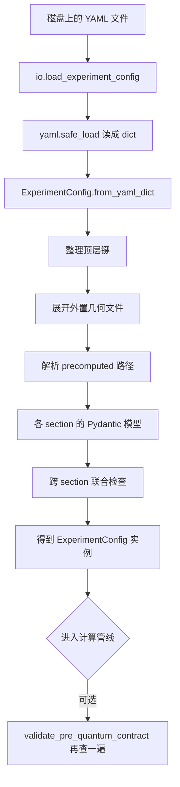

# `qchem_stack.config` 模块说明

> **快速索引：** [`reference/config_field_index.md`](reference/config_field_index.md) · [`reference/config_recipes.md`](reference/config_recipes.md) · [`reference/config_migration.md`](reference/config_migration.md)

| 属性 | 值 |
|------|-----|
| **文档类型** | 模块说明（给贡献者和集成开发者看） |
| **适用版本** | `schema_version: "2"`（嵌套 YAML，当前唯一支持的格式） |
| **源码位置** | `src/qchem_stack/config/` |
| **维护方式** | 跟仓库 main 同步；字段以代码里的 Pydantic 模型为准 |
| **适合谁读** | 想改配置模块的人、要把 config 接到别的系统的人、写文档的人 |
| **更严格的规范** | [config_校验分层约定.md](config_校验分层约定.md) |
| **零基础入门** | [说明_config入门_通俗导读.md](说明_config入门_通俗导读.md) |
| **包内索引** | [src/qchem_stack/config/README.md](../src/qchem_stack/config/README.md) |

---

## 1. 这份文档是干什么的

### 1.1 一句话概括

`qchem_stack.config` 负责：**读实验 YAML → 检查有没有写错 → 变成 Python 对象 → 给后面的计算管线用**。

本文档告诉你这个包怎么组织、怎么加载、怎么扩展。各 section 的字段细节，请看对应的 `docs/说明_*.md`。

若对「YAML 怎么变成 Python 对象」「`cfg` / `ExperimentConfig` / `load_experiment_config` 分别是什么」还不熟悉，建议先读 [说明_config入门_通俗导读.md](说明_config入门_通俗导读.md)。

### 1.2 文档里会讲什么

- 这个模块在整个项目里扮演什么角色
- 从 YAML 文件到 `ExperimentConfig` 对象的完整流程
- 对外公开的函数和类（怎么调用、会报什么错）
- 每个源文件大致负责什么
- 配置是怎么一层层检查的
- 如果要加新字段 / 新 section，应该改哪些文件

### 1.3 文档里不讲什么

- 量子算法、DMET、Schmidt 等**怎么算**（去看 `chem/`、`quantum/` 的文档）
- Parity 导出格式的完整定义（去看 `protocols/product_contract`）
- 旧版扁平 YAML（`schema_version` 不是 `"2"` 的）——现在会直接拒绝加载

### 1.4 和其他文档怎么分工

| 文档 | 主要讲什么 |
|------|-----------|
| **本文** | 整体结构、API、文件怎么拆、怎么扩展、和管线的关系 |
| [说明_config入门_通俗导读.md](说明_config入门_通俗导读.md) | YAML→对象、`cfg`/`ExperimentConfig`/`load_experiment_config` 零基础解释 |
| [config_校验分层约定.md](config_校验分层约定.md) | 校验分几层、哪些写法要避免、提 PR 前自查 |
| [说明_实验配置加载_io.md](说明_实验配置加载_io.md) | `io.py` 的通俗说明 |
| [说明_molecule配置与自旋多重度.md](说明_molecule配置与自旋多重度.md) 等 | 某个 section 的字段表和 YAML 示例 |
| [pre_quantum_yaml_matrix.md](pre_quantum_yaml_matrix.md) | driver、embedding、active_space 哪些组合能用 |

---

## 2. 整体长什么样

### 2.1 它在项目里的位置

可以把 `qchem_stack.config` 理解成**实验配置的「翻译官 + 质检员」**：

```text
用户写的 YAML (configs/*.yaml)
        │
        ▼
  qchem_stack.config          ← 读文件、检查、整理成对象
        │
        ├── orchestration/     ← 按阶段跑管线（SCF → pre-quantum → VQE → …）
        ├── chem/              ← 经典化学计算、建哈密顿量
        ├── quantum/           ← VQE、激发态、Pauli 协议等
        └── backends/          ← 模拟器 / 真机执行与编译
```

**几条固定规则（改代码时别打破）：**

1. **YAML 里的路径 = Python 里的属性路径** — 例如 YAML 里写 `quantum.vqe.maxiter`，代码里就是 `cfg.quantum.vqe.maxiter`
2. **只用 v2 嵌套格式** — 顶层要有 `schema_version: "2"`；每个子块不允许乱写多余字段（`extra="forbid"`）
3. **业务代码不要自己解析 dict** — 用 `ExperimentConfig` 或 `{section}_helpers` 里的函数来读
4. **不认识的顶层键先收进 `extra`** — 方便以后扩展；如果打开 `strict_top_level_keys=True`，则会直接报错

### 2.2 为什么要这样设计

| 目标 | 怎么做 |
|------|--------|
| 好扩展 | 每个 section 拆成 enums、specs、入口、validation、helpers 五块，不搞一个巨大的「全能 Spec」 |
| 好写 YAML | YAML 结构跟实验意图一致，用 `mode`、`strategy` 这类键选分支 |
| 好维护 | 校验写在哪有规律；长说明放 `docs/说明_*.md`，代码里只留 `Field(description=...)` |

### 2.3 每个 section 的文件怎么拆

新增或重构一个配置域（比如 `embedding`、`quantum`）时，按下面五类文件来拆：

```text
{section}_enums.py       # 合法选项（字符串 → 枚举）
{section}_specs.py       # 字段定义（子块长什么样）
{section}.py             # 对外入口（几种形态拼在一起）
{section}_helpers.py     # 给业务代码用的读取函数
_{section}_validation.py # 这一块内部的组合规则检查
```

**为什么要拆？** 把「能写什么值」「字段长什么样」「怎么组装」「合不合法」「业务怎么读」分开，避免一个类什么都管。

| 文件 | 干什么 |
|------|--------|
| `{section}_enums.py` | **合法选项。** 把 YAML 里的字符串收成枚举，比如 `mode: dmet` → `EmbeddingMode.DMET`。少写错字，IDE 也能补全。 |
| `{section}_specs.py` | **字段定义。** 这一块的子结构：有哪些字段、默认值、说明文字。通常不允许多余键。只管「长什么样」，不管复杂校验。 |
| `{section}.py` | **对外入口。** 把几种子形态拼成一个整体，挂到 `ExperimentConfig` 上。比如按 `mode` 字段决定是 DMET 还是 projection。这里的校验逻辑尽量薄，复杂规则交给 `_validation`。 |
| `_{section}_validation.py` | **这一块内部的检查。** 比如「选了 A 模式就必须填 B 字段」。写成普通函数，由入口文件里的 validator 调用。**跨多块配置**的规则（比如 embedding 和 molecule 一起约束）放在 `_experiment_validation.py`。 |
| `{section}_helpers.py` | **给业务代码用的读取函数。** 比如 `require_dmet(spec)`、`resolve_vqe_maxiter(spec)`。把「多种形态」收窄成「当前这一种」，并处理好默认值，避免到处写 `if mode == ...`。 |

**从 YAML 到业务的流向：**

```text
YAML
  ↓
{section}.py（入口：判断是哪种配置）
  ├─ enums      → 选项有哪些
  ├─ specs      → 字段结构
  ├─ validation → 这一块内部是否自洽
  └─ helpers    → 后面代码怎么读
```

**不要这样写：**

- 在 Spec 上再写和 helpers 重复的 `@property`（只保留一处）
- 在 orchestration / chem 里直接用 `cfg["quantum"]["vqe_depth"]` 这种老式 flat 键
- 子块里悄悄忽略未知键（子块必须 `extra=forbid`，多写就报错）

---

## 3. YAML 是怎么加载进来的

### 3.1 从头到尾的流程



### 3.2 每一步在干什么

| 步骤 | 函数 | 在哪 | 干什么 |
|------|------|------|--------|
| ① 整理顶层 | `preprocess_top_level_yaml_dict` | `_experiment_validation.py` | 认识的键保留；不认识的合并进 `extra` |
| ② 外置几何 | `preprocess_experiment_dict_geometry_files` | `geometry_files.py` | 如果写了 `molecule.geometry_file`，读文件填 `symbols` 和 `coordinates` |
| ③ precomputed 路径 | `preprocess_precomputed_bundle_path` | `_experiment_validation_precomputed.py` | 把相对路径转成绝对路径 |
| ④ 各块建模 | Pydantic `model_validate` | 各 `{section}.py` | 检查类型、范围；子块禁止多余字段 |
| ⑤ 跨块检查 | `EXPERIMENT_CROSS_VALIDATORS` | `_experiment_validation.py` | 见 §5.3 |
| ⑥ 管线入口再查 | `validate_pre_quantum_contract` | `_experiment_validation.py` | 只查 pre-quantum 相关的一部分规则（见 §5.2） |

### 3.3 相对路径相对谁

| 配置项 | 基准目录 |
|--------|----------|
| `molecule.geometry_file` | YAML 文件所在目录 |
| `scf.precomputed.bundle_path` | 同上（仅 `driver=precomputed` 时） |
| 已经是绝对路径 | 直接用，不再拼接 |

---

## 4. 对外 API（常用函数）

以下都可以 `from qchem_stack.config import ...` 导入（完整列表见 `__init__.py` 的 `__all__`）。

### 4.1 读写配置

#### `load_experiment_config`

**干什么：** 从磁盘读一个实验 YAML，返回 `ExperimentConfig`。

```python
def load_experiment_config(
    path: str | Path,
    *,
    strict_top_level_keys: bool = False,
) -> ExperimentConfig
```

| 参数 | 类型 | 默认 | 说明 |
|------|------|------|------|
| `path` | `str \| Path` | — | YAML 文件路径 |
| `strict_top_level_keys` | `bool` | `False` | 为 `True` 时，顶层出现未知键会直接报 `ConfigurationError` |

| 可能报的错 | 什么时候 |
|-----------|---------|
| `ConfigurationError` | 文件不存在、读不了、YAML 不是字典、strict 模式下有未知顶层键 |
| `ValidationError` | 字段类型不对、数值超范围、组合规则不满足等 |

**示例：**

```python
from qchem_stack.config import load_experiment_config

cfg = load_experiment_config("configs/example_h4_schmidt_multifragment.yaml")
assert cfg.schema_version == "2"
assert cfg.experiment_id == "h4_schmidt_multifragment_demo"
```

**加载时自动迁移：** 若 YAML 无 `schema_version` 或为 legacy flat 键（`quantum_algorithm`、`scf_driver` 等），
`load_experiment_config` 会在校验前调用 `migrate_config` 升到当前 schema（默认 v2），并写 INFO 日志。
幂等：已是 v2 的文件不会改写磁盘，仅内存中解析为 `ExperimentConfig`。

#### `dump_experiment_config`

**干什么：** 把配置对象转回 YAML 字符串（比如保存或调试）。

```python
def dump_experiment_config(cfg: ExperimentConfig) -> str
```

内部会先去掉不能序列化的 callable（比如测试里的 `expectation_fn`）。

#### `ExperimentConfig.from_yaml_dict`

**干什么：** 已经有 dict 时，不经过读文件直接构造对象。测试和 HTTP API 常用。

```python
@classmethod
def from_yaml_dict(
    cls,
    data: Mapping[str, Any],
    *,
    geometry_files_base_dir: Path | str | None = None,
    strict_top_level_keys: bool = False,
) -> ExperimentConfig
```

`geometry_files_base_dir` 为 `None` 时，跳过几何文件和 precomputed 路径的预处理。

#### `backend_spec_from_config`

**干什么：** 从实验配置里抽出「跑量子计算用哪个后端」的信息。

```python
def backend_spec_from_config(cfg: ExperimentConfig) -> BackendSpec
```

| 输出字段从哪来 | |
|------|------|
| `name`, `provider`, `shots_per_circuit`, … | `cfg.backend.*` |
| `native_twoq` | `cfg.compiler.native_twoq` |

后面 `qchem_stack.backends.factory.executor_from_spec` 会用到。

#### `compiler_pass_bundle_from_config`

**干什么：** 读出编译 pass 相关设置。

```python
def compiler_pass_bundle_from_config(cfg: ExperimentConfig) -> CompilerPassBundle
```

对应 `cfg.compiler.optimization_level`、`preoptimize_passes`、`compiler_passes`。

#### `compiler_bundle_signature_from_config`

**干什么：** 给当前编译 pass 组合算一个 16 字符的摘要，方便复现和记录。

```python
def compiler_bundle_signature_from_config(cfg: ExperimentConfig) -> str
```

### 4.2 进入 pre-quantum 前的额外检查

#### `validate_pre_quantum_contract`

**干什么：** 在真正跑 pre-quantum 阶段前，再显式查一遍相关规则。加载 YAML 时不会自动调用，需要管线或测试自己调。

```python
def validate_pre_quantum_contract(spec: ExperimentConfig) -> None
```

| 这里会查 | 这里不查（只在构造对象时查） |
|---------|---------------------------|
| precomputed 模式不能开 live hooks | MD/ML 几何形状 |
| embedding 契约 + 后端能力 | UCCSD 变分约束 |
| 周期边界（PBC）和 CASSCF 不能同时开 | AVAS 的 ao_labels 非空 |
| pre-quantum 路径需要的 backend 能力 | k-mesh 与 solver 能力（那条单独查） |

**示例：**

```python
from qchem_stack.config import load_experiment_config, validate_pre_quantum_contract

cfg = load_experiment_config("configs/example_h2.yaml")
validate_pre_quantum_contract(cfg)  # 进 pre-quantum 前手动调用
```

### 4.3 几何文件相关

| 函数 | 简要说明 |
|------|----------|
| `parse_xyz` | 解析 XYZ 文本 → 元素符号 + 坐标 |
| `load_cartesian_geometry_file` | 从磁盘读结构文件（目前支持 `.xyz`） |
| `merge_molecule_dict_from_geometry_file` | 把 `geometry_file` 展开成 inline 的 `symbols` / `coordinates` |
| `preprocess_experiment_dict_geometry_files` | 加载流程里用的 in-place 预处理 |

### 4.4 Helpers 速查（业务代码优先用这些）

#### Active space（活性空间）

| 函数 | 输入 | 返回 | 说明 |
|------|------|------|------|
| `resolve_n_orbitals` | `ActiveSpaceSpec` | `int` | 按 strategy 取轨道数 |
| `resolve_n_electrons` | `ActiveSpaceSpec` | `int` | 按 strategy 取电子数 |
| `resolve_fermion_qubit_mapping` | `ActiveSpaceSpec` | 映射名 | 费米子 → qubit 的映射方式 |

#### SCF（自洽场）

| 函数 | 说明 |
|------|------|
| `resolve_scf_max_cycle` | 按 `driver` 从 pyscf 或 psi4 子块读最大迭代次数 |
| `resolve_scf_density_fit` | 同上，读是否开 density fit |

#### Mitigation / Quantum repro（误差缓解与复现字段）

| 函数 | 说明 |
|------|------|
| `zne_enabled`, `pmsv_enabled` | 对应功能是否开启 |
| `quantum_repro_core_fields(cfg)` | 复现快照里稳定的 quantum 键 |
| `quantum_repro_sidecar_fields(cfg)` | VQD/QSE/SCEOM、demo、tensornet 等附加键 |
| `mitigation_repro_core_fields(cfg)` | mitigation 复现键 |

#### Quantum helpers（`quantum_helpers.py`）

读 `quantum.*` 时**优先用这里**，不要在业务代码里重复写一长串 `cfg.quantum....`。

| 类别 | 函数 | 说明 |
|------|------|------|
| 变分 | `resolve_variational_algorithm`, `resolve_variational_ansatz`, `resolve_vqe_depth`, … | VQE / UCCSD / 插件调度 |
| ADAPT | `resolve_adapt_max_iter`, `resolve_adapt_pool_id` | ADAPT 相关 |
| IQEB | `resolve_iqeb_max_rounds`, `resolve_iqeb_pool_id`, … | IQEB 外轮与 pool |
| Pauli | `pauli_protocol_enabled`, `classify_pauli_expectation_path_for_config`, … | Pauli 协议开关与路径 |
| 激发态 | `excited_vqd_after_variational`, … | VQD/QSE/SCEOM 侧车 |
| Demo | `qpe_demo_track_requested`, `vqs_track_requested`, … | QPE/VQS 演示轨 |
| TensorNet | `tensornet_expectation_stub_enabled`, … | TN stub |
| Repro | `quantum_excited_run_summary_yaml_fields`, … | run_summary 字段块 |

`protocols.product_contract` 里仍 re-export 部分 Pauli 相关符号；**以 `quantum_helpers` 为准**。

#### Chemistry extended（扩展化学选项）

| 函数 | 说明 |
|------|------|
| `avas_ao_labels(spec)` | AVAS 轨道标签列表 |
| `pbc_cell_vectors_bohr(spec)` | 周期边界晶胞向量（Bohr） |

#### 常量

| 名称 | 含义 |
|------|------|
| `ANGSTROM_TO_BOHR` | 埃 → Bohr 换算因子 |
| `SCHMIDT_DMET_MAX_CYCLES_LIMIT` | Schmidt DMET 外循环上限（当前 50） |

### 4.5 没在 `__all__` 里、但改代码时常用的

| 符号 | 模块 | 干什么 |
|------|------|--------|
| `require_dmet`, `require_projection`, `require_plugin` | `embedding_helpers` | 把 embedding 收窄成某一种 mode |
| `is_schmidt_production`, `is_projection_mulliken` | `embedding_helpers` | 判断走哪条 embedding 路径 |
| `resolve_schmidt_per_fragment_vqe_maxiter` | `embedding_helpers` | fragment VQE 迭代上限 |
| `resolve_scf_driver_controls` | `scf_helpers` | 读出完整 driver 控制子块 |
| `EXPERIMENT_CROSS_VALIDATORS` | `_experiment_validation` | 注册跨 section 检查的地方 |
| `scf_driver_id` | `_driver_helpers` | 统一 driver 字符串写法 |

---

## 5. 配置是怎么检查的

### 5.1 分五层，由浅到深

```text
第 1 层  单个字段的类型和范围     Field(ge=..., le=...)           写在字段声明里
第 2 层  单个字段的格式整理         @field_validator                模型或 _validation.py
第 3 层  同一块内部的组合规则       @model_validator → 普通函数     _{section}_validation.py
第 4 层  多块之间 / 和后端能力      普通函数                        _experiment_validation.py
第 5 层  进管线前再确认一次         validate_pre_quantum_contract   需要时手动调用
```

**怎么记：** 先查「这个数合不合法」，再查「这一块内部自不自洽」，再查「几块配在一起行不行」，最后在进 pre-quantum 前可选地再查一遍。

### 5.2 什么时候查

| 检查 | 什么时候跑 | 典型例子 |
|------|-----------|---------|
| 各 section 的 `@model_validator` | 构造 `ExperimentConfig` 时 | PMSV 开了就必须有 stabilizers |
| `EXPERIMENT_CROSS_VALIDATORS` | 构造完成后 | 见 §5.3 全表 |
| `validate_pre_quantum_contract` | 管线或测试显式调用 | precomputed、embedding、PBC 相关子集 |

### 5.3 跨 section 检查清单（`EXPERIMENT_CROSS_VALIDATORS`）

| 检查函数 | 文件 | 大致规则 |
|----------|------|----------|
| `validate_embedding_contract` | `_experiment_validation.py` | embedding 内部字段 + 原子索引不能超出分子范围 |
| `validate_md_ml_extra_coordinates_shape` | 同上 | 额外几何的数量和形状 `(n_atom, 3)` |
| `validate_md_ml_pauli_energy_requires_pauli_protocol` | 同上 | 能量参考选 pauli_protocol 时必须开 Pauli 协议 |
| `validate_avas_strategy_requires_labels_and_capability` | 同上 | `strategy=avas` 要有 ao_labels 且 solver 支持 |
| `validate_uccsd_variational_constraints` | 同上 | UCCSD 要 JW 映射；和某些 ZNE 模式互斥 |
| `validate_precomputed_driver_excludes_live_hooks` | `_experiment_validation_precomputed.py` | precomputed 不能开 benchmarks / rdm_correction |
| `validate_pbc_excludes_casscf_hooks` | `_experiment_validation_pbc.py` | PBC 和 CASSCF 轨道优化 hook 不能同时开 |
| `validate_pbc_k_mesh_solver_capability` | 同上 | k-mesh 和后端能力（**不在** pre_quantum_contract 里） |
| `validate_backend_capabilities_for_pre_quantum_path` | `_experiment_validation.py` | 默认 pre-quantum 路径需要的 backend 能力 |

### 5.4 报错时怎么理解

| 异常 | 常见原因 | 怎么处理 |
|------|----------|----------|
| `pydantic.ValidationError` | 类型错、数值超范围、子块多了未知键 | 看错误里的 `loc` 路径，改 YAML 对应位置 |
| `ValueError`（常被包成 ValidationError） | 两种选项不能同时开、形状不对 | 改 YAML 里的策略组合 |
| `ConfigurationError` | 文件 IO、几何文件找不到、driver 能力不够、zmatrix 没 PySCF | 改路径 / 换 driver / 装依赖 |
| `TypeError` | 顶层 `extra` 不是字典 | 改 `extra` 的类型 |

**提示：** 程序里弹给用户的 `ConfigurationError` / `PipelineError` 消息是**英文**；中文解释在各 `docs/说明_*.md` 里。

---

## 6. 源文件一览

### 6.1 按职责分类

| 类别 | 文件 | 干什么 |
|------|------|--------|
| **入口** | `__init__.py` | 对外 re-export |
| **顶层** | `experiment.py` | `ExperimentConfig` 和 `from_yaml_dict` |
| **I/O** | `io.py` | 读写 YAML、转成 BackendSpec / CompilerPassBundle |
| **基础设施** | `_constants.py`, `_validation.py`, `_driver_helpers.py` | 常量、字符串整理、driver 名规范化 |
| **跨 section** | `_experiment_validation.py`, `_experiment_validation_pbc.py`, `_experiment_validation_precomputed.py` | 顶层联合检查 |
| **Molecule** | `molecule.py`, `geometry_files.py` | 分子定义、外置几何文件 |
| **SCF** | `scf.py`, `scf_enums.py`, `scf_specs.py`, `scf_helpers.py`, `_scf_validation.py` | 自洽场 |
| **Active space** | `active_space.py`, `active_space_specs.py`, `active_space_mapping_specs.py`, `active_space_helpers.py`, `_active_space_validation.py` | 活性空间 |
| **Embedding** | `embedding.py`, `embedding_enums.py`, `embedding_specs.py`, `embedding_helpers.py`, `_embedding_validation.py` | DMET / projection / plugin |
| **Quantum** | `quantum.py`, `quantum_enums.py`, `quantum_specs.py`, `quantum_graph.py`, `quantum_helpers.py`, `_quantum_validation.py` | 量子计算阶段 |
| **Chemistry ext.** | `chemistry_extended.py`, `chemistry_extended_specs.py`, `chemistry_extended_helpers.py`, `_chemistry_extended_validation.py` | PBC / AVAS / benchmarks 等 |
| **Execution** | `backend.py`, `compiler.py` | 量子后端与编译 |
| **Mitigation** | `mitigation.py`, `mitigation_specs.py`, `mitigation_helpers.py`, `_mitigation_validation.py` | ZNE / PMSV 等 |
| **Sidecar** | `nexus.py`, `parity_integrations.py`, `md_ml_export.py`, `md_ml_export_helpers.py` | 集成与导出附件 |

### 6.2 规模

- Python 源文件：47 个（含 `README.md`）
- 带 `_validation` 的 section 校验模块：7 个
- 带 `_helpers` 的读取辅助模块：6 个

---

## 7. 顶层配置 `ExperimentConfig` 有哪些块

### 7.1 字段总表

| YAML 键 | Python 属性 | 类型 | 必填 | 默认 | 主要在哪个阶段用 |
|---------|-------------|------|------|------|-----------------|
| `schema_version` | `schema_version` | `str` | 是 | `"2"` | 加载时检查格式 |
| `experiment_id` | `experiment_id` | `str` | 是 | — | 日志、复现 |
| `random_seed` | `random_seed` | `int` | 否 | `0` | 随机数 |
| `molecule` | `molecule` | `MoleculeSpec` | 是 | — | SCF |
| `scf` | `scf` | `SCFSpec` | 否 | 默认 pyscf/RHF | SCF |
| `active_space` | `active_space` | `ActiveSpaceSpec` | 是 | — | SCF 后 / pre-quantum |
| `backend` | `backend` | `BackendSpecConfig` | 否 | statevector | 变分 / Pauli |
| `mitigation` | `mitigation` | `MitigationSpec` | 否 | 全关 | 收尾阶段 |
| `compiler` | `compiler` | `CompilerSpec` | 否 | level=1 | 编译、复现签名 |
| `quantum` | `quantum` | `QuantumSpec` | 否 | vqe | 变分 / 激发 / Pauli |
| `embedding` | `embedding` | `EmbeddingSpec` | 否 | `mode=none` | pre-quantum |
| `chemistry_extended` | `chemistry_extended` | `ChemistryExtendedSpec` | 否 | 空 | AVAS / PBC 等 |
| `nexus_analog` | `nexus_analog` | `NexusAnalogSpec` | 否 | disabled | 资源账本 sidecar |
| `nexus_cloud` | `nexus_cloud` | `NexusCloudSpec` | 否 | mode=off | 云提交 sidecar |
| `parity_integrations` | `parity_integrations` | `ParityIntegrationsSpec` | 否 | 多数 enabled | 复现 parity |
| `md_ml_export` | `md_ml_export` | `MdMlExportSpec` | 否 | 全关 | 管线结束后的 MD/ML 附件 |
| `extra` | `extra` | `dict[str, Any]` | 否 | `{}` | 扩展字段容器 |

### 7.2 `extra` 是干什么的

- YAML 里显式写的 `extra:` 和不认识的顶层键会**合并**进这里
- 适合集成 sidecar、临时扩展；**不保证**跨版本键名不变
- 需要稳定复现的键，应写成正式 TypedDict 字段（见 [config_校验分层约定.md](config_校验分层约定.md)）

---

## 8. 各 section 简介

下面每节说明：**怎么选分支（判别键）**、**子块结构**、**关键字段**、**谁在用**。完整字段表请看对应的 `docs/说明_*.md`。

各 section 的详细配置参考已拆分为独立文档：

| Section | 文档 | 用途 |
|---------|------|------|
| **8.1** | [config_reference_molecule.md](config_reference_molecule.md) | 分子定义：元素、坐标、基组 |
| **8.2** | [config_reference_scf.md](config_reference_scf.md) | 经典自洽场：PySCF/Psi4/precomputed |
| **8.3** | [config_reference_active_space.md](config_reference_active_space.md) | 活性空间：轨道数、电子数、映射 |
| **8.4** | [config_reference_embedding.md](config_reference_embedding.md) | 嵌入/分片：DMET、Schmidt、投影 |
| **8.5** | [config_reference_quantum.md](config_reference_quantum.md) | 量子计算：VQE、ADAPT、激发态 |
| **8.6** | [config_reference_chemistry_extended.md](config_reference_chemistry_extended.md) | 扩展选项：溶剂、周期边界、AVAS |
| **8.7** | [config_reference_backend.md](config_reference_backend.md) | 后端配置：模拟器、真机 |
| **8.8** | [config_reference_compiler.md](config_reference_compiler.md) | 线路编译：优化等级、pass |
| **8.9** | [config_reference_mitigation.md](config_reference_mitigation.md) | 误差缓解：ZNE、PMSV、stub |
| **8.10** | [config_reference_sidecars.md](config_reference_sidecars.md) | 集成 sidecar：Nexus、MD/ML |

**使用建议：**

- **快速查阅**：从上表点击对应 section 文档
- **深入理解**：各文档链接到的 `说明_*.md` 提供更完整的字段表和 YAML 示例
- **代码实现**：参考 `src/qchem_stack/config/` 下的对应文件

---

## 9. 配置和计算管线怎么对接

### 9.1 各阶段读哪些配置

源码入口：`orchestration/pipeline.py` — `run_pipeline_sync` / `run_pipeline_from_config`

```text
run_pipeline_from_config(cfg_path)
  │
  ├─ load_experiment_config(path)
  │
  └─ run_pipeline_sync(cfg)
       │
       ├─ [1] scf_stage
       │     molecule, scf, active_space, chemistry_extended
       │
       ├─ [2] build_pre_quantum_stage
       │     active_space, embedding, chemistry_extended.pbc/avas
       │
       ├─ [3] collect_repro_metadata
       │     全量 + compiler + parity_integrations
       │
       ├─ [4] run_variational_stage
       │     quantum, backend, compiler
       │
       ├─ [5] apply_embedding_workflow_stage
       │     embedding (DMET/Schmidt 多 fragment)
       │
       ├─ [6] run_excited_stages
       │     quantum.excited.*
       │
       └─ [7] run_protocol_and_finalize_stage
             quantum.pauli, mitigation, md_ml_export, nexus_*
```

### 9.2 配置对象怎么变成运行时对象

| 从配置读 | 转换函数 | 得到什么 | 谁用 |
|----------|----------|----------|------|
| 整个 `cfg` | — | `ExperimentConfig` | 全管线 |
| `cfg.backend` + compiler | `backend_spec_from_config` | `BackendSpec` | 创建 executor |
| `cfg.compiler` | `compiler_pass_bundle_from_config` | `CompilerPassBundle` | 编译 pass |
| `cfg.compiler` | `compiler_bundle_signature_from_config` | `str` | 复现签名 |
| `cfg.scf` | `create_solver(cfg)` | `ChemSolver` | SCF |
| `cfg.molecule` | `coordinates_in_bohr()` | `np.ndarray` | 几何相关阶段 |

### 9.3 完整示例（H4 Schmidt 多 fragment）

```python
from qchem_stack.config import (
    load_experiment_config,
    validate_pre_quantum_contract,
    resolve_n_orbitals,
    backend_spec_from_config,
)
from qchem_stack.config.embedding_helpers import is_schmidt_production
from qchem_stack.backends.factory import executor_from_spec

cfg = load_experiment_config("configs/example_h4_schmidt_multifragment.yaml")
validate_pre_quantum_contract(cfg)

assert resolve_n_orbitals(cfg.active_space) == 4
assert is_schmidt_production(cfg.embedding)
assert cfg.scf.driver == "pyscf"

bspec = backend_spec_from_config(cfg)
exe = executor_from_spec(bspec)
```

---

## 10. 怎么改 / 怎么扩展

### 10.1 只加某个 section 里的字段（最小改动）

| 步骤 | 改哪个文件 | 做什么 |
|------|-----------|--------|
| 1 | `{section}_specs.py` | 在子块 `BaseModel` 里加字段 |
| 2 | `_{section}_validation.py` | 如果有「A 和 B 要一起满足」的规则，加检查函数 |
| 3 | `{section}.py` | 如需 `@model_validator`，只转调 validation |
| 4 | `{section}_helpers.py` | 如果多处要读这个新字段，加 `resolve_*` |
| 5 | `_experiment_validation.py` | 如果和别的 section 或 solver 能力有关 |
| 6 | `tests/test_config_*.py` | 写正反例测试 |
| 7 | `docs/说明_{section}*.md` | 更新字段说明和 YAML 示例 |
| 8 | `configs/*.yaml` | 同步示例配置 |

### 10.2 新增一种 embedding mode

| 步骤 | 文件 |
|------|------|
| 1 | `embedding_enums.py` — 加 `EmbeddingMode.NEW = "new"` |
| 2 | `embedding_specs.py` — 加 `EmbeddingNew(EmbeddingBase)` |
| 3 | `embedding.py` — Union 里加入新类 |
| 4 | `_embedding_validation.py` — 校验 + backend caps |
| 5 | `embedding_helpers.py` — 加 `require_new(spec)` |
| 6 | `chem/embedding/`, `orchestration/embedding_workflow_stage.py` — 业务实现 |
| 7 | `docs/pre_quantum_yaml_matrix.md` — 更新组合矩阵 |

### 10.3 新增跨 section 规则

```python
# _experiment_validation.py

def validate_my_cross_rule(spec: ExperimentConfig) -> None:
    if spec.some_section.flag and spec.other_section.flag:
        raise ValueError("some_section.flag incompatible with other_section.flag")

EXPERIMENT_CROSS_VALIDATORS = (
    # ... existing ...
    validate_my_cross_rule,
)
```

要不要也放进 `validate_pre_quantum_contract`，取决于这条规则是不是 pre-quantum 路径才需要。

### 10.4 新增 SCF driver

| 步骤 | 模块 |
|------|------|
| 1 | `scf_specs.py` — driver 子块模型 |
| 2 | `scf.py` — 挂到 `SCFSpec` |
| 3 | `_scf_validation.py` — driver 特有规则 |
| 4 | `chem/solvers/registry.py` — 注册 + `SolverCapabilities` |
| 5 | `_experiment_validation.py` — capability 检查 |
| 6 | 更新 [说明_经典化学后端驱动_registry与能力位.md](说明_经典化学后端驱动_registry与能力位.md) |

### 10.5 支持新的几何文件格式

| 步骤 | 文件 |
|------|------|
| 1 | `geometry_files.py` — 写 parser |
| 2 | 扩展 `GeometryFileFormat` |
| 3 | `_infer_geometry_format` 加分支 |
| 4 | `merge_molecule_dict_from_geometry_file` 允许新 format |
| 5 | `tests/chem/test_geometry_files.py` |

### 10.6 提 PR 前自查

- [ ] 对照 [config_校验分层约定.md](config_校验分层约定.md)
- [ ] 子块 `extra="forbid"`
- [ ] 错误信息里用完整 nested 路径（如 `quantum.vqe.maxiter`）
- [ ] 跑 `pytest tests/config/test_config_validation_helpers.py` 或 section 专项测试
- [ ] 示例 YAML 能 `from_yaml_dict` 加载
- [ ] 更新对应 `docs/说明_*.md`

---

## 11. 如果要搬到网页文档（Docusaurus 等）

### 11.1 建议目录结构

```text
/docs/config/
  overview.md              ← §1–§2
  loading-yaml.md          ← §3
  api-reference.md         ← §4
  validation.md            ← §5
  sections/
    molecule.md
    scf.md
    ...
  extending.md             ← §10
  workflow-map.md          ← §9
```

### 11.2 每个 section 页面建议包含

1. **Overview** — 什么时候需要这一块、用什么键选分支
2. **YAML 示例** — 嵌套结构
3. **字段表** — 名、类型、默认、约束
4. **校验规则** — 哪些组合不能一起开
5. **管线用法** — 哪个阶段、哪个模块读它
6. **Examples** — 链到 `configs/*.yaml`
7. **See Also** — 链到 chem/quantum 实现文档

### 11.3 代码示例习惯

- 统一 `from qchem_stack.config import ...`
- 路径用仓库里真实的 `configs/` 示例
- 区分「加载时报错」和「跑管线时报 PipelineError」

### 11.4 和现有中文说明怎么合并

| 本文章节 | 可链接的现有文档 |
|----------|-----------------|
| §3, §4.1 | [说明_实验配置加载_io.md](说明_实验配置加载_io.md) |
| §8.1 | [说明_molecule配置与自旋多重度.md](说明_molecule配置与自旋多重度.md) |
| §8.2 | [说明_scf配置.md](说明_scf配置.md) |
| §8.3 | [说明_active_space配置.md](说明_active_space配置.md) |
| §8.4 | [说明_embedding配置.md](说明_embedding配置.md) |
| §8.5 | [说明_quantum配置.md](说明_quantum配置.md) |
| §5, §10 | [config_校验分层约定.md](config_校验分层约定.md) |

---

## 12. 相关文档

| 文档 | 路径 |
|------|------|
| 零基础入门导读 | [说明_config入门_通俗导读.md](说明_config入门_通俗导读.md) |
| 校验分层约定 | [config_校验分层约定.md](config_校验分层约定.md) |
| Pre-quantum 组合矩阵 | [pre_quantum_yaml_matrix.md](pre_quantum_yaml_matrix.md) |
| 工程架构 | [ENGINEERING_ARCHITECTURE.md](ENGINEERING_ARCHITECTURE.md) |
| 贡献指南 | [CONTRIBUTING.md](../CONTRIBUTING.md) |
| 包内 README | [src/qchem_stack/config/README.md](../src/qchem_stack/config/README.md) |

---

## 13. 修订记录

| 日期 | 说明 |
|------|------|
| 2026-05-20 | 初版 |
| 2026-05-22 | 全文改写成更通俗的叙述；§2.3 补充 section 五文件分工说明 |

---

**维护提示：** 改了 public YAML 形状、校验层次或 `__all__` 里的 API，请同步更新本文，并在 PR 里注明对照了 [config_校验分层约定.md](config_校验分层约定.md) 哪一节。
