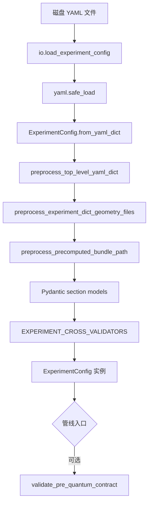

# `qchem_stack.config` 模块技术参考手册

| 属性 | 值 |
|------|-----|
| **文档类型** | 模块级技术参考（Module Technical Reference） |
| **适用版本** | `schema_version: "2"`（nested YAML canonical） |
| **源码路径** | `src/qchem_stack/config/` |
| **维护状态** | 与仓库 main 同步；字段以 Pydantic 模型为准 |
| **目标读者** | 贡献者、集成开发者、技术文档撰写者（Docusaurus / 内部 wiki） |
| **权威风格标准** | [config_校验分层约定.md](config_校验分层约定.md) |
| **包内索引** | [src/qchem_stack/config/README.md](../src/qchem_stack/config/README.md) |

---

## 1. 文档目的与范围

### 1.1 目的

本文档为 `qchem_stack.config` 包提供**可发布级**技术参考，供后续在网页（如 Docusaurus）上撰写用户手册与开发者指南时使用。内容涵盖：

- 模块在整体软件栈中的职责与边界
- YAML → 强类型模型的完整加载链
- 公开 API（函数签名、参数、返回值、异常）
- 各源文件的职责与在工作流中的消费点
- 校验分层与跨 section 规则索引
- 扩展开发的标准流程与文件修改清单

### 1.2 范围（In Scope）

- `ExperimentConfig` 及其全部嵌套 section
- I/O、预处理、helpers、validation 层
- 与 orchestration / chem / quantum / backends 的接口边界

### 1.3 非范围（Out of Scope）

- 各量子算法、DMET、Schmidt 的数值实现细节（见 `chem/`、`quantum/` 模块文档）
- Parity 导出键的完整 schema（见 `protocols/product_contract`）
- Flat legacy YAML（`schema_version != "2"`）——加载时直接拒绝

### 1.4 与其他文档的分工

| 文档 | 侧重 |
|------|------|
| **本文** | 模块架构、API、文件布局、扩展流程、工作流映射 |
| [config_校验分层约定.md](config_校验分层约定.md) | 校验层次、反模式、PR 自检 |
| [说明_实验配置加载_io.md](说明_实验配置加载_io.md) | `io.py` 面向用户的通俗说明 |
| [说明_molecule配置与自旋多重度.md](说明_molecule配置与自旋多重度.md) 等 | 各 section 字段表与 YAML 示例 |
| [pre_quantum_yaml_matrix.md](pre_quantum_yaml_matrix.md) | driver × embedding × active_space 允许组合矩阵 |

---

## 2. 架构概览

### 2.1 模块定位

`qchem_stack.config` 是实验契约层（Experiment Contract Layer）：

```text
用户 YAML (configs/*.yaml)
        │
        ▼
  qchem_stack.config          ← 解析、校验、窄化访问
        │
        ├── orchestration/     ← 管线阶段调度（SCF → pre-quantum → VQE → …）
        ├── chem/              ← 经典化学、哈密顿量构建
        ├── quantum/           ← 变分、激发态、Pauli 协议
        └── backends/          ← 模拟器 / 硬件执行与编译
```

**核心不变量：**

1. **YAML 路径 = Python 属性路径** — 例如 `quantum.vqe.maxiter` → `cfg.quantum.vqe.maxiter`
2. **嵌套 v2 schema** — 顶层 `schema_version: "2"`；子块 `extra="forbid"`
3. **业务代码不解析 raw dict** — 通过 `ExperimentConfig` 或 `{section}_helpers` 访问
4. **未知顶层键合并到 `extra`** — 前向兼容；`strict_top_level_keys=True` 时可拒绝

### 2.2 设计目标

| 目标 | 实现方式 |
|------|----------|
| 可扩展 | 新 section = enums + specs + 入口 + validation + helpers；避免「上帝 Spec」 |
| 易用 | YAML 结构反映实验意图（判别键在 section 顶层） |
| 易维护 | 校验位置可预测；长文文档在 `docs/说明_*.md`，代码仅 `Field(description=...)` |

### 2.3 标准 Section 文件布局

新增或重构一个 YAML section 时，遵循以下骨架（样板：`embedding`、`quantum`）：

```text
{section}_enums.py       # 用户可见字符串 → StrEnum
{section}_specs.py       # 嵌套 BaseModel 子块，一律 extra="forbid"
{section}.py             # 顶层 Spec / Discriminated Union 入口
{section}_helpers.py     # 只读窄化：require_xxx / resolve_xxx
_{section}_validation.py # 子块内跨字段规则
```

**禁止：**

- Spec 上与 helpers 语义重复的 `@property`
- orchestration / chem 内直接读 `cfg["quantum"]["vqe_depth"]` 等 flat 键
- 未知子键 silent ignore（子块必须 `extra=forbid`）

---

## 3. 配置加载流水线

### 3.1 端到端流程



### 3.2 各预处理步骤说明

| 步骤 | 函数 | 文件 | 行为 |
|------|------|------|------|
| ① 顶层键过滤 | `preprocess_top_level_yaml_dict` | `_experiment_validation.py` | 已知键保留；未知键合并进 `extra` |
| ② 外置几何 | `preprocess_experiment_dict_geometry_files` | `geometry_files.py` | `molecule.geometry_file` → `symbols` + `coordinates` |
| ③ precomputed 路径 | `preprocess_precomputed_bundle_path` | `_experiment_validation_precomputed.py` | 相对 `bundle_path` 解析为绝对路径 |
| ④ Section 建模 | Pydantic `model_validate` | 各 `{section}.py` | 类型、范围、子块 forbid extra |
| ⑤ 跨 section 校验 | `EXPERIMENT_CROSS_VALIDATORS` | `_experiment_validation.py` | 见 §5.3 |
| ⑥ 管线二次门禁 | `validate_pre_quantum_contract` | `_experiment_validation.py` | 规则**子集**（见 §5.2） |

### 3.3 相对路径解析规则

| 配置项 | 基准目录 |
|--------|----------|
| `molecule.geometry_file` | YAML 文件所在目录（`load_experiment_config` 传入 `geometry_files_base_dir=p.parent`） |
| `scf.precomputed.bundle_path` | 同上（仅当 `driver=precomputed`） |
| 绝对路径 | 忽略基准目录，直接使用 |

---

## 4. 公开 API 参考

以下符号均从 `qchem_stack.config` 导入（见 `__init__.py` 的 `__all__`）。

### 4.1 I/O 与运行时适配

#### `load_experiment_config`

```python
def load_experiment_config(
    path: str | Path,
    *,
    strict_top_level_keys: bool = False,
) -> ExperimentConfig
```

| 参数 | 类型 | 默认 | 说明 |
|------|------|------|------|
| `path` | `str \| Path` | — | 实验 YAML 文件路径 |
| `strict_top_level_keys` | `bool` | `False` | `True` 时未知顶层键 → `ConfigurationError` |

| 异常 | 条件 |
|------|------|
| `ConfigurationError` | 文件不存在、不可读、YAML 非 mapping、strict 模式下未知顶层键 |
| `ValidationError` | Pydantic 字段/跨字段校验失败 |

**示例：**

```python
from qchem_stack.config import load_experiment_config

cfg = load_experiment_config("configs/example_h4_schmidt_multifragment.yaml")
assert cfg.schema_version == "2"
assert cfg.experiment_id == "h4_schmidt_multifragment_demo"
```

#### `dump_experiment_config`

```python
def dump_experiment_config(cfg: ExperimentConfig) -> str
```

将配置序列化为 YAML 字符串；内部 `_strip_callables` 移除不可序列化的 callable（如测试中的 `expectation_fn`）。

#### `ExperimentConfig.from_yaml_dict`

```python
@classmethod
def from_yaml_dict(
    cls,
    data: Mapping[str, Any],
    *,
    geometry_files_base_dir: Path | str | None = None,
    strict_top_level_keys: bool = False,
) -> ExperimentConfig
```

程序化构造入口；测试与 HTTP API 常用。`geometry_files_base_dir` 为 `None` 时跳过几何/precomputed 路径预处理。

#### `backend_spec_from_config`

```python
def backend_spec_from_config(cfg: ExperimentConfig) -> BackendSpec
```

| 映射 | 来源 |
|------|------|
| `name`, `provider`, `shots_per_circuit`, … | `cfg.backend.*` |
| `native_twoq` | `cfg.compiler.native_twoq` |

消费方：`qchem_stack.backends.factory.executor_from_spec`。

#### `compiler_pass_bundle_from_config`

```python
def compiler_pass_bundle_from_config(cfg: ExperimentConfig) -> CompilerPassBundle
```

映射 `cfg.compiler.optimization_level`、`preoptimize_passes`、`compiler_passes`。

#### `compiler_bundle_signature_from_config`

```python
def compiler_bundle_signature_from_config(cfg: ExperimentConfig) -> str
```

返回 16 字符 SHA256 摘要，用于 Methods / repro 中标识编译 pass 组合。

### 4.2 管线二次门禁

#### `validate_pre_quantum_contract`

```python
def validate_pre_quantum_contract(spec: ExperimentConfig) -> None
```

| 包含的规则 | 不包含（仅在构造时运行） |
|-----------|-------------------------|
| precomputed 禁 live hooks | MD/ML 几何形状 |
| embedding 契约 + backend caps | UCCSD variational 约束 |
| PBC ↔ CASSCF 互斥 | AVAS ao_labels 非空 |
| backend capabilities（pre-quantum 路径） | `validate_pbc_k_mesh_solver_capability` |

**示例：**

```python
from qchem_stack.config import load_experiment_config, validate_pre_quantum_contract

cfg = load_experiment_config("configs/example_h2.yaml")
validate_pre_quantum_contract(cfg)  # 进入 pre-quantum 前显式调用
```

### 4.3 几何 I/O

| 函数 | 签名摘要 | 说明 |
|------|----------|------|
| `parse_xyz` | `(text: str) -> tuple[list[str], list[list[float]]]` | 解析 XYZ 文本 |
| `load_cartesian_geometry_file` | `(path, *, file_format=None)` | 读磁盘结构文件（当前支持 `.xyz`） |
| `merge_molecule_dict_from_geometry_file` | `(molecule: Mapping, *, base_dir: Path) -> dict` | 展开 `geometry_file` 为 inline 几何 |
| `preprocess_experiment_dict_geometry_files` | `(data: dict, *, base_dir: Path) -> None` | in-place 预处理 |

### 4.4 Helpers 速查

#### Active space

| 函数 | 输入 | 返回 | 说明 |
|------|------|------|------|
| `resolve_n_orbitals` | `ActiveSpaceSpec` | `int` | `strategy=manual` → `manual.n_orbitals`，否则 `cas.n_orbitals` |
| `resolve_n_electrons` | `ActiveSpaceSpec` | `int` | 同上 |
| `resolve_fermion_qubit_mapping` | `ActiveSpaceSpec` | `FermionQubitMappingName` | `mapping.fermion_qubit` |

#### SCF

| 函数 | 说明 |
|------|------|
| `resolve_scf_max_cycle` | 按 `driver` 选 `pyscf` 或 `psi4` 子块 |
| `resolve_scf_density_fit` | 同上 |

#### Mitigation / Quantum repro

| 函数 | 说明 |
|------|------|
| `zne_enabled`, `pmsv_enabled` | 布尔开关 |
| `quantum_repro_core_fields(cfg)` | repro snapshot 稳定键 dict |
| `quantum_repro_sidecar_fields(cfg)` | VQD/QSE/SCEOM、demo、tensornet 详细 YAML 键 |
| `mitigation_repro_core_fields(cfg)` | mitigation repro 键 |

#### Quantum helpers（`quantum_helpers.py`）

插件 runner、orchestration、workflow preview 读取 `quantum.*` 时**优先**使用下表，而非在业务层重复 `cfg.quantum....`。

| 类别 | 函数 | 说明 |
|------|------|------|
| 变分 | `resolve_variational_algorithm`, `resolve_variational_ansatz`, `resolve_vqe_depth`, `resolve_vqe_maxiter`, `resolve_vqe_optimizer_method`, `resolve_vqe_initial_parameters_strategy`, `resolve_uccsd_trotter_steps`, `resolve_quantum_algorithm_factory` | VQE / UCCSD / 插件 dispatch |
| ADAPT | `resolve_adapt_max_iter`, `resolve_adapt_pool_id` | ADAPT / tetris_adapt |
| IQEB | `resolve_iqeb_max_rounds`, `resolve_iqeb_pool_id`, `resolve_iqeb_n_grads`, `resolve_iqeb_energy_tolerance` | IQEB 外轮与 pool |
| Pauli | `pauli_protocol_enabled`, `pauli_run_sampled`, `pauli_run_qiskit_shots`, `resolve_pauli_grouping`, `pauli_record_histograms`, `resolve_pauli_support_max_terms`, `classify_pauli_expectation_path_for_config` | 协议开关与路径分类（`PAULI_PATH_*` 常量同模块） |
| 激发态 | `excited_vqd_after_variational`, …, `excited_vqd_plugin_params`, `excited_qse_plugin_params`, `excited_sceom_plugin_params` | sidecar 开关、维度与插件 runner 参数块 |
| Demo track | `qpe_demo_track_requested`, `qpe_three_pack_requested`, `vqs_track_requested`, `resolve_qpe_demo_track_n_bits`, `resolve_vqs_track_payload_kwargs`, `quantum_workflow_preview_qpe_fields`, `quantum_workflow_preview_vqs_fields`, `quantum_demo_open_stack_yaml_flags` | QPE/VQS 演示轨 |
| TensorNet | `tensornet_expectation_stub_enabled`, `resolve_tensornet_contraction_engine` | stub 侧车 |
| Repro / summary | `quantum_excited_run_summary_yaml_fields`, `quantum_variational_run_summary_yaml_fields`, `quantum_algorithm_report_run_summary_fields` | `run_summary` 字段块；后者从 pipeline `algorithm_report` 镜像 `algorithm_report_*` 键 |

Capability surface（`GET /v1/meta/capability-surface`）另含 `variational_registry_export_v1` 与 `excited_registry_export_v1`（与 parity export 同源）。

`protocols.product_contract` 仍 re-export `PAULI_PATH_*` 与 `classify_pauli_expectation_path(QuantumSpec)`；canonical 实现在 `quantum_helpers`。

#### Chemistry extended

| 函数 | 说明 |
|------|------|
| `avas_ao_labels(spec)` | AVAS 轨道标签列表 |
| `pbc_cell_vectors_bohr(spec)` | PBC 晶胞向量 |

#### 常量

| 名称 | 值 / 含义 |
|------|-----------|
| `ANGSTROM_TO_BOHR` | CODATA 兼容 Å→Bohr 换算因子 |
| `SCHMIDT_DMET_MAX_CYCLES_LIMIT` | Schmidt DMET 循环上限（当前 50） |

### 4.5 未在 `__all__` 但常用的内部/扩展 API

业务代码优先用 helpers；以下供贡献者与深度集成：

| 符号 | 模块 | 用途 |
|------|------|------|
| `require_dmet`, `require_projection`, `require_plugin` | `embedding_helpers` | 窄化 `EmbeddingSpec` Union |
| `is_schmidt_production`, `is_projection_mulliken` | `embedding_helpers` | 路径判别 |
| `resolve_schmidt_per_fragment_vqe_maxiter` | `embedding_helpers` | fragment VQE 迭代预算 |
| `resolve_variational_algorithm`, `resolve_adapt_pool_id`, `classify_pauli_expectation_path_for_config` | `quantum_helpers` | 量子阶段开关与 repro |
| `resolve_scf_driver_controls` | `scf_helpers` | 完整 driver 控制子块 |
| `EXPERIMENT_CROSS_VALIDATORS` | `_experiment_validation` | 注册表扩展点 |
| `scf_driver_id` | `_driver_helpers` | 归一化 driver 字符串 |

---

## 5. 校验架构

### 5.1 分层模型

```text
层级 1  单字段类型/范围     Field(ge=..., le=...)           模型字段声明
层级 2  单字段归一化         @field_validator                模型或 _validation.py
层级 3  子块内跨字段         @model_validator → 纯函数       _{section}_validation.py
层级 4  跨 section / 能力位  纯函数                          _experiment_validation.py
层级 5  管线二次确认         validate_pre_quantum_contract   管线入口显式调用
```

### 5.2 构造时 vs 管线门禁

| 函数 | 触发时机 | 典型规则 |
|------|----------|----------|
| Section `@model_validator` | `model_validate` | density_fit/auxbasis、mitigation PMSV stabilizers 非空 |
| `EXPERIMENT_CROSS_VALIDATORS` | `ExperimentConfig` 构造后 | 见 §5.3 全表 |
| `validate_pre_quantum_contract` | 管线/测试显式调用 | precomputed、embedding、PBC/CASSCF、backend caps 子集 |

### 5.3 `EXPERIMENT_CROSS_VALIDATORS` 注册表

| 校验函数 | 文件 | 规则摘要 |
|----------|------|----------|
| `validate_embedding_contract` | `_experiment_validation.py` | embedding 跨字段 + 原子索引在分子范围内 |
| `validate_md_ml_extra_coordinates_shape` | 同上 | extra 几何数量与 `(n_atom, 3)` 形状 |
| `validate_md_ml_pauli_energy_requires_pauli_protocol` | 同上 | `energy_reference=pauli_protocol` → `quantum.pauli.use_protocol` |
| `validate_avas_strategy_requires_labels_and_capability` | 同上 | `strategy=avas` → 非空 `ao_labels` + solver capability |
| `validate_uccsd_variational_constraints` | 同上 | UCCSD 与 mapping / pauli protocol 互斥；`uccsd + qse.pauli_transitions` 互斥 |
| `validate_precomputed_driver_excludes_live_hooks` | `_experiment_validation_precomputed.py` | precomputed 禁 benchmarks / rdm_correction |
| `validate_pbc_excludes_casscf_hooks` | `_experiment_validation_pbc.py` | PBC 与 CASSCF 轨道优化 hook 互斥 |
| `validate_pbc_k_mesh_solver_capability` | 同上 | k-mesh 与 solver 能力（**不在** pre_quantum_contract 内） |
| `validate_backend_capabilities_for_pre_quantum_path` | `_experiment_validation.py` | default pre-quantum 路径所需 capability |

### 5.4 异常类型与处理指南

| 异常 | 典型场景 | 用户动作 |
|------|----------|----------|
| `pydantic.ValidationError` | 类型错误、ge/le 违反、子块 forbid extra | 按 `loc` 路径修改 YAML |
| `ValueError`（包装为 ValidationError） | 互斥组合、形状错误 | 修改 YAML 策略组合 |
| `ConfigurationError` | 文件 IO、geometry 缺失、driver capability 不满足、zmatrix 无 PySCF | 换 driver / 装依赖 / 修正路径 |
| `TypeError` | `extra` 非 mapping | 修正顶层 `extra` 类型 |

**用户可见错误消息：** `ConfigurationError` / 管线 `PipelineError` 使用**英文**；中文说明放在 `docs/说明_*.md`。

---

## 6. 源文件清单

### 6.1 按职责分类

| 类别 | 文件 | 职责 |
|------|------|------|
| **入口** | `__init__.py` | 公开 re-export |
| **顶层** | `experiment.py` | `ExperimentConfig` 定义与 `from_yaml_dict` |
| **I/O** | `io.py` | YAML 读写、BackendSpec/CompilerPassBundle 转换 |
| **基础设施** | `_constants.py`, `_validation.py`, `_driver_helpers.py` | 常数、文本归一化、driver id |
| **跨 section** | `_experiment_validation.py`, `_experiment_validation_pbc.py`, `_experiment_validation_precomputed.py` | 顶层校验 registry |
| **Molecule** | `molecule.py`, `geometry_files.py` | 分子 schema 与外置几何 |
| **SCF** | `scf.py`, `scf_enums.py`, `scf_specs.py`, `scf_helpers.py`, `_scf_validation.py` | 经典 mean-field |
| **Active space** | `active_space.py`, `active_space_specs.py`, `active_space_mapping_specs.py`, `active_space_helpers.py`, `_active_space_validation.py` | 活性空间与映射 |
| **Embedding** | `embedding.py`, `embedding_enums.py`, `embedding_specs.py`, `embedding_helpers.py`, `_embedding_validation.py` | DMET/projection/plugin |
| **Quantum** | `quantum.py`, `quantum_enums.py`, `quantum_specs.py`, `quantum_graph.py`, `quantum_helpers.py`, `_quantum_validation.py` | 变分/激发/Pauli |
| **Chemistry ext.** | `chemistry_extended.py`, `chemistry_extended_specs.py`, `chemistry_extended_helpers.py`, `_chemistry_extended_validation.py` | PBC/AVAS/benchmarks |
| **Execution** | `backend.py`, `compiler.py` | 量子后端与编译 |
| **Mitigation** | `mitigation.py`, `mitigation_specs.py`, `mitigation_helpers.py`, `_mitigation_validation.py` | ZNE/PMSV/stubs |
| **Sidecar** | `nexus.py`, `parity_integrations.py`, `md_ml_export.py`, `md_ml_export_helpers.py` | 集成与导出附件 |

### 6.2 文件数量统计

- Python 源文件：47（含 `README.md`）
- 带 `_validation` 后缀的 section 校验模块：7
- 带 `_helpers` 后缀的窄化访问模块：6

---

## 7. `ExperimentConfig` 顶层 Schema

### 7.1 字段总表

| YAML 键 | Python 属性 | 类型 | 必填 | 默认 | 工作流阶段 |
|---------|-------------|------|------|------|-----------|
| `schema_version` | `schema_version` | `str` | 是 | `"2"` | 加载门禁 |
| `experiment_id` | `experiment_id` | `str` | 是 | — | repro / 日志 |
| `random_seed` | `random_seed` | `int` | 否 | `0` | 全局随机性 |
| `molecule` | `molecule` | `MoleculeSpec` | 是 | — | SCF |
| `scf` | `scf` | `SCFSpec` | 否 | 默认 pyscf/RHF | SCF |
| `active_space` | `active_space` | `ActiveSpaceSpec` | 是 | — | SCF  refinement / pre-quantum |
| `backend` | `backend` | `BackendSpecConfig` | 否 | statevector | variational / Pauli |
| `mitigation` | `mitigation` | `MitigationSpec` | 否 | 全关 | finalize |
| `compiler` | `compiler` | `CompilerSpec` | 否 | level=1 | 编译 / repro 签名 |
| `quantum` | `quantum` | `QuantumSpec` | 否 | vqe | variational / excited / Pauli |
| `embedding` | `embedding` | `EmbeddingSpec` | 否 | `mode=none` | pre-quantum / embedding_workflow |
| `chemistry_extended` | `chemistry_extended` | `ChemistryExtendedSpec` | 否 | 空 | AVAS/PBC/benchmarks |
| `nexus_analog` | `nexus_analog` | `NexusAnalogSpec` | 否 | disabled | 资源账本 sidecar |
| `nexus_cloud` | `nexus_cloud` | `NexusCloudSpec` | 否 | mode=off | 云 submit 适配 |
| `parity_integrations` | `parity_integrations` | `ParityIntegrationsSpec` | 否 | 多数 enabled | repro parity |
| `md_ml_export` | `md_ml_export` | `MdMlExportSpec` | 否 | 全关 | 管线结束后 MD/ML 附件 |
| `extra` | `extra` | `dict[str, Any]` | 否 | `{}` | 扩展字段容器 |

### 7.2 `extra` 字段语义

- 显式 YAML 中的 `extra:` 与未知顶层键**合并**
- 用于集成 sidecar、前向兼容；**不保证**跨版本键稳定
- 稳定 parity/repro 键须 TypedDict + 显式构造（见风格标准 §6.2）

---

## 8. Section 详细参考

以下各节给出：**判别键**、**子块结构**、**关键字段**、**消费模块**。完整字段表见对应 `docs/说明_*.md`。

### 8.1 `molecule` — `MoleculeSpec`

**源码：** `molecule.py`  
**用户文档：** [说明_molecule配置与自旋多重度.md](说明_molecule配置与自旋多重度.md)

| 字段 | 类型 | 默认 | 说明 |
|------|------|------|------|
| `symbols` | `list[str]` | — | 元素符号列表 |
| `coordinates` | `list[list[float]] \| None` | `None` | Cartesian；单位由 `coordinate_unit` 决定 |
| `zmatrix` | `str \| None` | `None` | Z-matrix 文本；与 `coordinates` 互斥 |
| `coordinate_unit` | `"angstrom" \| "bohr"` | `"angstrom"` | 坐标长度单位 |
| `charge` | `int` | `0` | 总电荷 |
| `multiplicity` | `int` | `1` | 自旋多重度 2S+1 |
| `basis` | `str` | `"sto-3g"` | 基组名 |
| `ecp` | `str \| dict \| None` | `None` | 有效核芯势 |

**运行时 API：**

```python
coords_bohr = cfg.molecule.coordinates_in_bohr()  # np.ndarray, shape (n_atom, 3)
```

**外置几何（加载前预处理）：**

```yaml
molecule:
  geometry_file: "structures/h2.xyz"
  geometry_file_format: xyz   # 可选，默认按后缀推断
  coordinate_unit: angstrom   # XYZ 通常为 Å
```

**消费点：** `chem/solvers/*` → `gto.M` / Psi4 molecule；所有需要原子数的校验（embedding 原子索引等）。

---

### 8.2 `scf` — `SCFSpec`

**源码：** `scf.py`, `scf_specs.py`, `scf_enums.py`  
**用户文档：** [说明_scf配置.md](说明_scf配置.md)

| 字段 | 类型 | 默认 | 说明 |
|------|------|------|------|
| `driver` | `str` | `"pyscf"` | `pyscf` / `psi4` / `precomputed` / 注册 plugin |
| `method` | `"RHF" \| "ROHF" \| "UHF"` | `"RHF"` | 自旋处理 |
| `pyscf` | `ScfPyscfSpec` | 默认工厂 | driver=pyscf 时生效 |
| `psi4` | `ScfPsi4Spec` | 默认工厂 | driver=psi4 时生效 |
| `precomputed` | `ScfPrecomputedSpec` | 默认工厂 | driver=precomputed 时生效 |

**Driver 控制子块字段（pyscf/psi4 共用）：**

| 字段 | 类型 | 说明 |
|------|------|------|
| `max_cycle` | `int \| None` | SCF 最大循环 |
| `chkfile` | `str \| None` | 检查点路径 |
| `init_guess` | `str \| None` | 初猜 |
| `level_shift` | `float \| None` | level shift |
| `use_newton` | `bool` | Newton SCF |
| `diis_space_dimension` | `int \| None` | DIIS 空间维 |
| `density_fit` | `bool` | 密度拟合 |
| `density_fit_auxbasis` | `str \| None` | 辅助基组 |

**Precomputed 子块：**

| 字段 | 说明 |
|------|------|
| `bundle_path` | `classical_reference_bundle_v1` JSON 路径 |

**消费点：**

| 模块 | 函数/用法 |
|------|-----------|
| `orchestration/scf_stage.py` | `run_scf_reference(cfg)`, `solver_capabilities(cfg)` |
| `chem/solvers/registry.py` | `create_solver(cfg)` |
| `orchestration/precomputed_stage.py` | `is_precomputed_driver(cfg)` |

---

### 8.3 `active_space` — `ActiveSpaceSpec`

**源码：** `active_space.py`, `active_space_specs.py`, `active_space_mapping_specs.py`  
**用户文档：** [说明_active_space配置.md](说明_active_space配置.md)

**判别键：** `strategy` — `manual` | `cas` | `avas_stub` | `avas`

```yaml
active_space:
  strategy: cas
  mapping:
    fermion_qubit: jordan_wigner   # jordan_wigner | bravyi_kitaev | symmetry_conserving_bravyi_kitaev
  cas:
    n_orbitals: 4
    n_electrons: 4
  manual:
    n_orbitals: null
    n_electrons: null
    frozen_orbitals: []
  jw:
    prefer_restricted_spatial: false
    coeff_atol: null
```

**Helpers（业务代码优先使用）：**

```python
from qchem_stack.config import resolve_n_orbitals, resolve_n_electrons, resolve_fermion_qubit_mapping

n_orb = resolve_n_orbitals(cfg.active_space)
n_el = resolve_n_electrons(cfg.active_space)
mapping = resolve_fermion_qubit_mapping(cfg.active_space)
```

**消费点：** SCF 后活性空间 refinement；pre-quantum 积分打包；qubit 哈密顿量映射路径。

---

### 8.4 `embedding` — `EmbeddingSpec` (Discriminated Union)

**源码：** `embedding.py`, `embedding_specs.py`, `embedding_enums.py`  
**用户文档：** [说明_embedding配置.md](说明_embedding配置.md)

**判别键：** `mode` — `none` | `dmet` | `projection` | `plugin`

#### 8.4.1 共享基类 `EmbeddingBase`

| 字段 | 说明 |
|------|------|
| `embedding_input_representation` | `mo` / `ao` / `lowdin_orth_ao` |
| `n_scf_cycles_embedding` | 嵌入 SCF 循环数 |
| `classical_reference_method` | 经典参考方法标签 |
| `oniom_layers_v1` | ONIOM 层 sidecar |

#### 8.4.2 `mode: dmet`

| 子块 | 关键字段 |
|------|----------|
| `dmet.fragment_labels` | fragment 标签列表 |
| `dmet.hamiltonian_source` | `parity_stub` / `whole_active_system` / `schmidt_atomic_production` |
| `dmet.schmidt.*` | Schmidt 生产路径：原子索引、多 fragment 组、bath 轨道数、DMET 循环等 |
| `dmet.fragment_solver.*` | 精确 ED / VQE fragment solver |

**Schmidt 关键字段（`dmet.schmidt`）：**

| 字段 | 类型 | 说明 |
|------|------|------|
| `fragment_atom_indices` | `list[int]` | 单 fragment 原子索引 |
| `multi_fragment_atom_groups` | `list[list[int]]` | 多 fragment 分组 |
| `multi_primary_fragment_index` | `int` | 主 fragment 索引 |
| `n_bath_spatial` | `int` | bath 空间轨道数 |
| `dmet_max_cycles` | `int` | DMET 外循环（≤ `SCHMIDT_DMET_MAX_CYCLES_LIMIT`） |
| `run_vqe_on_all_fragments` | `bool` | 是否对所有 fragment 跑 VQE |
| `per_fragment_vqe_maxiter` | `int \| None` | 覆盖 `quantum.vqe.maxiter` |

#### 8.4.3 `mode: projection`

| 字段 | 说明 |
|------|------|
| `projection.low_level` / `high_level` | 低/高水平方法 |
| `projection.quantum_hamiltonian` | `global_active_space` / `fragment_mulliken_mo` |
| `projection.fragment_atom_indices` | 投影原子索引 |

#### 8.4.4 `mode: plugin`

| 字段 | 说明 |
|------|------|
| `plugin.name` | 插件名 |
| `plugin.json_path` | 可选 JSON 配置路径 |

**消费点：**

| 阶段 | 模块 |
|------|------|
| pre-quantum | `chem/pre_quantum_build.py`, Schmidt 哈密顿量分支 |
| embedding_workflow | `orchestration/embedding_workflow_stage.py` |
| 能力门禁 | `_embedding_validation.validate_embedding_backend_caps` |

---

### 8.5 `quantum` — `QuantumSpec`

**源码：** `quantum.py`, `quantum_specs.py`  
**用户文档：** [说明_quantum配置.md](说明_quantum配置.md)

**顶层字段：**

| 字段 | 类型 | 默认 | 说明 |
|------|------|------|------|
| `algorithm` | `str` | `"vqe"` | 内置变分 id 或 factory 标签 |
| `algorithm_factory` | `str \| None` | `None` | `module:callable` 自定义 runner |

**子块索引：**

| 子块 | 用途 | 关键字段 |
|------|------|----------|
| `variational` | ansatz 选择 | `ansatz`: `hea`/`uccsd`; `uccsd_trotter_steps` |
| `vqe` | VQE 超参 | `depth`, `maxiter`, `optimizer_method`, `initial_parameters_strategy` |
| `adapt` | ADAPT | `max_iter`, `pool_id` |
| `iqeb` | IQEB | `pool_id`, `n_grads`, `energy_tolerance`, `max_rounds` |
| `pauli` | Pauli 协议 | `use_protocol`, `grouping`, `run_sampled`, `run_qiskit_shots` |
| `excited.vqd` | VQD | `after_variational`, `n_states`, penalty 相关 |
| `excited.qse` | QSE | `after_variational`, `subspace_dim`, `shot_mode` |
| `excited.sceom` | SCEOM | `after_variational`, `generator_strategy` |
| `demos.qpe` | QPE 演示 sidecar | `track_after_variational`, `three_pack` |
| `demos.vqs` | VQS 演示 sidecar | `mode`, `n_times`, `dt` |
| `tensornet` | TN stub | `expectation_stub`, `contraction_engine` |
| `graph` | workflow preview | `extra_edges`, `remove_edges` |

**消费点：**

| 阶段 | 模块 |
|------|------|
| variational | `quantum/variational_plugins/registry.run_variational_stage` |
| excited | `orchestration/excited_stages.run_excited_stages` |
| Pauli / job | `orchestration/protocol_finalize_stage`, `run_pipeline_from_config` + `job_db` |
| repro | `quantum_repro_core_fields(cfg)` |

---

### 8.6 `chemistry_extended` — `ChemistryExtendedSpec`

**源码：** `chemistry_extended.py`, `chemistry_extended_specs.py`

| 子块 | 关键字段 | 工作流 |
|------|----------|--------|
| `solvent` | `model`, `epsilon` | ddCOSMO SCF |
| `pbc` | `cell_vectors_bohr`, `kpoint_mesh`, `active_space_kpoint_index` | 周期边界 |
| `avas` | `ao_labels`, `threshold`, `minao`, … | `strategy=avas` 活性空间 |
| `casscf` | `orbital_optimization_audit`, `orbital_optimization_for_integrals` | CASSCF hook |
| `benchmarks` | `enabled`, `backend` | 经典 post-HF benchmark |
| `post_hf` | `integral_crosscheck`, `rdm_correction_method` | 积分交叉检验 / RDM |
| `mo_transform` | `hook`, `kwargs` | 后 SCF MO 变换 |
| `symmetry` | `pyscf_symmetry` | PySCF 对称性 |

---

### 8.7 `backend` — `BackendSpecConfig`

| 字段 | 类型 | 默认 | 说明 |
|------|------|------|------|
| `name` | `str` | `"statevector_sim"` | 后端实例名 |
| `provider` | `"statevector" \| "qiskit" \| "ionstack"` | `"statevector"` | 提供者 |
| `shots_per_circuit` | `int` | `2048` | 每线路 shots |
| `target_energy_stderr` | `float \| None` | `None` | 目标能量标准误 |
| `qiskit_mode` | `"statevector" \| "estimator"` | `"statevector"` | Qiskit 模式 |
| `ionstack_endpoint` | `str \| None` | `None` | IonStack HTTP 端点 |
| `meta` | `dict` | `{}` | 调试元数据 |

---

### 8.8 `compiler` — `CompilerSpec`

| 字段 | 类型 | 默认 | 说明 |
|------|------|------|------|
| `optimization_level` | `int` | `1` | 0–3 |
| `native_twoq` | `str` | `"CX"` | 原生双量子门 |
| `preoptimize_passes` | `list[str]` | `[]` | 化学/ansatz 相关 pass |
| `compiler_passes` | `list[str]` | `[]` | 目标后端 pass |

---

### 8.9 `mitigation` — `MitigationSpec`

| 字段 | 说明 |
|------|------|
| `execution_class` | `unspecified` / `sync_graph` / `async_batch` / `shot_postselect` |
| `zne.enabled` | ZNE stub |
| `zne.mode` | `scalar_stub` / `circuit_scale_fold` |
| `zne.scales` | 噪声放大因子列表 |
| `pmsv.enabled` | PMSV 后选择（需非空 `stabilizers`） |
| `stubs.*` | spam_calibration / pec_literature / classical_shadows |

**校验（`_mitigation_validation.py`）：**

- `pmsv.enabled` → `stabilizers` 非空
- `zne.enabled` → `scales` 非空

**消费点：** `orchestration/protocol_finalize_stage` → mitigation DAG。

---

### 8.10 集成 Sidecar Sections

#### `nexus_analog` / `nexus_cloud`

本地资源账本与可选云 submit 适配；不涉及核心化学计算。

#### `parity_integrations`

控制 repro `parity_snapshot` 中各类 sidecar（qnexus probe、UCCSD 计数、TKET stats、DMET ledger 等）。

#### `md_ml_export`

| 字段 | 说明 |
|------|------|
| `attach_single_frame_to_repro` | 附加 QMEF ML attachment |
| `energy_reference` | `variational` / `scf` / `pauli_protocol` |
| `trajectory.extra_coordinates_bohr` | 额外几何 `(n_geom, n_atom, 3)` Bohr |
| `trajectory.theory_level` | `hf_scf` / `full_pipeline` |

---

## 9. 工作流消费映射

### 9.1 管线阶段与 Config 关系

源码：`orchestration/pipeline.py` — `run_pipeline_sync` / `run_pipeline_from_config`

```text
run_pipeline_from_config(cfg_path)
  │
  ├─ load_experiment_config(path)                    ← io.py
  │
  └─ run_pipeline_sync(cfg)
       │
       ├─ [1] scf_stage
       │     molecule, scf, active_space, chemistry_extended
       │
       ├─ [2] build_pre_quantum_stage
       │     active_space, embedding, chemistry_extended.pbc/avas
       │
       ├─ [3] collect_repro_metadata
       │     全量 + compiler + parity_integrations
       │
       ├─ [4] run_variational_stage
       │     quantum, backend, compiler
       │
       ├─ [5] apply_embedding_workflow_stage
       │     embedding (DMET/Schmidt multi-fragment)
       │
       ├─ [6] run_excited_stages
       │     quantum.excited.*
       │
       └─ [7] run_protocol_and_finalize_stage
             quantum.pauli, mitigation, md_ml_export, nexus_*
```

### 9.2 Config → Runtime 对象转换

| Config 访问 | 转换函数 | Runtime 类型 | 消费方 |
|-------------|----------|--------------|--------|
| `cfg` (整体) | — | `ExperimentConfig` | 全管线 |
| `cfg.backend` + `cfg.compiler.native_twoq` | `backend_spec_from_config` | `BackendSpec` | `executor_from_spec` |
| `cfg.compiler` | `compiler_pass_bundle_from_config` | `CompilerPassBundle` | 编译 pass 管线 |
| `cfg.compiler` | `compiler_bundle_signature_from_config` | `str` | repro / Methods |
| `cfg.scf` | `create_solver(cfg)` | `ChemSolver` | SCF / capabilities |
| `cfg.molecule` | `coordinates_in_bohr()` | `np.ndarray` | 所有几何相关阶段 |

### 9.3 典型调用链示例（H4 Schmidt 多 fragment）

```python
from qchem_stack.config import (
    load_experiment_config,
    validate_pre_quantum_contract,
    resolve_n_orbitals,
    backend_spec_from_config,
)
from qchem_stack.config.embedding_helpers import is_schmidt_production
from qchem_stack.backends.factory import executor_from_spec

cfg = load_experiment_config("configs/example_h4_schmidt_multifragment.yaml")
validate_pre_quantum_contract(cfg)

assert resolve_n_orbitals(cfg.active_space) == 4
assert is_schmidt_production(cfg.embedding)
assert cfg.scf.driver == "pyscf"

bspec = backend_spec_from_config(cfg)
exe = executor_from_spec(bspec)
```

---

## 10. 扩展开发指南

### 10.1 新增 Section 内字段（最小变更）

| 步骤 | 文件 | 动作 |
|------|------|------|
| 1 | `{section}_specs.py` | 在对应子块 `BaseModel` 增加字段 + `Field(...)` |
| 2 | `_{section}_validation.py` | 若有跨字段规则，增加纯函数 |
| 3 | `{section}.py` | 若需 `@model_validator`，仅转调 validation 函数 |
| 4 | `{section}_helpers.py` | 若业务有多处读取，增加 `resolve_*` |
| 5 | `_experiment_validation.py` | 若依赖其他 section 或 solver capabilities |
| 6 | `tests/test_config_*.py` | 正负例 |
| 7 | `docs/说明_{section}*.md` | 字段表与 YAML 示例 |
| 8 | `configs/*.yaml` | 示例配置同步 |

### 10.2 新增 Embedding Mode

| 步骤 | 文件 |
|------|------|
| 1 | `embedding_enums.py` — `EmbeddingMode.NEW = "new"` |
| 2 | `embedding_specs.py` — `EmbeddingNew(EmbeddingBase)` + 子块 |
| 3 | `embedding.py` — Union 加入 `EmbeddingNew` |
| 4 | `_embedding_validation.py` — 校验 + `validate_embedding_backend_caps` 分支 |
| 5 | `embedding_helpers.py` — `require_new(spec)` |
| 6 | `chem/embedding/`, `orchestration/embedding_workflow_stage.py` — 业务实现 |
| 7 | `docs/pre_quantum_yaml_matrix.md` — 组合矩阵更新 |

### 10.3 新增跨 Section 规则

```python
# _experiment_validation.py

def validate_my_cross_rule(spec: ExperimentConfig) -> None:
    if spec.some_section.flag and spec.other_section.flag:
        raise ValueError("some_section.flag incompatible with other_section.flag")

EXPERIMENT_CROSS_VALIDATORS = (
    # ... existing ...
    validate_my_cross_rule,
)
```

**决策：** 是否加入 `validate_pre_quantum_contract` 取决于规则是否属于 pre-quantum 路径子集。

### 10.4 新增 SCF Driver

| 步骤 | 模块 |
|------|------|
| 1 | `scf_specs.py` — driver 子块模型 |
| 2 | `scf.py` — 挂字段 |
| 3 | `_scf_validation.py` — driver 特定规则 |
| 4 | `chem/solvers/registry.py` — 注册 + `SolverCapabilities` |
| 5 | `_experiment_validation.py` — capability 门禁 |
| 6 | [说明_经典化学后端驱动_registry与能力位.md](说明_经典化学后端驱动_registry与能力位.md) |

### 10.5 新增几何文件格式

| 步骤 | 文件 |
|------|------|
| 1 | `geometry_files.py` — parser 函数 |
| 2 | `GeometryFileFormat` Literal 扩展 |
| 3 | `_infer_geometry_format` 分支 |
| 4 | `merge_molecule_dict_from_geometry_file` — `geometry_file_format` 允许值 |
| 5 | `tests/test_geometry_files.py` |

### 10.6 PR 自检清单

- [ ] 对照 [config_校验分层约定.md](config_校验分层约定.md) 对应章节
- [ ] 子块 `extra="forbid"`
- [ ] 错误消息使用完整 nested 路径（如 `quantum.vqe.maxiter`）
- [ ] `pytest tests/test_config_validation_helpers.py` 或 section 专项测试
- [ ] packaged YAML 能 `from_yaml_dict` 加载
- [ ] 更新对应 `docs/说明_*.md`

---

## 11. 网页技术手册撰写指南

本节供将本文迁移至 Docusaurus / 内部 wiki 时使用。

### 11.1 建议站点结构

```text
/docs/config/
  overview.md              ← §1–§2 架构概览
  loading-yaml.md          ← §3 加载链（链到 说明_实验配置加载_io）
  api-reference.md         ← §4 公开 API
  validation.md              ← §5 校验架构
  sections/
    molecule.md              ← §8.1 + 说明_molecule
    scf.md                   ← §8.2 + 说明_scf
    active-space.md
    embedding.md
    quantum.md
    ...
  extending.md               ← §10 扩展指南
  workflow-map.md            ← §9 工作流映射
```

### 11.2 页面模板建议

每个 section 页面应包含：

1. **Overview** — 判别键、何时需要该 section
2. **YAML Schema** — 嵌套结构代码块
3. **Field Reference Table** — 字段名、类型、默认、约束
4. **Validation Rules** — 互斥组合与 capability 要求
5. **Pipeline Usage** — 消费模块与阶段
6. **Examples** — 链到 `configs/*.yaml`
7. **See Also** — 链接 chem/quantum 实现文档

### 11.3 代码示例规范

- 导入统一使用 `from qchem_stack.config import ...`
- 路径使用仓库内真实 `configs/` 示例
- 区分「加载时错误」与「运行时 PipelineError」

### 11.4 与现有中文说明文档的关系

| 本文章节 | 迁移时可合并/链接的现有文档 |
|----------|---------------------------|
| §3, §4.1 | [说明_实验配置加载_io.md](说明_实验配置加载_io.md) |
| §8.1 | [说明_molecule配置与自旋多重度.md](说明_molecule配置与自旋多重度.md), [说明_geometry_files源码学习.md](说明_geometry_files源码学习.md) |
| §8.2 | [说明_scf配置.md](说明_scf配置.md) |
| §8.3 | [说明_active_space配置.md](说明_active_space配置.md) |
| §8.4 | [说明_embedding配置.md](说明_embedding配置.md) |
| §8.5 | [说明_quantum配置.md](说明_quantum配置.md) |
| §5, §10 | [config_校验分层约定.md](config_校验分层约定.md) |
| driver 能力 | [说明_经典化学后端驱动_registry与能力位.md](说明_经典化学后端驱动_registry与能力位.md) |

---

## 12. 相关文档索引

| 文档 | 路径 |
|------|------|
| 校验分层约定（权威标准） | [config_校验分层约定.md](config_校验分层约定.md) |
| Pre-quantum 组合矩阵 | [pre_quantum_yaml_matrix.md](pre_quantum_yaml_matrix.md) |
| 工程架构 | [ENGINEERING_ARCHITECTURE.md](ENGINEERING_ARCHITECTURE.md) |
| 贡献指南（config pytest） | [CONTRIBUTING.md](../CONTRIBUTING.md) |
| 包内 README | [src/qchem_stack/config/README.md](../src/qchem_stack/config/README.md) |

---

## 13. 修订记录

| 日期 | 说明 |
|------|------|
| 2026-05-20 | 初版：模块技术参考手册，供网页技术文档撰写使用 |

---

**维护说明：** 任何改变 public YAML 形状、校验层次或 `__all__` 公开 API 的 PR，应同步更新本文对应章节，并在 PR 描述中注明对照 [config_校验分层约定.md](config_校验分层约定.md) 的章节号。
