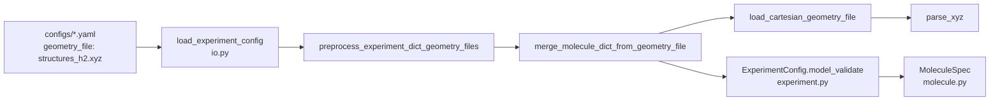

# `geometry_files.py` 源码学习：外置几何文件加载

本文面向**读代码、改配置加载逻辑**的学习场景，逐函数说明 `src/qchem_stack/config/geometry_files.py` 的职责、调用关系与边界。

- **YAML 字段与坐标单位（用户写法）**：见 [说明_molecule配置与自旋多重度.md §1.1](说明_molecule配置与自旋多重度.md#11-外置几何文件geometry_file与坐标单位必读)
- **实验配置从磁盘读入的总流程**：见 [说明_实验配置加载_io.md](说明_实验配置加载_io.md)
- **配置校验分层**：见 [config_校验分层约定.md](config_校验分层约定.md)

---

## 1. 模块解决什么问题

实验 YAML 的 `molecule:` 段通常要提供原子种类与笛卡尔坐标。除**内联** `coordinates` / `zmatrix` 外，还支持：

```yaml
molecule:
  geometry_file: "structures_h2.xyz"
  coordinate_unit: angstrom
```

本模块在 **Pydantic 构建 `MoleculeSpec` 之前**，把 `geometry_file` 展开为标准的 `symbols` + `coordinates`，并删除仅用于加载的键（`geometry_file`、`geometry_file_format`）。

**本模块不负责：**

| 事项 | 由谁处理 |
|------|----------|
| 埃 → Bohr 单位换算 | `MoleculeSpec.coordinates_in_bohr()`（`molecule.py`） |
| 电荷、多重度、基组 | `MoleculeSpec` 其它字段 |
| 与 `scf` / `quantum` 的跨段策略校验 | `_experiment_validation.py` 等 |

**当前支持的文件格式：** XYZ（后缀 `.xyz`；或通过 `geometry_file_format: xyz` / 函数参数显式指定）。

---

## 2. 在配置加载链路中的位置



**`base_dir` 约定：** 相对路径相对于 **YAML 所在目录** 解析，而不是进程的当前工作目录。

| 调用方 | 传入的 `geometry_files_base_dir` |
|--------|----------------------------------|
| `load_experiment_config(path)` | `path.parent` |
| `ExperimentConfig.from_yaml_dict(..., geometry_files_base_dir=...)` | 调用方指定（API、作业 runner 等） |

实现入口：`ExperimentConfig.from_yaml_dict` 内调用 `preprocess_experiment_dict_geometry_files`（`experiment.py`）。

---

## 3. 类型别名

### `GeometryFileFormat`

```python
GeometryFileFormat = Literal["xyz"]
```

- 限制 `load_cartesian_geometry_file(..., file_format=...)` 的合法取值。
- 扩展新格式时：在此增加字面量、实现解析函数、更新 `_infer_geometry_format` 与 `merge_molecule_dict_from_geometry_file` 中对 `geometry_file_format` 的校验。

---

## 4. 函数详解

### 4.1 `parse_xyz(text: str) -> tuple[list[str], list[list[float]]]`

| 项目 | 说明 |
|------|------|
| **职责** | 将 **XYZ 格式纯文本** 解析为 `(symbols, coordinates)` |
| **是否读盘** | 否（纯函数，便于单测与复用） |
| **单位** | 数值**原样**解析；社区惯例为 Å，最终含义由 YAML 的 `coordinate_unit` 决定 |

**XYZ 行约定（与模块 docstring 一致）：**

| 行号 | 内容 |
|------|------|
| 第 1 行 | 原子数 `n`（正整数） |
| 第 2 行 | 注释（内容忽略） |
| 第 3 … 2+n 行 | `符号 x y z`；扩展 XYZ 额外列**忽略**（只取前 4 列） |

**处理细节：**

- 跳过空行后再解析（`strip` 后非空行参与计数）。
- 原子行不足 4 个 token，或坐标无法 `float()` → `ConfigurationError`。
- `n` 与后续行数不一致 → `ConfigurationError`。

**返回值示例**（对应 `configs/structures_h2.xyz`）：

```python
(["H", "H"], [[0.0, 0.0, 0.0], [0.0, 0.0, 0.74]])
```

**测试参考：** `tests/test_geometry_files.py::test_parse_xyz_h2`、`test_parse_xyz_extended_extra_columns`。

---

### 4.2 `load_cartesian_geometry_file(path, *, file_format=None)`

| 项目 | 说明 |
|------|------|
| **职责** | 从磁盘读取结构文件，返回 `(symbols, coordinates)` |
| **编码** | UTF-8（`path.read_text(encoding="utf-8")`） |
| **格式选择** | `file_format` 显式指定；否则 `_infer_geometry_format(path)` |

**错误映射：**

| 底层异常 | 抛出 |
|----------|------|
| `FileNotFoundError` | `ConfigurationError`（文件不存在） |
| `OSError` | `ConfigurationError`（读失败） |
| 不支持的 `fmt` | `ConfigurationError` |

**何时直接调用：** 脚本、测试、不经过 YAML 预处理时需要从路径加载几何。

---

### 4.3 `_infer_geometry_format(path)`（内部）

| 项目 | 说明 |
|------|------|
| **职责** | 根据 `Path.suffix` 推断 `GeometryFileFormat` |
| **规则** | `.xyz`（大小写不敏感）→ `"xyz"`；否则报错并提示可传 `file_format='xyz'` |

**设计意图：** YAML 中通常可省略 `geometry_file_format`；无标准后缀的文件需显式指定格式。

---

### 4.4 `resolve_geometry_file_path(path_str, *, base_dir)`

| 项目 | 说明 |
|------|------|
| **职责** | 将配置中的路径字符串解析为**绝对** `Path` |
| **绝对路径** | 原样使用，**忽略** `base_dir` |
| **相对路径** | `(base_dir / path_str).resolve()` |

**示例：**

- YAML：`configs/example_h2_geometry_file_xyz.yaml`
- 字段：`geometry_file: "structures_h2.xyz"`
- 解析结果：`.../configs/structures_h2.xyz`（规范化后的绝对路径）

---

### 4.5 `merge_molecule_dict_from_geometry_file(molecule, *, base_dir)`

| 项目 | 说明 |
|------|------|
| **职责** | 若存在 `geometry_file`，读文件并**合并**进 molecule 字典；否则返回浅拷贝 |
| **输入** | `Mapping[str, Any]`（通常是 `yaml.safe_load` 后的 `molecule` 子 dict） |
| **输出** | 新 `dict`：`symbols`、`coordinates` 已写入；加载专用键已删除 |

**无 `geometry_file` 或为 `None`：** `return dict(molecule)`，不做 I/O。

**有 `geometry_file` 时的校验与步骤：**

| 步骤 | 行为 |
|------|------|
| 路径 | 非空字符串 |
| 互斥 | 不得与 `coordinates`、`coordinates_bohr`、`zmatrix` 同时存在 |
| 格式 | `geometry_file_format` 为 `None` / `""` / `"xyz"` |
| 加载 | `resolve_geometry_file_path` → `load_cartesian_geometry_file` |
| 可选交叉校验 | 若 YAML 已写 `symbols`，必须与文件解析结果**完全一致** |
| 写回 | `out["symbols"]`、`out["coordinates"]`；`pop` 掉 `geometry_file`、`geometry_file_format` |

**不修改的键：** `coordinate_unit`、`charge`、`multiplicity`、`basis` 等原样保留。

**加载前后对比（概念上）：**

```yaml
# 加载前（example_h2_geometry_file_xyz.yaml 片段）
molecule:
  geometry_file: "structures_h2.xyz"
  coordinate_unit: angstrom
  charge: 0
  multiplicity: 1
  basis: sto-3g
```

```yaml
# preprocess 之后、进入 MoleculeSpec 之前
molecule:
  symbols: ["H", "H"]
  coordinates: [[0.0, 0.0, 0.0], [0.0, 0.0, 0.74]]
  coordinate_unit: angstrom
  charge: 0
  multiplicity: 1
  basis: sto-3g
```

---

### 4.6 `preprocess_experiment_dict_geometry_files(data, *, base_dir)`

| 项目 | 说明 |
|------|------|
| **职责** | **原地**修改实验配置顶层 dict |
| **条件** | `data["molecule"]` 为 `dict` 且含有效 `geometry_file` |
| **否则** | 直接返回（`molecule` 非 dict 时不报错） |

**调用时机：** `ExperimentConfig.from_yaml_dict` 在 `model_validate` 之前。

**导出：** `qchem_stack.config` 包 `__init__.py` 中对外暴露，便于测试与自定义加载路径。

---

## 5. 函数调用关系（速查）

```
preprocess_experiment_dict_geometry_files
    └── merge_molecule_dict_from_geometry_file
            ├── resolve_geometry_file_path
            └── load_cartesian_geometry_file
                    ├── _infer_geometry_format   # file_format 未指定时
                    └── parse_xyz                  # fmt == "xyz"
```

---

## 6. 与坐标单位的分工（读代码时易混点）

| 阶段 | 代码 | 对坐标做了什么 |
|------|------|----------------|
| ① 本模块 | `merge_molecule_dict_from_geometry_file` | 把 xyz 中的浮点数**原样**写入 `coordinates` |
| ② `MoleculeSpec` | `coordinates_in_bohr()` | 按 `coordinate_unit` 决定是否乘以 Å→Bohr 常数 |

因此：**不要把「xyz 文件惯例是 Å」和「`coordinate_unit` 声明」混为一谈。** 文件里没有单位字段；填错 `coordinate_unit` 会导致键长约 1.89 倍偏差且不一定立刻报错。详见 [说明_molecule §1.1](说明_molecule配置与自旋多重度.md#11-外置几何文件geometry_file与坐标单位必读)。

---

## 7. 错误与异常

本模块统一抛出 `qchem_stack.exceptions.ConfigurationError`（配置层错误，与 `ValueError` 区分）。

常见触发场景：

| 场景 | 典型报错信息关键词 |
|------|-------------------|
| xyz 行数/原子数不符 | `atom count`、`atom rows` |
| 与内联几何混用 | `cannot be used together` |
| `symbols` 与文件不一致 | `disagrees with symbols` |
| 文件不存在 | `Geometry file not found` |
| 后缀无法推断格式 | `Cannot infer geometry format` |

---

## 8. 相关源码与测试

| 类型 | 路径 |
|------|------|
| 实现 | `src/qchem_stack/config/geometry_files.py` |
| 预处理挂载 | `src/qchem_stack/config/experiment.py`（`from_yaml_dict`） |
| IO 入口 | `src/qchem_stack/config/io.py`（`geometry_files_base_dir=p.parent`） |
| 分子 schema | `src/qchem_stack/config/molecule.py` |
| 示例 YAML | `configs/example_h2_geometry_file_xyz.yaml` |
| 示例 xyz | `configs/structures_h2.xyz` |
| 单元测试 | `tests/test_geometry_files.py` |

**建议阅读顺序：**

1. `configs/structures_h2.xyz` + `configs/example_h2_geometry_file_xyz.yaml`
2. `geometry_files.py`（本文）
3. `tests/test_geometry_files.py`（行为契约）
4. `molecule.py` 中 `coordinates_in_bohr()`

**本地验证：**

```bash
pytest tests/test_geometry_files.py -q
```

```python
from qchem_stack.config import (
    load_experiment_config,
    parse_xyz,
    merge_molecule_dict_from_geometry_file,
)
from pathlib import Path

# 仅解析文本
text = Path("configs/structures_h2.xyz").read_text(encoding="utf-8")
print(parse_xyz(text))

# 完整加载（含 preprocess）
cfg = load_experiment_config("configs/example_h2_geometry_file_xyz.yaml")
print(cfg.molecule.symbols, cfg.molecule.coordinates)
print(cfg.molecule.coordinates_in_bohr())
```

---

## 9. 扩展新格式时的改动清单

新增例如 `.mol` 时，通常需要：

1. 在 `GeometryFileFormat` 增加字面量；
2. 实现 `parse_mol(text)`（或类似）；
3. `_infer_geometry_format` 增加后缀映射；
4. `load_cartesian_geometry_file` 增加分支；
5. `merge_molecule_dict_from_geometry_file` 允许 `geometry_file_format` 新取值；
6. 补充 `tests/test_geometry_files.py` 与本文档 §4。

保持 **解析（纯函数）与读盘（`load_*`）分离**，与现有 XYZ 路径一致，便于测试。

---

## 10. 公开 API 一览

`qchem_stack.config` 包导出：

| 符号 | 用途 |
|------|------|
| `parse_xyz` | 解析 XYZ 字符串 |
| `load_cartesian_geometry_file` | 从路径加载 |
| `merge_molecule_dict_from_geometry_file` | 单段 `molecule` dict 预处理 |
| `preprocess_experiment_dict_geometry_files` | 整份实验 dict 原地预处理 |

内部函数 `_infer_geometry_format` 不对外导出。
