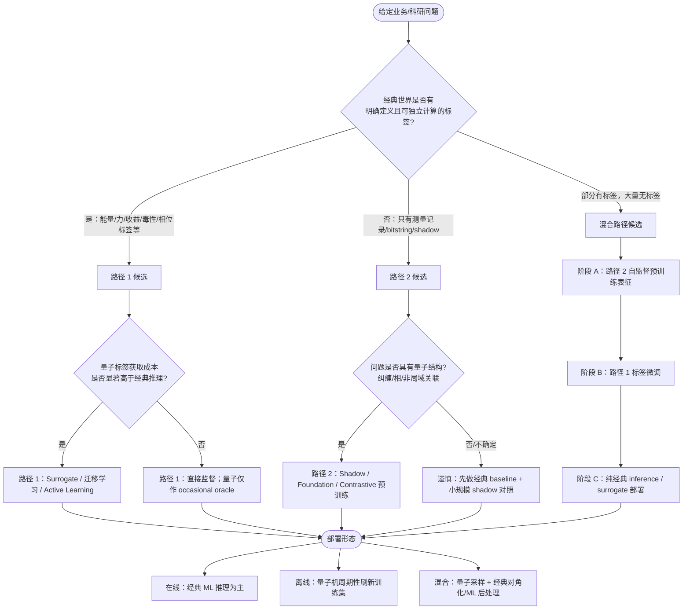
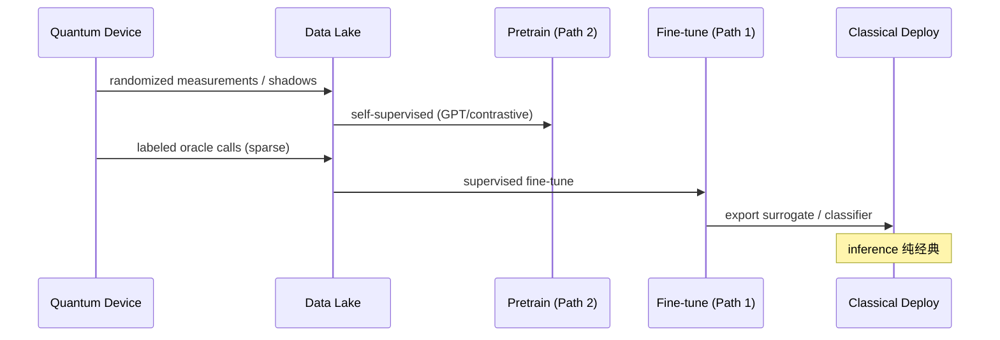

# 量子数据用于经典机器学习：文献库、报告章节与决策框架

> **产出说明**：本文件为行业调研与文献综述的配套交付物，覆盖 2024-07 至 2026-07 窗口内代表性工作。  
> **组织维度**：按用户最初定义的两条路径（路径 1：一一对应标签；路径 2：原生量子测量数据）+ 混合范式 + 综述/Benchmark。  
> **BibTeX**：可直接复制到 `.bib` 文件；键名格式 `作者姓年份关键词`。  
> **扩展交付包**（LaTeX 报告 / 速查表 / JSON Schema / Pydantic）：见 [`survey_quantum_data_ml/README.md`](survey_quantum_data_ml/README.md)。

---

## 目录

1. [决策树：给定问题类型如何选路径](#1-决策树给定问题类型如何选路径)
2. [调研报告 Markdown 章节（可直接粘贴）](#2-调研报告-markdown-章节可直接粘贴)
3. [BibTeX 文献库（按路径分组）](#3-bibtex-文献库按路径分组)
4. [附录：评估指标与 Benchmark 检查清单](#4-附录评估指标与-benchmark-检查清单)

---

## 1. 决策树：给定问题类型如何选路径

### 1.1 总决策流程



### 1.2 按问题类型的推荐矩阵

| 问题类型 | 首选路径 | 推荐 ML 架构 | 关键量子数据形态 | 代表文献 |
|---------|---------|-------------|----------------|---------|
| 量子多体基态性质预测 | 路径 2 → 路径 1 微调 | Set Transformer / GPT / Kernel | Pauli shadow, randomized measurements | Cho2024NatComm, ShadowGPT2024, LLM4QPE2024 |
| 量子相/相变分类 | 路径 2 为主 | PCA+无监督 / QSVM / SSL | Shadow spin configs, shadow vectors | SSL4Q2024, UnsupPCA2025, GLQK2025 |
| VQE/QAOA 能量加速 | 路径 1 | GNN / MLP surrogate | (H, ansatz, θ) → E | PredictiveSurrogates2026, Qracle2025, MLVQE2025 |
| 量子误差缓解 | 路径 1 | NN surrogate / GPR | noisy ⟨O⟩(λ) → zero-noise limit | S-ZNE2025, NoiseAgnosticQEM2025, NNAS2025 |
| 分子/材料能量（有经典参照） | 路径 1 | GNN / Transformer / MLFF | geometry → E, F | SQD2025, ResTdNN2025, HamiltonianGNN2025 |
| 药物 hit 生成/筛选 | 路径 1+混合 | QGNN / QSVM / hybrid GAN | 分子描述符 + 量子 kernel 特征 | KRAS2024NatBiotech, QCaDD2026, QGNNVQE2025 |
| 组合优化（组合/Portfolio） | 路径 1（优化输出） | 经典 solver + QUBO mapping | QUBO 最优解 / 能量 | PortfolioRBI2025, MultiDiscPO2025 |
| HEP 异常检测 | 路径 2 + 经典 AE 降维 | Quantum kernel / QAE / clustering |  latent space of collision events | LHCAnomaly2024, OneP1Q2025 |
| 网络/工控异常检测 | 路径 1（经典特征）+ 量子核 | QSVM / QAE | 网络流量特征 → quantum feature map | QOC-SVM2024, QAE-BETH2025 |
| 图像/遥感分类 | 混合 | H-QCNN / NQK / VQC | angle/amplitude encoded pixels | UtilityScaleImage2025, MedMNIST2025, SatelliteNQK2025 |
| 时序预测（金融/混沌） | 路径 1 谨慎 | QLSTM / iQTransformer / QRC | 时序窗口 → 量子 reservoir 特征 | FinancialQML2026, iQTransformer2025, QRC-Feedback2024 |
| 量子传感/相位估计 | 路径 2（测量→NN） | VQC+NN / Digital Twin | 连续测量轨迹 I(t) | VQS2024, QDigitalTwin2025, VQ-CNNI2026 |
| 跨设备泛化 | 混合 + 域适应 | UDA on shadow features | sim shadow → hardware shadow | UDAQuantum2026, CITL-QMEM2025 |

### 1.3 快速判定规则（5 问）

1. **标签是否存在且经典可验证？**  
   - 是 → 路径 1 或混合的路径 1 微调阶段  
   - 否 → 路径 2

2. **单次量子实验成本是否 >> 单次经典 inference？**  
   - 是 → 必须 Surrogate / Foundation pretrain / Active Learning  
   - 否 → 可直接在线量子+经典

3. **数据是否原生量子态/测量？**  
   - 是 → Shadow、bitstring histogram、overlap 为主特征  
   - 否（经典输入经 encoding）→ 这是 **Quantum-enhanced classical ML**，不是纯路径 2

4. **系统规模是否 >20 qubit 且用 global fidelity kernel？**  
   - 是 → 高风险（指数集中）；改 local/projected kernel 或 shadow  
   - 否 → 可尝试标准 QKM

5. **是否有 sim→hardware 漂移？**  
   - 是 → 必须 UDA / device-specific calibration / robust shallow shadows  
   - 否 → 标准监督即可

### 1.4 路径选择反模式（应避免）

| 反模式 | 为何失败 | 替代 |
|--------|---------|------|
| 小表格数据 + 深 VQC 端到端 | Bowles2024：经典常更好 | 强经典 baseline + 量子仅作 ablation |
| 无 shot budget 比较 QML | 测量成本未计入 ROI | 固定 shots 下比 accuracy-cost |
| 只用 global fidelity kernel 于大 qubit | 指数集中 NatComm2024 | GLQK / local kernel / projected kernel |
| 忽略测量协议存 raw data | 无法复现/迁移 | 标准化 schema（见 §2.3） |
| 声称 quantum advantage 无 nested CV | 过拟合 | Schnabel2025 / QSVM2026 方法论 |

---

## 2. 调研报告 Markdown 章节（可直接粘贴）

### 2.1 执行摘要（Executive Summary）

量子数据用于经典机器学习的产业与研究格局，在 2024–2026 年呈现 **"benchmark 降温、场景分化、混合范式成熟"** 特征。大规模对照实验（Bowles 2024；Schnabel 2025；Fellner 2026）表明：在通用小数据集分类与时序任务上，开箱即用的量子模型**整体不优于**经典基线。然而，在以下场景已出现可复现的实用价值：

- **路径 1（标签一一对应）**：量子处理器代理（Predictive Surrogates, 42 qubit）、ML 驱动的误差缓解（S-ZNE、noise-agnostic QEM）、VQE/QAOA 优化 warm-start（Qracle）、采样后经典对角化（SQD）。
- **路径 2（原生测量数据）**：IBM 127-qubit 实验数据 + 经典 ML 相分类（Cho 2024）、Shadow 预训练 foundation model（ShadowGPT、LLM4QPE、FNQS）、真机对比学习（Contrastive QML 2025）。

**产业判断**：近 1–3 年 ROI 最高的不是"通用 QML"，而是 **量子数据基础设施 + 场景化 surrogate/foundation model**；Quantum AI 细分市场 2025 约 4 亿美元，2030 约 18 亿美元（CAGR ~34%），但仍处 pilot 阶段。

### 2.2 研究背景与问题定义

#### 2.2.1 两条数据路径

**路径 1 — Labeled Quantum-Compatible Output**  
量子计算输出与经典计算可对照的物理量或优化目标（能量、力、可观测量期望、组合优化目标值等）。经典 ML 执行监督学习：`(问题描述, 电路/上下文) → 标签`。

**路径 2 — Quantum-Native Measurement Data**  
问题映射到量子电路后，通过测量/采样得到的原生数据（bitstring、Pauli/Clifford 测量记录、shadow 向量、overlap 等），**不要求**与经典输出逐点对应，但编码问题结构信息。经典 ML 执行表征学习、预训练、few-shot 或自监督下游任务。

#### 2.2.2 与相邻概念边界

| 概念 | 是否本综述范围 | 说明 |
|------|--------------|------|
| 经典数据 + 量子 feature map | 部分 | 输入为经典，量子仅作编码；偏 QML 而非 quantum data |
| AI for Quantum（校准/编译/QEC） | 相关 | ML 消费量子 **校准/日志** 数据，非业务标签 |
| 纯量子 ML 端到端 | 相关 | 测量与训练均在量子侧；本综述聚焦 **经典 ML 消费量子数据** |
| Quantum-inspired classical算法 | 不重点 | 无真实量子数据 |

### 2.3 量子实验数据 Schema 建议

```yaml
quantum_experiment_record:
  id: "uuid"
  timestamp: "ISO8601"
  path_type: "labeled | native | hybrid"

  problem:
    domain: "many_body | chemistry | finance | hep | sensing | cv | security"
    description: "..."
    parameters: {}          # 如 Hamiltonian 参数、分子几何、组合约束

  quantum_execution:
    backend: "ibm_kyoto | quantinuum_h2 | simulator"
    device_calibration_id: "..."
    circuit:
      ansatz: "..."
      depth: 12
      n_qubits: 20
      params: [...]
    measurement:
      protocol: "computational | random_pauli | clifford | shadow"
      n_shots: 8192
      observables: ["ZZ", "XX", ...]   # 路径 1 常用
      raw_outcomes: ["0101...", ...]  # 路径 2 必存
      shadow_vectors: optional

  labels:                        # 路径 1 / hybrid 微调
    energy_hartree: optional
    forces: optional
    class_label: optional
    custom: {}

  classical_reference:           # 可复现对照
    method: "DFT | CCSD | exact | classical_solver"
    value: optional

  mitigation:
    applied: ["zne", "readout", "ml_surrogate"]
    surrogate_model_id: optional

  repro:
    software_versions: {}
    random_seed: 42
    hash: "..."
```

### 2.4 技术路线对比

| 维度 | 路径 1 | 路径 2 | 混合 |
|------|--------|--------|------|
| 数据获取成本 | 高（需 labeled oracle） | 中高（测量次数） | 最高（两阶段） |
| 经典 ML 成熟度 | 高（标准监督） | 中（表征/预训练） | 中 |
| 可解释性 | 中（物理标签） | 低-中 | 中 |
| NISQ 友好度 | 高（surrogate 后纯经典） | 中（需 robust shadow） | 高 |
| 理论优势证据 | 样本效率/surrogate | 可证 shadow/纠缠优势 | 最完整 |
| 产业化近景 | ★★★★ | ★★★ | ★★★★ |

### 2.5 应用领域成熟度评估

| 领域 | 成熟度 | 主导路径 | 12–24 个月 outlook |
|------|--------|---------|-------------------|
| 量子多体/相分类 | TRL 4–5 | 2 | 真机 shadow foundation 扩大 |
| QEM / 处理器代理 | TRL 4–5 | 1 | 云 QPU 标配 ML mitigation |
| 量子化学/材料 | TRL 3–4 | 1 | SQD + MLFF 并行发展 |
| HEP 异常检测 | TRL 3–4 | 2 | 需更大 entanglement 资源验证 |
| 金融优化 | TRL 3 | 1 | 10–20 资产 hybrid pilot |
| 药物发现 | TRL 2–3 | 1+混合 | 低数据 QSVM/VQR 继续 PoC |
| 通用 CV/NLP | TRL 2 | 混合 | utility-scale 实验增多但 advantage 未证 |
| 时序预测 | TRL 2 | 1 | benchmark 偏负面， niche 场景或有戏 |
| 网络安全 | TRL 2–3 | 混合 | 少样本 QAE 有初步证据 |

*TRL 参考：1=概念，5=相关环境验证。*

### 2.6 Benchmark 与 "量子优势" 判据

**建议任何 "quantum data → ML" 项目必须报告：**

1. 经典强基线（同参数量或同训练预算）
2. Nested cross-validation 或独立 test set
3. 总 **quantum shot budget** 与 wall-clock 成本
4. sim vs hardware 分离结果
5. 噪声 ablation（depolarizing / readout / device-specific）

**参考 benchmark 文献**：Bowles2024, Schnabel2025, Fellner2026, QSVM2026, ComparativeQML2025.

### 2.7 风险与限制

| 风险 | 影响 | 缓解 |
|------|------|------|
| 指数集中（QKM） | 大 qubit 下 kernel 失效 | Local/projected kernel, shadow |
| sim→hardware 漂移 | 预训练模型失效 | UDA, robust shallow shadows |
| 测量成本 | 路径 2 数据贵 | RL shot allocation, surrogate 预筛选 |
| 标签噪声（VQE 未收敛） | 路径 1 学偏 | 收敛判据 + 不确定性加权 |
| 过度营销 quantum advantage | 决策误导 | 强制 benchmark 协议 |
| 数据 silo | 无法 foundation 化 | 统一 schema + 开放 benchmark 集 |

### 2.8 未来 3–5 年研究方向

1. **Cross-domain Quantum Foundation Model**：统一 shadow/measurement 预训练，跨 Hamiltonian/设备微调。
2. **Quantum Data Advantage 判据**：何时路径 2 必不可少（非 crypto 构造任务）。
3. **Cost-aware AutoML**：联合优化 accuracy vs shots vs qubit-hours。
4. **Federated Quantum Data**：多实验室 shadow 数据联合训练（隐私 preserving）。
5. **Real-time ML-QEM loop**：校准漂移 → surrogate 在线更新 → 实验闭环。
6. **Standard benchmark suite**：类似 MLPerf 的 Quantum-Data-ML benchmark。

### 2.9 图表模板（Mermaid）

**图 A：产业生态**

```mermaid
flowchart LR
    subgraph Hardware
        IBM[IBM Quantum]
        Quantinuum[Quantinuum]
        IonQ[IonQ]
        Google[Google QC]
    end

    subgraph DataLayer[Quantum Data Layer]
        Shots[Raw Shots / Bitstrings]
        Shadows[Classical Shadows]
        Labels[Labeled Observables]
    end

    subgraph ClassicalML
        Surrogate[Surrogate / QEM ML]
        Foundation[Foundation Pretrain]
        Downstream[Task Fine-tune]
    end

    subgraph Apps
        Physics[Many-body / Phase]
        Chem[Materials / Chemistry]
        Finance[Portfolio / Risk]
        HEP[Particle Physics]
        Security[Anomaly Detection]
    end

    Hardware --> DataLayer
    DataLayer --> ClassicalML
    ClassicalML --> Apps
```



**图 B：混合训练三阶段**



---

## 3. BibTeX 文献库（按路径分组）

> 复制以下块至 `quantum_data_ml_survey.bib` 即可使用。

### 3.1 综述与 Benchmark

```bibtex
@article{Wang2024QMLReview,
  title   = {A comprehensive review of Quantum Machine Learning: from {NISQ} to Fault Tolerance},
  author  = {Wang, Yuxuan and Liu, Junyu},
  journal = {arXiv preprint arXiv:2401.11351},
  year    = {2024}
}

@article{Chen2025ACMQMLSurvey,
  title   = {A Survey of Quantum Machine Learning: Foundations, Algorithms, Frameworks, Data and Applications},
  journal = {ACM Computing Surveys},
  year    = {2025},
  doi     = {10.1145/3764582}
}

@article{Majid2025QMLCategorization,
  title   = {Quantum machine learning: a systematic categorization based on learning paradigms, {NISQ} suitability, and fault tolerance},
  author  = {Majid, Basit and Sofi, Sartaj Ahmad and Jabeen, Zahoor},
  journal = {Quantum Machine Intelligence},
  volume  = {7},
  pages   = {39},
  year    = {2025},
  doi     = {10.1007/s42484-025-00266-4}
}

@article{ComprehensiveQMLSurvey2025,
  title   = {Comprehensive Survey of {QML}: From Data Analysis to Algorithmic Advancements},
  journal = {arXiv preprint arXiv:2501.09528},
  year    = {2025},
  doi     = {10.48550/arxiv.2501.09528}
}

@article{SupervisedQMLOutlook2025,
  title   = {Supervised Quantum Machine Learning: A Future Outlook from Qubits to Enterprise Applications},
  journal = {arXiv preprint arXiv:2505.24765},
  year    = {2025}
}

@article{Bowles2024BetterThanClassical,
  title   = {Better than classical? The subtle art of benchmarking quantum machine learning models},
  author  = {Bowles, Joseph and Ahmed, Shahnawaz and Schuld, Maria},
  journal = {arXiv preprint arXiv:2403.07059},
  year    = {2024}
}

@article{Schnabel2025QKMBenchmark,
  title   = {Quantum kernel methods under scrutiny: a benchmarking study},
  author  = {Schnabel, Raphael and Roth, Volker},
  journal = {Quantum Machine Intelligence},
  year    = {2025},
  doi     = {10.1007/s42484-025-00273-5}
}

@article{Fellner2026QMLTimeSeries,
  title   = {Quantum vs. classical: a comprehensive benchmark study for predicting time series with variational quantum machine learning},
  author  = {Fellner, Tobias and Kreplin, David A. and Tovey, Samuel and Holm, Christian},
  journal = {Machine Learning: Science and Technology},
  year    = {2026},
  doi     = {10.1088/2632-2153/ae365f}
}

@inproceedings{ComparativeQML2025,
  title     = {A Comparative Effectiveness Study of Quantum Machine Learning Algorithms},
  booktitle = {ICOCO},
  year      = {2025},
  doi       = {10.1109/icoco67189.2025.11334075}
}

@article{QSVMTabularBenchmark2026,
  title   = {Benchmarking Quantum Kernel Support Vector Machines Against Classical Baselines on Tabular Data: A Rigorous Empirical Study with Hardware Validation},
  journal = {arXiv preprint arXiv:2604.18837},
  year    = {2026}
}

@article{FinancialQMLBenchmark2026,
  title   = {Quantum vs. Classical Machine Learning: A Benchmark Study for Financial Prediction},
  journal = {arXiv preprint arXiv:2601.03802},
  year    = {2026}
}
```

### 3.2 路径 2：原生量子测量数据 + 经典 ML

```bibtex
@article{Cho2024ExpMLQuantumData,
  title   = {Machine learning on quantum experimental data toward solving quantum many-body problems},
  author  = {Cho, Gyeonghun and Kim, Donghwan},
  journal = {Nature Communications},
  volume  = {15},
  pages   = {7552},
  year    = {2024},
  doi     = {10.1038/s41467-024-51932-3}
}

@article{ShadowGPT2024,
  title   = {{ShadowGPT}: Learning to Solve Quantum Many-Body Problems from Randomized Measurements},
  journal = {arXiv preprint arXiv:2411.03285},
  year    = {2024}
}

@inproceedings{LLM4QPE2024,
  title     = {{LLM4QPE}: A Large Language Model Style Quantum Task-Agnostic Pretraining and Finetuning Paradigm},
  booktitle = {ICLR},
  year      = {2024}
}

@article{Jerbi2024ShadowsQML,
  title   = {Shadows of quantum machine learning},
  author  = {Jerbi, Sofiene and Gyurik, Csaba and Marshall, Sarah C. and others},
  journal = {Nature Communications},
  volume  = {15},
  pages   = {5676},
  year    = {2024},
  doi     = {10.1038/s41467-024-49877-8}
}

@article{RobustShallowShadows2025,
  title   = {Demonstration of robust and efficient quantum property learning with shallow shadows},
  journal = {Nature Communications},
  year    = {2025},
  doi     = {10.1038/s41467-025-57349-w}
}

@article{GLQK2025,
  title   = {Learning quantum many-body data locally: A provably scalable framework},
  journal = {arXiv preprint arXiv:2509.13705},
  year    = {2025}
}

@article{BayesianShadowSetTransformer2025,
  title   = {Scalable bayesian shadow tomography for quantum property estimation with set transformers},
  journal = {arXiv preprint arXiv:2509.18674},
  year    = {2025}
}

@article{NeuralShadowQST2024,
  title   = {Neural-shadow quantum state tomography},
  author  = {Wei, Victor and Coish, W. A. and Ronagh, Pooya and Muschik, Christine A.},
  journal = {Physical Review Research},
  volume  = {6},
  pages   = {023250},
  year    = {2024},
  doi     = {10.1103/physrevresearch.6.023250}
}

@article{BootstrapShadowNNQST2024,
  title   = {Bootstrapping Classical Shadows for Neural Quantum State Tomography},
  journal = {arXiv preprint arXiv:2405.06864},
  year    = {2024}
}

@article{FNQS2025,
  title   = {Foundation Neural-Network Quantum States as a Unified Ansatz for Multiple Hamiltonians},
  journal = {arXiv preprint arXiv:2502.09488},
  year    = {2025}
}

@article{TransformerNQSPretrain2025,
  title   = {Transformer neural networks and quantum simulators: a hybrid approach for simulating strongly correlated systems},
  journal = {Quantum},
  volume  = {9},
  pages   = {1675},
  year    = {2025},
  doi     = {10.22331/q-2025-03-26-1675}
}

@article{ContrastiveQMLHardware2025,
  title   = {Quantum Machine Learning via Contrastive Training},
  journal = {arXiv preprint arXiv:2511.13497},
  year    = {2025}
}

@inproceedings{SSL4Q2024,
  title     = {{SSL4Q}: Semi-Supervised Learning of Quantum Data with Application to Quantum State Classification},
  booktitle = {AISTATS},
  year      = {2024}
}

@article{UDAImperfectQuantumData2026,
  title   = {Unsupervised domain adaptation for learning from imperfect quantum data},
  journal = {arXiv preprint arXiv:2603.28294},
  year    = {2026}
}

@article{UnsupPCAShadows2025,
  title   = {A Unsupervised Framework for Identifying Diverse Quantum Phase Transitions Using Classical Shadow Tomography},
  journal = {arXiv preprint arXiv:2508.17688},
  year    = {2025}
}

@article{OrderedPhasesShadows2025,
  title   = {Distinguishing Ordered Phases using Machine Learning and Classical Shadows},
  journal = {arXiv preprint arXiv:2501.17837},
  year    = {2025}
}

@article{UniversalPhaseClassification2025,
  title   = {Universal quantum phase classification on quantum computers from machine learning},
  journal = {arXiv preprint arXiv:2508.04774},
  year    = {2025}
}

@article{FoundationOpticalQuantum2025,
  title   = {Foundation Model for Unified Characterization of Optical Quantum States},
  journal = {arXiv preprint arXiv:2512.18801},
  year    = {2025}
}

@article{ExponentialConcentrationQK2024,
  title   = {Exponential concentration in quantum kernel methods},
  journal = {Nature Communications},
  year    = {2024},
  doi     = {10.1038/s41467-024-49287-w}
}

@article{MitigateConcentrationCovariant2025,
  title   = {Mitigating exponential concentration in covariant quantum kernels for subspace and real-world data},
  journal = {npj Quantum Information},
  year    = {2025},
  doi     = {10.1038/s41534-025-01154-2}
}

@article{LocalMultiScaleQK2026,
  title   = {Local and Multi-Scale Strategies to Mitigate Exponential Concentration in Quantum Kernels},
  journal = {arXiv preprint arXiv:2602.16097},
  year    = {2026}
}
```

### 3.3 路径 1：一一对应标签 + 经典 ML

```bibtex
@article{PredictiveSurrogates2026,
  title   = {Demonstration of efficient predictive surrogates for large-scale quantum processors},
  journal = {Nature Communications},
  year    = {2026},
  doi     = {10.1038/s41467-026-72506-5}
}

@article{SZNE2025,
  title   = {Sample-efficient quantum error mitigation via classical learning surrogates},
  journal = {arXiv preprint arXiv:2511.07092},
  year    = {2025}
}

@article{NoiseAgnosticQEM2025,
  title   = {Noise-agnostic quantum error mitigation with data augmented neural models},
  author  = {Liao, Ming and Zhu, Yuxuan and Chiribella, Giulio and others},
  journal = {npj Quantum Information},
  volume  = {11},
  pages   = {8},
  year    = {2025},
  doi     = {10.1038/s41534-025-00960-y}
}

@article{NNAS2025,
  title   = {Physics-inspired Machine Learning for Quantum Error Mitigation},
  journal = {arXiv preprint arXiv:2501.04558},
  year    = {2025}
}

@article{CITLQMEM2025,
  title   = {Scalable quantum measurement error mitigation via conditional independence and transfer learning},
  journal = {Machine Learning: Science and Technology},
  year    = {2025},
  doi     = {10.1088/2632-2153/ad1007}
}

@article{Qracle2025,
  title   = {{Qracle}: A Graph-Neural-Network-based Parameter Initializer for Variational Quantum Eigensolvers},
  journal = {arXiv preprint arXiv:2505.01236},
  year    = {2025}
}

@article{MLVQEOptimiser2025,
  title   = {Fast and Noise-aware Machine Learning Variational Quantum Eigensolver Optimiser},
  journal = {arXiv preprint arXiv:2503.20210},
  year    = {2025}
}

@article{GPRVQEMitigation2024,
  title   = {Error mitigation in variational quantum eigensolvers using tailored probabilistic machine learning},
  journal = {Physical Review Research},
  year    = {2024},
  doi     = {10.1103/physrevresearch.6.023250}
}

@article{SQDPeriodicMaterials2025,
  title   = {Computing band gaps of periodic materials via sample-based quantum diagonalization},
  journal = {arXiv preprint arXiv:2503.10901},
  year    = {2025}
}

@article{ExplicitQuantumSurrogates2024,
  title   = {Explicit quantum surrogates for quantum kernel models},
  journal = {arXiv preprint arXiv:2408.03000},
  year    = {2024}
}

@article{ResTdNN2025,
  title   = {Accurate Neural Network Fine-Tuning Approach for Transferable Ab Initio Energy Prediction across Varying Molecular and Crystalline Scales},
  journal = {Journal of Chemical Theory and Computation},
  year    = {2025}
}

@inproceedings{HamiltonianGNN2025,
  title     = {Learning the Electronic Hamiltonian of Large Atomic Structures},
  booktitle = {ICML},
  year      = {2025}
}

@article{TransferLearningNoisyQML2025,
  title   = {The Novel Mechanisms of Transfer Learning for Quantum Machine Learning with Noisy Measurements and Limited Quantum Data},
  booktitle = {Computing Conference},
  year    = {2025},
  doi     = {10.1109/computingcon64838.2025.11376925}
}

@article{RLShotAllocationVQE2024,
  title   = {Artificial-Intelligence-Driven Shot Reduction in Quantum Measurement},
  journal = {arXiv preprint arXiv:2405.02493},
  year    = {2024}
}

@article{YOMOSingleShot2025,
  title   = {You Only Measure Once: On Designing Single-Shot Quantum Machine Learning Models},
  journal = {arXiv preprint arXiv:2509.20090},
  year    = {2025}
}

@article{SingleShotQMLLimits2025,
  title   = {Single-shot quantum machine learning},
  journal = {Physical Review A},
  volume  = {111},
  pages   = {042420},
  year    = {2025},
  doi     = {10.1103/PhysRevA.111.042420}
}
```

### 3.4 跨领域应用

```bibtex
@article{LHCQuantumAnomaly2024,
  title   = {Quantum anomaly detection in the latent space of proton collision events at the {LHC}},
  journal = {Communications Physics},
  year    = {2024},
  doi     = {10.1038/s42005-024-01811-6}
}

@article{OneP1Q2025,
  title   = {One particle - one qubit: Particle physics data encoding for quantum machine learning},
  journal = {arXiv preprint arXiv:2502.17301},
  year    = {2025}
}

@article{KRASQuantumDrug2024,
  title   = {Quantum-computing-enhanced algorithm unveils potential {KRAS} inhibitors},
  journal = {Nature Biotechnology},
  year    = {2024},
  doi     = {10.1038/s41587-024-02526-3}
}

@article{QuantumDrugDiscoveryReview2025,
  title   = {Quantum-machine-assisted drug discovery},
  journal = {npj Drug Discovery},
  year    = {2025},
  doi     = {10.1038/s44386-025-00033-2}
}

@article{QCaDD2026,
  title   = {{Q-CaDD}: accelerating in silico methodologies with quantum computation and machine learning for Epidermal growth factor receptor},
  journal = {Scientific Reports},
  year    = {2026},
  doi     = {10.1038/s41598-026-44978-4}
}

@article{QGNNVQE2025,
  title   = {Quantum drug discovery: a hybrid quantum graph neural network–variational quantum eigensolver framework for serine neutralization},
  journal = {The European Physical Journal D},
  year    = {2025},
  doi     = {10.1140/epjd/s10053-025-01024-8}
}

@article{PortfolioRBI2025,
  title   = {A real-world test of portfolio optimization with quantum annealing},
  journal = {Quantum Machine Intelligence},
  year    = {2025},
  doi     = {10.1007/s42484-025-00268-2}
}

@article{UtilityScaleImageQML2025,
  title   = {Quantum Image Classification: Experiments on Utility-Scale Quantum Computers},
  journal = {arXiv preprint arXiv:2504.10595},
  year    = {2025}
}

@article{MedMNISTQuantum2025,
  title   = {Benchmarking MedMNIST dataset on real quantum hardware},
  journal = {arXiv preprint arXiv:2502.13056},
  year    = {2025}
}

@article{SatelliteNQK2025,
  title   = {Satellite image classification with neural quantum kernels},
  journal = {Machine Learning: Science and Technology},
  year    = {2025},
  doi     = {10.1088/2632-2153/ada86c}
}

@article{QOC-SVM2024,
  title   = {Anomaly Detection for Real-World Cyber-Physical Security using Quantum Hybrid Support Vector Machines},
  journal = {arXiv preprint arXiv:2409.04935},
  year    = {2024}
}

@article{QAECyberBETH2025,
  title   = {Quantum Autoencoders for Anomaly Detection in Cybersecurity},
  journal = {arXiv preprint arXiv:2510.21837},
  year    = {2025}
}

@article{VQS2024,
  title   = {End-to-end variational quantum sensing},
  journal = {npj Quantum Information},
  volume  = {10},
  pages   = {118},
  year    = {2024},
  doi     = {10.1038/s41534-024-00914-w}
}

@article{QuantumDigitalTwinSensing2025,
  title   = {Learning to Restore Heisenberg Limit in Noisy Quantum Sensing via Quantum Digital Twin},
  journal = {arXiv preprint arXiv:2508.11198},
  year    = {2025}
}

@article{VQCNNIPhase2026,
  title   = {Global quantum phase estimation via hybrid quantum–classical learning},
  journal = {arXiv preprint arXiv:2605.25049},
  year    = {2026}
}

@article{iQTransformer2025,
  title   = {Quantum Neural Network Architectures for Multivariate Time-Series Forecasting},
  journal = {arXiv preprint arXiv:2510.21168},
  year    = {2025}
}
```

### 3.5 理论：量子数据优势

```bibtex
@article{EntanglementAdvantage2025,
  title   = {Entanglement-induced provable and robust quantum learning advantages},
  journal = {npj Quantum Information},
  volume  = {11},
  pages   = {127},
  year    = {2025},
  doi     = {10.1038/s41534-025-01078-x}
}

@article{PreskillPhotonicLearning2025,
  title   = {Quantum learning advantage on a scalable photonic platform},
  author  = {Preskill, John and others},
  year    = {2025}
}

@article{ExponentialAdvantageObservables2025,
  title   = {Exponential quantum advantages in learning quantum observables from classical data},
  journal = {npj Quantum Information},
  year    = {2025},
  doi     = {10.1038/s41534-025-01162-2}
}
```

### 3.6 表征学习 / 生成 / 联邦 / 编码

```bibtex
@article{QuantumAutoencoderPeptides2025,
  title   = {Quantum Autoencoder: An efficient approach to quantum feature map generation},
  journal = {arXiv preprint arXiv:2509.19157},
  year    = {2025}
}

@article{QRLaXAI2025,
  title   = {{QRLaXAI}: quantum representation learning and explainable {AI}},
  journal = {Quantum Machine Intelligence},
  year    = {2025},
  doi     = {10.1007/s42484-025-00253-9}
}

@article{LatentQGAN2024,
  title   = {{LatentQGAN}: A Hybrid {QGAN} with Classical Convolutional Autoencoder},
  journal = {arXiv preprint arXiv:2409.14622},
  year    = {2024}
}

@article{VAEQWGAN2025,
  title   = {{VAE-QWGAN}: addressing mode collapse in quantum {GANs} via autoencoding priors},
  journal = {Quantum Machine Intelligence},
  year    = {2025},
  doi     = {10.1007/s42484-025-00314-z}
}

@article{HybridQGANTL2026,
  title   = {Hybrid quantum-classical generative adversarial networks with transfer learning},
  journal = {Quantum Machine Intelligence},
  year    = {2026},
  doi     = {10.1007/s42484-026-00389-2}
}

@article{QFLSurvey2025,
  title   = {Quantum federated learning: a comprehensive literature review of foundations, challenges, and future directions},
  journal = {Quantum Machine Intelligence},
  year    = {2025},
  doi     = {10.1007/s42484-025-00292-2}
}

@article{FedQNN2024,
  title   = {{FedQNN}: Federated Learning using Quantum Neural Networks},
  journal = {arXiv preprint arXiv:2403.10861},
  year    = {2024}
}

@article{QuantumEncodingComparative2024,
  title   = {Quantum data encoding: a comparative analysis of classical-to-quantum mapping techniques and their impact on machine learning accuracy},
  journal = {EPJ Quantum Technology},
  year    = {2024},
  doi     = {10.1140/epjqt/s40507-024-00285-3}
}

@article{CVEncoding2025,
  title   = {Continuous-Variable Quantum Encoding Techniques: A Comparative Study},
  journal = {arXiv preprint arXiv:2504.06497},
  year    = {2025}
}

@article{FeedbackQRC2024,
  title   = {Feedback-Driven Quantum Reservoir Computing for Time-Series Analysis},
  journal = {PRX Quantum},
  volume  = {5},
  pages   = {040325},
  year    = {2024},
  doi     = {10.1103/PRXQuantum.5.040325}
}

@article{MinimalisticQRC2025,
  title   = {Minimalistic and scalable quantum reservoir computing enhanced with feedback},
  journal = {npj Quantum Information},
  year    = {2025},
  doi     = {10.1038/s41534-025-01144-4}
}
```

### 3.7 行业 / 政策

```bibtex
@article{AIforQuantumComputing2025,
  title   = {Artificial intelligence for quantum computing},
  journal = {Nature Communications},
  year    = {2025},
  doi     = {10.1038/s41467-025-65836-3}
}

@techreport{EUQuantumAIWhitePaper2025,
  title   = {Artificial intelligence and quantum computing white paper},
  institution = {Quantum Flagship / European Commission},
  year    = {2025},
  url     = {https://qt.eu/media/pdf/Artificial_Intelligence_and_Quantum_Computing_white_paper.pdf}
}

@techreport{QEDCQuantumAI2025,
  title   = {Quantum Computing and Artificial Intelligence Use Cases},
  institution = {QED-C},
  year    = {2025},
  url     = {https://quantumconsortium.org/publication/quantum-computing-and-artificial-intelligence-use-cases/}
}

@article{AnomalyDetectionQMLReview2024,
  title   = {Quantum Machine Learning Algorithms for Anomaly Detection: a Review},
  journal = {arXiv preprint arXiv:2408.11047},
  year    = {2024}
}

@article{CybersecurityQMLTaxonomy2025,
  title   = {Quantum Machine Learning for Cybersecurity: A Taxonomy and Future Directions},
  journal = {arXiv preprint arXiv:2512.15286},
  year    = {2025}
}
```

---

## 4. 附录：评估指标与 Benchmark 检查清单

### 4.1 路径 1 评估指标

| 指标 | 公式/定义 | 用途 |
|------|----------|------|
| Surrogate MAE / RMSE | \|E_pred − E_true\| | 能量代理精度 |
| Sample efficiency | 达到目标 MAE 所需 quantum calls | ROI |
| Speedup factor | T_classical_oracle / T_hybrid | 加速比 |
| Mitigation overhead | shots_mitigated / shots_raw | QEM 代价 |
| Transfer gap | perf_source − perf_target | 迁移学习 |

### 4.2 路径 2 评估指标

| 指标 | 用途 |
|------|------|
| Shadow sample complexity | 达到 ε 误差所需测量数 |
| Phase classification accuracy / F1 | 相分类 |
| Few-shot gain | 有/无预训练在 n_label 下的 Δ |
| Domain shift gap | sim vs hardware 性能差 |
| Property estimation MSE | 能量/熵/关联函数预测 |

### 4.3 Benchmark 检查清单（项目验收用）

- [ ] 声明 path type（1 / 2 / hybrid）
- [ ] 报告 quantum shot budget 与 wall-clock
- [ ] 经典强基线（同参 / 同预算）
- [ ] Nested CV 或 held-out test
- [ ] sim 与 hardware 分离
- [ ] 噪声 ablation
- [ ] 存 measurement protocol + raw outcomes
- [ ] 报告负结果 / 无 advantage 情形
- [ ] 开源代码或 repro hash

---

*文档版本：v1.0 | 生成日期：2026-07-02*
