# 述职材料：看得见的产品 + 现场演示剧本

> **图床路径**（本仓库）：`docs/assets/shuzhi_demo/`  
> **现场文档站**（已可开）：`http://localhost:3000/qcchem-qml-md/`  
> **配套文字稿**：`D:\Yaozheng\述职报告_量子计算化学软件与成果.md`  
> 说明：向领导演示时，**优先现场打开网页 / 跑 smoke / 打开 YAML**；本文插图用于 PPT 或离线翻页。

---

## 0. 演示总流程（建议 20–25 分钟）

| 时段 | 做什么 | 让听众看到什么 |
|------|--------|----------------|
| 0–3 min | 打开文档站首页 | 这是正式产品文档，不是 README 草稿 |
| 3–8 min | 打开 YAML + 跑 smoke | 配置驱动、一键出能量 |
| 8–12 min | 翻模块/教程页 + 算法图 | 算法面、协议、MD/ML 都有文档 |
| 12–17 min | 展示 UQC 云实验结果图 | 公司云上真跑过多轮 |
| 17–22 min | 展示 GQE HPC 复现图与表 | 论文级数值、化学精度 |
| 22–25 min | 收束：软著/调研/下一步 | 资产与战略 |

---

## 1. 产品长什么样（文档站截图）

### 1.1 首页：编排层产品叙事

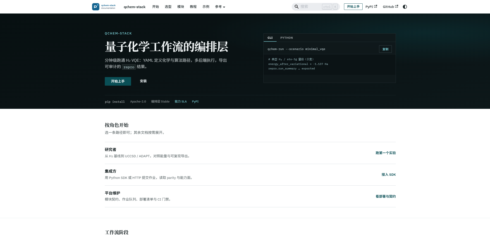

**讲解词**：这是 `qchem-stack` 的正式文档站（Docusaurus）。首页一句话说清产品——**量子化学工作流的编排层**：YAML 定义路径、多后端执行、导出可审计 `repro`。右侧直接给出 CLI：

```bash
qchem-run --scenario minimal_vqe
# energy_after_variational ≈ -1.137 Ha
```

徽章：`pip install` · Apache-2.0 · 编排层 Stable · 能力 SLA · PyPI。

### 1.2 15 分钟上手：从安装到端到端

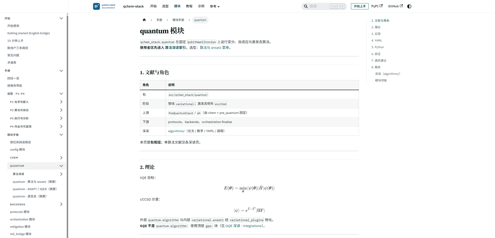

**讲解词**：不是「把代码丢给同事自己摸」，而是有完整上手路径：安装档位（含 **`uqc-cloud`**）、smoke、`minimal_vqe.yaml`、jobs.sqlite、期望输出。左侧教程目录可见 GQE、DMET、ZNE、MD/ML 主动学习等——**产品面铺开了**。

**现场打开（推荐）**：

```text
http://localhost:3000/qcchem-qml-md/
http://localhost:3000/qcchem-qml-md/tutorial/quickstart
http://localhost:3000/qcchem-qml-md/modules/quantum/
http://localhost:3000/qcchem-qml-md/tutorial/gqe-nakaji-h2
http://localhost:3000/qcchem-qml-md/product/capability-sla
```

若本机未起文档站：

```bash
cd docusaurus-site && npm start
# 或已部署：https://sunhl4.github.io/qcchem-qml-md/
```

---

## 2. YAML 拆解：每一块对应什么能力（现场打开文件）

> 现场用 VS Code / Cursor 打开下列文件，**滚动讲解字段**，再跑一条命令。

### 2.1 最小场景入口（30 秒）

文件：`configs/scenarios/minimal_vqe.yaml`

```yaml
schema_version: "3"
scenario: minimal_vqe
overrides: {}
```

讲解：场景化入口；真正化学/算法细节在 profile + `example_h2.yaml`。

### 2.2 完整实验 YAML 的「积木」——`configs/example_h2.yaml`

| YAML 块 | 能力 | 你怎么讲 |
|---------|------|----------|
| `molecule:` | 分子、基组、坐标 | 化学问题入口 |
| `scf:` | PySCF/Psi4/预计算 | 经典化学层，可换驱动 |
| `active_space:` | CAS、JW/BK 映射 | 活性空间与费米子→比特 |
| `backend:` | statevector / qiskit / **uqc** | 后端可替换 |
| `quantum:` | `algorithm: vqe` + ansatz | 变分主路径 |
| `mitigation:` | ZNE / shadows… | 误差缓解可开关 |
| `jobs:` / repro | 作业与可复现导出 | 平台化，不是脚本 |

关键片段（现场高亮）：

```yaml
molecule:
  symbols: [H, H]
  basis: sto-3g
scf:
  driver: pyscf
  method: RHF
active_space:
  strategy: cas
  cas: { n_orbitals: 2, n_electrons: 2 }
backend:
  provider: statevector
quantum:
  algorithm: vqe
  variational:
    ansatz: hea
```

### 2.3 按功能准备的演示 YAML 清单

| 演示主题 | 打开这个文件 | 现场命令（本地 smoke） |
|----------|--------------|------------------------|
| 最小 VQE | `configs/scenarios/minimal_vqe.yaml` | `qchem-run --scenario minimal_vqe` |
| 完整 H₂ | `configs/example_h2.yaml` | `qchem-run configs/example_h2.yaml` |
| UCCSD / Pauli | `configs/scenarios/uccsd_pauli.yaml` | `qchem-run --scenario uccsd_pauli` |
| 激发态 | `configs/scenarios/excited_states.yaml` | `qchem-run --scenario excited_states` |
| DMET 嵌入 | `configs/scenarios/embedding_dmet.yaml` | `qchem-run --scenario embedding_dmet` |
| GQE | `configs/example_h2_gqe_plan_b.yaml` | 见 §5（HPC 全量；本地 smoke 见教程） |
| UQC 云 + MD/ML | `configs/example_h2_uqc_cloud_sim_qmlff_loop_smoke.yaml` | 见 §4 |
| MD/ML 场景 | `configs/scenarios/md_ml.yaml` | `qchem-run --scenario md_ml` |

一键烟测（保底，断网也能讲）：

```bash
python scripts/smoke_pipeline.py --precomputed-only
# 或教程串跑
python examples/run_all_smoke.py
```

---

## 3. 本地管线真实结果图（不是空口）

### 3.1 最小 H₂ 管线能量柱状图

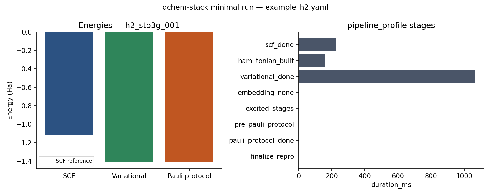

### 3.2 UCCSD 相对 SCF

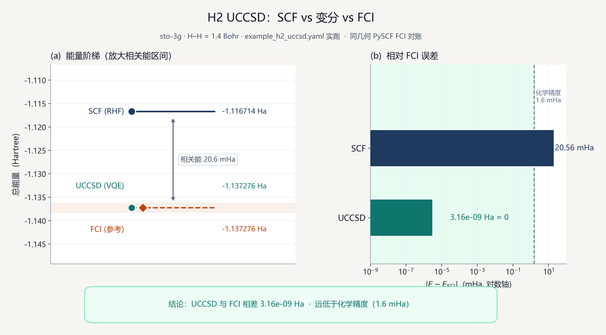

### 3.3 Pauli 协议路径

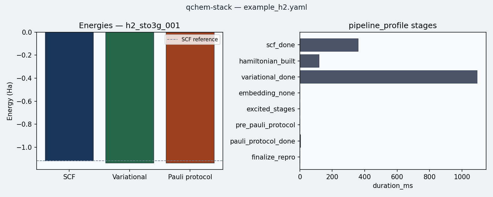

**讲解词**：这些图来自仓库内 `examples/` 教程与可视化脚本，和公开配置一一对应；听众可以当场要求「再跑一遍」。

---

## 4. 公司云平台（UQC）——真跑过的结果

### 4.1 现场演示步骤（UQC）

**前置**：内网可达 UQC、已设 `UQC_API_TOKEN`。

```bash
export UQC_API_TOKEN='...'   # 现场用公司账号

# Smoke（1 轮，适合上台）：云模拟器 + MD/ML 闭环
python scripts/run_uqc_md_ml.py \
  --backend-profile uqc_cloud \
  --experiment configs/example_h2_uqc_cloud_sim_md_ml.yaml \
  --loop configs/example_h2_uqc_cloud_sim_qmlff_loop_smoke.yaml \
  --output results/demo_uqc_smoke

# 若时间紧：展示已有 5 轮结果目录（不必重跑）
ls results/uqc_cloud_sim_md_ml_5rounds/plots/
```

**YAML 讲解点**（打开 smoke loop 配置）：

- `label_energy_reference: variational` → 用**云端 VQE 能量**做标签  
- `force_field_backend: qmlff_preset` → 力场在线学习  
- `max_rounds` / `md_n_steps` → 主动学习轮次与 MD 步数（smoke 已缩到可演示）

### 4.2 已沉淀的云实验结果（直接投屏）

以下为 **UQC cloud sim + 5 轮 MD/ML** 产物（`results/uqc_cloud_sim_md_ml_5rounds/`）：

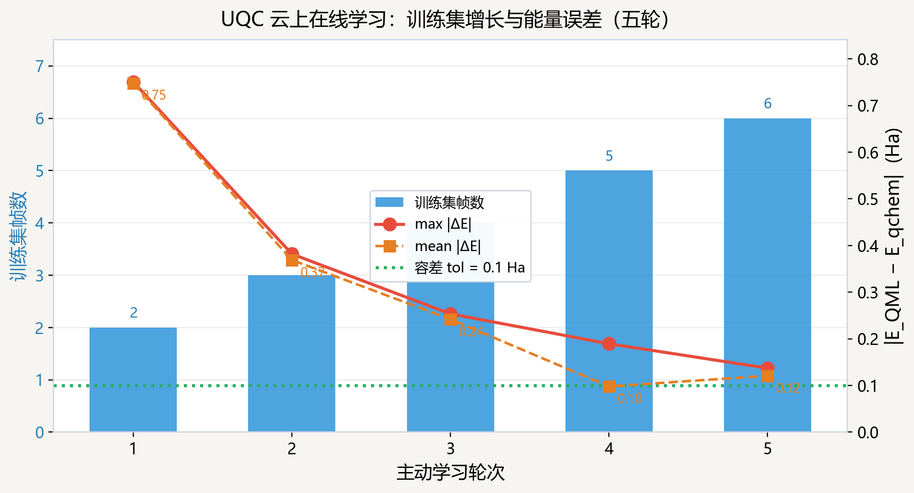

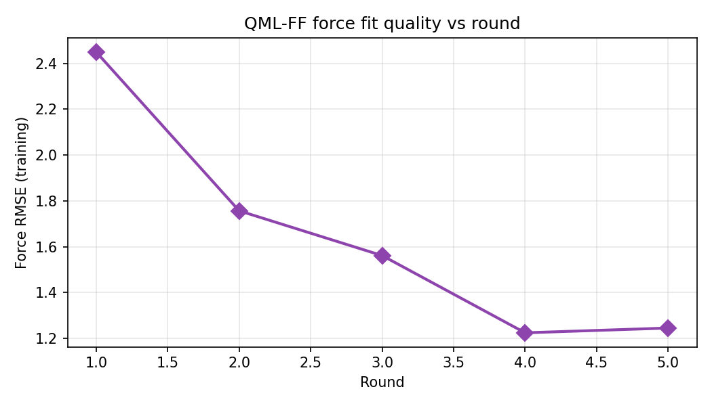

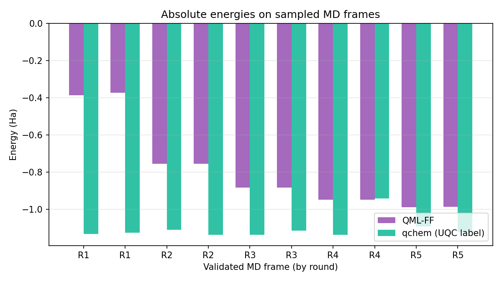

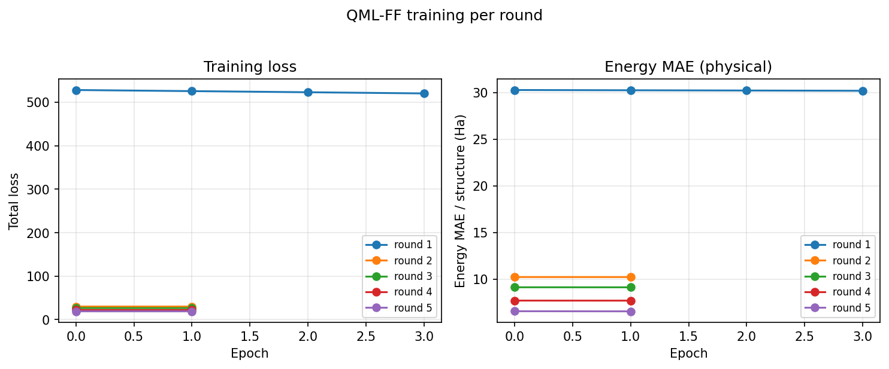

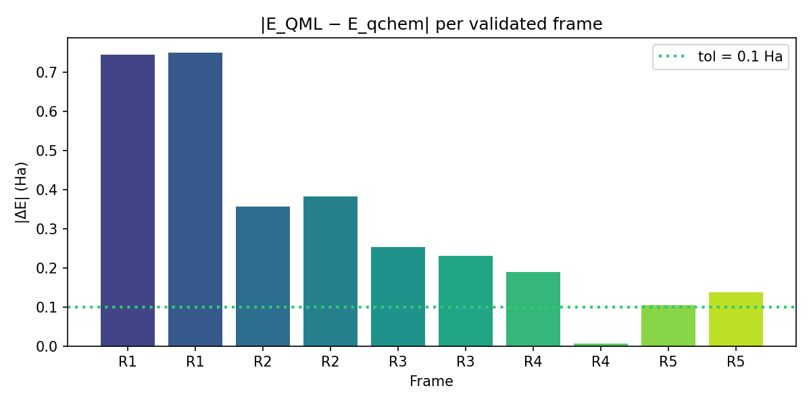

**讲解词**：这不是「API ping 通了」，而是 **云上量子标注 → 力场训练 → MD 校验** 的业务闭环；有多轮曲线与误差图可审计。技术说明见 `docs/UQC云平台集成技术报告.md`。

---

## 5. HPC + GQE 论文复现——数字与图

### 5.1 现场演示步骤（HPC）

登录节点（已有作业结果时可只展示图，不必重提）：

```bash
# 提交 H₂ 键能扫描：9 键长 × 3 seeds（完整复现）
bash scripts/hpc/submit_gqe_nakaji_h2_scan.sh

# 快速冒烟（缩短）
N_TRIALS=1 EPOCHS=40 bash scripts/hpc/submit_gqe_nakaji_h2_scan.sh

# 监控
squeue -u $USER
```

本地/汇报用汇总 JSON（已入库）：

- `results/hpc_gqe_h2_scan_summary.json`（27 trials）
- `results/hpc_gqe_lih_pilot_summary.json`

### 5.2 H₂ 复现数值表（化学精度 = 1.6 mHa）

| R (Å) | 最佳 \(E_{\mathrm{GQE}}\) | \(E_{\mathrm{FCI}}\) | 误差 (mHa) | 化学精度 |
|------:|--------------------------:|---------------------:|-----------:|:--------:|
| 0.5 | −1.055160 | −1.055160 | 0.000 | 3/3 |
| 0.6 | −1.116272 | −1.116286 | 0.014 | 3/3 |
| 0.7 | −1.136160 | −1.136189 | 0.029 | 3/3 |
| 0.8 | −1.134136 | −1.134148 | 0.012 | 3/3 |
| 0.9 | −1.120545 | −1.120560 | 0.016 | 3/3 |
| 1.0 | −1.101130 | −1.101150 | 0.020 | 3/3 |
| 1.2 | −1.056740 | −1.056741 | 0.000 | 3/3 |
| 1.5 | −0.998145 | −0.998149 | 0.005 | 3/3 |
| 2.0（原跑） | −0.944695 | −0.948641 | 3.946 | 0/3 |
| 2.0（补跑 400 ep） | −0.948625 / −0.948564 | −0.948641 | 0.016 / 0.077 | **2/3** |

**一句话**：平衡区 **8/8 键长全达标**；解离区加长训练后 **2/3 达标**——管线可迭代，不是一次性碰巧。

### 5.3 GQE 结果图（投屏顺序）

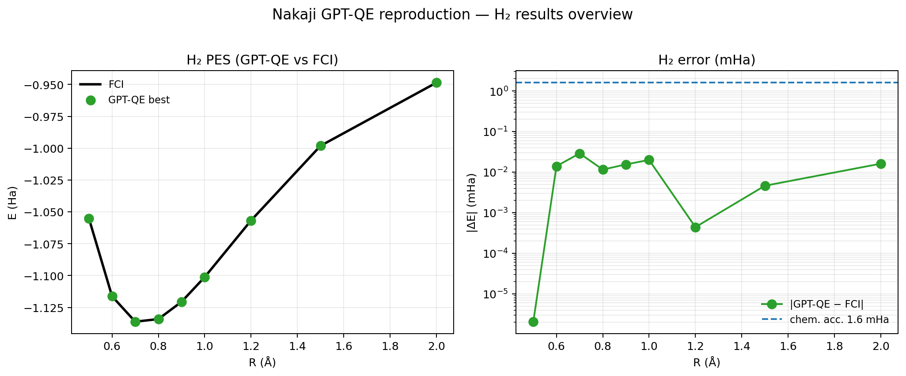

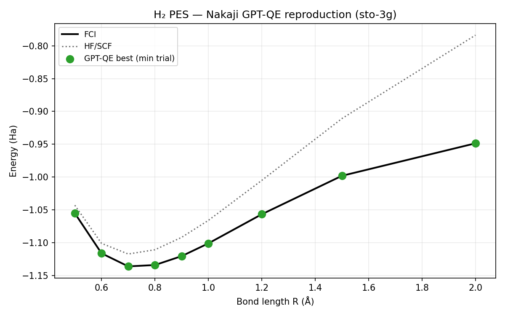

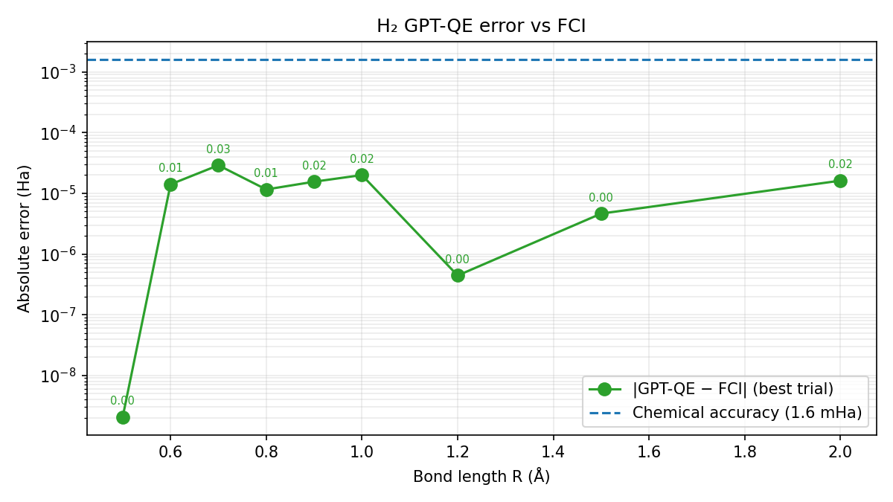


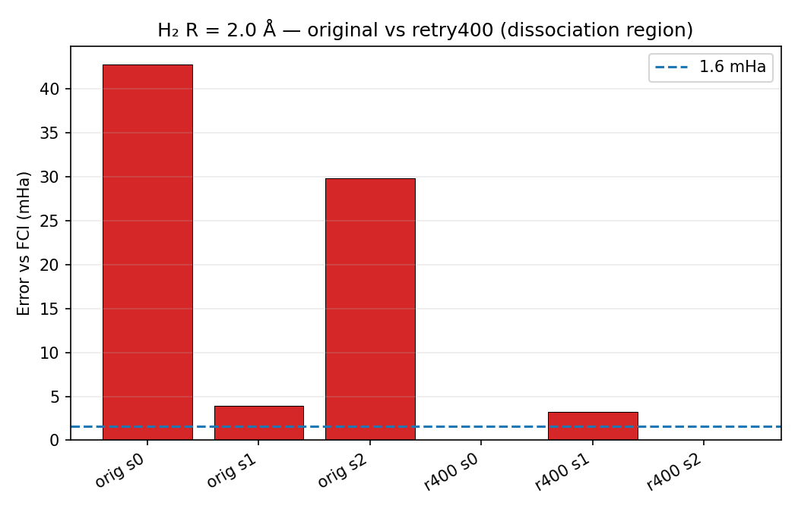

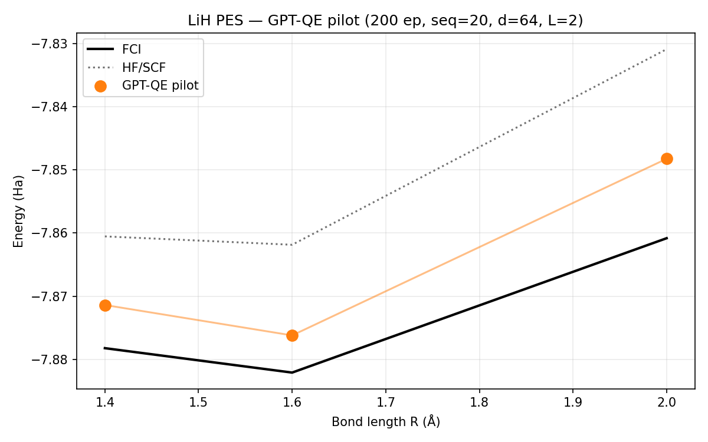

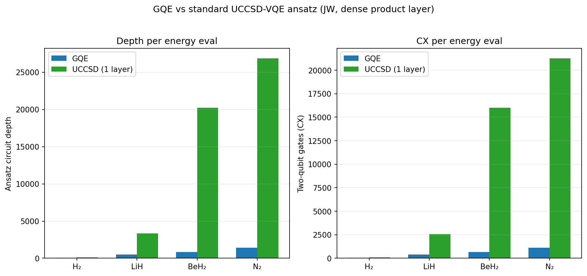

**讲解词**：方法按 `qchem_stack` 集成规范落地（配置 + HPC sbatch + 汇总 JSON + 11 图汇报），不是独立 notebook。完整报告：`docs/gqe_nakaji_项目汇报报告_source.md`，PPT：`D:\Yaozheng\GQE_汇报_Nakaji2024_QA与结果.pptx`。

---

## 6. 现场「问答防打脸」预案

| 可能提问 | 你怎么应答 + 当场打开什么 |
|----------|---------------------------|
| 「有没有真跑过云？」 | 打开 `results/uqc_cloud_sim_md_ml_5rounds/plots/` + UQC 技术报告 |
| 「和 InQuanto 比呢？」 | 打开竞品调研报告第 7–8 章 + parity 矩阵 |
| 「测试够不够？」 | `pytest tests -q` 或说 301+ 测试 / ~80% 覆盖；现场跑 smoke |
| 「GQE 是不是抄的脚本？」 | 打开 `src/qchem_stack/integrations/gqe/` + HPC summary JSON 数字表 |
| 「别人能不能复现？」 | 打开文档站 quickstart + `minimal_vqe.yaml` 当场跑 |
| 「产品边界在哪？」 | 打开 Capability SLA 页，诚实讲 non-goals |

---

## 7. 上台前 10 分钟检查清单

- [ ] `cd docusaurus-site && npm start` → 浏览器收藏首页/上手/GQE  
- [ ] `qchem-run --scenario minimal_vqe` 本地跑通一次  
- [ ] `python scripts/smoke_pipeline.py --precomputed-only` 备一手  
- [ ] 提前打开：`example_h2.yaml`、`uqc ... smoke.yaml`、`example_h2_gqe_plan_b.yaml`  
- [ ] 图床文件夹：`docs/assets/shuzhi_demo/{docs,pipeline,uqc,gqe}`  
- [ ] UQC：确认 token / 或改用「展示已有 5 轮图」模式  
- [ ] HPC：确认 `squeue` 可用 / 或改用「展示 summary JSON + 图」模式  
- [ ] PPT 备用：`D:\Yaozheng\GQE_汇报_Nakaji2024*.pptx`

---

## 8. 与文字述职稿的关系

| 文件 | 用途 |
|------|------|
| `D:\Yaozheng\述职报告_量子计算化学软件与成果.md` | 书面/邮件版：数字、软著、调研、贡献表述 |
| **本文** `docs/述职报告_可视化与现场演示.md` | 上台版：截图、结果表、YAML 讲解、云/HPC 操作步骤 |

两份一起用：**先投图与现场操作，文字稿留给会后或答辩材料。**
