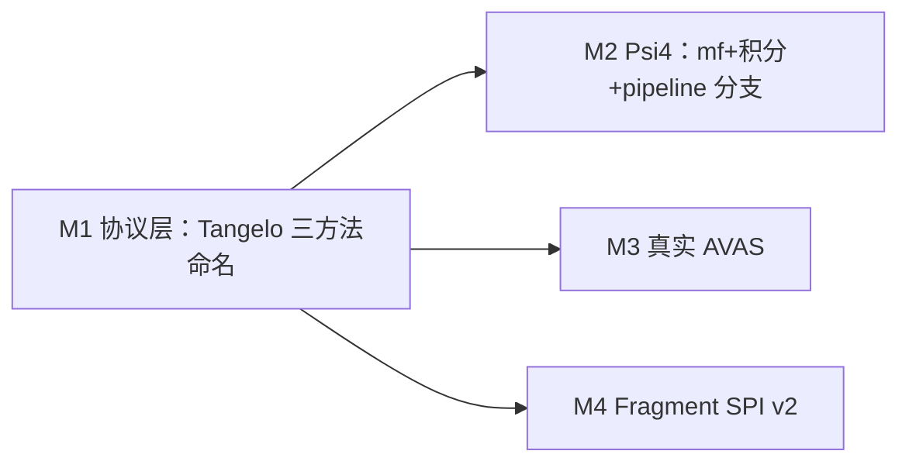

# 里程碑详细计划：化学后端深化 + 嵌入 SPI v2（与主干的「安全分界线」）

本文档是把《实施总计划_Vendor platform_PySCF_Tangelo.md》中 **工程量与接口面过大**、须单独收口的几条线，整理成 **可分 PR、可分阶段验收** 的里程碑说明。

---

## 0. 既定「安全分界线」（在下列里程碑收口前保持不变）

| 维度 | 当前约定 | 说明 |
|------|----------|------|
| 哈密顿量 / 活性空间主线 | **`scf.driver=pyscf`** → `PySCFIntegralSolver` / `classical_mean_field_reference_from_config`（legacy `PySCFDriver` deprecated） | 全套 MO 积分、`RestrictedActiveSpaceQuantumProblem`、默认 CI 语义以此为准。 |
| Psi4 | **可选主路径**：`scf.driver=psi4` → `Psi4IntegralSolver` + bridge；亦保留 `psi4_hf_total_energy_au`、``scripts/check_cross_solver_parity.py`` 用于 **闭合壳层 HF 总能量对照**。 |
| **统一桥接（interchange）** | `qchem_stack.chem.bridges` | 所有经典 SCF 经注册表 **同一出口**：`classical_mean_field_via_solver_bridge` → `MolecularMeanFieldResult`，并在 `driver_meta` 写入 `canonical_classical_bridge_*`；新软件只需实现 ``ChemIntegralSolver`` + 必要定制元数据，再汇入该 interchange。 |
| 嵌入 | DMET / Schmidt / `plugin` / `projection` 现有骨架 | 新 SPI 在 **不破坏现有 YAML 默认可跑** 的前提下增量扩展。 |

**原则**：每个里程碑默认 **可独立合并、可回滚、主 CI 不强制新可选依赖**；引入 Psi4 数值主路径时必须有 **显式配置闸门** + **optional job**。

---

## 1. 里程碑总览（建议执行顺序）



| 代号 | 名称 | 核心价值 | 估算体量 | 硬依赖 |
|------|------|----------|----------|--------|
| **M1** | `ChemIntegralSolver` 与 Tangelo **三方法同构命名** | 降低跨代码库心智负担；为 Psi4/未来后端统一入口 | 中 | 无新外部依赖 |
| **M2** | **Psi4** 全流程 `mf`/积分进入 pipeline（可选） | 证明「多后端可迁移」不仅是能量 smoke | 大 | 可选 `psi4` 环境 |
| **M3** | **真实 AVAS**（PySCF 内核） | 缩小与 Vendor platform `AVAS` 能力差距 | 大 | `chem`（PySCF） |
| **M4** | **Fragment / 嵌入 SPI v2** | 统一碎片求解、能量账本、失败语义 | 大 | 无新外部依赖（首批） |

**建议合并顺序**：**M1 →（M2 ∥ M3 ∥ M4）**；M2 与 M3 可并行由不同开发者推进，但 **M1 应先落地**，避免各分支各写一套 adapter 名称。

---

## 2. M1 — `ChemIntegralSolver` 与 Tangelo 三方法命名对齐

### 2.1 目标

与 Tangelo 源码中 `IntegralSolver` 习惯用法对齐（概念映射，不要求字节级同构）：

| Tangelo 概念（摘自实施总计划） | 本仓现状 | M1 交付 |
|----------------------------------|----------|---------|
| `set_physical_data` | 构造时注入 `MolecularSystem` + `ExperimentConfig` | 显式方法 **`set_physical_data(...)`** 或 **同语义工厂**；文档标注与 `__init__` 关系 |
| `compute_mean_field` | `run_molecular_mean_field` / `run_periodic_mean_field` | **统一别名**：`compute_mean_field(mode="molecular"|"periodic")` **或** 保留两方法但在 Protocol 与文档中标记为 `compute_mean_field` 的分支 |
| `get_integrals` | 未在 Protocol 中形式化 | **可选 Protocol 方法** `get_integrals(...)`：默认 `NotImplementedError`；PySCF adapter 可先返回 **结构化占位** 或 **MO 块指针**（与现有 compact 路径衔接） |

### 2.2 阶段拆分

1. **M1-A（仅 Protocol + 文档，无行为变化）**  
   - 在 `chem/solvers/base.py` 扩展 `ChemIntegralSolver`：增加 `compute_mean_field` 作为 **正式名称**，内部转调现有 `run_*`；`run_molecular_mean_field` 标为 **兼容别名**（保留至少一个主版本周期的弃用告警可选）。  
   - 增加 `set_physical_data` 的 Protocol 签名（对已构造对象 no-op 或 idempotent）。  
   - 增加 `get_integrals` optional（`raise NotImplementedError` 默认实现）。  

2. **M1-B（PySCF / Psi4 adapter 对齐）**  
   - `PySCFIntegralSolver`、`Psi4IntegralSolver` 实现上述方法名。  
   - `registry.create_solver` 返回类型仍为 `ChemIntegralSolver`。  

3. **M1-C（调用方迁移策略）**  
   - Driver、脚本、示范代码：**新代码只用 Tangelo 对齐名**；旧名通过薄包装保留。  
   - 单元测试：**新增** `tests/chem/test_chem_integral_solver_tangelo_aliases.py`（命名与调度覆盖）。  

### 2.3 验收标准（DoD）

- [x] Protocol 文档与 Tangelo 三方法 **一一对照说明** 出现在 ``ChemIntegralSolver`` 的 class docstring。  
- [x] PySCF 路径：`compute_mean_field`/`set_physical_data`/`get_integrals` 与 **`run_*` 数值等价**（HF 回归）。  
- [x] 全量 `pytest` + `scripts/check_parity_export_sample.py` 通过。  

### 2.4 代码落地（已实现）

- Source：`src/qchem_stack/chem/solvers/base.py`（Protocol）、`pyscf_solver.py` / `psi4_solver.py`。  
- Call sites：`PySCFDriver`、`integrations/cross_solver_parity.py` 使用 **`compute_mean_field`**。  
- Tests：`tests/chem/test_chem_integral_solver_tangelo_aliases.py`；`test_pyscf_solver_adapter`、`test_psi4_solver_smoke` 增补。

### 2.5 风险与缓解

| 风险 | 缓解 |
|------|------|
| 双重命名困惑 | README / 开发者文档单列「推荐使用 `compute_mean_field`」 |
| `get_integrals` 范围失控 | M1 只定义 **签名 + NotImplemented**；真正实现放到 M2/M3 |

---

## 3. M2 — Psi4 全流程 `mf`/积分 + pipeline 分支（可选后端）

### 3.1 目标

在 **显式 YAML 闸门**下，允许：

```yaml
scf:
  driver: psi4
  method: RHF   # 首批仅 RHF 闭合壳层
```

完成：**Psi4 mean-field/wfn → 与本仓现有 MO/active-space→费米子/量子链路可衔接的中间表示**。

**不要求**首期与 PySCF 路径逐 double 对齐；要求 **可追溯的 `driver_meta` + 失败语义 + optional CI**。

### 3.2 阶段拆分

1. **M2-A：Psi4 mf 对象包装**  
   - 定义 **窄接口** `MeanFieldLike`（本仓内部 Protocol）：`e_tot`、`make_rdm1`、获取 MO 系数/能量的最小方法集。  
   - 用 Psi4 `Wavefunction` 实现 adapter（或薄包装），供 `MolecularMeanFieldResult.mf` 使用。  

2. **M2-B：积分与 active-space**  
   - 选一条 **唯一主路径**：例如「Psi4 → MO ERI / 或转 OpenFermion `MolecularData` 再进现有流程」之一；**禁止**首版同时维护两条等价路径。  
   - 与 `integral_convention` 文档对齐：声明 **Psi4→OpenFermion 的指标顺序**（与 PySCF 路径同样要求可机读）。  

3. **M2-C：pipeline 接入**  
   - `PySCFDriver.from_config` 今日在 `driver!=pyscf` 时硬拒绝；改为：  
     - **方案 1**：重命名 **`ClassicalHamiltonianDriver`** 工厂，根据 `scf.driver` 选 PySCF 或 Psi4（推荐长期）。  
     - **方案 2**：保留 `PySCFDriver` 专指 PySCF，`run_pipeline_sync` 在 `scf.driver==psi4` 时走 **`Psi4HamiltonianBuilder`**（实现成本略低但命名债更多）。  

4. **M2-D：配置与契约**  
   - `scf` block：Psi4 专用键（收敛阈值、`freeze_core` 等）**白名单化**，写入 `driver_meta`。  
   - `SolverCapabilities`：`psi4` 的 `supports_molecular_scf=True`（完成 M2-A 后）。  

5. **M2-E：测试与 CI**  
   - `tests/chem/test_psi4_pre_quantum_pipeline.py`：`pytest.importorskip("psi4")`，小体系 H2/STO-3G。  
   - 主 CI：无 psi4 **skip**；Nightly/`optional` job：装机 psi4 跑全链路。  

### 3.3 验收标准（DoD）

- [ ] `scf.driver=psi4` + 最小 YAML **端到端跑出** `energy_after_variational`（或至少 `scf_done` → 哈密顿量构建完成，若无量子后端则文档声明边界）。  
- [ ] `rdm_bundle_from_*` **或**等价入口在 Psi4 路径上可构造 `RDMBundle v2`。  
- [ ] `cross_solver` 脚本在 Psi4 存在时可扩展为「**同一中间表示维度**」的对比（而不仅是 HF 总能量）。  

### 3.4 风险与缓解

| 风险 | 缓解 |
|------|------|
| Psi4 安装与授权/二进制差异 | conda optional lane；Docker 基底镜像 Pin 版本 |
| 与 PySCF 数值细微差导致「假失败」 | 分离 **协议测试** vs **数值容差矩阵** |

---

## 4. M3 — 真实 AVAS（PySCF 内核）

### 4.1 目标

将 `active_space.strategy=avas_stub` **保留为兼容占位**，新增 **`strategy=avas`**：

- 使用 PySCF **公开 API**（`avas.AVAS` 或项目锁定的稳定入口）完成活性轨道子空间选择；  
- 输出写入 **可回归** 的 `active_space_recipe` / `driver_meta`（轨道索引、阈值、版本）。  

### 4.2 阶段拆分

1. **M3-A：配置模型**  
   - `ActiveSpaceSpec` 增加 AVAS 参数块（阈值、从属轨道数 cap、与 `manual`/`cas` 的优先级规则）。  

2. **M3-B：实现与回退**  
   - 小体系白名单（H2O、N2 等）单元测试；失败时 **明确错误**（非 silent 退化为 stub）。  

3. **M3-C：与 pipeline 对接**  
   - `get_restricted_active_space_quantum_problem` 之前插入 **AVAS 选轨**；与 `frozen_orbitals` 组合规则文档化。  

### 4.3 验收标准（DoD）

- [ ] 至少 **2 个分子** YAML 示例 + 回归测试；  
- [ ] `avas_stub` 与 `avas` 在 `run_summary`/parity 导出中 **可区分**；  
- [ ] 文档写明 **PySCF 版本门槛** 与已知数值 caveats。  

---

## 5. M4 — Fragment / 嵌入 SPI v2

### 5.1 现状锚点（代码）

- `chem/embedding/dmet.py`：`FragmentSolverProtocol`（`solve(fragment_id, hamiltonian)`）较薄。  
- `chem/embedding/decomposition_plugin.py`：`DecompositionPlugin`（`load_fragments`）+ JSON schema 校验。  

### 5.2 v2 目标

统一「碎片一次求解」的 **输入 / 输出 / 能量账本 / 失败语义**，使 DMET、Schmidt、decomposition plugin 后续可共用同一 SPI，而不是各写各的 dict 形状。

### 5.3 建议的 v2 契约（草案）

**输入** `FragmentSolveRequest v2`（概念）：

- `fragment_id: str`  
- `hamiltonian_handle`：`QubitHamiltonian` **或** 显式引用 `RestrictedActiveSpaceQuantumProblem`（二选一由 `mode` 决定）  
- `embedding_context`：Schmidt/DMET/plugin 共通字段（`mu`、`nelec_target`、投影元数据指针等）  
- `solver_capabilities`：来自注册表（是否支持 CCSD/VQE/UCCSD 等——首批可仅占位）

**输出** `FragmentSolveResult v2`（概念）：

- `status: ok|failed|skipped`  
- `energy_au: float | null`  
- `rdm_bundle_meta` 或 `RDMBundle` 引用（可选）  
- `ledger: dict`：与 `fragment_energy_terms` 对齐的可机读分项  
- `reason`：失败时必选  

### 5.4 阶段拆分

1. **M4-A：类型与 Protocol**  
   - 新建 `chem/embedding/fragment_spi_v2.py`（或等价模块）定义 dataclass + `FragmentSolverSPIv2` Protocol。  

2. **M4-B：适配现有路径**  
   - Schmidt production：包装现有 `solve` 为 v2 Result。  
   - DMET：`FragmentSolverProtocol` 与 v2 **并存一层转换**（ deprecation 周期内）。  

3. **M4-C：plugin 贯通**  
   - `decomposition_plugin_contract_v1` 扩展或 **新 schema v2**：允许声明每个 fragment 使用的 solver id。  

4. **M4-D：parity / run_summary**  
   - 新键进入 `PARITY_SNAPSHOT_DOCUMENTED_KEYS` / `RUN_SUMMARY_DOCUMENTED_KEYS` 白名单（与现有工程规则一致）。  

### 5.5 验收标准（DoD）

- [ ] 至少 **一条** embedding 主路径（建议 Schmidt 或 plugin）写出 **v2 Result**；  
- [ ] 单测覆盖 **success + failure** 两种 JSON 可序列化；  
- [ ] 文档说明 v1→v2 迁移与 **何时仍可用 toy JSON**。  

---

## 6. 扩展验收闸门（建议写入团队流程）

每个里程碑合并前：

1. `python -m pytest`（含新增 optional 用例的 skip 语义正确）。  
2. `python scripts/check_parity_export_sample.py`。  
3. 若动 `run_summary` / `parity_snapshot`：**同步** `product_contract.py`、`scripts/export_*` 与既有单测/CI 钩子（已无集中式 `PARITY_SNAPSHOT_DOCUMENTED_KEYS`）。
4. 若动积分约定：**补一条** `integral_convention` 或 golden JSON 的回归（与 M2 强相关）。  

---

## 7. 不在本里程碑包内（明确延后）

- QMMM / 显式溶剂场 beyond ddCOSMO。  
- 设备端 RDM → `RDMBundle` 的贝叶斯/AC0 产品级闭环。  
- Vendor platform 闭源 L0 数值同构声明。  

---

## 8. 与主文档关系

- 战略周历与任务组索引仍以 **[实施总计划_Vendor platform_PySCF_Tangelo.md](./实施总计划_Vendor platform_PySCF_Tangelo.md)** 为准。  
- **本文档**负责 **「深水区」里程碑级拆分与 DoD**；执行中若与主文档冲突，以 **主文档战略优先级** 为准，**本文档技术拆分** 可半年度修订一次。

---

## 9. 建议排期（工程周，仅供参考）

| 里程碑 | 建议跨度 | 说明 |
|--------|----------|------|
| M1 | 1–2 周 | 以转调/文档为主，风险低 |
| M2 | 4–8 周 | 含积分路径选定 + optional CI |
| M3 | 3–6 周 | 强依赖 PySCF 版本与案例稳定性 |
| M4 | 4–8 周 | 与 Schmidt/DMET 现状耦合，需分批适配 |

可与《实施总计划》中的 **W9–W12** 交错：通常 **W9–W10 偏 M2**，**W11 偏 M4**，**M3 与 W5–W6 AVAS** 条目合并规划。
