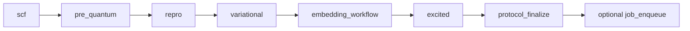

# 工程架构

`qchem-stack` 采用分层设计，把化学问题定义、量子算法构建、后端执行与作业编排拆开，便于独立演进和回归验证。

## 分层视图

1. **Chemistry layer（P1）**：分子定义、驱动、哈密顿量、活性空间与嵌入配置。
2. **Program layer（P2）**：算法、协议与编译/评估阶段编排。
3. **Execution layer（P3）**：后端抽象、采样路径、结果汇总与缓解报告。
4. **Jobs & Repro layer（P4）**：作业队列、HTTP API、`repro` 与可追踪字段。

## 管线阶段（flowchart）

主路径按编排阶段推进；部分阶段可按配置跳过或仅写审计元数据。

| 阶段 | 作用（摘要） |
|------|----------------|
| `scf` | 经典平均场 / 积分驱动 |
| `pre_quantum` | 构建 `PreQuantumInput` / `QubitHamiltonian` |
| `repro` | 组装可复现元数据骨架 |
| `variational` | VQE / ADAPT / … 变分 |
| `embedding_workflow` | 嵌入审计 / DMET 等后处理 |
| `excited` | VQD / QSE / SCEOM 侧车 |
| `protocol_finalize` | Pauli 协议收尾、QPE demo track 等 |
| `job_enqueue` | 可选：写入 SQLite / HTTP 作业 |

选型入口：[P1](/guide/chemistry-and-embedding) → [P2](/guide/program-construction) → [P3](/guide/execution-and-analysis) → [P4](/guide/jobs-and-reproducibility)。

## 关键设计原则

- **配置先行**：通过 YAML 描述实验，降低代码耦合。
- **契约稳定**：对外以结构化输出和 reference 文档为准。
- **可复现优先**：结果除了数值，也包含配置、摘要与轨迹。
- **边界明确**：聚焦开放工程能力，不宣称闭源云/硬件等价实现。

## 推荐配套阅读

- [指南总览](/guide/)
- [HTTP API 与作业队列](/reference/http-api-sqlite-jobs)
- [Product contracts / workflow-preview import](/reference/parity-contract-import-paths)
- [产品路线图](/product/roadmap)
